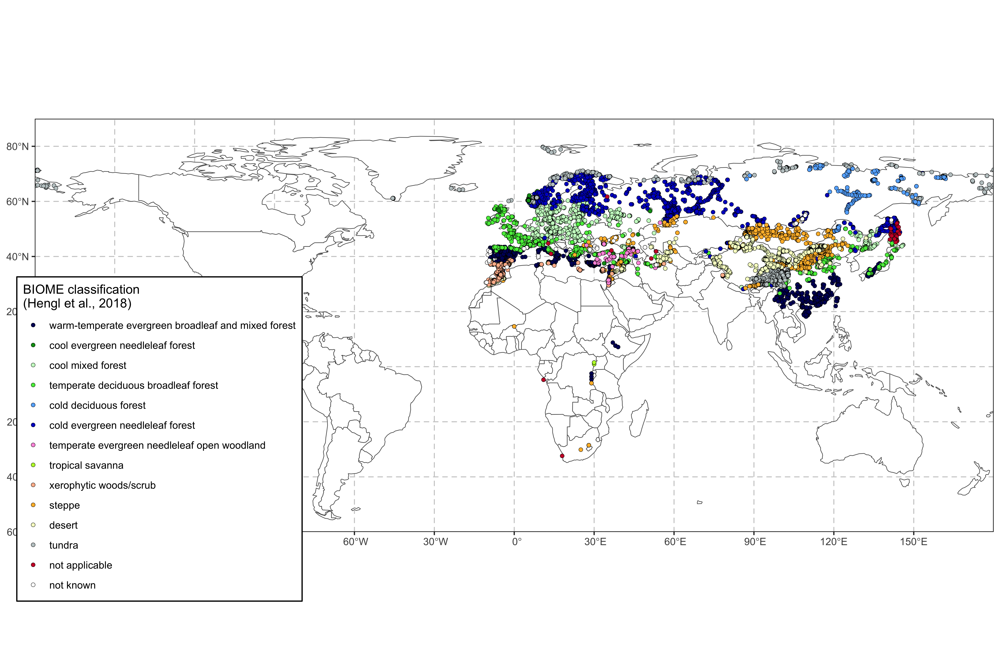

<!-- README.md is generated from README.Rmd. Please edit that file -->

# SMPDS: Modern Pollen Data for climate reconstructionS

<!-- badges: start -->

[](https://www.tidyverse.org/lifecycle/#experimental)
[](https://CRAN.R-project.org/package=smpds)
[](https://codecov.io/gh/special-uor/smpds?branch=main)
[](https://github.com/special-uor/smpds/actions)
<!-- badges: end -->

The goal of smpds is to …

## Installation

You can install the released version of SMPDS from
[CRAN](https://CRAN.R-project.org) with:

``` r
install.packages("smpds")
```

And the development version from [GitHub](https://github.com/) with:

``` r
# install.packages("devtools")
devtools::install_github("special-uor/smpds")
```

## Example

<!-- This is a basic example which shows you how to solve a common problem: -->

``` r
library(smpds)
## basic example code
smpds::SMPDSv2 %>%
  dplyr::slice(1:20) %>%
  knitr::kable()
```

| original | ID\_SMPDSv1 | source   | site\_name     | entity\_name   | latitude | longitude | elevation | basin\_size         | site\_type                   | entity\_type         | age\_BP        | ID\_BIOME | publication                                                                                                                                          | Abies | Abies alba | Abies cilicica | Abies nordmanniana | Abies pinsapo subsp marocana | Acalypha | Acantholimon | Acanthus mollis | Acer | Acer campestre | Acer campestre type | Acer pseudoplatanus | Acer type | Achillea | Achillea type | Achillea/Anthemis type | Achillea/Aster | Achillea/Aster type | Aconitum | Aconitum napellus type | Aconitum septentrionale | Aconitum type | Adenostyles type | Adiantum | Adonis | Adonis aestivalis type | Adonis type | Adonis vernalis | Adoxa | Adoxa moschatellina | Aegopodium | Aegopodium podagraria | Aellenia type | Aesculus | Aesculus hippocastanum | Agrimonia | Agrimonia type | Agrostemma | Agrostemma githago | Ailanthus | Ajuga | Alchemilla | Alchemilla pentaphylla type | Alchemilla type | Alkanna | Alkanna type | Allium | Allium type | Alnus | Alnus alnobetula subsp fruticosa | Alnus glutinosa | Alnus glutinosa type | Alnus glutinosa/Alnus incana | Alnus incana | Alnus incana type | Alnus incana/Alnus cordata type | Alnus non-viridis | Alnus type | Alnus viridis | Alnus viridis subsp fruticosa | Amaranthaceae | Amaranthus | Amaryllidaceae | Ambrosia | Ambrosia artemisiifolia type | Ambrosia type | Ambrosia/Xanthium | Ammi type | Amygdaloideae | Anacardiaceae | Anagallis | Anagallis arvensis | Anagallis arvensis type | Anagallis tenella | Anagallis type | Anchusa | Anchusa arvensis | Anchusa type | Andrachne | Andrachne telephioides | Andromeda | Androsace | Androsaceae | Anemone | Anemone nemorosa | Anemone nemorosa type | Anemone nemorosa type/Hepatica nobilis | Anemone nemorosa/Anemone ranunculoides | Anemone type | Angelica | Angelica archangelica | Angelica type | Anisosciadium type | Antennaria | Antennaria type | Anthemis | Anthemis type | Anthericum | Anthericum type | Anthoxanthum | Anthriscus | Anthriscus sylvestris | Anthriscus sylvestris type | Anthriscus type | Anthyllis | Antirrhinum type | Antirrhinum/Linaria | Apiaceae | Apium type | Apium/Berula | Aquilegia type | Arabidopsis | Araceae | Arbutus | Arbutus type | Arbutus unedo | Arceuthobium oxycedri | Arctium | Arctium type | Arctium/Jurinea | Arctostaphylos | Arctostaphylos uva-ursi | Arenaria | Arenaria type | Argania spinosa | Aristolochia | Armeria | Armeria maritima | Armeria maritima subsp elongata | Armeria type | Armeria/Limonium | Armeria/Limonium type | Arnebia type | Arnica montana | Artemisia | Artemisia genipii/Artemisia mutellina | Artemisia herba-alba type | Artemisia type | Artemisia vulgaris type | Aruncus type | Asclepiadaceae | Asparagaceae | Asparagus | Asparagus type | Asperula type | Asphodeline | Asphodelus | Asphodelus albus | Asphodelus albus type | Asphodelus fistulosus type | Asphodelus type | Asplenium | Asplenium ceterach subsp ceterach | Asplenium type | Asplenium viride | Aster | Aster bellidiastrum | Aster type | Asteraceae | Asteraceae (Liguliflorae) | Asteroideae | Astragalus | Astragalus alpinus type | Astragalus type | Astrantia | Astrantia type | Athamanta cretensis | Athyrium | Athyrium alpestre type | Athyrium distentifolium | Athyrium distentifolium type | Athyrium filix-femina | Atraphaxis | Atriplex nudicaulis | Ballota | Barbarea type | Bellis | Bellis type | Berberidaceae | Berberis | Berberis vulgaris | Bergenia crassifolia | Berula erecta type | Betula | Betula alba | Betula alba type | Betula fruticosa | Betula humilis | Betula humilis/Betula nana | Betula nana | Betula nana type | Betula pendula | Betula pendula/Betula pubescens | Betula pubescens | Betula pubescens type | Betula sect. Albae | Betula sect. Fruticosae | Betula sect. Nanae | Betula tortuosa | Betula type | Bidens | Bidens type | Bilderdykia convolvulus | Bilderdykia convolvulus type | Bistorta officinalis type | Bistorta vivipara | Blechnum | Blechnum spicant | Boraginaceae | Borago officinalis | Botrychium | Botrychium lunaria | Botrychium lunaria type | Botrychium type | Brassica | Brassica type | Brassicaceae | Bruckenthalia | Bunium type | Bupleurum | Bupleurum type | Buxus | Buxus sempervirens | Calendula | Calendula type | Calligonum | Calluna | Calluna type | Calluna vulgaris | Calystegia | Calystegia sepium | Campanula | Campanula type | Campanulaceae | Cannabaceae | Capparaceae | Capparis | Capparis spinosa | Capparis type | Caprifoliaceae | Capsella bursa-pastoris type | Capsella type | Capsicum type | Caragana | Cardamine | Cardamine pratensis type | Cardamine type | Carduoideae | Carduus | Carduus type | Carex | Carex hirta type | Carex type | Carlina | Carlina type | Carpinus | Carpinus betulus | Carpinus betulus type | Carpinus orientalis | Carpinus orientalis type | Carpinus orientalis/Ostrya | Carpinus orientalis/Ostrya carpinifolia | Carpinus orientalis/Ostrya carpinifolia type | Carpinus type | Carpinus/Ostrya | Carpobrotus | Carthamus | Carum carvi | Caryophyllaceae | Caryophyllaceae subfam. Silenoideae | Cassiope | Cassiope type | Castanea | Castanea sativa | Castanea type | Cedrus | Cedrus atlantica | Cedrus atlantica type | Cedrus libani | Celastraceae | Celtis | Celtis australis | Centaurea | Centaurea collina | Centaurea collina type | Centaurea cyanus | Centaurea cyanus type | Centaurea depressa type | Centaurea diffusa | Centaurea jacea | Centaurea jacea type | Centaurea montana | Centaurea montana type | Centaurea nigra | Centaurea nigra type | Centaurea rhenana type | Centaurea scabiosa | Centaurea scabiosa type | Centaurea solstitialis | Centaurea solstitialis type | Centaurea type | Centaurium | Centaurium maritimum | Centaurium type | Centranthus | Cerastium | Cerastium alpinum type | Cerastium arvense type | Cerastium cerastioides type | Cerastium fontanum type | Cerastium type | Cerastium/Stellaria type | Ceratonia | Ceratonia siliqua | Ceratonia type | Cercis siliquastrum | Cerinthe | Cerinthe minor | Cerinthe type | Chaerophyllum | Chaerophyllum hirsutum type | Chaerophyllum type | Chamaedaphne | Chamaedaphne calyculata | Chamaenerion | Chamaenerion angustifolium | Chamaerops | Cheilanthes | Cheilanthes type | Chelidonium majus | Chenopodium | Chenopodium album | Chimaphila umbellata | Chrysanthemum alpinum | Chrysosplenium | Chrysosplenium type | Cichorioideae | Cichorium | Cichorium intybus type | Cichorium type | Cimicifuga foetida | Circaea | Cirsium | Cirsium type | Cirsium/Carduus | Cirsium/Carduus type | Cirsium/Gundelia | Cistaceae | Cistus | Cistus albidus type | Cistus incanus type | Cistus ladanifer | Cistus ladanifer type | Cistus monspeliensis | Cistus monspeliensis type | Cistus populifolius type | Cistus salvifolius | Cistus salviifolius type | Cistus type | Cistus villosus type | Clematis | Clematis type | Clematis vitalba type | Clethra | Colchicum | Colchicum autumnale type | Colchicum type | Colchicum/Merendera | Colutea | Conopodium | Conopodium majus | Consolida type | Convallaria | Convolvulaceae | Convolvulus | Convolvulus arvensis | Convolvulus arvensis type | Corema album type | Coriaria | Coriaria myrtifolia | Cornaceae | Cornus | Cornus mas | Cornus mas/Cornus suecica | Cornus sanguinea | Cornus suecica | Coronilla | Corrigiola | Corydalis | Corydalis solida type | Corydalis type | Corylus | Corylus avellana | Corylus avellana type | Corylus maxima | Corylus type | Corylus/Myrica | Cotinus | Cotinus coggygria | Cotinus type | Cotoneaster | Cousinia | Crassula | Crassulaceae | Crataegus | Crataegus monogyna | Crataegus type | Crepis | Crepis aurea | Crepis type | Crocus | Crozophora | Cryptogramma | Cryptogramma crispa | Cryptogramma crispa type | Cryptomeria japonica | Cucumis | Cucurbitaceae | Cupressaceae | Cupressus | Cupressus type | Cuscuta | Cuscuta europaea type | Cyclamen | Cyclamen hederifolium | Cynoglossum creticum | Cynomorium | Cyperaceae | Cyperus | Cyperus longus type | Cyperus type | Cystopteris | Cystopteris fragilis | Cystopteris type | Cytinus hypocistis type | Cytisus type | Cytisus/Genista | Cytisus/Genista type | Cytisus/Ulex | Daphne | Daphne gnidium | Daphne gnidium type | Daphne type | Datisca | Datura | Daucaceae | Daucus carota | Daucus carota type | Daucus type | Delphinium type | Deschampsia | Descurainia | Dianthus | Dianthus superbus type | Dianthus type | Diapensia | Diapensia lapponica | Digitalis | Digitalis purpurea type | Digitalis type | Diphasiastrum | Diphasiastrum alpinum | Diphasium | Diphasium alpinum | Diphasium alpinum type | Diphasium complanatum | Diphasium tristachyum | Diphasium type | Dipsacaceae | Dipsacus | Dipsacus fullonum type | Dipsacus type | Doronicum | Draba | Draba type | Dryas | Dryas octopetala | Dryopteridaceae/Polypodiaceae | Dryopteris | Dryopteris carthusiana | Dryopteris carthusiana type | Dryopteris cristata | Dryopteris cristata type | Dryopteris dilatata | Dryopteris dilatata type | Dryopteris expansa | Dryopteris filix-mas | Dryopteris filix-mas type | Dryopteris type | Dryopteris/Thelypteris | Echinophora | Echinophora type | Echinops | Echinops ritro | Echium | Echium type | Echium vulgare | Elaeagnus | Elaeagnus angustifolia | Eleocharis palustris | Elymus | Empetrum | Empetrum nigrum | Empetrum nigrum type | Empetrum type | Empetrum/Ledum | Ephedra | Ephedra alata type | Ephedra distachya | Ephedra distachya type | Ephedra fragilis | Ephedra fragilis ssp campylopoda | Ephedra fragilis type | Ephedra major | Ephedra type | Epilobium | Epilobium type | Equisetum | Eremurus | Erica | Erica arborea | Erica arborea type | Erica australis | Erica australis type | Erica cinerea | Erica cinerea type | Erica erigena type | Erica lusitanica | Erica lusitanica type | Erica scoparia type | Erica spiculifolia | Erica tetralix | Erica tetralix type | Erica type | Erica umbellata type | Ericaceae | Ericales | Erigeron | Eriophorum angustifolium/Eriophorum vaginatum | Eriophorum type | Erodium | Eryngium | Eryngium ilicifolium | Eryngium type | Euonymus | Euonymus europaeus | Eupatorium | Eupatorium type | Euphorbia | Euphorbia type | Euphorbiaceae | Euphrasia | Euphrasia type | Evax | Fabaceae | Fagus | Fagus orientalis | Fagus sylvatica | Falcaria type | Fallopia | Fallopia convolvulus | Fallopia convolvulus type | Ferula type | Ficus | Filago type | Filipendula | Filipendula type | Filipendula ulmaria | Filipendula vulgaris | Fontanesia/Phillyrea | Fragaria | Frangula | Frangula alnus | Frankenia | Frankenia hirsuta type | Fraxinus | Fraxinus angustifolia | Fraxinus angustifolia subsp oxycarpa | Fraxinus angustifolia type | Fraxinus excelsior | Fraxinus excelsior type | Fraxinus ornus | Fraxinus ornus type | Fraxinus oxycarpa type | Fritillaria lusitanica | Fumana | Fumaria | Fumaria officinalis type | Gagea | Galega type | Galeopsis | Galeopsis type | Galeopsis/Ballota type | Galium | Galium type | Genista | Genista type | Genista/Ulex | Gentiana | Gentiana lutea/Gentiana pneumonanthe | Gentiana nivalis type | Gentiana pneumonanthe | Gentiana pneumonanthe type | Gentiana purpurea | Gentiana purpurea type | Gentianaceae | Gentianella | Gentianella campestris type | Gentianella germanica type | Geraniaceae | Geranium | Geranium sylvaticum type | Geranium type | Geum | Geum rivale type | Geum type | Glaucium | Glaucium type | Glechoma type | Globularia | Glyceria | Gnaphalium | Gnaphalium type | Goniolimon | Grammitis | Gratiola officinalis | Guttiferae | Gymnocarpium | Gymnocarpium dryopteris | Gypsophila | Gypsophila fastigiata | Gypsophila repens type | Gypsophila type | Halimium | Halimium type | Halimium/Tuberaria | Haplophyllum | Hedera | Hedera helix | Hedera type | Hedysarum hedysaroides | Hedysarum/Ebenus | Helianthemum | Helianthemum croceum type | Helianthemum nummularium type | Helianthemum salicifolium type | Helianthemum type | Helianthus | Helianthus type | Heliotropium | Heliotropium type | Helleborus | Helleborus foetidus | Helleborus type | Helleborus viridis type | Hepatica | Heracleum | Heracleum laciniatum type | Heracleum sphondylium | Heracleum type | Herniaria | Herniaria glabra | Herniaria type | Herniaria/Paronychia | Hibiscus | Hieracium type | Hippocrepis comosa | Hippocrepis type | Hippophae | Hippophae rhamnoides | Hippuris vulgaris | Homogyne | Homogyne alpina | Hornungia type | Huperzia selago | Huperzia selago type | Hymenophyllum tunbrigense | Hymenophyllum wilsonii | Hyoscyamus | Hypecoum | Hypericum | Hypericum perforatum type | Hypericum pulchrum type | Hypericum type | Ilex | Ilex aquifolium | Ilex type | Illecebrum | Impatiens | Inula | Inula type | Iridaceae | Iris | Iris humilis | Iris pseudacorus | Iris pseudacorus type | Iris type | Jasione | Jasione montana | Jasione type | Jasminum | Jasminum fruticans | Jasminum type | Juglandaceae | Juglans | Juglans regia | Juncaceae | Juncus | Juniperus | Juniperus communis | Juniperus communis type | Juniperus excelsa/Juniperus oxycedrus | Juniperus sabina | Juniperus type | Jurinea type | Knautia | Knautia arvensis | Knautia type | Koenigia islandica | Laburnum anagyroides | Lactuca | Lactuca sativa type | Lactuca type | Lamiaceae | Lamium | Lamium type | Larix | Larix decidua | Larix decidua type | Larix type | Larix/Pseudotsuga | Laserpitium latifolium type | Laserpitium prutenicum | Lathyrus | Lathyrus type | Lathyrus/Vicia | Lathyrus/Vicia type | Laurus | Lavandula stoechas type | Lecythis | Ledum | Ledum palustre | Ledum type | Legousia | Leontice leontopetalum | Leontodon helveticus | Leontodon type | Lepidotis inundata | Ligusticum mutellina | Ligustrum | Ligustrum vulgare | Ligustrum vulgare type | Liliaceae | Lilium | Lilium martagon type | Limonium | Limonium type | Limonium vulgare | Linaceae | Linaria | Linaria type | Linnaea | Linnaea borealis | Linum | Linum catharticum | Linum catharticum type | Lithospermum | Lithospermum officinale type | Lloydia serotina | Lobelia | Lobelia dortmanna | Lobelia type | Loeflingia | Loiseleuria procumbens | Lonicera | Lonicera caerulea | Lonicera hispida | Lonicera implexa | Lonicera periclymenum | Lonicera type | Lonicera xylosteum type | Loranthaceae | Loranthus | Lotus | Lotus corniculatus | Lotus corniculatus type | Lotus type | Lotus uliginosus | Luzula | Lychnis | Lychnis flos-cuculi | Lychnis flos-cuculi type | Lychnis type | Lychnis viscaria type | Lycium | Lycopodium | Lycopodium alpinum | Lycopodium annotinum | Lycopodium annotinum type | Lycopodium clavatum | Lycopodium clavatum type | Lycopodium complanatum | Lycopodium dubium | Lycopodium inundatum | Lycopodium selago | Lycopodium type | Lycopus | Lycopus type | Lycopus/Mentha | Lygeum | Lygeum spartum | Lysimachia | Lysimachia maritima | Lysimachia nemorum | Lysimachia thyrsiflora | Lysimachia type | Lysimachia vulgaris | Lysimachia vulgaris type | Lythraceae | Lythrum | Lythrum salicaria | Lythrum salicaria type | Lythrum salicaria/Lythrum hyssopifolia | Magnoliaceae | Maianthemum | Maianthemum bifolium | Maianthemum type | Malabaila | Malus | Malus type | Malva | Malva sylvestris type | Malva type | Malvaceae | Marrubium | Matricaria type | Matteuccia struthiopteris | Matthiola | Medicago | Medicago littoralis type | Medicago sativa | Medicago type | Melampyrum | Melilotus | Melilotus officinalis | Melilotus type | Mentha | Mentha type | Mentha/Thymus | Mentha/Thymus type | Mercurialis | Mercurialis annua | Mercurialis annua type | Mercurialis perennis | Mercurialis perennis type | Merendera | Meum | Meum athamanticum | Micranthes nivalis type | Minuartia | Minuartia rubra type | Minuartia type | Minuartia verna type | Moehringia type | Moltkia | Moneses | Montia | Montia fontana | Moraceae | Morus | Morus alba | Morus alba type | Morus nigra | Muscari | Myosotis | Myosotis arvensis type | Myosotis type | Myrica | Myrica gale | Myrica gale type | Myrica type | Myricaria | Myricaria type | Myrtaceae | Myrtus | Myrtus communis | Narcissus | Nardus | Narthecium | Narthecium ossifragum | Narthecium type | Neogaya simplex type | Neottia type | Nepeta | Nerium | Nerium oleander | Nigella | Nitraria | Noaea type | Nonea | Oenanthe | Oenanthe type | Olea | Olea europaea | Olea type | Olea/Ligustrum | Olea/Phillyrea | Oleaceae | Omphalodes type | Onagraceae | Onobrychis | Onobrychis type | Ononis | Ononis type | Onopordum type | Onosma | Onosma type | Ophioglossaceae | Ophioglossum | Ophioglossum vulgatum | Orchidaceae | Origanum vulgare | Orlaya | Orlaya grandiflora | Ornithogalum type | Orthilia | Osmunda | Osmunda regalis | Ostrya | Ostrya type | Osyris alba type | Oxalidaceae | Oxalis | Oxalis acetosella | Oxalis stricta | Oxyria | Oxyria digyna | Oxyria type | Oxyria/Rumex | Oxytropis | Paeonia | Paliurus | Paliurus spina-christi | Papaver | Papaver argemone | Papaver rhoeas type | Papaver type | Papaveraceae | Parietaria | Parietaria/Urtica | Parnassia | Parnassia palustris | Paronychia | Paronychia type | Parrotia persica | Parrotia persica type | Pastinaca type | Patrinia | Pedicularis | Pedicularis oederi type | Pedicularis palustris type | Pedicularis type | Pedicularis verticillata type | Peganum | Peganum harmala | Peplis | Periploca | Persicaria | Persicaria amphibia | Petasites | Petasites type | Peucedanum | Peucedanum ostruthium | Peucedanum type | Phaseolus type | Phillyrea | Phillyrea angustifolia | Phillyrea angustifolia type | Phillyrea media | Phillyrea type | Phlomis | Phyllodoce | Phyteuma | Phyteuma type | Picea | Picea abies | Picea abies subsp abies | Picea orientalis | Pilularia | Pimpinella | Pimpinella major type | Pimpinella type | Pinus | Pinus (Diploxylon) | Pinus (Haploxylon) | Pinus cembra | Pinus cembra type | Pinus halepensis | Pinus nigra type | Pinus non-cembra | Pinus peuce | Pinus pinaster | Pinus pinaster type | Pinus pinaster/Pinus halepensis | Pinus pinea type | Pinus pinea/Pinus halepensis type | Pinus pumila | Pinus sibirica | Pinus sylvestris | Pinus sylvestris type | Pinus sylvestris/Pinus nigra type | Pinus type | Pirus type | Pistacia | Pistacia lentiscus | Pistacia lentiscus type | Pistacia terebinthus | Pistacia terebinthus type | Pistacia type | Plantaginaceae | Plantago | Plantago afra type | Plantago albicans | Plantago alpina | Plantago alpina type | Plantago coronopus | Plantago coronopus type | Plantago cylindrica type | Plantago lagopus type | Plantago lanceolata | Plantago lanceolata type | Plantago lanceolata/Plantago major type | Plantago lusitanica | Plantago major | Plantago major type | Plantago maritima | Plantago maritima type | Plantago maritima/Plantago alpina type | Plantago media | Plantago media type | Plantago media/Plantago major | Plantago media/Plantago major type | Plantago montana type | Plantago ovata type | Plantago psyllium type | Plantago tenuiflora type | Plantago type | Platanus | Platanus orientalis | Platanus type | Pleurospermum austriacum | Plumbaginaceae | Poa/Festuca type | Poaceae | Polemoniaceae | Polemonium | Polemonium caeruleum | Polycarpon | Polygala | Polygala comosa type | Polygala type | Polygala vulgaris | Polygala vulgaris type | Polygalaceae | Polygaloides chamaebuxus | Polygonaceae | Polygonatum | Polygonum | Polygonum alpinum | Polygonum amphibium | Polygonum amphibium type | Polygonum aviculare | Polygonum aviculare type | Polygonum aviculare/Polygonum bistorta type | Polygonum bistorta | Polygonum bistorta type | Polygonum bistorta/Polygonum viviparum | Polygonum cognatum | Polygonum cognatum type | Polygonum convolvulus | Polygonum convolvulus type | Polygonum oxyspermum type | Polygonum persicaria | Polygonum persicaria type | Polygonum sect. Persicaria | Polygonum type | Polygonum viviparum | Polypodiaceae | Polypodiales | Polypodium | Polypodium serratum | Polypodium vulgare | Polypodium vulgare type | Polystichum | Polystichum type | Populus | Populus tremula | Populus tremula type | Portulacaceae | Potentilla | Potentilla aurea | Potentilla recta | Potentilla type | Poterium | Poterium type | Primula | Primula clusiana type | Primula farinosa | Primula farinosa type | Primula hirsuta type | Primula type | Primula veris type | Primula vulgaris | Primula vulgaris type | Primulaceae | Prosopis | Prunella | Prunella type | Prunella vulgaris type | Prunus | Prunus avium | Prunus padus | Prunus spinosa type | Prunus type | Prunus/Rubus type | Psoralea | Pteridium | Pteridium aquilinum | Pteridium aquilinum type | Pteridium type | Pteris | Pterocarya | Pterocarya fraxinifolia | Pterocarya pterocarpa | Pteropyrum | Pulmonaria | Pulmonaria type | Pulsatilla | Punica | Pyrola | Pyrus | Pyrus type | Pyrus/Malus | Quercus | Quercus canariensis type | Quercus cerris | Quercus cerris type | Quercus cerris/Quercus suber | Quercus cerris/Quercus suber type | Quercus coccifera | Quercus coccifera type | Quercus coccifera/Quercus ilex | Quercus deciduous | Quercus evergreen | Quercus faginea | Quercus faginea/Quercus pubescens | Quercus faginea/Quercus pyrenaica | Quercus ilex | Quercus ilex type | Quercus infectoria type | Quercus petraea | Quercus pubescens type | Quercus pyrenaica type | Quercus robur | Quercus robur type | Quercus robur/Quercus petraea | Quercus robur/Quercus pubescens type | Quercus rotundifolia type | Quercus suber | Quercus suber type | Radiola linoides | Ranunculaceae | Ranunculus | Ranunculus acer type | Ranunculus aconitifolius | Ranunculus aconitifolius type | Ranunculus acris | Ranunculus acris type | Ranunculus arvensis | Ranunculus arvensis type | Ranunculus asiaticus type | Ranunculus ficaria type | Ranunculus flammula type | Ranunculus glacialis type | Ranunculus montanus type | Ranunculus nivalis type | Ranunculus parviflorus | Ranunculus repens type | Ranunculus sceleratus type | Ranunculus type | Reseda | Reseda lutea | Reseda lutea type | Resedaceae | Rhamnaceae | Rhamnus | Rhamnus catharticus | Rhamnus type | Rhamnus/Frangula | Rhamnus/Paliurus | Rheum | Rheum type | Rhinanthus | Rhinanthus type | Rhododendron | Rhododendron ferrugineum | Rhododendron type | Rhus | Rhus coriaria | Rhynchospora | Rhynchospora alba | Ribes | Ribes type | Robinia pseudacacia | Roemeria | Roemeria hybrida type | Rosa | Rosa canina type | Rosa type | Rosa/Prunus | Rosaceae | Rosaceae subfam. Maloideae | Rosaceae subgen. Amygdalus | Rosmarinus | Rosmarinus type | Rubiaceae | Rubus | Rubus arcticus | Rubus arcticus type | Rubus chamaemorus | Rubus fruticosus type | Rubus idaeus type | Rubus saxatilis | Rubus type | Rumex | Rumex acetosa | Rumex acetosa type | Rumex acetosa/Oxyria type | Rumex acetosa/Rumex acetosella | Rumex acetosa/Rumex acetosella type | Rumex acetosa/Rumex scutatus type | Rumex acetosella | Rumex acetosella type | Rumex alpestris | Rumex alpinus | Rumex alpinus type | Rumex aquaticus | Rumex aquaticus type | Rumex conglomeratus type | Rumex crispus | Rumex crispus type | Rumex hydrolapathum | Rumex longifolius | Rumex longifolius type | Rumex obtusifolius type | Rumex sanguineus type | Rumex type | Ruscus | Ruta | Rutaceae | Sagina | Sagina procumbens | Sagina type | Salix | Salix glauca type | Salix helvetica type | Salix herbacea | Salix herbacea type | Salix herbacea/Salix reticulata | Salix pentandra type | Salix polaris | Salvia | Salvia type | Salvia verticillata type | Sambucus | Sambucus nigra | Sambucus nigra type | Sambucus nigra/Sambucus racemosa | Sambucus racemosa | Sambucus type | Sanguisorba | Sanguisorba minor | Sanguisorba minor ssp minor | Sanguisorba minor type | Sanguisorba minor/Poterium | Sanguisorba officinalis | Sanguisorba officinalis type | Sanguisorba type | Sanicula | Sanicula europaea | Sanicula type | Saponaria | Sarcopoterium spinosum/Sanguisorba minor | Sarcopoterium type | Sarothamnus scoparius | Saussurea | Saussurea alpina | Saussurea type | Saxifraga | Saxifraga cernua type | Saxifraga cespitosa type | Saxifraga foliolosa type | Saxifraga granulata | Saxifraga granulata type | Saxifraga hirculus type | Saxifraga oppositifolia | Saxifraga oppositifolia type | Saxifraga paniculata type | Saxifraga stellaris | Saxifraga stellaris type | Saxifraga tricuspidata | Saxifragaceae | Scabiosa | Scabiosa columbaria type | Scabiosa rotata type | Scabiosa type | Scabiosa/Succisa type | Scandix | Schoenoplectus lacustris ssp lacustris | Schoenoplectus type | Schoenus type | Scilla type | Scirpus | Scirpus lacustris type | Scirpus type | Scleranthus | Scleranthus annuus | Scleranthus perennis | Scleranthus type | Scorzonera humilis type | Scorzonera type | Scrophularia | Scrophularia type | Scrophularia/Verbascum | Scrophularia/Verbascum type | Scrophularia/Verbascum/Digitalis | Scrophulariaceae | Scutellaria type | Securinega tinctoria type | Sedum | Sedum rosea | Sedum type | Sempervivum | Senecio | Senecio type | Serratula | Serratula type | Seseli type | Setaria | Sideritis | Silenaceae | Silene | Silene acaulis | Silene acaulis type | Silene alba type | Silene dioica type | Silene latifolia | Silene rupestris | Silene type | Silene vulgaris type | Sinapis | Sinapis type | Smilax | Smyrnium type | Solanaceae | Solanum | Solanum dulcamara | Solanum nigrum | Solanum nigrum type | Soldanella | Solidago | Solidago type | Solidago virgaurea type | Sonchus type | Sorbus | Sorbus aria | Sorbus aucuparia | Sorbus aucuparia type | Sorbus type | Sorbus/Cotoneaster | Spartium | Spergula | Spergula arvensis | Spergula type | Spergula/Spergularia | Spergularia | Spergularia type | Spinacia type | Spiraea | Stachys | Stachys sylvatica type | Stachys sylvestris | Stachys type | Staphylea | Staphylea pinnata | Stellaria | Stellaria holostea | Stellaria holostea type | Stellaria nemorum | Stellaria nemorum type | Stellaria palustris | Stellaria type | Sterculia | Styrax | Styrax officinalis | Suaeda type | Succisa | Succisa pratensis | Succisa pratensis type | Succisa type | Swertia perennis | Symphytum | Symphytum type | Syringa | Tamarix | Taraxacum | Taraxacum type | Taxodiaceae | Taxodium | Taxus | Taxus baccata | Teucrium | Teucrium type | Thalictrum | Thalictrum alpinum | Thalictrum aquilegiifolium | Thalictrum flavum type | Thalictrum lucidum | Thalictrum type | Theligonum | Theligonum cynocrambe | Thelypteris | Thelypteris palustris | Thelypteris palustris type | Thelypteris phegopteris | Thelypteris type | Thesium | Thymelaea | Thymelaeaceae | Thymus | Thymus serpyllum | Thymus type | Tilia | Tilia cordata | Tilia cordata type | Tilia dasystyla | Tilia platyphyllos | Tilia platyphyllos type | Tofieldia | Torilis | Torilis arvensis | Torilis type | Tribulus | Tribulus terrestris | Trichomanes speciosum | Trichophorum caespitosum | Trientalis | Trientalis europaea | Trifolium | Trifolium alpinum type | Trifolium badium type | Trifolium montanum | Trifolium pratense | Trifolium pratense type | Trifolium repens | Trifolium repens type | Trifolium spadiceum type | Trifolium type | Trollius | Trollius europaeus | Trollius type | Tuberaria | Tulipa | Turgenia type | Tussilago farfara | Tussilago type | Ulex | Ulex type | Ulmus | Ulmus glabra | Ulmus glabra type | Ulmus minor | Ulmus/Zelkova | Umbilicus | Umbilicus rupestris type | Urtica | Urtica dioica | Urtica dioica type | Urtica pilulifera type | Urtica type | Urtica urens | Urticaceae | Vaccinium | Vaccinium myrtillus | Vaccinium myrtillus type | Vaccinium oxycoccos | Vaccinium type | Vaccinium/Oxycoccus | Valeriana | Valeriana dioica type | Valeriana montana type | Valeriana officinalis | Valeriana officinalis type | Valeriana sambucifolia type | Valeriana tripteris type | Valeriana type | Valerianaceae | Valerianella | Veratrum | Veratrum type | Verbascum | Verbascum type | Verbena | Verbena officinalis | Veronica | Veronica type | Viburnum | Viburnum opulus | Viburnum opulus type | Viburnum type | Vicia | Vicia cracca | Vicia cracca type | Vicia faba type | Vicia lathyroides | Vicia sylvatica type | Vicia type | Viciaceae | Viola | Viola arvensis type | Viola canina type | Viola odorata type | Viola palustris | Viola palustris type | Viola tricolor | Viola tricolor type | Viola tricolor/Viola arvensis | Violaceae | Viscum | Viscum album | Viscum album type | Viscum type | Vitex | Xanthium | Xanthium spinosum | Xanthium spinosum type | Xanthium strumarium | Xanthium type | Zelkova | Zelkova type | Ziziphus type | Zizyphus | Zizyphus lotus | Zygophyllaceae | Zygophyllum | ID\_SSMPD | Allium vineale | Angelica sylvestris | Conium maculatum | Eriophorum | Geum urbanum | Hornungia | Ligusticum | Linum usitatissimum | Matteuccia | Oenanthe fistulosa | Plantago m | Primula veris | Rhamnus cathartica | Rumex obtusifolius | Schoenoplectus | Scorzonera | Silene dioica | Silene flos-cuculi | Sonchus oleraceus | Stachys sylvatica | Vicia sylvatica | Viola arvensis | Viola canina | Acanthaceae | Actinidia | Aizoaceae | Alangium | Annona | Annonaceae | Apocynaceae | Apodytes | Aquifoliaceae | Araliaceae | Arecaceae | Balsaminaceae | Bignoniaceae | Boerhavia | Bombax | Broussonetia | Buxaceae | Carya | Castanopsis | Casuarina | Cercidiphyllum | Clusiaceae | Combretaceae | Commelinaceae | Cycas | Cyclocarya | Dacrydium | Diospyros | Dipterocarpaceae | Elaeocarpaceae | Engelhardia | Euptelea | Fabaceae\_herb | Fabaceae\_shrub | Fabaceae\_tree | Gesneriaceae | Ginkgo | Grewia | Haloragaceae | Hamamelidaceae | Hiptage | Hydrangea | Keteleeria | Koenigia | Lardizabalaceae | Lauraceae | Liquidambar | Lithocarpus | Loganiaceae | Melastomataceae | Meliaceae | Menispermaceae | Moringa | Myoporum | Nyssa | Ostryopsis | Pandanus | Passifloraceae | Piperaceae | Pittosporaceae | Platea | Platycarya | Platycladus | Podocarpaceae | Proboscidea | Proteaceae | Pseudolarix | Pseudotsuga | Pteroceltis | Reaumuria | Sabiaceae | Salicaceae | Sapindaceae | Sapotaceae | Saururaceae | Sesamum | Sonneratia | Styracaceae | Symplocos | Tamaricaceae | Taxaceae | Theaceae | Trema | Tristellateia | Trochodendron | Tsuga | Turpinia | Ulmaceae | Verbenaceae | Vitaceae | ID\_EMPDv2 | DOI | Abies pinsapo | Abies pinsapo subsp marocana | Abies sibirica | Acacia | Acanthus | Acer turkestanica | Achillea/Eupatorium type | Actinidia chinensis var deliciosa | Actinostemma/Gynostemma | Adonis aestivalis | Adoxa moschatellina type | Aegopodium type | Aerva type | Ailanthus altissima | Ajuga type | Alchemilla pentaphylla | Allium ursinum type | Alnus alnobetula | Alnus alnobetula subsp crispa | Alnus hirsuta | Alternanthera | Amorpha fruticosa | Anagallis tenella type | Anchusa officinalis | Anemone hortensis | Anethum | Anethum graveolens | Anogramma leptophylla | Aphananthe/Celtis | Apium inundatum type | Aquilegia | Aralia | Arceuthobium | Arceuthobium type | Arctostaphylos alpinus | Artemisia norvegica | Asperula | Asplenium ceterach type | Asplenium scolopendrium | Asteroideae/Carduoideae | Astomaea | Astragalus alpinus | Ballota type | Berula erecta | Beta type | Betula glandulosa | Betula sect. Costatae | Betula sect. Fruticosae/sect. Nanae | Biebersteinia | Bifaria type | Bistorta | Bistorta elliptica | Bistorta type | Botrychium boreale | Botrychium multifidum | Bryonia | Buddleia | Calicotome | Callitriche obtusangula | Camellia | Camellia sinensis | Campanula giesekiana | Campanula trachelium type | Campylospermum | Capsella | Cardamine parviflora | Carpinus orientalis/Ostrya type | Castanea/Castanopsis | Castanopsis/Lithocarpus | Casuarina type | Centaurea ustulata | Centaurium pulchellum type | Cephalanthera | Cephalotaxaceae/Cupressaceae/Taxaceae | Cercis | Chaerophyllum hirsutum | Chamaerops humilis | Chenopodium type | Chrozophora | Cimicifuga | Circaea alpina | Cistus ladanifer/Cistus populifolius type | Cistus salviifolius | Citrullus type | Claytonia | Claytonia acutifolia | Colutea arborescens | Comandra umbellata | Conium type | Coprosma type | Cornus sanguinea type | Cornus sericea | Cornus suecica type | Coronilla type | Corydalis bracteata | Corylopsis | Cousinia type | Cryptomeria | Cupressaceae/Taxaceae | Cynoglossum type | Cytisus | Cytisus scoparius | Daucus | Davallia | Delphinium | Delphinium elatum | Dryopteris cristata/Dryopteris dilatata type | Dryopteris dilitata | Dryopteris fragrans | Dryopteris/Gymnocarpium | Dryopteris/Gymnocarpium type | Elaeagnaceae | Elaeagnus type | Epilobium angustifolium | Epilobium angustifolium | Epilobium/Ludwigia | Epipactis palustris | Equisetaceae | Erica carnea | Erica cinerea/Erica tetralix | Erica umbellata | Erodium type | Eucalyptus | Eupatorium cannabinum type | Euphorbia/Mercurialis | Fagus crenata type | Fagus japonica type | Fagus type | Falcaria | Fallopia convolvulus/Fallopia dumetorum | Ferula | Ficus carica | Fontanesia | Forsythia europaea type | Fothergilla latifolia | Fraxinus sogdiana | Fraxinus type | Fritillaria | Galium uliginosum | Genisteae | Gentiana type | Gladiolus | Gypsophila repens | Hedera helix type | Hedysarum | Helleborus niger | Helleborus viridis | Heracleum sphondylium type | Hieracium | Hornungia/Sinapis type | Huperzia | Huperzia appressa | Hymenophyllum | Hyoscyamus type | Hypericaceae | Illecebrum verticillatum | Impatiens type | Juglans nigra | Juglans regia type | Juglans/Pterocarya | Juncus type | Kalmia procumbens type | Knautia arvensis type | Knorringia | Koenigia/Persicaria/Polygonum | Laburnum | Larix gmelinii var gmelinii | Larix sibirica | Laserpitium | Lathyrus japonicus | Lathyrus oleraceus | Lentibulariaceae | Leucojum | Libanotis | Ligusticum type | Ligustrum type | Lilium martagon | Linum type | Lithocarpus lepidocarpus | Lithospermum arvense | Lloydia | Loiseleuria | Lomatogonium | Lomatogonium rotatum | Loranthus europaeus | Lycopodiella inundata | Lycopodium alpinum type | Lycopodium appressum | Lycopodium juniperoides | Lycopodium pungens | Lycopodium tristachyum | Magnolia | Mallotus | Malus/Pyrus type | Marsileaceae | Matricaria | Melia | Mercurialis type | Micranthes hieraciifolia | Micranthes nelsoniana | Myricaceae | Nelumbo | Oenanthe fistulosa type | Onopordum | Origanum type | Ornithopus | Osmunda type | Osmundaceae | Ostrya carpinifolia | Osyris alba | Oxalis pes-caprae | Oxalis type | Oxytropis type | Papaver radicatum type | Papaver rhoeas | Parnassia type | Pastinaca | Persicaria maculosa | Peucedanum palustre type | Phacelia | Phacelia tanacetifolia | Phegopteris connectilis | Phellodendron | Phillyrea latifolia | Phlox sibirica | Phoenix | Physochlaina | Picea abies subsp obovata | Picea obovata | Picea omorika | Picea schrenkiana | Picea sect. Eupicea | Pimpinella anisum | Pinaceae | Pinus cembra subsp sibirica | Pinus halepensis type | Pinus halepensis/Pinus pinea | Pinus haploxylon/Pinus cembra | Pinus mugo/Pinus sylvestris | Pinus mugo/Pinus sylvestris type | Pinus pinea | Pinus sylvestris/Pinus nigra/Pinus uncinata type | Plantago albicans type | Plantago atrata type | Plantago maxima | Plantago media/Plantago montana | Plantago ovata | Plantago subulata type | Plumbago type | Polemonium acutiflorum | Polemonium type | Polypodium virginianum | Potentilla erecta | Prunus/Rosa/Rubus type | Pseudolarix type | Pseudotsuga menzieii var menzieii | Pteridaceae | Pteris cretica | Pterocarya fraxinifolia type | Ptilostemon | Pulsatilla alpina type | Quercus canariensis | Quercus petraea/Quercus pubescens | Quercus semecarpifolia type | Ranunculus lapponicus type | Ranunculus macrophyllus | Ranunculus reniformis type | Ranunculus serbicus | Reynoutria | Rhamnus/Paliurus spina-christi | Rheum ribes | Rhus type | Robinia | Roemeria type | Rosa canina | Rubia | Rubus idaeus | Rubus saxatilis type | Rumex conglomeratus | Rumex scutatus | Rumex spinosa | Ruscus aculeatus | Ruta type | Salix hastata type | Salsola | Salsola kali type | Salsola type | Sambucus ebulus | Sambucus racemosa type | Sambucus sibirica | Sambucus/Viburnum | Sangisorba minor | Sanguisorba dodecandra | Santalaceae | Sarcopoterium | Sarcopoterium/Sanguisorba minor | Saxifraga aizoides | Saxifraga cespitosa | Saxifraga type | Scabiosa argentea | Scabiosa ochroleuca | Schoenus | Schulzia | Sciadopitys | Scorzonera laciniata | Scutellaria | Silene flos-cuculi type | Sium latifolium type | Sium type | Smilax aspera | Solanum tuberosum | Sorbus/Rubus type | Spergula arvensis type | Spiraea type | Stellaria graminea type | Stipa | Syringia | Tamus | Tamus type | Thesium humifusum | Thymus praecox subsp britannicus | Trachycarpus fortunei | Tragopogon pratensis | Trifolium dubium type | Trigonella | Tsuga diversifolia | Tsuga heterophylla | Tsuga sieboldii | Ulmus laevis | Urtica membranacea | Urtica pilulifera | Vaccinium vitis-idaea | Vaccinium/Rhododendron | Valeriana capitata | Valeriana capitata type | Viburnaceae | Viburnum lantana | Viburnum opulus/Viburnum tinus | Vicia faba | Vicia sativa type | Vinca | Weigela | Woodsia | Woodsia alpina | Woodsia ilvensis | Woodsia mollis | Zanthoxylum | ID\_CMPD | Abelia | Abies fargesii | Acacia confusa | Acanthus ilicifolius | Acronychia | Actaea | Adenanthera | Adina | Adinandra | Aegiceras | Aeschynanthus | Aesculus chinensis var wilsonii | Aganosma | Aglaia | Aidia henryi | Ajania | Akebia | Albizia | Alchornea | Alhagi | Allophylus | Alocasia | Alopecurus | Altingiaceae | Alyxia | Amygdalus | Anabasis | Anodendron | Antidesma | Antiotrema | Aphanamixis | Apocynum | Aporosa | Arabis | Ardisia | Areca | Argemone | Argostemma | Arisaema | Artocarpus | Atractylodes | Atriplex | Averrhoa | Balbisia | Bauhinia | Betula costata | Betula dahurica | Betula middendorfii | Betula platyphylla | Betula utilis subsp albosinensis | Bischofia | Boenninghausenia | Bowringia | Brassica rapa | Bredia | Breynia | Bridelia | Cactaceae | Caesalpinia | Cajanus | Campylotropis | Canarium | Canthium | Carallia | Casearia | Cassia | Casuarinaceae | Catalpa | Cathaya | Celastrus | Cephalomappa | Cephalotaxaceae | Ceratostigma | Ceriops | Chelidonium | Chimonobambusa | Chionanthus | Chloranthaceae | Chloranthus | Chonemorpha | Chrysanthemum | Chukrasia | Cinnamomum | Claoxylon | Clausena | Cleomaceae | Clerodendrum | Cleyera | Cocculus | Cocos | Commelina | Corethrodendron | Cratoxylum | Croton | Crypteronia | Cryptotaenia | Cunninghamia | Cupressus/Juniperus | Dalbergia | Damnacanthus | Daphniphyllum | Davidia | Debregeasia | Decaspermum | Dendropanax | Desmodium | Dimocarpus fumatus subsp indochinensis | Dinetus | Diplospora | Distylium | Dodonaea | Ebenaceae | Elaeocarpus | Elsholtzia | Elytranthe | Embelia | Endospermum | Eomecon | Ephedra equisetina | Ephedraceae | Epiprinus | Eranthemum | Eriocaulon | Erycibe | Eucommiaceae | Eurya | Exbucklandia | Excoecaria | Excoecaria agallocha | Fagaceae | Fatoua | Filifolium | Flacourtia | Flueggea | Fraxinus mandshurica | Garcinia | Gardenia | Gentianella campestris | Gironniera | Gleditsia | Glochidion | Glycyrrhiza | Gnetum | Gonatanthus | Gonocarpus micranthus | Gordonia | Gynostemma | Hamamelis | Hedyotis | Helicia | Helicteres | Helwingia | Hemerocallis | Hemiphragma | Hemsleya | Heritiera | Heteropanax | Homalium | Homonoia | Hopea | Icacinaceae | Ichnocarpus | Idesia | Illicium | Imperata | Incarvillea | Iodes | Ipomoea | Isoglossa | Itea | Ixeris | Kleinhovia | Kochia | Koelreuteria | Krascheninnikovia | Lagerstroemia | Lannea | Leiphaimos | Lespedeza | Licuala | Ligularia | Liquidambar formosana | Liriodendron | Litsea | Loropetalum | Lumnitzera | Macaranga | Macleaya | Maclura | Maesa | Malania | Mappianthus | Mazus | Melastoma | Meliosma | Merremia | Michelia | Microcos | Microdesmis | Microtropis | Mimosa | Monotropa | Morina | Morinda | Mussaenda | Myrica rubra | Myristicaceae | Myrsine | Nandina | Nanophyton | Neonauclea | Nephelium | Nyctaginaceae | Ochnaceae | Olacaceae | Olax | Ophiorrhiza | Origanum | Ormosia | Orobanchaceae | Orobanche | Orostachys | Osmanthus | Oxyspora | Oxytropis aciphylla | Pachygone | Pandanaceae | Pandanus tectorius | Pentaphylacaceae | Pentaphylax | Photinia | Phyllanthus | Pinus koraiensis | Pinus sylvestris var mongholica | Piper | Pittosporum | Pityranthe | Platycarya strobilacea | Platycodon | Podocarpus | Podocarpus macrophyllus | Podophyllum | Pogonia | Porana | Potaninia | Premna | Pterolobium | Pyracantha | Quercus semecarpifolia | Randia | Reevesia | Rhaphiolepis | Rhodiola | Rhododendron oreodoxa var fargesii | Rhodoleia | Rhodomyrtus | Rhoiptelea | Ricinus | Rostellularia | Rourea | Rungia | Sabia | Santalum | Sapindus | Sapium | Sauropus | Saururus | Schefflera | Schima | Schisandra | Schizomussaenda | Schoepfia | Sequoia | Sibbaldia | Simaroubaceae | Skimmia | Sophora alopecuroides | Sorbaria | Spenceria | Spondias | Staphyleaceae | Stellera | Stephania | Stimpsonia | Strobilanthes | Sycopsis | Symplocaceae | Syzygium | Tagetes | Tamarindus | Terminalia | Ternstroemia | Tetracentron | Tetramelaceae | Thellungiella | Thottea | Toona sinensis | Toricellia | Toxicodendron | Toxicodendron succedaneum | Trachycarpus | Trichosanthes | Tropaeolaceae | Uncaria | Urtica/Morus | Vaccinium uliginosum | Vatica | Vernicia | Vigna | Vitex negundo | Wendlandia | Wikstroemia | Xylosma | Ziziphus | Anthospermum | Euclea | Tarchonanthus type | Anthocleista | Elaeis guineensis | Gaertnera paniculata type | Landolphia type | Laurembergia tetrandra | Lygodium | Phoenix reclinata type | Psydrax schimperianus type | Sauvagesia erecta | Stipularia africana type | Syzygium type | Tetracera | Xyris | Macaranga type | Hymenocardia | Ipomoea type | Vigna luteola type | Gunnera perpensa | Mohria type | Bridelia type | Ekebergia type | Ficalhoa laurifolia type | Hagenia abyssinica | Ilex mitis | Neoboutonia type | Polyscias | Restio | Aloe type | Croton type | Dombeya type | Entada type | Milicia excelsa type | Mimulopsis type | Mitragyna rubrostipulata type | Olea capensis type | Persicaria senegalensis type | Phyllanthus fraternus type | Prunus africana type | Tragia hildebrandtii type | Trichilia emetica type | Trilepisium madagascariense type | Zanthoxylum asiaticum | Zanthoxylum usambarense type | Brachystegia | Holoptelea grandis | Delonix | Mallotus type | Trema orientale type | Commiphora | Isoberlinia type | Achyranthes aspera type | Capparis fascicularis type | Celosia trigyna type | Cissus quadrangularis type | Crateva adansonii | Cyathula orthacantha type | Cyphostemma type | Dodonaea viscosa type | Eucalyptus type | Euphorbia drupifera type | Flueggea virosa type | Hypoestes type | Juniperus procera type | Justicia anselliana type | Laportea aestuans type | Myrsine africana | Olea europaea ssp africana type | Phyllanthus reticulatus type | Pilea bambuseti type | Protea type | Ricinus communis | Solanum type | Suaeda monoica type | Apodytes dimidiata | Indigofera schimperi type | Ouret lanata type | Plantago africana type | Pterolobium stellatum | Salvadora persica type | Shirakiopsis elliptica type | Blighia unijugata type | Buxus hildebrandtii type | Clutia | Lannea type | Lepisanthes senegalensis type | Phyllanthus engleri type | Rubia cordifolia type | Asparagus buchananii type | Astropanax abyssinicus type | Borassus aethiopum type | Cichoroideae | Commiphora africana type | Dichrostachys cinerea type | Gymnosporia senegalensis type | Hymenodictyon floribundum type | Leucas type | Maesa lanceolata type | Polyscias fulva type | Rubus pinnatus type | Boscia type | Kohautia caespitosa type | Kotschya | Maerua type | Vepris dainellii type | Cussonia | Capparis tomentosa type | Justicia odora type | Astropanax myrianthus type | Cordia africana type | Balanites aegyptiaca type | Sericostachys scandens type | Ximenia | Allophylus abyssinicus type | Aerva javanica type | Jasminum grandiflorum subsp floribundum type | Vepris nobilis type | Tetrorchidium | Zanthoxylum type | Balanites | Cassia type | Cleome type | Indigofera | Mitracarpus hirtus | Piliostigma | Tephrosia | Mitragyna inermis type | Pleopeltis polypodioides type | Symphonia globulifera | Leucosidea sericea | Pentzia | Stoebe type | Grewia type | Ruschia | Maytenus | Passerina montana | Cliffortia | Ranunculus oreophytus type | Basilicum polystachyon type | Minuartia filifolia type | Myrsine melanophloeos type | Rubia type | Steganotaenia type |
| :------- | ----------: | :------- | :------------- | :------------- | -------: | --------: | --------: | :------------------ | :--------------------------- | :------------------- | :------------- | --------: | :--------------------------------------------------------------------------------------------------------------------------------------------------- | ----: | ---------: | -------------: | -----------------: | ---------------------------: | -------: | -----------: | --------------: | ---: | -------------: | ------------------: | ------------------: | --------: | -------: | ------------: | ---------------------: | -------------: | ------------------: | -------: | ---------------------: | ----------------------: | ------------: | ---------------: | -------: | -----: | ---------------------: | ----------: | --------------: | ----: | ------------------: | ---------: | --------------------: | ------------: | -------: | ---------------------: | --------: | -------------: | ---------: | -----------------: | --------: | ----: | ---------: | --------------------------: | --------------: | ------: | -----------: | -----: | ----------: | ----: | -------------------------------: | --------------: | -------------------: | ---------------------------: | -----------: | ----------------: | ------------------------------: | ----------------: | ---------: | ------------: | ----------------------------: | ------------: | ---------: | -------------: | -------: | ---------------------------: | ------------: | ----------------: | --------: | ------------: | ------------: | --------: | -----------------: | ----------------------: | ----------------: | -------------: | ------: | ---------------: | -----------: | --------: | ---------------------: | --------: | --------: | ----------: | ------: | ---------------: | --------------------: | -------------------------------------: | -------------------------------------: | -----------: | -------: | --------------------: | ------------: | -----------------: | ---------: | --------------: | -------: | ------------: | ---------: | --------------: | -----------: | ---------: | --------------------: | -------------------------: | --------------: | --------: | ---------------: | ------------------: | -------: | ---------: | -----------: | -------------: | ----------: | ------: | ------: | -----------: | ------------: | --------------------: | ------: | -----------: | --------------: | -------------: | ----------------------: | -------: | ------------: | --------------: | -----------: | ------: | ---------------: | ------------------------------: | -----------: | ---------------: | --------------------: | -----------: | -------------: | --------: | ------------------------------------: | ------------------------: | -------------: | ----------------------: | -----------: | -------------: | -----------: | --------: | -------------: | ------------: | ----------: | ---------: | ---------------: | --------------------: | -------------------------: | --------------: | --------: | --------------------------------: | -------------: | ---------------: | ----: | ------------------: | ---------: | ---------: | ------------------------: | ----------: | ---------: | ----------------------: | --------------: | --------: | -------------: | ------------------: | -------: | ---------------------: | ----------------------: | ---------------------------: | --------------------: | ---------: | ------------------: | ------: | ------------: | -----: | ----------: | ------------: | -------: | ----------------: | -------------------: | -----------------: | -----: | ----------: | ---------------: | ---------------: | -------------: | -------------------------: | ----------: | ---------------: | -------------: | ------------------------------: | ---------------: | --------------------: | -----------------: | ----------------------: | -----------------: | --------------: | ----------: | -----: | ----------: | ----------------------: | ---------------------------: | ------------------------: | ----------------: | -------: | ---------------: | -----------: | -----------------: | ---------: | -----------------: | ----------------------: | --------------: | -------: | ------------: | -----------: | ------------: | ----------: | --------: | -------------: | ----: | -----------------: | --------: | -------------: | ---------: | ------: | -----------: | ---------------: | ---------: | ----------------: | --------: | -------------: | ------------: | ----------: | ----------: | -------: | ---------------: | ------------: | -------------: | ---------------------------: | ------------: | ------------: | -------: | --------: | -----------------------: | -------------: | ----------: | ------: | -----------: | ----: | ---------------: | ---------: | ------: | -----------: | -------: | ---------------: | --------------------: | ------------------: | -----------------------: | -------------------------: | --------------------------------------: | -------------------------------------------: | ------------: | --------------: | ----------: | --------: | ----------: | --------------: | ----------------------------------: | -------: | ------------: | -------: | --------------: | ------------: | -----: | ---------------: | --------------------: | ------------: | -----------: | -----: | ---------------: | --------: | ----------------: | ---------------------: | ---------------: | --------------------: | ----------------------: | ----------------: | --------------: | -------------------: | ----------------: | ---------------------: | --------------: | -------------------: | ---------------------: | -----------------: | ----------------------: | ---------------------: | --------------------------: | -------------: | ---------: | -------------------: | --------------: | ----------: | --------: | ---------------------: | ---------------------: | --------------------------: | ----------------------: | -------------: | -----------------------: | --------: | ----------------: | -------------: | ------------------: | -------: | -------------: | ------------: | ------------: | --------------------------: | -----------------: | -----------: | ----------------------: | -----------: | -------------------------: | ---------: | ----------: | ---------------: | ----------------: | ----------: | ----------------: | -------------------: | --------------------: | -------------: | ------------------: | ------------: | --------: | ---------------------: | -------------: | -----------------: | ------: | ------: | -----------: | --------------: | -------------------: | ---------------: | --------: | -----: | ------------------: | ------------------: | ---------------: | --------------------: | -------------------: | ------------------------: | -----------------------: | -----------------: | -----------------------: | ----------: | -------------------: | -------: | ------------: | --------------------: | ------: | --------: | -----------------------: | -------------: | ------------------: | ------: | ---------: | ---------------: | -------------: | ----------: | -------------: | ----------: | -------------------: | ------------------------: | ----------------: | -------: | ------------------: | --------: | -----: | ---------: | ------------------------: | ---------------: | -------------: | --------: | ---------: | --------: | --------------------: | -------------: | ------: | ---------------: | --------------------: | -------------: | -----------: | -------------: | ------: | ----------------: | -----------: | ----------: | -------: | -------: | -----------: | --------: | -----------------: | -------------: | -----: | -----------: | ----------: | -----: | ---------: | -----------: | ------------------: | -----------------------: | -------------------: | ------: | ------------: | -----------: | --------: | -------------: | ------: | --------------------: | -------: | --------------------: | -------------------: | ---------: | ---------: | ------: | ------------------: | -----------: | ----------: | -------------------: | ---------------: | ----------------------: | -----------: | --------------: | -------------------: | -----------: | -----: | -------------: | ------------------: | ----------: | ------: | -----: | --------: | ------------: | -----------------: | ----------: | --------------: | ----------: | ----------: | -------: | ---------------------: | ------------: | --------: | ------------------: | --------: | ----------------------: | -------------: | ------------: | --------------------: | --------: | ----------------: | ---------------------: | --------------------: | --------------------: | -------------: | ----------: | -------: | ---------------------: | ------------: | --------: | ----: | ---------: | ----: | ---------------: | ----------------------------: | ---------: | ---------------------: | --------------------------: | ------------------: | -----------------------: | ------------------: | -----------------------: | -----------------: | -------------------: | ------------------------: | --------------: | ---------------------: | ----------: | ---------------: | -------: | -------------: | -----: | ----------: | -------------: | --------: | ---------------------: | -------------------: | -----: | -------: | --------------: | -------------------: | ------------: | -------------: | ------: | -----------------: | ----------------: | ---------------------: | ---------------: | -------------------------------: | --------------------: | ------------: | -----------: | --------: | -------------: | --------: | -------: | ----: | ------------: | -----------------: | --------------: | -------------------: | ------------: | -----------------: | -----------------: | ---------------: | --------------------: | ------------------: | -----------------: | -------------: | ------------------: | ---------: | -------------------: | --------: | -------: | -------: | --------------------------------------------: | --------------: | ------: | -------: | -------------------: | ------------: | -------: | -----------------: | ---------: | --------------: | --------: | -------------: | ------------: | --------: | -------------: | ---: | -------: | ----: | ---------------: | --------------: | ------------: | -------: | -------------------: | ------------------------: | ----------: | ----: | ----------: | ----------: | ---------------: | ------------------: | -------------------: | -------------------: | -------: | -------: | -------------: | --------: | ---------------------: | -------: | --------------------: | -----------------------------------: | -------------------------: | -----------------: | ----------------------: | -------------: | ------------------: | ---------------------: | ---------------------: | -----: | ------: | -----------------------: | ----: | ----------: | --------: | -------------: | ---------------------: | -----: | ----------: | ------: | -----------: | -----------: | -------: | -----------------------------------: | --------------------: | --------------------: | -------------------------: | ----------------: | ---------------------: | -----------: | ----------: | --------------------------: | -------------------------: | ----------: | -------: | -----------------------: | ------------: | ---: | ---------------: | --------: | -------: | ------------: | ------------: | ---------: | -------: | ---------: | --------------: | ---------: | --------: | -------------------: | ---------: | -----------: | ----------------------: | ---------: | --------------------: | ---------------------: | --------------: | -------: | ------------: | -----------------: | -----------: | -----: | -----------: | ----------: | ---------------------: | ---------------: | -----------: | ------------------------: | ----------------------------: | -----------------------------: | ----------------: | ---------: | --------------: | -----------: | ----------------: | ---------: | ------------------: | --------------: | ----------------------: | -------: | --------: | ------------------------: | --------------------: | -------------: | --------: | ---------------: | -------------: | -------------------: | -------: | -------------: | -----------------: | ---------------: | --------: | -------------------: | ----------------: | -------: | --------------: | -------------: | --------------: | -------------------: | ------------------------: | ---------------------: | ---------: | -------: | --------: | ------------------------: | ----------------------: | -------------: | ---: | --------------: | --------: | ---------: | --------: | ----: | ---------: | --------: | ---: | -----------: | ---------------: | --------------------: | --------: | ------: | --------------: | -----------: | -------: | -----------------: | ------------: | -----------: | ------: | ------------: | --------: | -----: | --------: | -----------------: | ----------------------: | ------------------------------------: | ---------------: | -------------: | -----------: | ------: | ---------------: | -----------: | -----------------: | -------------------: | ------: | ------------------: | -----------: | --------: | -----: | ----------: | ----: | ------------: | -----------------: | ---------: | ----------------: | --------------------------: | ---------------------: | -------: | ------------: | -------------: | ------------------: | -----: | ----------------------: | -------: | ----: | -------------: | ---------: | -------: | ---------------------: | -------------------: | -------------: | -----------------: | -------------------: | --------: | ----------------: | ---------------------: | --------: | -----: | -------------------: | -------: | ------------: | ---------------: | -------: | ------: | -----------: | ------: | ---------------: | ----: | ----------------: | ---------------------: | -----------: | ---------------------------: | ---------------: | ------: | ----------------: | -----------: | ---------: | ---------------------: | -------: | ----------------: | ---------------: | ---------------: | --------------------: | ------------: | ----------------------: | -----------: | --------: | ----: | -----------------: | ----------------------: | ---------: | ---------------: | -----: | ------: | ------------------: | -----------------------: | -----------: | --------------------: | -----: | ---------: | -----------------: | -------------------: | ------------------------: | ------------------: | -----------------------: | ---------------------: | ----------------: | -------------------: | ----------------: | --------------: | ------: | -----------: | -------------: | -----: | -------------: | ---------: | ------------------: | -----------------: | ---------------------: | --------------: | ------------------: | -----------------------: | ---------: | ------: | ----------------: | ---------------------: | -------------------------------------: | -----------: | ----------: | -------------------: | ---------------: | --------: | ----: | ---------: | ----: | --------------------: | ---------: | --------: | --------: | --------------: | ------------------------: | --------: | -------: | -----------------------: | --------------: | ------------: | ---------: | --------: | --------------------: | -------------: | -----: | ----------: | ------------: | -----------------: | ----------: | ----------------: | ---------------------: | -------------------: | ------------------------: | --------: | ---: | ----------------: | ----------------------: | --------: | -------------------: | -------------: | -------------------: | --------------: | ------: | ------: | -----: | -------------: | -------: | ----: | ---------: | --------------: | ----------: | ------: | -------: | ---------------------: | ------------: | -----: | ----------: | ---------------: | ----------: | --------: | -------------: | --------: | -----: | --------------: | --------: | -----: | ---------: | --------------------: | --------------: | -------------------: | -----------: | -----: | -----: | --------------: | ------: | -------: | ---------: | ----: | -------: | ------------: | ---: | ------------: | --------: | -------------: | -------------: | -------: | --------------: | ---------: | ---------: | --------------: | -----: | ----------: | -------------: | -----: | ----------: | --------------: | -----------: | --------------------: | ----------: | ---------------: | -----: | -----------------: | ----------------: | -------: | ------: | --------------: | -----: | ----------: | ---------------: | ----------: | -----: | ----------------: | -------------: | -----: | ------------: | ----------: | -----------: | --------: | ------: | -------: | ---------------------: | ------: | ---------------: | ------------------: | -----------: | -----------: | ---------: | ----------------: | --------: | ------------------: | ---------: | --------------: | ---------------: | --------------------: | -------------: | -------: | ----------: | ----------------------: | -------------------------: | ---------------: | ----------------------------: | ------: | --------------: | -----: | --------: | ---------: | ------------------: | --------: | -------------: | ---------: | --------------------: | --------------: | -------------: | --------: | ---------------------: | --------------------------: | --------------: | -------------: | ------: | ---------: | -------: | ------------: | ----: | ----------: | ----------------------: | ---------------: | --------: | ---------: | --------------------: | --------------: | ----: | -----------------: | -----------------: | -----------: | ----------------: | ---------------: | ---------------: | ---------------: | ----------: | -------------: | ------------------: | ------------------------------: | ---------------: | --------------------------------: | -----------: | -------------: | ---------------: | --------------------: | --------------------------------: | ---------: | ---------: | -------: | -----------------: | ----------------------: | -------------------: | ------------------------: | ------------: | -------------: | -------: | -----------------: | ----------------: | --------------: | -------------------: | -----------------: | ----------------------: | -----------------------: | --------------------: | ------------------: | -----------------------: | --------------------------------------: | ------------------: | -------------: | ------------------: | ----------------: | ---------------------: | -------------------------------------: | -------------: | ------------------: | ----------------------------: | ---------------------------------: | --------------------: | ------------------: | ---------------------: | -----------------------: | ------------: | -------: | ------------------: | ------------: | -----------------------: | -------------: | ---------------: | ------: | ------------: | ---------: | -------------------: | ---------: | -------: | -------------------: | ------------: | ----------------: | ---------------------: | -----------: | -----------------------: | -----------: | ----------: | --------: | ----------------: | ------------------: | -----------------------: | ------------------: | -----------------------: | ------------------------------------------: | -----------------: | ----------------------: | -------------------------------------: | -----------------: | ----------------------: | --------------------: | -------------------------: | ------------------------: | -------------------: | ------------------------: | -------------------------: | -------------: | ------------------: | ------------: | -----------: | ---------: | ------------------: | -----------------: | ----------------------: | ----------: | ---------------: | ------: | --------------: | -------------------: | ------------: | ---------: | ---------------: | ---------------: | --------------: | -------: | ------------: | ------: | --------------------: | ---------------: | --------------------: | -------------------: | -----------: | -----------------: | ---------------: | --------------------: | ----------: | -------: | -------: | ------------: | ---------------------: | -----: | -----------: | -----------: | ------------------: | ----------: | ----------------: | -------: | --------: | ------------------: | -----------------------: | -------------: | -----: | ---------: | ----------------------: | --------------------: | ---------: | ---------: | --------------: | ---------: | -----: | -----: | ----: | ---------: | ----------: | ------: | -----------------------: | -------------: | ------------------: | ---------------------------: | --------------------------------: | ----------------: | ---------------------: | -----------------------------: | ----------------: | ----------------: | --------------: | --------------------------------: | --------------------------------: | -----------: | ----------------: | ----------------------: | --------------: | ---------------------: | ---------------------: | ------------: | -----------------: | ----------------------------: | -----------------------------------: | ------------------------: | ------------: | -----------------: | ---------------: | ------------: | ---------: | -------------------: | -----------------------: | ----------------------------: | ---------------: | --------------------: | ------------------: | -----------------------: | ------------------------: | ----------------------: | -----------------------: | ------------------------: | -----------------------: | ----------------------: | ---------------------: | ---------------------: | -------------------------: | --------------: | -----: | -----------: | ----------------: | ---------: | ---------: | ------: | ------------------: | -----------: | ---------------: | ---------------: | ----: | ---------: | ---------: | --------------: | -----------: | -----------------------: | ----------------: | ---: | ------------: | -----------: | ----------------: | ----: | ---------: | ------------------: | -------: | --------------------: | ---: | ---------------: | --------: | ----------: | -------: | -------------------------: | -------------------------: | ---------: | --------------: | --------: | ----: | -------------: | ------------------: | ----------------: | --------------------: | ----------------: | --------------: | ---------: | ----: | ------------: | -----------------: | ------------------------: | -----------------------------: | ----------------------------------: | --------------------------------: | ---------------: | --------------------: | --------------: | ------------: | -----------------: | --------------: | -------------------: | -----------------------: | ------------: | -----------------: | ------------------: | ----------------: | ---------------------: | ----------------------: | --------------------: | ---------: | -----: | ---: | -------: | -----: | ----------------: | ----------: | ----: | ----------------: | -------------------: | -------------: | ------------------: | ------------------------------: | -------------------: | ------------: | -----: | ----------: | -----------------------: | -------: | -------------: | ------------------: | -------------------------------: | ----------------: | ------------: | ----------: | ----------------: | --------------------------: | ---------------------: | -------------------------: | ----------------------: | ---------------------------: | ---------------: | -------: | ----------------: | ------------: | --------: | ---------------------------------------: | -----------------: | --------------------: | --------: | ---------------: | -------------: | --------: | --------------------: | -----------------------: | -----------------------: | ------------------: | -----------------------: | ----------------------: | ----------------------: | ---------------------------: | ------------------------: | ------------------: | -----------------------: | ---------------------: | ------------: | -------: | -----------------------: | -------------------: | ------------: | --------------------: | ------: | -------------------------------------: | ------------------: | ------------: | ----------: | ------: | ---------------------: | -----------: | ----------: | -----------------: | -------------------: | ---------------: | ----------------------: | --------------: | -----------: | ----------------: | ---------------------: | --------------------------: | -------------------------------: | ---------------: | ---------------: | ------------------------: | ----: | ----------: | ---------: | ----------: | ------: | -----------: | --------: | -------------: | ----------: | ------: | --------: | ---------: | -----: | -------------: | ------------------: | ---------------: | -----------------: | ---------------: | ---------------: | ----------: | -------------------: | ------: | -----------: | -----: | ------------: | ---------: | ------: | ----------------: | -------------: | ------------------: | ---------: | -------: | ------------: | ----------------------: | -----------: | -----: | ----------: | ---------------: | --------------------: | ----------: | -----------------: | -------: | -------: | ----------------: | ------------: | -------------------: | ----------: | ---------------: | ------------: | ------: | ------: | ---------------------: | -----------------: | -----------: | --------: | ----------------: | --------: | -----------------: | ----------------------: | ----------------: | ---------------------: | ------------------: | -------------: | --------: | -----: | -----------------: | ----------: | ------: | ----------------: | ---------------------: | -----------: | ---------------: | --------: | -------------: | ------: | ------: | --------: | -------------: | ----------: | -------: | ----: | ------------: | -------: | ------------: | ---------: | -----------------: | -------------------------: | ---------------------: | -----------------: | --------------: | ---------: | --------------------: | ----------: | --------------------: | -------------------------: | ----------------------: | ---------------: | ------: | --------: | ------------: | -----: | ---------------: | ----------: | ----: | ------------: | -----------------: | --------------: | -----------------: | ----------------------: | --------: | ------: | ---------------: | -----------: | -------: | ------------------: | --------------------: | -----------------------: | ---------: | ------------------: | --------: | ---------------------: | --------------------: | -----------------: | -----------------: | ----------------------: | ---------------: | --------------------: | -----------------------: | -------------: | -------: | -----------------: | ------------: | --------: | -----: | ------------: | ----------------: | -------------: | ---: | --------: | ----: | -----------: | ----------------: | ----------: | ------------: | --------: | -----------------------: | -----: | ------------: | -----------------: | ---------------------: | ----------: | -----------: | ---------: | --------: | ------------------: | -----------------------: | ------------------: | -------------: | ------------------: | --------: | --------------------: | ---------------------: | --------------------: | -------------------------: | --------------------------: | -----------------------: | -------------: | ------------: | -----------: | -------: | ------------: | --------: | -------------: | ------: | ------------------: | -------: | ------------: | -------: | --------------: | -------------------: | ------------: | ----: | -----------: | ----------------: | --------------: | ----------------: | -------------------: | ---------: | --------: | ----: | ------------------: | ----------------: | -----------------: | --------------: | -------------------: | -------------: | ------------------: | ----------------------------: | --------: | -----: | -----------: | ----------------: | ----------: | ----: | -------: | ----------------: | ---------------------: | ------------------: | ------------: | ------: | -----------: | ------------: | -------: | -------------: | -------------: | ----------: | --------: | -------------: | ------------------: | ---------------: | ---------: | -----------: | --------: | ---------: | ------------------: | ---------: | -----------------: | ---------: | ------------: | -----------------: | -----------------: | -------------: | ---------: | ------------: | -----------------: | ----------------: | ----------------: | --------------: | -------------: | -----------: | ----------: | --------: | --------: | -------: | -----: | ---------: | ----------: | -------: | ------------: | ---------: | --------: | ------------: | -----------: | --------: | -----: | -----------: | -------: | ----: | ----------: | --------: | -------------: | ---------: | -----------: | ------------: | ----: | ---------: | --------: | --------: | ---------------: | -------------: | ----------: | -------: | -------------: | --------------: | -------------: | -----------: | -----: | -----: | -----------: | -------------: | ------: | --------: | ---------: | -------: | --------------: | --------: | ----------: | ----------: | ----------: | --------------: | --------: | -------------: | ------: | -------: | ----: | ---------: | -------: | -------------: | ---------: | -------------: | -----: | ---------: | ----------: | ------------: | ----------: | ---------: | ----------: | ----------: | ----------: | --------: | --------: | ---------: | ----------: | ---------: | ----------: | ------: | ---------: | ----------: | --------: | -----------: | -------: | -------: | ----: | ------------: | ------------: | ----: | -------: | -------: | ----------: | -------: | ---------: | :-- | ------------: | ---------------------------: | -------------: | -----: | -------: | ----------------: | -----------------------: | --------------------------------: | ----------------------: | ----------------: | -----------------------: | --------------: | ---------: | ------------------: | ---------: | ---------------------: | ------------------: | ---------------: | ----------------------------: | ------------: | ------------: | ----------------: | ---------------------: | ------------------: | ----------------: | ------: | -----------------: | --------------------: | ----------------: | -------------------: | --------: | -----: | -----------: | ----------------: | ---------------------: | ------------------: | -------: | ----------------------: | ----------------------: | ----------------------: | -------: | -----------------: | -----------: | ------------: | --------: | ----------------: | --------------------: | ----------------------------------: | ------------: | -----------: | -------: | -----------------: | ------------: | -----------------: | --------------------: | ------: | -------: | ---------: | ----------------------: | -------: | ----------------: | -------------------: | ------------------------: | -------------: | -------: | -------------------: | ------------------------------: | -------------------: | ----------------------: | -------------: | -----------------: | -------------------------: | ------------: | ------------------------------------: | -----: | ---------------------: | -----------------: | ---------------: | ----------: | ---------: | -------------: | ----------------------------------------: | ------------------: | -------------: | --------: | -------------------: | ------------------: | -----------------: | ----------: | ------------: | --------------------: | -------------: | ------------------: | -------------: | ------------------: | ---------: | ------------: | ----------: | --------------------: | ---------------: | ------: | ----------------: | -----: | -------: | ---------: | ----------------: | -------------------------------------------: | ------------------: | ------------------: | ----------------------: | ---------------------------: | -----------: | -------------: | ----------------------: | ----------------------: | -----------------: | ------------------: | -----------: | -----------: | ---------------------------: | --------------: | -----------: | ---------: | -------------------------: | --------------------: | -----------------: | ------------------: | ---------: | -------: | --------------------------------------: | -----: | -----------: | ---------: | ----------------------: | --------------------: | ----------------: | ------------: | ----------: | ----------------: | --------: | ------------: | --------: | ----------------: | ----------------: | --------: | ---------------: | -----------------: | -------------------------: | --------: | ---------------------: | -------: | ----------------: | ------------: | --------------: | -----------: | -----------------------: | -------------: | ------------: | -----------------: | -----------------: | ----------: | ---------------------: | --------------------: | ---------: | ----------------------------: | -------: | --------------------------: | -------------: | ----------: | -----------------: | -----------------: | ---------------: | -------: | --------: | --------------: | -------------: | --------------: | ---------: | -----------------------: | -------------------: | ------: | ----------: | -----------: | -------------------: | ------------------: | --------------------: | ----------------------: | -------------------: | ----------------------: | -----------------: | ---------------------: | -------: | -------: | ---------------: | -----------: | ---------: | ----: | ---------------: | -----------------------: | --------------------: | ---------: | ------: | ----------------------: | --------: | ------------: | ---------: | -----------: | ----------: | ------------------: | ----------: | ----------------: | ----------: | -------------: | ---------------------: | -------------: | -------------: | --------: | ------------------: | -----------------------: | -------: | ---------------------: | ----------------------: | ------------: | ------------------: | -------------: | ------: | -----------: | ------------------------: | ------------: | ------------: | ----------------: | ------------------: | ----------------: | -------: | --------------------------: | --------------------: | ---------------------------: | ----------------------------: | --------------------------: | -------------------------------: | ----------: | -----------------------------------------------: | ---------------------: | -------------------: | --------------: | ------------------------------: | -------------: | ---------------------: | ------------: | ---------------------: | --------------: | ---------------------: | ----------------: | ---------------------: | ---------------: | --------------------------------: | ----------: | -------------: | ---------------------------: | ----------: | ---------------------: | ------------------: | --------------------------------: | --------------------------: | -------------------------: | ----------------------: | -------------------------: | ------------------: | ---------: | -----------------------------: | ----------: | --------: | ------: | ------------: | ----------: | ----: | -----------: | -------------------: | ------------------: | -------------: | ------------: | ---------------: | --------: | -----------------: | ------: | ----------------: | -----------: | --------------: | ---------------------: | ----------------: | ----------------: | ---------------: | ---------------------: | ----------: | ------------: | ------------------------------: | -----------------: | ------------------: | -------------: | ----------------: | ------------------: | -------: | -------: | ----------: | -------------------: | ----------: | ----------------------: | -------------------: | --------: | ------------: | ----------------: | ----------------: | ---------------------: | -----------: | ----------------------: | ----: | -------: | ----: | ---------: | ----------------: | -------------------------------: | --------------------: | -------------------: | --------------------: | ---------: | -----------------: | -----------------: | --------------: | -----------: | -----------------: | ----------------: | --------------------: | ---------------------: | -----------------: | ----------------------: | ----------: | ---------------: | -----------------------------: | ---------: | ----------------: | ----: | ------: | ------: | -------------: | ---------------: | -------------: | ----------: | -------: | -----: | -------------: | -------------: | -------------------: | ---------: | -----: | ----------: | ----: | --------: | --------: | ------------: | ------------------------------: | -------: | -----: | -----------: | -----: | -----: | ------: | --------: | -----: | ---------: | -------: | ---------: | -----------: | -----: | --------: | -------: | ---------: | --------: | ---------: | ----------: | -------: | ------: | -----: | ------: | ----: | -------: | ---------: | -------: | ---------: | -----------: | -------: | -------: | -------: | -------: | -------------: | --------------: | ------------------: | -----------------: | -------------------------------: | --------: | ---------------: | --------: | ------------: | -----: | ------: | -------: | --------: | ----------: | ------: | ------------: | -------: | -------: | -------: | -------: | -----: | ------------: | ------: | ------: | --------: | -----------: | --------------: | -----------: | ------: | ----------: | -------------: | ----------: | -------------: | ----------: | ----------: | ------------: | --------: | ---------: | --------: | -------: | ---------: | -----------: | ------: | -------: | ----: | --------: | --------------: | ---------: | -----: | ----------: | -----------: | -----------: | ------------------: | --------: | -----------: | ------------: | ------: | ----------: | ----------: | ----------: | --------: | -------------------------------------: | ------: | ---------: | --------: | -------: | --------: | ----------: | ---------: | ---------: | ------: | ----------: | ------: | -----------------: | ----------: | --------: | ---------: | ---------: | ------: | -----------: | ----: | -----------: | ---------: | -------------------: | -------: | -----: | ---------: | ---------: | -------: | -------------------: | -------: | -------: | ---------------------: | ---------: | --------: | ---------: | ----------: | -----: | ----------: | --------------------: | -------: | ---------: | --------: | -------: | ------: | ---------: | --------: | -----------: | ----------: | -------: | --------: | ----------: | -------: | -------: | ----: | ----------: | ----------: | -----: | -------: | -------: | ----------: | ----: | ------: | --------: | ---: | -----: | ---------: | -----: | -----------: | ----------------: | ------------: | -----: | ---------: | --------: | ------: | --------: | --------------------: | -----------: | -----: | ----------: | ---------: | --------: | -------: | ------: | ----: | ------: | ----------: | ----: | --------: | -------: | -------: | -------: | -------: | ----------: | ----------: | -----: | --------: | -----: | ------: | --------: | -----------: | ------------: | ------: | ------: | ---------: | ---------: | --------: | ------------: | --------: | --------: | ---: | ----------: | -------: | ------: | ------------: | --------: | ---------: | --------: | -------: | ------------------: | --------: | ----------: | -----------------: | ---------------: | ----------: | -------: | ----------: | ---------------: | ------------------------------: | ----: | ----------: | ---------: | ---------------------: | ---------: | ---------: | ----------------------: | ----------: | ------: | -----: | --------: | -----: | ----------: | ---------: | ---------------------: | -----: | -------: | -----------: | -------: | ---------------------------------: | --------: | ----------: | ---------: | ------: | ------------: | -----: | -----: | ----: | -------: | -------: | -----: | -------: | -------: | ---------: | -----: | ---------: | --------------: | --------: | ------: | --------: | ------------: | ------: | --------------------: | -------: | --------: | -------: | ------------: | -------: | --------: | ---------: | ------------: | -------: | -----------: | -------: | ------: | ---------: | ---------: | -----------: | -----------: | ------------: | ------------: | ------: | -------------: | ---------: | ------------: | ------------------------: | -----------: | ------------: | ------------: | ------: | -----------: | -------------------: | -----: | -------: | ----: | ------------: | ---------: | ----------: | ------: | -------: | -----------: | -----: | -----------------: | -----------: | ----------------: | ------------------------: | --------------: | ---------------------: | -------: | ---------------------: | -------------------------: | ----------------: | -----------------------: | ------------: | --------: | ----: | -------------: | -----------: | -----------: | -----------------: | ---------------: | ----------: | ------------: | -------------: | -----------------------: | -----------------: | ---------: | ---------------: | --------: | -----: | --------: | ----------: | -----------: | ----------: | -------------------: | --------------: | ----------------------------: | -----------------: | ---------------------------: | -------------------------: | -------------------: | ------------------------: | ---------------------: | -------------------------------: | --------------------: | ---------------------------: | -----------: | -----------------: | ------: | ------------: | -------------------: | ---------: | ---------------: | ----------------------: | -------------------------: | -------------------: | -------------------------: | ----------------: | ------------------------: | ---------------: | --------------------: | --------------: | -----------------------: | -------------------: | -------------: | ---------------------: | -----------------------: | ---------------------: | ---------------: | ------------------------------: | ---------------------------: | -------------------: | ----------: | ---------------: | -----------: | ------------------: | -----------------: | ------------------------: | ----------------: | ---------------------: | --------------------: | ---------------------: | --------------------------: | ---------------------: | -----------------------: | -----: | ----------: | ----------------------------: | -----------------------: | --------------------: | ------------------------: | --------------------------: | ----------------------: | -----------: | -----------------------: | -------------------------: | ----------------------------: | -----------------------------: | ----------: | --------------------: | -------------------: | ------------------: | ----------: | -----------------------: | -------: | ----------: | --------------------: | -------: | ----------------------: | ------------------: | -------------------------: | -------------------: | ------------------------: | --------------------------: | ------: | --------------------------: | ------------------: | -------------------------------------------: | ------------------: | ------------: | ---------------: | --------: | ----------: | ----------: | ---------: | -----------------: | ----------: | --------: | ---------------------: | ----------------------------: | --------------------: | -----------------: | ------: | ----------: | ----------: | ------: | -------: | ----------------: | ---------: | -------------------------: | --------------------------: | -----------------------: | -------------------------: | ---------: | -----------------: |
| SMPDSv1  |           1 | EMPD     | Mt Shipchenska | Atanassova\_a1 | 42.74111 |  25.34139 |      1310 | NA                  | Unknown                      | moss polster or moss | \-52           |        13 | Harrison, Sandy P., 2019. Modern pollen data for climate reconstructions, version 1 (SMPDS). University of Reading. Dataset. <doi:10.17864/1947.194> |     7 |         NA |             NA |                 NA |                           NA |       NA |           NA |              NA |    1 |             NA |                  NA |                  NA |        NA |       NA |            NA |                     NA |             NA |                  NA |       NA |                     NA |                      NA |            NA |               NA |       NA |     NA |                     NA |          NA |              NA |    NA |                  NA |         NA |                    NA |            NA |       NA |                     NA |        NA |             NA |         NA |                 NA |        NA |    NA |         NA |                          NA |              NA |      NA |           NA |     NA |          NA |    NA |                               NA |              NA |                   NA |                           NA |           NA |                NA |                              NA |                NA |         NA |            NA |                            NA |            49 |         NA |             NA |       NA |                           NA |            NA |                NA |        NA |            NA |            NA |        NA |                 NA |                      NA |                NA |             NA |      NA |               NA |           NA |        NA |                     NA |        NA |        NA |          NA |      NA |               NA |                    NA |                                     NA |                                     NA |           NA |       NA |                    NA |            NA |                 NA |         NA |              NA |       NA |            NA |         NA |              NA |           NA |         NA |                    NA |                         NA |              NA |        NA |               NA |                  NA |        5 |         NA |           NA |             NA |          NA |      NA |      NA |           NA |            NA |                    NA |      NA |           NA |              NA |             NA |                      NA |       NA |            NA |              NA |           NA |      NA |               NA |                              NA |           NA |               NA |                    NA |           NA |             NA |        13 |                                    NA |                        NA |             NA |                      NA |           NA |             NA |           NA |        NA |             NA |            NA |          NA |         NA |               NA |                    NA |                         NA |              NA |        NA |                                NA |             NA |               NA |    NA |                  NA |         NA |         NA |                        NA |          14 |         NA |                      NA |              NA |        NA |             NA |                  NA |       NA |                     NA |                      NA |                           NA |                    NA |         NA |                  NA |      NA |            NA |     NA |          NA |            NA |       NA |                NA |                   NA |                 NA |     97 |          NA |               NA |               NA |             NA |                         NA |          NA |               NA |             NA |                              NA |               NA |                    NA |                 NA |                      NA |                 NA |              NA |          NA |     NA |          NA |                      NA |                           NA |                        NA |                NA |       NA |               NA |           NA |                 NA |         NA |                 NA |                      NA |              NA |       NA |            NA |            9 |            NA |          NA |        NA |             NA |    NA |                 NA |        NA |             NA |         NA |      NA |           NA |               NA |         NA |                NA |        NA |             NA |            NA |          NA |          NA |       NA |               NA |            NA |             NA |                           NA |            NA |            NA |       NA |        NA |                       NA |             NA |          NA |      NA |           NA |    NA |               NA |         NA |      NA |           NA |       NA |                9 |                    NA |                   9 |                       NA |                         NA |                                      NA |                                           NA |            NA |              NA |          NA |        NA |          NA |              NA |                                  NA |       NA |            NA |       NA |              NA |            NA |     NA |               NA |                    NA |            NA |           NA |     NA |               NA |        NA |                NA |                     NA |               NA |                    NA |                      NA |                NA |              NA |                   NA |                NA |                     NA |              NA |                   NA |                     NA |                 NA |                      NA |                     NA |                          NA |             NA |         NA |                   NA |              NA |          NA |        NA |                     NA |                     NA |                          NA |                      NA |             NA |                       NA |        NA |                NA |             NA |                  NA |       NA |             NA |            NA |            NA |                          NA |                 NA |           NA |                      NA |           NA |                         NA |         NA |          NA |               NA |                NA |          NA |                NA |                   NA |                    NA |             NA |                  NA |             7 |        NA |                     NA |             NA |                 NA |      NA |      NA |           NA |              NA |                   NA |               NA |        NA |     NA |                  NA |                  NA |               NA |                    NA |                   NA |                        NA |                       NA |                 NA |                       NA |          NA |                   NA |       NA |            NA |                    NA |      NA |        NA |                       NA |             NA |                  NA |      NA |         NA |               NA |             NA |          NA |             NA |          NA |                   NA |                        NA |                NA |       NA |                  NA |        NA |     NA |         NA |                        NA |               NA |             NA |        NA |         NA |        NA |                    NA |             NA |      30 |               NA |                    NA |             NA |           NA |             NA |      NA |                NA |           NA |          NA |       NA |       NA |           NA |        NA |                 NA |             NA |     NA |           NA |          NA |     NA |         NA |           NA |                  NA |                       NA |                   NA |      NA |            NA |           NA |        NA |             NA |      NA |                    NA |       NA |                    NA |                   NA |         NA |          9 |      NA |                  NA |           NA |          NA |                   NA |               NA |                      NA |           NA |              NA |                   NA |           NA |     NA |             NA |                  NA |          NA |      NA |     NA |        NA |            NA |                 NA |          NA |              NA |          NA |          NA |       NA |                     NA |            NA |        NA |                  NA |        NA |                      NA |             NA |            NA |                    NA |        NA |                NA |                     NA |                    NA |                    NA |             NA |          NA |       NA |                     NA |            NA |        NA |    NA |         NA |    NA |               NA |                            NA |         NA |                     NA |                          NA |                  NA |                       NA |                  NA |                       NA |                 NA |                   NA |                        NA |              NA |                     NA |          NA |               NA |       NA |             NA |     NA |          NA |             NA |        NA |                     NA |                   NA |     NA |       NA |              NA |                   NA |            NA |             NA |      NA |                 NA |                NA |                     NA |               NA |                               NA |                    NA |            NA |           NA |         5 |             NA |        NA |       NA |    NA |            NA |                 NA |              NA |                   NA |            NA |                 NA |                 NA |               NA |                    NA |                  NA |                 NA |             NA |                  NA |         NA |                   NA |        NA |       NA |       NA |                                            NA |              NA |      NA |       NA |                   NA |            NA |       NA |                 NA |         NA |              NA |        NA |             NA |            NA |        NA |             NA |   NA |       NA |   245 |               NA |              NA |            NA |       NA |                   NA |                        NA |          NA |    NA |          NA |          NA |               NA |                  NA |                   NA |                   NA |       NA |       NA |             NA |        NA |                     NA |       NA |                    NA |                                   NA |                         NA |                 NA |                      NA |              1 |                  NA |                     NA |                     NA |     NA |      NA |                       NA |    NA |          NA |        NA |             NA |                     NA |     NA |          NA |      NA |           NA |           NA |       NA |                                   NA |                    NA |                    NA |                         NA |                NA |                     NA |           NA |          NA |                          NA |                         NA |          NA |       NA |                       NA |            NA |   NA |               NA |        NA |       NA |            NA |            NA |         NA |       NA |         NA |              NA |         NA |        NA |                   NA |         NA |           NA |                      NA |         NA |                    NA |                     NA |              NA |       NA |            NA |                 NA |           NA |     NA |           NA |          NA |                     NA |               NA |           NA |                        NA |                            NA |                             NA |                NA |         NA |              NA |           NA |                NA |         NA |                  NA |              NA |                      NA |       NA |        NA |                        NA |                    NA |             NA |        NA |               NA |             NA |                   NA |       NA |             NA |                 NA |               NA |        NA |                   NA |                NA |       NA |              NA |             NA |              NA |                   NA |                        NA |                     NA |         NA |       NA |        NA |                        NA |                      NA |             NA |   NA |              NA |        NA |         NA |        NA |    NA |         NA |        NA |   NA |           NA |               NA |                    NA |        NA |      NA |              NA |           NA |       NA |                 NA |            NA |           NA |      17 |            NA |        NA |     NA |        NA |                 NA |                      NA |                                    NA |               NA |             NA |           NA |      NA |               NA |           NA |                 NA |                   NA |      NA |                  NA |           NA |        NA |     NA |          NA |    NA |            NA |                 NA |         NA |                NA |                          NA |                     NA |       NA |            NA |             NA |                  NA |     NA |                      NA |       NA |    NA |             NA |         NA |       NA |                     NA |                   NA |             NA |                 NA |                   NA |        NA |                NA |                     NA |        NA |     NA |                   NA |       NA |            NA |               NA |       NA |      NA |           NA |      NA |               NA |    NA |                NA |                     NA |           NA |                           NA |               NA |      NA |                NA |           NA |         NA |                     NA |       NA |                NA |               NA |               NA |                    NA |            NA |                      NA |           NA |        NA |    NA |                 NA |                      NA |         NA |               NA |     NA |      NA |                  NA |                       NA |           NA |                    NA |     NA |         NA |                 NA |                   NA |                        NA |                  NA |                       NA |                     NA |                NA |                   NA |                NA |              NA |      NA |           NA |             NA |     NA |             NA |         NA |                  NA |                 NA |                     NA |              NA |                  NA |                       NA |         NA |      NA |                NA |                     NA |                                     NA |           NA |          NA |                   NA |               NA |        NA |    NA |         NA |    NA |                    NA |         NA |        NA |        NA |              NA |                        NA |        NA |       NA |                       NA |              NA |            NA |         NA |        NA |                    NA |             NA |     NA |          NA |            NA |                 NA |          NA |                NA |                     NA |                   NA |                        NA |        NA |   NA |                NA |                      NA |        NA |                   NA |             NA |                   NA |              NA |      NA |      NA |     NA |             NA |       NA |    NA |         NA |              NA |          NA |      NA |       NA |                     NA |            NA |     NA |          NA |               NA |          NA |        NA |             NA |        NA |     NA |              NA |        NA |     NA |         NA |                    NA |              NA |                   NA |           NA |     NA |     NA |              NA |      NA |       NA |         NA |    NA |       NA |            NA |   NA |            NA |        NA |             NA |             NA |       NA |              NA |         NA |         NA |              NA |     NA |          NA |             NA |     NA |          NA |              NA |           NA |                    NA |          NA |               NA |     NA |                 NA |                NA |       NA |      NA |              NA |     NA |          NA |               NA |          NA |     NA |                NA |             NA |     NA |            NA |          NA |           NA |        NA |      NA |       NA |                     NA |      NA |               NA |                  NA |           NA |           NA |         NA |                NA |        NA |                  NA |         NA |              NA |               NA |                    NA |             NA |       NA |          NA |                      NA |                         NA |               NA |                            NA |      NA |              NA |     NA |        NA |         NA |                  NA |        NA |             NA |         NA |                    NA |              NA |             NA |        NA |                     NA |                          NA |              NA |             NA |      NA |         NA |       NA |            NA |    25 |          NA |                      NA |               NA |        NA |         NA |                    NA |              NA |   495 |                 NA |                 NA |           NA |                NA |               NA |               NA |               NA |          NA |             NA |                  NA |                              NA |               NA |                                NA |           NA |             NA |               NA |                    NA |                                NA |         NA |         NA |       NA |                 NA |                      NA |                   NA |                        NA |            NA |             NA |       NA |                 NA |                NA |              NA |                   NA |                 NA |                      NA |                       NA |                    NA |                  NA |                       NA |                                      NA |                  NA |             NA |                  NA |                NA |                     NA |                                     NA |             NA |                  NA |                            NA |                                 NA |                    NA |                  NA |                     NA |                       NA |            NA |       NA |                  NA |            NA |                       NA |             NA |               NA |     237 |            NA |         NA |                   NA |         NA |       NA |                   NA |            NA |                NA |                     NA |           NA |                       NA |           NA |          NA |        NA |                NA |                  NA |                       NA |                  NA |                       NA |                                          NA |                 NA |                      NA |                                     NA |                 NA |                      NA |                    NA |                         NA |                        NA |                   NA |                        NA |                         NA |             NA |                  NA |            NA |           NA |         NA |                  NA |                 NA |                      NA |          NA |               NA |      NA |              NA |                   NA |            NA |         NA |               NA |               NA |              NA |       NA |            NA |      NA |                    NA |               NA |                    NA |                   NA |           NA |                 NA |               NA |                    NA |          NA |       NA |       NA |            NA |                     NA |     NA |           NA |           NA |                  NA |          NA |                NA |       NA |        NA |                  NA |                       NA |             NA |     NA |         NA |                      NA |                    NA |         NA |         NA |              NA |         NA |     NA |     NA |    NA |         NA |          NA |      51 |                       NA |             NA |                  NA |                           NA |                                NA |                NA |                     NA |                             NA |                NA |                NA |              NA |                                NA |                                NA |           NA |                NA |                      NA |              NA |                     NA |                     NA |            NA |                 NA |                            NA |                                   NA |                        NA |            NA |                 NA |               NA |            NA |         NA |                   NA |                       NA |                            NA |               NA |                    NA |                  NA |                       NA |                        NA |                      NA |                       NA |                        NA |                       NA |                      NA |                     NA |                     NA |                         NA |               4 |     NA |           NA |                NA |         NA |         NA |      NA |                  NA |           NA |               NA |               NA |    NA |         NA |         NA |              NA |           NA |                       NA |                NA |   NA |            NA |           NA |                NA |    NA |         NA |                  NA |       NA |                    NA |   NA |               NA |        NA |          NA |       NA |                         NA |                         NA |         NA |              NA |        28 |    NA |             NA |                  NA |                NA |                    NA |                NA |              NA |         NA |    14 |            NA |                 NA |                        NA |                             NA |                                  NA |                                NA |               NA |                    NA |              NA |            NA |                 NA |              NA |                   NA |                       NA |            NA |                 NA |                  NA |                NA |                     NA |                      NA |                    NA |         NA |     NA |   NA |       NA |     NA |                NA |          NA |    NA |                NA |                   NA |             NA |                  NA |                              NA |                   NA |            NA |     NA |          NA |                       NA |       NA |             NA |                  NA |                               NA |                NA |            NA |          NA |                NA |                          NA |                     NA |                         NA |                      NA |                           NA |               NA |       NA |                NA |            NA |        NA |                                       NA |                 NA |                    NA |        NA |               NA |             NA |        NA |                    NA |                       NA |                       NA |                  NA |                       NA |                      NA |                      NA |                           NA |                        NA |                  NA |                       NA |                     NA |            NA |       NA |                       NA |                   NA |            NA |                    NA |      NA |                                     NA |                  NA |            NA |          NA |      NA |                     NA |           NA |           5 |                 NA |                   NA |               NA |                      NA |              NA |           NA |                NA |                     NA |                          NA |                               NA |               NA |               NA |                        NA |    NA |          NA |         NA |          NA |      NA |           NA |        NA |             NA |          NA |      NA |        NA |         NA |     NA |             NA |                  NA |               NA |                 NA |               NA |               NA |           3 |                   NA |      NA |           NA |     NA |            NA |         NA |      NA |                NA |             NA |                  NA |         NA |       NA |            NA |                      NA |           NA |     NA |          NA |               NA |                    NA |          NA |                 NA |       NA |       NA |                NA |            NA |                   NA |          NA |               NA |            NA |      NA |      NA |                     NA |                 NA |           NA |        NA |                NA |        NA |                 NA |                      NA |                NA |                     NA |                  NA |             NA |        NA |     NA |                 NA |          NA |      NA |                NA |                     NA |           NA |               NA |        NA |             NA |      NA |      NA |        NA |             NA |          NA |       NA |    NA |            NA |       NA |            NA |         NA |                 NA |                         NA |                     NA |                 NA |              NA |         NA |                    NA |          NA |                    NA |                         NA |                      NA |               NA |      NA |        NA |            NA |     NA |               NA |          NA |    NA |            NA |                 NA |              NA |                 NA |                      NA |        NA |      NA |               NA |           NA |       NA |                  NA |                    NA |                       NA |         NA |                  NA |        NA |                     NA |                    NA |                 NA |                 NA |                      NA |               NA |                    NA |                       NA |             NA |       NA |                 NA |            NA |        NA |     NA |            NA |                NA |             NA |   NA |        NA |     3 |           NA |                NA |          NA |            NA |        NA |                       NA |     NA |            NA |                 NA |                     NA |          NA |           NA |         NA |        NA |                  NA |                       NA |                  NA |             NA |                  NA |        NA |                    NA |                     NA |                    NA |                         NA |                          NA |                       NA |             NA |            NA |           NA |       NA |            NA |        NA |             NA |      NA |                  NA |       NA |            NA |       NA |              NA |                   NA |            NA |    NA |           NA |                NA |              NA |                NA |                   NA |         NA |        NA |    NA |                  NA |                NA |                 NA |              NA |                   NA |             NA |                  NA |                            NA |        NA |     NA |           NA |                NA |          NA |    NA |       NA |                NA |                     NA |                  NA |            12 |      NA |           NA |            NA |       NA |             NA |             NA |          NA |        NA |             NA |                  NA |               NA |         NA |           NA |        NA |         NA |                  NA |         NA |                 NA |         NA |            NA |                 NA |                 NA |             NA |         NA |            NA |                 NA |                NA |                NA |              NA |             NA |           NA |          NA |        NA |        NA |       NA |     NA |         NA |          NA |       NA |            NA |         NA |        NA |            NA |           NA |        NA |     NA |           NA |       NA |    NA |          NA |        NA |             NA |         NA |           NA |            NA |    NA |         NA |        NA |        NA |               NA |             NA |          NA |       NA |             NA |              NA |             NA |           NA |     NA |     NA |           NA |             NA |      NA |        NA |         NA |       NA |              NA |        NA |          NA |          NA |          NA |              NA |        NA |             NA |      NA |       NA |    NA |         NA |       NA |             NA |         NA |             NA |     NA |         NA |          NA |            NA |          NA |         NA |          NA |          NA |          NA |        NA |        NA |         NA |          NA |         NA |          NA |      NA |         NA |          NA |        NA |           NA |       NA |       NA |    NA |            NA |            NA |    NA |       NA |       NA |          NA |       NA |         NA | NA  |            NA |                           NA |             NA |     NA |       NA |                NA |                       NA |                                NA |                      NA |                NA |                       NA |              NA |         NA |                  NA |         NA |                     NA |                  NA |               NA |                            NA |            NA |            NA |                NA |                     NA |                  NA |                NA |      NA |                 NA |                    NA |                NA |                   NA |        NA |     NA |           NA |                NA |                     NA |                  NA |       NA |                      NA |                      NA |                      NA |       NA |                 NA |           NA |            NA |        NA |                NA |                    NA |                                  NA |            NA |           NA |       NA |                 NA |            NA |                 NA |                    NA |      NA |       NA |         NA |                      NA |       NA |                NA |                   NA |                        NA |             NA |       NA |                   NA |                              NA |                   NA |                      NA |             NA |                 NA |                         NA |            NA |                                    NA |     NA |                     NA |                 NA |               NA |          NA |         NA |             NA |                                        NA |                  NA |             NA |        NA |                   NA |                  NA |                 NA |          NA |            NA |                    NA |             NA |                  NA |             NA |                  NA |         NA |            NA |          NA |                    NA |               NA |      NA |                NA |     NA |       NA |         NA |                NA |                                           NA |                  NA |                  NA |                      NA |                           NA |           NA |             NA |                      NA |                      NA |                 NA |                  NA |           NA |           NA |                           NA |              NA |           NA |         NA |                         NA |                    NA |                 NA |                  NA |         NA |       NA |                                      NA |     NA |           NA |         NA |                      NA |                    NA |                NA |            NA |          NA |                NA |        NA |            NA |        NA |                NA |                NA |        NA |               NA |                 NA |                         NA |        NA |                     NA |       NA |                NA |            NA |              NA |           NA |                       NA |             NA |            NA |                 NA |                 NA |          NA |                     NA |                    NA |         NA |                            NA |       NA |                          NA |             NA |          NA |                 NA |                 NA |               NA |       NA |        NA |              NA |             NA |              NA |         NA |                       NA |                   NA |      NA |          NA |           NA |                   NA |                  NA |                    NA |                      NA |                   NA |                      NA |                 NA |                     NA |       NA |       NA |               NA |           NA |         NA |    NA |               NA |                       NA |                    NA |         NA |      NA |                      NA |        NA |            NA |         NA |           NA |          NA |                  NA |          NA |                NA |          NA |             NA |                     NA |             NA |             NA |        NA |                  NA |                       NA |       NA |                     NA |                      NA |            NA |                  NA |             NA |      NA |           NA |                        NA |            NA |            NA |                NA |                  NA |                NA |       NA |                          NA |                    NA |                           NA |                            NA |                          NA |                               NA |          NA |                                               NA |                     NA |                   NA |              NA |                              NA |             NA |                     NA |            NA |                     NA |              NA |                     NA |                NA |                     NA |               NA |                                NA |          NA |             NA |                           NA |          NA |                     NA |                  NA |                                NA |                          NA |                         NA |                      NA |                         NA |                  NA |         NA |                             NA |          NA |        NA |      NA |            NA |          NA |    NA |           NA |                   NA |                  NA |             NA |            NA |               NA |        NA |                 NA |      NA |                NA |           NA |              NA |                     NA |                NA |                NA |               NA |                     NA |          NA |            NA |                              NA |                 NA |                  NA |             NA |                NA |                  NA |       NA |       NA |          NA |                   NA |          NA |                      NA |                   NA |        NA |            NA |                NA |                NA |                     NA |           NA |                      NA |    NA |       NA |    NA |         NA |                NA |                               NA |                    NA |                   NA |                    NA |         NA |                 NA |                 NA |              NA |           NA |                 NA |                NA |                    NA |                     NA |                 NA |                      NA |          NA |               NA |                             NA |         NA |                NA |    NA |      NA |      NA |             NA |               NA |             NA |          NA |       NA |     NA |             NA |             NA |                   NA |         NA |     NA |          NA |    NA |        NA |        NA |            NA |                              NA |       NA |     NA |           NA |     NA |     NA |      NA |        NA |     NA |         NA |       NA |         NA |           NA |     NA |        NA |       NA |         NA |        NA |         NA |          NA |       NA |      NA |     NA |      NA |    NA |       NA |         NA |       NA |         NA |           NA |       NA |       NA |       NA |       NA |             NA |              NA |                  NA |                 NA |                               NA |        NA |               NA |        NA |            NA |     NA |      NA |       NA |        NA |          NA |      NA |            NA |       NA |       NA |       NA |       NA |     NA |            NA |      NA |      NA |        NA |           NA |              NA |           NA |      NA |          NA |             NA |          NA |             NA |          NA |          NA |            NA |        NA |         NA |        NA |       NA |         NA |           NA |      NA |       NA |    NA |        NA |              NA |         NA |     NA |          NA |           NA |           NA |                  NA |        NA |           NA |            NA |      NA |          NA |          NA |          NA |        NA |                                     NA |      NA |         NA |        NA |       NA |        NA |          NA |         NA |         NA |      NA |          NA |      NA |                 NA |          NA |        NA |         NA |         NA |      NA |           NA |    NA |           NA |         NA |                   NA |       NA |     NA |         NA |         NA |       NA |                   NA |       NA |       NA |                     NA |         NA |        NA |         NA |          NA |     NA |          NA |                    NA |       NA |         NA |        NA |       NA |      NA |         NA |        NA |           NA |          NA |       NA |        NA |          NA |       NA |       NA |    NA |          NA |          NA |     NA |       NA |       NA |          NA |    NA |      NA |        NA |   NA |     NA |         NA |     NA |           NA |                NA |            NA |     NA |         NA |        NA |      NA |        NA |                    NA |           NA |     NA |          NA |         NA |        NA |       NA |      NA |    NA |      NA |          NA |    NA |        NA |       NA |       NA |       NA |       NA |          NA |          NA |     NA |        NA |     NA |      NA |        NA |           NA |            NA |      NA |      NA |         NA |         NA |        NA |            NA |        NA |        NA |   NA |          NA |       NA |      NA |            NA |        NA |         NA |        NA |       NA |                  NA |        NA |          NA |                 NA |               NA |          NA |       NA |          NA |               NA |                              NA |    NA |          NA |         NA |                     NA |         NA |         NA |                      NA |          NA |      NA |     NA |        NA |     NA |          NA |         NA |                     NA |     NA |       NA |           NA |       NA |                                 NA |        NA |          NA |         NA |      NA |            NA |     NA |     NA |    NA |       NA |       NA |     NA |       NA |       NA |         NA |     NA |         NA |              NA |        NA |      NA |        NA |            NA |      NA |                    NA |       NA |        NA |       NA |            NA |       NA |        NA |         NA |            NA |       NA |           NA |       NA |      NA |         NA |         NA |           NA |           NA |            NA |            NA |      NA |             NA |         NA |            NA |                        NA |           NA |            NA |            NA |      NA |           NA |                   NA |     NA |       NA |    NA |            NA |         NA |          NA |      NA |       NA |           NA |     NA |                 NA |           NA |                NA |                        NA |              NA |                     NA |       NA |                     NA |                         NA |                NA |                       NA |            NA |        NA |    NA |             NA |           NA |           NA |                 NA |               NA |          NA |            NA |             NA |                       NA |                 NA |         NA |               NA |        NA |     NA |        NA |          NA |           NA |          NA |                   NA |              NA |                            NA |                 NA |                           NA |                         NA |                   NA |                        NA |                     NA |                               NA |                    NA |                           NA |           NA |                 NA |      NA |            NA |                   NA |         NA |               NA |                      NA |                         NA |                   NA |                         NA |                NA |                        NA |               NA |                    NA |              NA |                       NA |                   NA |             NA |                     NA |                       NA |                     NA |               NA |                              NA |                           NA |                   NA |          NA |               NA |           NA |                  NA |                 NA |                        NA |                NA |                     NA |                    NA |                     NA |                          NA |                     NA |                       NA |     NA |          NA |                            NA |                       NA |                    NA |                        NA |                          NA |                      NA |           NA |                       NA |                         NA |                            NA |                             NA |          NA |                    NA |                   NA |                  NA |          NA |                       NA |       NA |          NA |                    NA |       NA |                      NA |                  NA |                         NA |                   NA |                        NA |                          NA |      NA |                          NA |                  NA |                                           NA |                  NA |            NA |               NA |        NA |          NA |          NA |         NA |                 NA |          NA |        NA |                     NA |                            NA |                    NA |                 NA |      NA |          NA |          NA |      NA |       NA |                NA |         NA |                         NA |                          NA |                       NA |                         NA |         NA |                 NA |
| SMPDSv1  |           2 | EMPD     | Mt Shipchenska | Atanassova\_a2 | 42.75556 |  25.32750 |      1195 | NA                  | Unknown                      | moss polster or moss | \-52           |        13 | Harrison, Sandy P., 2019. Modern pollen data for climate reconstructions, version 1 (SMPDS). University of Reading. Dataset. <doi:10.17864/1947.194> |    NA |         NA |             NA |                 NA |                           NA |       NA |           NA |              NA |   NA |             NA |                  NA |                  NA |        NA |       NA |            NA |                     NA |             NA |                  NA |       NA |                     NA |                      NA |            NA |               NA |       NA |     NA |                     NA |          NA |              NA |    NA |                  NA |         NA |                    NA |            NA |       NA |                     NA |        NA |             NA |         NA |                 NA |        NA |    NA |         NA |                          NA |              NA |      NA |           NA |     NA |          NA |    NA |                               NA |              NA |                   NA |                           NA |           NA |                NA |                              NA |                NA |         NA |            NA |                            NA |            35 |         NA |             NA |       NA |                           NA |            NA |                NA |        NA |            NA |            NA |        NA |                 NA |                      NA |                NA |             NA |      NA |               NA |           NA |        NA |                     NA |        NA |        NA |          NA |      NA |               NA |                    NA |                                     NA |                                     NA |           NA |       NA |                    NA |            NA |                 NA |         NA |              NA |       NA |            NA |         NA |              NA |           NA |         NA |                    NA |                         NA |              NA |        NA |               NA |                  NA |       36 |         NA |           NA |             NA |          NA |      NA |      NA |           NA |            NA |                    NA |      NA |           NA |              NA |             NA |                      NA |       NA |            NA |              NA |           NA |      NA |               NA |                              NA |           NA |               NA |                    NA |           NA |             NA |         7 |                                    NA |                        NA |             NA |                      NA |           NA |             NA |           NA |        NA |             NA |            NA |          NA |         NA |               NA |                    NA |                         NA |              NA |        NA |                                NA |             NA |               NA |    NA |                  NA |         NA |         NA |                        NA |         192 |         NA |                      NA |              NA |        NA |             NA |                  NA |       NA |                     NA |                      NA |                           NA |                    NA |         NA |                  NA |      NA |            NA |     NA |          NA |            NA |       NA |                NA |                   NA |                 NA |     26 |          NA |               NA |               NA |             NA |                         NA |          NA |               NA |             NA |                              NA |               NA |                    NA |                 NA |                      NA |                 NA |              NA |          NA |     NA |          NA |                      NA |                           NA |                        NA |                NA |       NA |               NA |           NA |                 NA |         NA |                 NA |                      NA |              NA |       NA |            NA |           NA |            NA |          NA |        NA |             NA |    NA |                 NA |        NA |             NA |         NA |      NA |           NA |               NA |         NA |                NA |        NA |             NA |            NA |          NA |          NA |       NA |               NA |            NA |             NA |                           NA |            NA |            NA |       NA |        NA |                       NA |             NA |          NA |      NA |           NA |    NA |               NA |         NA |      NA |           NA |       NA |               34 |                    NA |                  NA |                       NA |                         NA |                                      NA |                                           NA |            NA |              NA |          NA |        NA |          NA |              NA |                                  NA |       NA |            NA |       NA |              NA |            NA |     NA |               NA |                    NA |            NA |           NA |     NA |               NA |        NA |                NA |                     NA |               NA |                    NA |                      NA |                NA |              NA |                   NA |                NA |                     NA |              NA |                   NA |                     NA |                 NA |                      NA |                     NA |                          NA |             NA |         NA |                   NA |              NA |          NA |        NA |                     NA |                     NA |                          NA |                      NA |             NA |                       NA |        NA |                NA |             NA |                  NA |       NA |             NA |            NA |            NA |                          NA |                 NA |           NA |                      NA |           NA |                         NA |         NA |          NA |               NA |                NA |          NA |                NA |                   NA |                    NA |             NA |                  NA |            NA |        NA |                     NA |             NA |                 NA |      NA |      NA |           NA |              NA |                   NA |               NA |        NA |     NA |                  NA |                  NA |               NA |                    NA |                   NA |                        NA |                       NA |                 NA |                       NA |          NA |                   NA |       NA |            NA |                    NA |      NA |        NA |                       NA |             NA |                  NA |      NA |         NA |               NA |             NA |          NA |             NA |          NA |                   NA |                        NA |                NA |       NA |                  NA |        NA |     NA |         NA |                        NA |               NA |             NA |        NA |         NA |        NA |                    NA |             NA |      59 |               NA |                    NA |             NA |           NA |             NA |      NA |                NA |           NA |          NA |       NA |       NA |           NA |        NA |                 NA |             NA |     NA |           NA |          NA |     NA |         NA |           NA |                  NA |                       NA |                   NA |      NA |            NA |           NA |        NA |             NA |      NA |                    NA |       NA |                    NA |                   NA |         NA |         NA |      NA |                  NA |           NA |          NA |                   NA |               NA |                      NA |           NA |              NA |                   NA |           NA |     NA |             NA |                  NA |          NA |      NA |     NA |        NA |            NA |                 NA |          NA |              NA |          NA |          NA |       NA |                     NA |            NA |        NA |                  NA |        NA |                      NA |             NA |            NA |                    NA |        NA |                NA |                     NA |                    NA |                    NA |             NA |          NA |       NA |                     NA |            NA |        NA |    NA |         NA |    NA |               NA |                            NA |         NA |                     NA |                          NA |                  NA |                       NA |                  NA |                       NA |                 NA |                   NA |                        NA |              NA |                     NA |          NA |               NA |       NA |             NA |     NA |          NA |             NA |        NA |                     NA |                   NA |     NA |       NA |              NA |                   NA |            NA |             NA |      NA |                 NA |                NA |                     NA |               NA |                               NA |                    NA |            NA |           NA |        NA |             NA |        NA |       NA |    NA |            NA |                 NA |              NA |                   NA |            NA |                 NA |                 NA |               NA |                    NA |                  NA |                 NA |             NA |                  NA |         NA |                   NA |        NA |       NA |       NA |                                            NA |              NA |      NA |       NA |                   NA |            NA |       NA |                 NA |         NA |              NA |        NA |             NA |            NA |        NA |             NA |   NA |       NA |   165 |               NA |              NA |            NA |       NA |                   NA |                        NA |          NA |    NA |          NA |          NA |               NA |                  NA |                   NA |                   NA |       NA |       NA |             NA |        NA |                     NA |       NA |                    NA |                                   NA |                         NA |                 NA |                      NA |             NA |                  NA |                     NA |                     NA |     NA |      NA |                       NA |    NA |          NA |        NA |             NA |                     NA |     NA |          NA |      NA |           NA |           NA |       NA |                                   NA |                    NA |                    NA |                         NA |                NA |                     NA |           NA |          NA |                          NA |                         NA |          NA |       NA |                       NA |            NA |   NA |               NA |        NA |       NA |            NA |            NA |         NA |       NA |         NA |              NA |         NA |        NA |                   NA |         NA |           NA |                      NA |         NA |                    NA |                     NA |              NA |       NA |            NA |                 NA |           NA |     NA |           NA |          NA |                     NA |               NA |           NA |                        NA |                            NA |                             NA |                NA |         NA |              NA |           NA |                NA |         NA |                  NA |              NA |                      NA |       NA |        NA |                        NA |                    NA |             NA |        NA |               NA |             NA |                   NA |       NA |             NA |                 NA |               NA |        NA |                   NA |                NA |       NA |              NA |             NA |              NA |                   NA |                        NA |                     NA |         NA |       NA |        NA |                        NA |                      NA |             NA |   NA |              NA |        NA |         NA |        NA |    NA |         NA |        NA |   NA |           NA |               NA |                    NA |        NA |      NA |              NA |           NA |       NA |                 NA |            NA |           NA |       4 |            NA |        NA |     NA |        NA |                 NA |                      NA |                                    NA |               NA |             NA |           NA |      NA |               NA |           NA |                 NA |                   NA |      NA |                  NA |           NA |        NA |     NA |          NA |    NA |            NA |                 NA |         NA |                NA |                          NA |                     NA |       NA |            NA |             NA |                  NA |     NA |                      NA |       NA |    NA |             NA |         NA |       NA |                     NA |                   NA |             NA |                 NA |                   NA |        NA |                NA |                     NA |        NA |     NA |                   NA |       NA |            NA |               NA |       NA |      NA |           NA |      NA |               NA |    NA |                NA |                     NA |           NA |                           NA |               NA |      NA |                NA |           NA |         NA |                     NA |       NA |                NA |               NA |               NA |                    NA |            NA |                      NA |           NA |        NA |    NA |                 NA |                      NA |         NA |               NA |     NA |      NA |                  NA |                       NA |           NA |                    NA |     NA |         NA |                 NA |                   NA |                        NA |                  NA |                       NA |                     NA |                NA |                   NA |                NA |              NA |      NA |           NA |             NA |     NA |             NA |         NA |                  NA |                 NA |                     NA |              NA |                  NA |                       NA |         NA |      NA |                NA |                     NA |                                     NA |           NA |          NA |                   NA |               NA |        NA |    NA |         NA |    NA |                    NA |         NA |        NA |        NA |              NA |                        NA |        NA |       NA |                       NA |              NA |            NA |         NA |        NA |                    NA |             NA |     NA |          12 |            NA |                 NA |          NA |                NA |                     NA |                   NA |                        NA |        NA |   NA |                NA |                      NA |        NA |                   NA |             NA |                   NA |              NA |      NA |      NA |     NA |             NA |       NA |    NA |         NA |              NA |          NA |      NA |       NA |                     NA |            NA |     NA |          NA |               NA |          NA |        NA |             NA |        NA |     NA |              NA |        NA |     NA |         NA |                    NA |              NA |                   NA |           NA |     NA |     NA |              NA |      NA |       NA |         NA |    NA |       NA |            NA |   NA |            NA |        NA |             NA |             NA |       NA |              NA |         NA |         NA |              NA |     NA |          NA |             NA |     NA |          NA |              NA |           NA |                    NA |          NA |               NA |     NA |                 NA |                NA |       NA |      NA |              NA |     NA |          NA |               NA |          NA |     NA |                NA |             NA |     NA |            NA |          NA |           NA |        NA |      NA |       NA |                     NA |      NA |               NA |                  NA |           NA |           NA |         NA |                NA |        NA |                  NA |         NA |              NA |               NA |                    NA |             NA |       NA |          NA |                      NA |                         NA |               NA |                            NA |      NA |              NA |     NA |        NA |         NA |                  NA |        NA |             NA |         NA |                    NA |              NA |             NA |        NA |                     NA |                          NA |              NA |             NA |      NA |         NA |       NA |            NA |    24 |          NA |                      NA |               NA |        NA |         NA |                    NA |              NA |   277 |                 NA |                 NA |           NA |                NA |               NA |               NA |               NA |          NA |             NA |                  NA |                              NA |               NA |                                NA |           NA |             NA |               NA |                    NA |                                NA |         NA |         NA |       NA |                 NA |                      NA |                   NA |                        NA |            NA |             NA |       NA |                 NA |                NA |              NA |                   NA |                 NA |                      NA |                       NA |                    NA |                   5 |                       NA |                                      NA |                  NA |             NA |                  NA |                NA |                     NA |                                     NA |             NA |                  NA |                            NA |                                 NA |                    NA |                  NA |                     NA |                       NA |            NA |       NA |                  NA |            NA |                       NA |             NA |               NA |     156 |            NA |         NA |                   NA |         NA |       NA |                   NA |            NA |                NA |                     NA |           NA |                       NA |           NA |          NA |        NA |                NA |                  NA |                       NA |                   1 |                       NA |                                          NA |                 NA |                      NA |                                     NA |                 NA |                      NA |                    NA |                         NA |                        NA |                   NA |                        NA |                         NA |             NA |                  NA |            NA |           NA |         NA |                  NA |                 NA |                      NA |          NA |               NA |      NA |              NA |                   NA |            NA |         NA |               NA |               NA |              NA |       NA |            NA |      NA |                    NA |               NA |                    NA |                   NA |           NA |                 NA |               NA |                    NA |          NA |       NA |       NA |            NA |                     NA |     NA |           NA |           NA |                  NA |          NA |                NA |       NA |        NA |                  NA |                       NA |             NA |     NA |         NA |                      NA |                    NA |         NA |         NA |              NA |         NA |     NA |     NA |    NA |         NA |          NA |      43 |                       NA |             NA |                  NA |                           NA |                                NA |                NA |                     NA |                             NA |                NA |                NA |              NA |                                NA |                                NA |           NA |                NA |                      NA |              NA |                     NA |                     NA |            NA |                 NA |                            NA |                                   NA |                        NA |            NA |                 NA |               NA |             3 |         NA |                   NA |                       NA |                            NA |               NA |                    NA |                  NA |                       NA |                        NA |                      NA |                       NA |                        NA |                       NA |                      NA |                     NA |                     NA |                         NA |              NA |     NA |           NA |                NA |         NA |         NA |      NA |                  NA |           NA |               NA |               NA |    NA |         NA |         NA |              NA |           NA |                       NA |                NA |   NA |            NA |           NA |                NA |    NA |         NA |                  NA |       NA |                    NA |   NA |               NA |        NA |          NA |       NA |                         NA |                         NA |         NA |              NA |         8 |    NA |             NA |                  NA |                NA |                    NA |                NA |              NA |         NA |    16 |            NA |                 NA |                        NA |                             NA |                                  NA |                                NA |               NA |                    NA |              NA |            NA |                 NA |              NA |                   NA |                       NA |            NA |                 NA |                  NA |                NA |                     NA |                      NA |                    NA |         NA |     NA |   NA |       NA |     NA |                NA |          NA |    NA |                NA |                   NA |             NA |                  NA |                              NA |                   NA |            NA |     NA |          NA |                       NA |       NA |             NA |                  NA |                               NA |                NA |            NA |          NA |                NA |                          NA |                     NA |                         NA |                      NA |                           NA |               NA |       NA |                NA |            NA |        NA |                                       NA |                 NA |                    NA |        NA |               NA |             NA |        NA |                    NA |                       NA |                       NA |                  NA |                       NA |                      NA |                      NA |                           NA |                        NA |                  NA |                       NA |                     NA |            NA |       NA |                       NA |                   NA |            NA |                    NA |      NA |                                     NA |                  NA |            NA |          NA |      NA |                     NA |           NA |           3 |                 NA |                   NA |               NA |                      NA |              NA |           NA |                NA |                     NA |                          NA |                               NA |               NA |               NA |                        NA |    NA |          NA |         NA |          NA |      NA |           NA |        NA |             NA |          NA |      NA |        NA |         NA |     NA |             NA |                  NA |               NA |                 NA |               NA |               NA |          NA |                   NA |      NA |           NA |     NA |            NA |         NA |      NA |                NA |             NA |                  NA |         NA |       NA |            NA |                      NA |           NA |     NA |          NA |               NA |                    NA |          NA |                 NA |       NA |       NA |                NA |            NA |                   NA |          NA |               NA |            NA |      NA |      NA |                     NA |                 NA |           NA |        NA |                NA |        NA |                 NA |                      NA |                NA |                     NA |                  NA |             NA |        NA |     NA |                 NA |          NA |      NA |                NA |                     NA |           NA |               NA |        NA |             NA |      NA |      NA |        NA |             NA |          NA |       NA |    NA |            NA |       NA |            NA |         NA |                 NA |                         NA |                     NA |                 NA |              NA |         NA |                    NA |          NA |                    NA |                         NA |                      NA |               NA |      NA |        NA |            NA |     NA |               NA |          NA |    NA |            NA |                 NA |              NA |                 NA |                      NA |        NA |      NA |               NA |           NA |       NA |                  NA |                    NA |                       NA |         NA |                  NA |        NA |                     NA |                    NA |                 NA |                 NA |                      NA |               NA |                    NA |                       NA |             NA |       NA |                 NA |            NA |        NA |     NA |            NA |                NA |             NA |   NA |        NA |    NA |           NA |                NA |          NA |            NA |        NA |                       NA |     NA |            NA |                 NA |                     NA |          NA |           NA |         NA |        NA |                  NA |                       NA |                  NA |             NA |                  NA |        NA |                    NA |                     NA |                    NA |                         NA |                          NA |                       NA |             NA |            NA |           NA |       NA |            NA |        NA |             NA |      NA |                  NA |       NA |            NA |       NA |              NA |                   NA |            NA |    NA |           NA |                NA |              NA |                NA |                   NA |         NA |        NA |    NA |                  NA |                NA |                 NA |              NA |                   NA |             NA |                  NA |                            NA |        NA |     NA |           NA |                NA |          NA |    NA |       NA |                NA |                     NA |                  NA |             7 |      NA |           NA |            NA |       NA |             NA |             NA |          NA |        NA |             NA |                  NA |               NA |         NA |           NA |        NA |         NA |                  NA |         NA |                 NA |         NA |            NA |                 NA |                 NA |             NA |         NA |            NA |                 NA |                NA |                NA |              NA |             NA |           NA |          NA |        NA |        NA |       NA |     NA |         NA |          NA |       NA |            NA |         NA |        NA |            NA |           NA |        NA |     NA |           NA |       NA |    NA |          NA |        NA |             NA |         NA |           NA |            NA |    NA |         NA |        NA |        NA |               NA |             NA |          NA |       NA |             NA |              NA |             NA |           NA |     NA |     NA |           NA |             NA |      NA |        NA |         NA |       NA |              NA |        NA |          NA |          NA |          NA |              NA |        NA |             NA |      NA |       NA |    NA |         NA |       NA |             NA |         NA |             NA |     NA |         NA |          NA |            NA |          NA |         NA |          NA |          NA |          NA |        NA |        NA |         NA |          NA |         NA |          NA |      NA |         NA |          NA |        NA |           NA |       NA |       NA |    NA |            NA |            NA |    NA |       NA |       NA |          NA |       NA |         NA | NA  |            NA |                           NA |             NA |     NA |       NA |                NA |                       NA |                                NA |                      NA |                NA |                       NA |              NA |         NA |                  NA |         NA |                     NA |                  NA |               NA |                            NA |            NA |            NA |                NA |                     NA |                  NA |                NA |      NA |                 NA |                    NA |                NA |                   NA |        NA |     NA |           NA |                NA |                     NA |                  NA |       NA |                      NA |                      NA |                      NA |       NA |                 NA |           NA |            NA |        NA |                NA |                    NA |                                  NA |            NA |           NA |       NA |                 NA |            NA |                 NA |                    NA |      NA |       NA |         NA |                      NA |       NA |                NA |                   NA |                        NA |             NA |       NA |                   NA |                              NA |                   NA |                      NA |             NA |                 NA |                         NA |            NA |                                    NA |     NA |                     NA |                 NA |               NA |          NA |         NA |             NA |                                        NA |                  NA |             NA |        NA |                   NA |                  NA |                 NA |          NA |            NA |                    NA |             NA |                  NA |             NA |                  NA |         NA |            NA |          NA |                    NA |               NA |      NA |                NA |     NA |       NA |         NA |                NA |                                           NA |                  NA |                  NA |                      NA |                           NA |           NA |             NA |                      NA |                      NA |                 NA |                  NA |           NA |           NA |                           NA |              NA |           NA |         NA |                         NA |                    NA |                 NA |                  NA |         NA |       NA |                                      NA |     NA |           NA |         NA |                      NA |                    NA |                NA |            NA |          NA |                NA |        NA |            NA |        NA |                NA |                NA |        NA |               NA |                 NA |                         NA |        NA |                     NA |       NA |                NA |            NA |              NA |           NA |                       NA |             NA |            NA |                 NA |                 NA |          NA |                     NA |                    NA |         NA |                            NA |       NA |                          NA |             NA |          NA |                 NA |                 NA |               NA |       NA |        NA |              NA |             NA |              NA |         NA |                       NA |                   NA |      NA |          NA |           NA |                   NA |                  NA |                    NA |                      NA |                   NA |                      NA |                 NA |                     NA |       NA |       NA |               NA |           NA |         NA |    NA |               NA |                       NA |                    NA |         NA |      NA |                      NA |        NA |            NA |         NA |           NA |          NA |                  NA |          NA |                NA |          NA |             NA |                     NA |             NA |             NA |        NA |                  NA |                       NA |       NA |                     NA |                      NA |            NA |                  NA |             NA |      NA |           NA |                        NA |            NA |            NA |                NA |                  NA |                NA |       NA |                          NA |                    NA |                           NA |                            NA |                          NA |                               NA |          NA |                                               NA |                     NA |                   NA |              NA |                              NA |             NA |                     NA |            NA |                     NA |              NA |                     NA |                NA |                     NA |               NA |                                NA |          NA |             NA |                           NA |          NA |                     NA |                  NA |                                NA |                          NA |                         NA |                      NA |                         NA |                  NA |         NA |                             NA |          NA |        NA |      NA |            NA |          NA |    NA |           NA |                   NA |                  NA |             NA |            NA |               NA |        NA |                 NA |      NA |                NA |           NA |              NA |                     NA |                NA |                NA |               NA |                     NA |          NA |            NA |                              NA |                 NA |                  NA |             NA |                NA |                  NA |       NA |       NA |          NA |                   NA |          NA |                      NA |                   NA |        NA |            NA |                NA |                NA |                     NA |           NA |                      NA |    NA |       NA |    NA |         NA |                NA |                               NA |                    NA |                   NA |                    NA |         NA |                 NA |                 NA |              NA |           NA |                 NA |                NA |                    NA |                     NA |                 NA |                      NA |          NA |               NA |                             NA |         NA |                NA |    NA |      NA |      NA |             NA |               NA |             NA |          NA |       NA |     NA |             NA |             NA |                   NA |         NA |     NA |          NA |    NA |        NA |        NA |            NA |                              NA |       NA |     NA |           NA |     NA |     NA |      NA |        NA |     NA |         NA |       NA |         NA |           NA |     NA |        NA |       NA |         NA |        NA |         NA |          NA |       NA |      NA |     NA |      NA |    NA |       NA |         NA |       NA |         NA |           NA |       NA |       NA |       NA |       NA |             NA |              NA |                  NA |                 NA |                               NA |        NA |               NA |        NA |            NA |     NA |      NA |       NA |        NA |          NA |      NA |            NA |       NA |       NA |       NA |       NA |     NA |            NA |      NA |      NA |        NA |           NA |              NA |           NA |      NA |          NA |             NA |          NA |             NA |          NA |          NA |            NA |        NA |         NA |        NA |       NA |         NA |           NA |      NA |       NA |    NA |        NA |              NA |         NA |     NA |          NA |           NA |           NA |                  NA |        NA |           NA |            NA |      NA |          NA |          NA |          NA |        NA |                                     NA |      NA |         NA |        NA |       NA |        NA |          NA |         NA |         NA |      NA |          NA |      NA |                 NA |          NA |        NA |         NA |         NA |      NA |           NA |    NA |           NA |         NA |                   NA |       NA |     NA |         NA |         NA |       NA |                   NA |       NA |       NA |                     NA |         NA |        NA |         NA |          NA |     NA |          NA |                    NA |       NA |         NA |        NA |       NA |      NA |         NA |        NA |           NA |          NA |       NA |        NA |          NA |       NA |       NA |    NA |          NA |          NA |     NA |       NA |       NA |          NA |    NA |      NA |        NA |   NA |     NA |         NA |     NA |           NA |                NA |            NA |     NA |         NA |        NA |      NA |        NA |                    NA |           NA |     NA |          NA |         NA |        NA |       NA |      NA |    NA |      NA |          NA |    NA |        NA |       NA |       NA |       NA |       NA |          NA |          NA |     NA |        NA |     NA |      NA |        NA |           NA |            NA |      NA |      NA |         NA |         NA |        NA |            NA |        NA |        NA |   NA |          NA |       NA |      NA |            NA |        NA |         NA |        NA |       NA |                  NA |        NA |          NA |                 NA |               NA |          NA |       NA |          NA |               NA |                              NA |    NA |          NA |         NA |                     NA |         NA |         NA |                      NA |          NA |      NA |     NA |        NA |     NA |          NA |         NA |                     NA |     NA |       NA |           NA |       NA |                                 NA |        NA |          NA |         NA |      NA |            NA |     NA |     NA |    NA |       NA |       NA |     NA |       NA |       NA |         NA |     NA |         NA |              NA |        NA |      NA |        NA |            NA |      NA |                    NA |       NA |        NA |       NA |            NA |       NA |        NA |         NA |            NA |       NA |           NA |       NA |      NA |         NA |         NA |           NA |           NA |            NA |            NA |      NA |             NA |         NA |            NA |                        NA |           NA |            NA |            NA |      NA |           NA |                   NA |     NA |       NA |    NA |            NA |         NA |          NA |      NA |       NA |           NA |     NA |                 NA |           NA |                NA |                        NA |              NA |                     NA |       NA |                     NA |                         NA |                NA |                       NA |            NA |        NA |    NA |             NA |           NA |           NA |                 NA |               NA |          NA |            NA |             NA |                       NA |                 NA |         NA |               NA |        NA |     NA |        NA |          NA |           NA |          NA |                   NA |              NA |                            NA |                 NA |                           NA |                         NA |                   NA |                        NA |                     NA |                               NA |                    NA |                           NA |           NA |                 NA |      NA |            NA |                   NA |         NA |               NA |                      NA |                         NA |                   NA |                         NA |                NA |                        NA |               NA |                    NA |              NA |                       NA |                   NA |             NA |                     NA |                       NA |                     NA |               NA |                              NA |                           NA |                   NA |          NA |               NA |           NA |                  NA |                 NA |                        NA |                NA |                     NA |                    NA |                     NA |                          NA |                     NA |                       NA |     NA |          NA |                            NA |                       NA |                    NA |                        NA |                          NA |                      NA |           NA |                       NA |                         NA |                            NA |                             NA |          NA |                    NA |                   NA |                  NA |          NA |                       NA |       NA |          NA |                    NA |       NA |                      NA |                  NA |                         NA |                   NA |                        NA |                          NA |      NA |                          NA |                  NA |                                           NA |                  NA |            NA |               NA |        NA |          NA |          NA |         NA |                 NA |          NA |        NA |                     NA |                            NA |                    NA |                 NA |      NA |          NA |          NA |      NA |       NA |                NA |         NA |                         NA |                          NA |                       NA |                         NA |         NA |                 NA |
| SMPDSv1  |           3 | EMPD     | Mt Shipchenska | Atanassova\_a3 | 42.76000 |  25.32750 |      1061 | NA                  | Unknown                      | moss polster or moss | \-52           |        13 | Harrison, Sandy P., 2019. Modern pollen data for climate reconstructions, version 1 (SMPDS). University of Reading. Dataset. <doi:10.17864/1947.194> |    NA |         NA |             NA |                 NA |                           NA |       NA |           NA |              NA |   NA |             NA |                  NA |                  NA |        NA |       NA |            NA |                     NA |             NA |                  NA |       NA |                     NA |                      NA |            NA |               NA |       NA |     NA |                     NA |          NA |              NA |    NA |                  NA |         NA |                    NA |            NA |       NA |                     NA |        NA |             NA |         NA |                 NA |        NA |    NA |         NA |                          NA |              NA |      NA |           NA |     NA |          NA |    43 |                               NA |              NA |                   NA |                           NA |           NA |                NA |                              NA |                NA |         NA |            NA |                            NA |            97 |         NA |             NA |       NA |                           NA |            NA |                NA |        NA |            NA |            NA |        NA |                 NA |                      NA |                NA |             NA |      NA |               NA |           NA |        NA |                     NA |        NA |        NA |          NA |      NA |               NA |                    NA |                                     NA |                                     NA |           NA |       NA |                    NA |            NA |                 NA |         NA |              NA |       NA |            NA |         NA |              NA |           NA |         NA |                    NA |                         NA |              NA |        NA |               NA |                  NA |       NA |         NA |           NA |             NA |          NA |      NA |      NA |           NA |            NA |                    NA |      NA |           NA |              NA |             NA |                      NA |       NA |            NA |              NA |           NA |      NA |               NA |                              NA |           NA |               NA |                    NA |           NA |             NA |        89 |                                    NA |                        NA |             NA |                      NA |           NA |             NA |           NA |        NA |             NA |            NA |          NA |         NA |               NA |                    NA |                         NA |              NA |        NA |                                NA |             NA |               NA |    NA |                  NA |         NA |         NA |                        NA |          15 |         NA |                      NA |              NA |        NA |             NA |                  NA |       NA |                     NA |                      NA |                           NA |                    NA |         NA |                  NA |      NA |            NA |     NA |          NA |            NA |       NA |                NA |                   NA |                 NA |     41 |          NA |               NA |               NA |             NA |                         NA |          NA |               NA |             NA |                              NA |               NA |                    NA |                 NA |                      NA |                 NA |              NA |          NA |     NA |          NA |                      NA |                           NA |                        NA |                NA |       NA |               NA |           NA |                 NA |         NA |                 NA |                      NA |              NA |       NA |            NA |           NA |            NA |          NA |        NA |             NA |    NA |                 NA |        NA |             NA |         NA |      NA |           NA |               NA |         NA |                NA |        NA |             NA |            NA |          NA |          NA |       NA |               NA |            NA |             NA |                           NA |            NA |            NA |       NA |        NA |                       NA |             NA |          NA |      NA |           NA |    NA |               NA |         NA |      NA |           NA |       NA |              128 |                    NA |                  NA |                       NA |                         NA |                                      NA |                                           NA |            NA |              NA |          NA |        NA |          NA |              NA |                                  NA |       NA |            NA |       NA |              NA |            NA |     NA |               NA |                    NA |            NA |           NA |     NA |               NA |        NA |                NA |                     NA |               NA |                    NA |                      NA |                NA |              NA |                    8 |                NA |                     NA |              NA |                   NA |                     NA |                 NA |                      NA |                     NA |                          NA |             NA |         NA |                   NA |              NA |          NA |        NA |                     NA |                     NA |                          NA |                      NA |             NA |                       NA |        NA |                NA |             NA |                  NA |       NA |             NA |            NA |            NA |                          NA |                 NA |           NA |                      NA |           NA |                         NA |         NA |          NA |               NA |                NA |          NA |                NA |                   NA |                    NA |             NA |                  NA |            NA |        NA |                     NA |             NA |                 NA |      NA |      NA |           NA |              NA |                   NA |               NA |        NA |     NA |                  NA |                  NA |               NA |                    NA |                   NA |                        NA |                       NA |                 NA |                       NA |          NA |                   NA |       NA |            NA |                    NA |      NA |        NA |                       NA |             NA |                  NA |      NA |         NA |               NA |             NA |          NA |             NA |          NA |                   NA |                        NA |                NA |       NA |                  NA |        NA |     NA |         NA |                        NA |               NA |             NA |        NA |         NA |        NA |                    NA |             NA |     111 |               NA |                    NA |             NA |           NA |             NA |      NA |                NA |           NA |          NA |       NA |       NA |           NA |        NA |                 NA |             NA |     NA |           NA |          NA |     NA |         NA |           NA |                  NA |                       NA |                   NA |      NA |            NA |           NA |        NA |             NA |      NA |                    NA |       NA |                    NA |                   NA |         NA |         NA |      NA |                  NA |           NA |          NA |                   NA |               NA |                      NA |           NA |              NA |                   NA |           NA |     NA |             NA |                  NA |          NA |      NA |     NA |        NA |            NA |                 NA |          NA |              NA |          NA |          NA |       NA |                     NA |            NA |        NA |                  NA |        NA |                      NA |             NA |            NA |                    NA |        NA |                NA |                     NA |                    NA |                    NA |             NA |          NA |       NA |                     NA |            NA |        NA |    NA |         NA |    NA |               NA |                            NA |         NA |                     NA |                          NA |                  NA |                       NA |                  NA |                       NA |                 NA |                   NA |                        NA |              NA |                     NA |          NA |               NA |       NA |             NA |     NA |          NA |             NA |        NA |                     NA |                   NA |     NA |       NA |              NA |                   NA |            NA |             NA |      NA |                 NA |                NA |                     NA |               NA |                               NA |                    NA |            NA |           NA |        NA |             NA |        NA |       NA |    NA |            NA |                 NA |              NA |                   NA |            NA |                 NA |                 NA |               NA |                    NA |                  NA |                 NA |             NA |                  NA |         NA |                   NA |        NA |       NA |       NA |                                            NA |              NA |      NA |       NA |                   NA |            NA |       NA |                 NA |         NA |              NA |        NA |             NA |            NA |        NA |             NA |   NA |       NA |   575 |               NA |              NA |            NA |       NA |                   NA |                        NA |          NA |    NA |          NA |          NA |               NA |                  NA |                   NA |                   NA |       NA |       NA |             NA |        NA |                     NA |       NA |                    NA |                                   NA |                         NA |                 NA |                      NA |             NA |                  NA |                     NA |                     NA |     NA |      NA |                       NA |    NA |          NA |        NA |             NA |                     NA |     NA |          NA |      NA |           NA |           NA |       NA |                                   NA |                    NA |                    NA |                         NA |                NA |                     NA |           NA |          NA |                          NA |                         NA |          NA |       NA |                       NA |            NA |   NA |               NA |        NA |       NA |            NA |            NA |         NA |       NA |         NA |              NA |         NA |        NA |                   NA |         NA |           NA |                      NA |         NA |                    NA |                     NA |              NA |       NA |            NA |                 NA |           NA |     NA |           NA |          NA |                     NA |               NA |           NA |                        NA |                            NA |                             NA |                NA |         NA |              NA |           NA |                NA |         NA |                  NA |              NA |                      NA |       NA |        NA |                        NA |                    NA |             NA |        NA |               NA |             NA |                   NA |       NA |             NA |                 NA |               NA |        NA |                   NA |                NA |       NA |              NA |             NA |              NA |                   NA |                        NA |                     NA |         NA |       NA |        NA |                        NA |                      NA |             NA |   NA |              NA |        NA |         NA |        NA |    NA |         NA |        NA |   NA |           NA |               NA |                    NA |        NA |      NA |              NA |           NA |       NA |                 NA |            NA |           NA |       5 |            NA |        NA |     NA |        10 |                 NA |                      NA |                                    NA |               NA |             NA |           NA |      NA |               NA |           NA |                 NA |                   NA |      NA |                  NA |           NA |        NA |     NA |          NA |    NA |            NA |                 NA |         NA |                NA |                          NA |                     NA |       NA |            NA |             NA |                  NA |     NA |                      NA |       NA |    NA |             NA |         NA |       NA |                     NA |                   NA |             NA |                 NA |                   NA |        NA |                NA |                     NA |        NA |     NA |                   NA |       NA |            NA |               NA |       NA |      NA |           NA |      NA |               NA |    NA |                NA |                     NA |           NA |                           NA |               NA |      NA |                NA |           NA |         NA |                     NA |       NA |                NA |               NA |               NA |                    NA |            NA |                      NA |           NA |        NA |    NA |                 NA |                      NA |         NA |               NA |     NA |      NA |                  NA |                       NA |           NA |                    NA |     NA |         NA |                 NA |                   NA |                        NA |                  NA |                       NA |                     NA |                NA |                   NA |                NA |              NA |      NA |           NA |             NA |     NA |             NA |         NA |                  NA |                 NA |                     NA |              NA |                  NA |                       NA |         NA |      NA |                NA |                     NA |                                     NA |           NA |          NA |                   NA |               NA |        NA |    NA |         NA |    NA |                    NA |         NA |        NA |        NA |              NA |                        NA |        NA |       NA |                       NA |              NA |            NA |         NA |        NA |                    NA |             NA |     NA |          NA |            NA |                 NA |          NA |                NA |                     NA |                   NA |                        NA |        NA |   NA |                NA |                      NA |        NA |                   NA |             NA |                   NA |              NA |      NA |      NA |     NA |             NA |       NA |    NA |         NA |              NA |          NA |      NA |       NA |                     NA |            NA |     NA |          NA |               NA |          NA |        NA |             NA |        NA |     NA |              NA |        NA |     NA |         NA |                    NA |              NA |                   NA |           NA |     NA |     NA |              NA |      NA |       NA |         NA |    NA |       NA |            NA |   NA |            NA |        NA |             NA |             NA |       NA |              NA |         NA |         NA |              NA |     NA |          NA |             NA |     NA |          NA |              NA |           NA |                    NA |          NA |               NA |     NA |                 NA |                NA |       NA |      NA |              NA |     NA |          NA |               NA |          NA |     NA |                NA |             NA |     NA |            NA |          NA |           NA |        NA |      NA |       NA |                     NA |      NA |               NA |                  NA |           NA |           NA |         NA |                NA |        NA |                  NA |         NA |              NA |               NA |                    NA |             NA |       NA |          NA |                      NA |                         NA |               NA |                            NA |      NA |              NA |     NA |        NA |         NA |                  NA |        NA |             NA |         NA |                    NA |              NA |             NA |        NA |                     NA |                          NA |              NA |             NA |      NA |         NA |       NA |            NA |   525 |          NA |                      NA |               NA |        NA |         NA |                    NA |              NA |   426 |                 NA |                 NA |           NA |                NA |               NA |               NA |               NA |          NA |             NA |                  NA |                              NA |               NA |                                NA |           NA |             NA |               NA |                    NA |                                NA |         NA |         NA |       NA |                 NA |                      NA |                   NA |                        NA |            NA |             NA |       NA |                 NA |                NA |              NA |                   NA |                 NA |                      NA |                       NA |                    NA |                  NA |                       NA |                                      NA |                  NA |             NA |                  NA |                NA |                     NA |                                     NA |             NA |                  NA |                            NA |                                 NA |                    NA |                  NA |                     NA |                       NA |            NA |       NA |                  NA |            NA |                       NA |             NA |               NA |      21 |            NA |         NA |                   NA |         NA |       NA |                   NA |            NA |                NA |                     NA |           NA |                       NA |           NA |          NA |        NA |                NA |                  NA |                       NA |                  NA |                       NA |                                          NA |                 NA |                      NA |                                     NA |                 NA |                      NA |                    NA |                         NA |                        NA |                   NA |                        NA |                         NA |             NA |                  NA |            NA |           NA |         NA |                  NA |                 NA |                      NA |          NA |               NA |      NA |              NA |                   NA |            NA |         NA |               NA |               NA |              NA |       NA |            NA |      NA |                    NA |               NA |                    NA |                   NA |           NA |                 NA |               NA |                    NA |          NA |       NA |       NA |            NA |                     NA |     NA |           NA |           NA |                  NA |          NA |                NA |       NA |        NA |                  NA |                       NA |             NA |     NA |         NA |                      NA |                    NA |         NA |         NA |              NA |         NA |     NA |     NA |    NA |         NA |          NA |      73 |                       NA |             NA |                  NA |                           NA |                                NA |                NA |                     NA |                             NA |                NA |                NA |              NA |                                NA |                                NA |           NA |                NA |                      NA |              NA |                     NA |                     NA |            NA |                 NA |                            NA |                                   NA |                        NA |            NA |                 NA |               NA |            NA |         NA |                   NA |                       NA |                            NA |               NA |                    NA |                  NA |                       NA |                        NA |                      NA |                       NA |                        NA |                       NA |                      NA |                     NA |                     NA |                         NA |              NA |     NA |           NA |                NA |         NA |         NA |      NA |                  NA |           NA |               NA |               NA |    NA |         NA |         NA |              NA |           NA |                       NA |                NA |   NA |            NA |           NA |                NA |    NA |         NA |                  NA |       NA |                    NA |   NA |               NA |        NA |          NA |       NA |                         NA |                         NA |         NA |              NA |        NA |    NA |             NA |                  NA |                NA |                    NA |                NA |              NA |         NA |    NA |            NA |                 NA |                        NA |                             NA |                                  NA |                                NA |               NA |                    NA |              NA |            NA |                 NA |              NA |                   NA |                       NA |            NA |                 NA |                  NA |                NA |                     NA |                      NA |                    NA |         NA |     NA |   NA |       NA |     NA |                NA |          NA |    NA |                NA |                   NA |             NA |                  NA |                              NA |                   NA |            NA |     NA |          NA |                       NA |       NA |             NA |                  NA |                               NA |                NA |            NA |          NA |                NA |                          NA |                     NA |                         NA |                      NA |                           NA |               NA |       NA |                NA |            NA |        NA |                                       NA |                 NA |                    NA |        NA |               NA |             NA |        NA |                    NA |                       NA |                       NA |                  NA |                       NA |                      NA |                      NA |                           NA |                        NA |                  NA |                       NA |                     NA |            NA |       NA |                       NA |                   NA |            NA |                    NA |      NA |                                     NA |                  NA |            NA |          NA |      NA |                     NA |           NA |          NA |                 NA |                   NA |               NA |                      NA |              NA |           NA |                NA |                     NA |                          NA |                               NA |               NA |               NA |                        NA |    NA |          NA |         NA |          NA |      NA |           NA |        NA |             NA |          NA |      NA |        NA |         NA |     NA |             NA |                  NA |               NA |                 NA |               NA |               NA |          NA |                   NA |      NA |           NA |     NA |            NA |         NA |      NA |                NA |             NA |                  NA |         NA |       NA |            NA |                      NA |           NA |     NA |          NA |               NA |                    NA |          NA |                 NA |       NA |       NA |                NA |            NA |                   NA |          NA |               NA |            NA |      NA |      NA |                     NA |                 NA |           NA |        NA |                NA |        NA |                 NA |                      NA |                NA |                     NA |                  NA |             NA |        NA |     NA |                 NA |          NA |      NA |                NA |                     NA |           NA |               NA |        NA |             NA |      NA |      NA |        NA |             NA |          NA |       NA |    NA |            NA |       NA |            NA |         NA |                 NA |                         NA |                     NA |                 NA |              NA |         NA |                    NA |          NA |                    NA |                         NA |                      NA |               NA |      NA |        NA |            NA |     NA |               NA |          NA |     4 |            NA |                 NA |              NA |                 NA |                      NA |        NA |      NA |               NA |           NA |       NA |                  NA |                    NA |                       NA |         NA |                  NA |        NA |                     NA |                    NA |                 NA |                 NA |                      NA |               NA |                    NA |                       NA |             NA |       NA |                 NA |            NA |        NA |     NA |            NA |                NA |             NA |   NA |        NA |    NA |           NA |                NA |          NA |            NA |        NA |                       NA |     NA |            NA |                 NA |                     NA |          NA |           NA |         NA |        NA |                  NA |                       NA |                  NA |             NA |                  NA |        NA |                    NA |                     NA |                    NA |                         NA |                          NA |                       NA |             NA |            NA |           NA |       NA |            NA |        NA |              1 |      NA |                  NA |       NA |            NA |       NA |              NA |                   NA |            NA |    NA |           NA |                NA |              NA |                NA |                   NA |         NA |        NA |    NA |                  NA |                NA |                 NA |              NA |                   NA |             NA |                  NA |                            NA |        NA |     NA |           NA |                NA |          NA |    NA |       NA |                NA |                     NA |                  NA |            17 |      NA |           NA |            NA |       NA |             NA |             NA |          NA |        NA |             NA |                  NA |               NA |         NA |           NA |        NA |         NA |                  NA |         NA |                 NA |         NA |            NA |                 NA |                 NA |             NA |         NA |            NA |                 NA |                NA |                NA |              NA |             NA |           NA |          NA |        NA |        NA |       NA |     NA |         NA |          NA |       NA |            NA |         NA |        NA |            NA |           NA |        NA |     NA |           NA |       NA |    NA |          NA |        NA |             NA |         NA |           NA |            NA |    NA |         NA |        NA |        NA |               NA |             NA |          NA |       NA |             NA |              NA |             NA |           NA |     NA |     NA |           NA |             NA |      NA |        NA |         NA |       NA |              NA |        NA |          NA |          NA |          NA |              NA |        NA |             NA |      NA |       NA |    NA |         NA |       NA |             NA |         NA |             NA |     NA |         NA |          NA |            NA |          NA |         NA |          NA |          NA |          NA |        NA |        NA |         NA |          NA |         NA |          NA |      NA |         NA |          NA |        NA |           NA |       NA |       NA |    NA |            NA |            NA |    NA |       NA |       NA |          NA |       NA |         NA | NA  |            NA |                           NA |             NA |     NA |       NA |                NA |                       NA |                                NA |                      NA |                NA |                       NA |              NA |         NA |                  NA |         NA |                     NA |                  NA |               NA |                            NA |            NA |            NA |                NA |                     NA |                  NA |                NA |      NA |                 NA |                    NA |                NA |                   NA |        NA |     NA |           NA |                NA |                     NA |                  NA |       NA |                      NA |                      NA |                      NA |       NA |                 NA |           NA |            NA |        NA |                NA |                    NA |                                  NA |            NA |           NA |       NA |                 NA |            NA |                 NA |                    NA |      NA |       NA |         NA |                      NA |       NA |                NA |                   NA |                        NA |             NA |       NA |                   NA |                              NA |                   NA |                      NA |             NA |                 NA |                         NA |            NA |                                    NA |     NA |                     NA |                 NA |               NA |          NA |         NA |             NA |                                        NA |                  NA |             NA |        NA |                   NA |                  NA |                 NA |          NA |            NA |                    NA |             NA |                  NA |             NA |                  NA |         NA |            NA |          NA |                    NA |               NA |      NA |                NA |     NA |       NA |         NA |                NA |                                           NA |                  NA |                  NA |                      NA |                           NA |           NA |             NA |                      NA |                      NA |                 NA |                  NA |           NA |           NA |                           NA |              NA |           NA |         NA |                         NA |                    NA |                 NA |                  NA |         NA |       NA |                                      NA |     NA |           NA |         NA |                      NA |                    NA |                NA |            NA |          NA |                NA |        NA |            NA |        NA |                NA |                NA |        NA |               NA |                 NA |                         NA |        NA |                     NA |       NA |                NA |            NA |              NA |           NA |                       NA |             NA |            NA |                 NA |                 NA |          NA |                     NA |                    NA |         NA |                            NA |       NA |                          NA |             NA |          NA |                 NA |                 NA |               NA |       NA |        NA |              NA |             NA |              NA |         NA |                       NA |                   NA |      NA |          NA |           NA |                   NA |                  NA |                    NA |                      NA |                   NA |                      NA |                 NA |                     NA |       NA |       NA |               NA |           NA |         NA |    NA |               NA |                       NA |                    NA |         NA |      NA |                      NA |        NA |            NA |         NA |           NA |          NA |                  NA |          NA |                NA |          NA |             NA |                     NA |             NA |             NA |        NA |                  NA |                       NA |       NA |                     NA |                      NA |            NA |                  NA |             NA |      NA |           NA |                        NA |            NA |            NA |                NA |                  NA |                NA |       NA |                          NA |                    NA |                           NA |                            NA |                          NA |                               NA |          NA |                                               NA |                     NA |                   NA |              NA |                              NA |             NA |                     NA |            NA |                     NA |              NA |                     NA |                NA |                     NA |               NA |                                NA |          NA |             NA |                           NA |          NA |                     NA |                  NA |                                NA |                          NA |                         NA |                      NA |                         NA |                  NA |         NA |                             NA |          NA |        NA |      NA |            NA |          NA |    NA |           NA |                   NA |                  NA |             NA |            NA |               NA |        NA |                 NA |      NA |                NA |           NA |              NA |                     NA |                NA |                NA |               NA |                     NA |          NA |            NA |                              NA |                 NA |                  NA |             NA |                NA |                  NA |       NA |       NA |          NA |                   NA |          NA |                      NA |                   NA |        NA |            NA |                NA |                NA |                     NA |           NA |                      NA |    NA |       NA |    NA |         NA |                NA |                               NA |                    NA |                   NA |                    NA |         NA |                 NA |                 NA |              NA |           NA |                 NA |                NA |                    NA |                     NA |                 NA |                      NA |          NA |               NA |                             NA |         NA |                NA |    NA |      NA |      NA |             NA |               NA |             NA |          NA |       NA |     NA |             NA |             NA |                   NA |         NA |     NA |          NA |    NA |        NA |        NA |            NA |                              NA |       NA |     NA |           NA |     NA |     NA |      NA |        NA |     NA |         NA |       NA |         NA |           NA |     NA |        NA |       NA |         NA |        NA |         NA |          NA |       NA |      NA |     NA |      NA |    NA |       NA |         NA |       NA |         NA |           NA |       NA |       NA |       NA |       NA |             NA |              NA |                  NA |                 NA |                               NA |        NA |               NA |        NA |            NA |     NA |      NA |       NA |        NA |          NA |      NA |            NA |       NA |       NA |       NA |       NA |     NA |            NA |      NA |      NA |        NA |           NA |              NA |           NA |      NA |          NA |             NA |          NA |             NA |          NA |          NA |            NA |        NA |         NA |        NA |       NA |         NA |           NA |      NA |       NA |    NA |        NA |              NA |         NA |     NA |          NA |           NA |           NA |                  NA |        NA |           NA |            NA |      NA |          NA |          NA |          NA |        NA |                                     NA |      NA |         NA |        NA |       NA |        NA |          NA |         NA |         NA |      NA |          NA |      NA |                 NA |          NA |        NA |         NA |         NA |      NA |           NA |    NA |           NA |         NA |                   NA |       NA |     NA |         NA |         NA |       NA |                   NA |       NA |       NA |                     NA |         NA |        NA |         NA |          NA |     NA |          NA |                    NA |       NA |         NA |        NA |       NA |      NA |         NA |        NA |           NA |          NA |       NA |        NA |          NA |       NA |       NA |    NA |          NA |          NA |     NA |       NA |       NA |          NA |    NA |      NA |        NA |   NA |     NA |         NA |     NA |           NA |                NA |            NA |     NA |         NA |        NA |      NA |        NA |                    NA |           NA |     NA |          NA |         NA |        NA |       NA |      NA |    NA |      NA |          NA |    NA |        NA |       NA |       NA |       NA |       NA |          NA |          NA |     NA |        NA |     NA |      NA |        NA |           NA |            NA |      NA |      NA |         NA |         NA |        NA |            NA |        NA |        NA |   NA |          NA |       NA |      NA |            NA |        NA |         NA |        NA |       NA |                  NA |        NA |          NA |                 NA |               NA |          NA |       NA |          NA |               NA |                              NA |    NA |          NA |         NA |                     NA |         NA |         NA |                      NA |          NA |      NA |     NA |        NA |     NA |          NA |         NA |                     NA |     NA |       NA |           NA |       NA |                                 NA |        NA |          NA |         NA |      NA |            NA |     NA |     NA |    NA |       NA |       NA |     NA |       NA |       NA |         NA |     NA |         NA |              NA |        NA |      NA |        NA |            NA |      NA |                    NA |       NA |        NA |       NA |            NA |       NA |        NA |         NA |            NA |       NA |           NA |       NA |      NA |         NA |         NA |           NA |           NA |            NA |            NA |      NA |             NA |         NA |            NA |                        NA |           NA |            NA |            NA |      NA |           NA |                   NA |     NA |       NA |    NA |            NA |         NA |          NA |      NA |       NA |           NA |     NA |                 NA |           NA |                NA |                        NA |              NA |                     NA |       NA |                     NA |                         NA |                NA |                       NA |            NA |        NA |    NA |             NA |           NA |           NA |                 NA |               NA |          NA |            NA |             NA |                       NA |                 NA |         NA |               NA |        NA |     NA |        NA |          NA |           NA |          NA |                   NA |              NA |                            NA |                 NA |                           NA |                         NA |                   NA |                        NA |                     NA |                               NA |                    NA |                           NA |           NA |                 NA |      NA |            NA |                   NA |         NA |               NA |                      NA |                         NA |                   NA |                         NA |                NA |                        NA |               NA |                    NA |              NA |                       NA |                   NA |             NA |                     NA |                       NA |                     NA |               NA |                              NA |                           NA |                   NA |          NA |               NA |           NA |                  NA |                 NA |                        NA |                NA |                     NA |                    NA |                     NA |                          NA |                     NA |                       NA |     NA |          NA |                            NA |                       NA |                    NA |                        NA |                          NA |                      NA |           NA |                       NA |                         NA |                            NA |                             NA |          NA |                    NA |                   NA |                  NA |          NA |                       NA |       NA |          NA |                    NA |       NA |                      NA |                  NA |                         NA |                   NA |                        NA |                          NA |      NA |                          NA |                  NA |                                           NA |                  NA |            NA |               NA |        NA |          NA |          NA |         NA |                 NA |          NA |        NA |                     NA |                            NA |                    NA |                 NA |      NA |          NA |          NA |      NA |       NA |                NA |         NA |                         NA |                          NA |                       NA |                         NA |         NA |                 NA |
| SMPDSv1  |           4 | EMPD     | Mt Shipchenska | Atanassova\_a4 | 42.72056 |  25.34083 |       895 | NA                  | Unknown                      | moss polster or moss | \-52           |        13 | Harrison, Sandy P., 2019. Modern pollen data for climate reconstructions, version 1 (SMPDS). University of Reading. Dataset. <doi:10.17864/1947.194> |    NA |         NA |             NA |                 NA |                           NA |       NA |           NA |              NA |   NA |             NA |                  NA |                  NA |        NA |       NA |            NA |                     NA |             NA |                  NA |       NA |                     NA |                      NA |            NA |               NA |       NA |     NA |                     NA |          NA |              NA |    NA |                  NA |         NA |                    NA |            NA |       NA |                     NA |        NA |             NA |         NA |                 NA |        NA |    NA |         NA |                          NA |              NA |      NA |           NA |     NA |          NA |    NA |                               NA |              NA |                   NA |                           NA |           NA |                NA |                              NA |                NA |         NA |            NA |                            NA |            41 |         NA |             NA |       NA |                           NA |            NA |                NA |        NA |            NA |            NA |        NA |                 NA |                      NA |                NA |             NA |      NA |               NA |           NA |        NA |                     NA |        NA |        NA |          NA |      NA |               NA |                    NA |                                     NA |                                     NA |           NA |       NA |                    NA |            NA |                 NA |         NA |              NA |       NA |            NA |         NA |              NA |           NA |         NA |                    NA |                         NA |              NA |        NA |               NA |                  NA |        9 |         NA |           NA |             NA |          NA |      NA |      NA |           NA |            NA |                    NA |      NA |           NA |              NA |             NA |                      NA |       NA |            NA |              NA |           NA |      NA |               NA |                              NA |           NA |               NA |                    NA |           NA |             NA |        10 |                                    NA |                        NA |             NA |                      NA |           NA |             NA |           NA |        NA |             NA |            NA |          NA |         NA |               NA |                    NA |                         NA |              NA |        NA |                                NA |             NA |               NA |    NA |                  NA |         NA |         NA |                        NA |           5 |         NA |                      NA |              NA |        NA |             NA |                  NA |       NA |                     NA |                      NA |                           NA |                    NA |         NA |                  NA |      NA |            NA |     NA |          NA |            NA |       NA |                NA |                   NA |                 NA |     60 |          NA |               NA |               NA |             NA |                         NA |          NA |               NA |             NA |                              NA |               NA |                    NA |                 NA |                      NA |                 NA |              NA |          NA |     NA |          NA |                      NA |                           NA |                        NA |                NA |       NA |               NA |           NA |                 NA |         NA |                 NA |                      NA |              NA |       NA |            NA |           NA |            NA |          NA |        NA |             NA |    NA |                 NA |        NA |             NA |         NA |      NA |           NA |               NA |         NA |                NA |        NA |             NA |            NA |          NA |          NA |       NA |               NA |            NA |             NA |                           NA |            NA |            NA |       NA |        NA |                       NA |             NA |          NA |      NA |           NA |    NA |               NA |         NA |      NA |           NA |       NA |               55 |                    NA |                   9 |                       NA |                         NA |                                      NA |                                           NA |            NA |              NA |          NA |        NA |          NA |              NA |                                  NA |       NA |            NA |       NA |              NA |            NA |     NA |               NA |                    NA |            NA |           NA |     NA |               NA |        NA |                NA |                     NA |               NA |                    NA |                      NA |                NA |              NA |                   NA |                NA |                     NA |              NA |                   NA |                     NA |                 NA |                      NA |                     NA |                          NA |             NA |         NA |                   NA |              NA |          NA |        NA |                     NA |                     NA |                          NA |                      NA |             NA |                       NA |        NA |                NA |             NA |                  NA |       NA |             NA |            NA |            NA |                          NA |                 NA |           NA |                      NA |           NA |                         NA |         NA |          NA |               NA |                NA |          NA |                NA |                   NA |                    NA |             NA |                  NA |            NA |        NA |                     NA |             NA |                 NA |      NA |      NA |           NA |              NA |                   NA |               NA |        NA |     NA |                  NA |                  NA |               NA |                    NA |                   NA |                        NA |                       NA |                 NA |                       NA |          NA |                   NA |       NA |            NA |                    NA |      NA |        NA |                       NA |             NA |                  NA |      NA |         NA |               NA |             NA |          NA |             NA |          NA |                   NA |                        NA |                NA |       NA |                  NA |        NA |     NA |         NA |                        NA |               NA |             NA |        NA |         NA |        NA |                    NA |             NA |      35 |               NA |                    NA |             NA |           NA |             NA |      NA |                NA |           NA |          NA |       NA |       NA |           NA |        NA |                 NA |             NA |     NA |           NA |          NA |     NA |         NA |           NA |                  NA |                       NA |                   NA |      NA |            NA |           NA |        NA |             NA |      NA |                    NA |       NA |                    NA |                   NA |         NA |         NA |      NA |                  NA |           NA |          NA |                   NA |               NA |                      NA |           NA |              NA |                   NA |           NA |     NA |             NA |                  NA |          NA |      NA |     NA |        NA |            NA |                 NA |          NA |              NA |          NA |          NA |       NA |                     NA |            NA |        NA |                  NA |        NA |                      NA |             NA |            NA |                    NA |        NA |                NA |                     NA |                    NA |                    NA |             NA |          NA |       NA |                     NA |            NA |        NA |    NA |         NA |    NA |               NA |                            NA |         NA |                     NA |                          NA |                  NA |                       NA |                  NA |                       NA |                 NA |                   NA |                        NA |              NA |                     NA |          NA |               NA |       NA |             NA |     NA |          NA |             NA |        NA |                     NA |                   NA |     NA |       NA |              NA |                   NA |            NA |             NA |      NA |                 NA |                NA |                     NA |               NA |                               NA |                    NA |            NA |           NA |        NA |             NA |        NA |       NA |    NA |            NA |                 NA |              NA |                   NA |            NA |                 NA |                 NA |               NA |                    NA |                  NA |                 NA |             NA |                  NA |         NA |                   NA |        NA |       NA |       NA |                                            NA |              NA |      NA |       NA |                   NA |            NA |       NA |                 NA |         NA |              NA |        NA |             NA |            NA |        NA |             NA |   NA |       NA |   115 |               NA |              NA |            NA |       NA |                   NA |                        NA |          NA |    NA |          NA |          NA |               NA |                  NA |                   NA |                   NA |       NA |       NA |             NA |        NA |                     NA |       NA |                    NA |                                   NA |                         NA |                 NA |                      NA |             NA |                  NA |                     NA |                     NA |     NA |      NA |                       NA |    NA |          NA |        NA |             NA |                     NA |     NA |          NA |      NA |           NA |           NA |       NA |                                   NA |                    NA |                    NA |                         NA |                NA |                     NA |           NA |          NA |                          NA |                         NA |          NA |       NA |                       NA |            NA |   NA |               NA |        NA |       NA |            NA |            NA |         NA |       NA |         NA |              NA |         NA |        NA |                   NA |         NA |           NA |                      NA |         NA |                    NA |                     NA |              NA |       NA |            NA |                 NA |           NA |     NA |           NA |          NA |                     NA |               NA |           NA |                        NA |                            NA |                             NA |                NA |         NA |              NA |           NA |                NA |         NA |                  NA |              NA |                      NA |       NA |        NA |                        NA |                    NA |             NA |        NA |               NA |             NA |                   NA |       NA |             NA |                 NA |               NA |        NA |                   NA |                NA |       NA |              NA |             NA |              NA |                   NA |                        NA |                     NA |         NA |       NA |        NA |                        NA |                      NA |             NA |   NA |              NA |        NA |         NA |        NA |    NA |         NA |        NA |   NA |           NA |               NA |                    NA |        NA |      NA |              NA |           NA |       NA |                 NA |            NA |           NA |      10 |            NA |        NA |     NA |        NA |                 NA |                      NA |                                    NA |               NA |             NA |           NA |      NA |               NA |           NA |                 NA |                   NA |      NA |                  NA |           NA |        NA |     NA |          NA |    NA |            NA |                 NA |         NA |                NA |                          NA |                     NA |       NA |            NA |             NA |                  NA |     NA |                      NA |       NA |    NA |             NA |         NA |       NA |                     NA |                   NA |             NA |                 NA |                   NA |        NA |                NA |                     NA |        NA |     NA |                   NA |       NA |            NA |               NA |       NA |      NA |           NA |      NA |               NA |    NA |                NA |                     NA |           NA |                           NA |               NA |      NA |                NA |           NA |         NA |                     NA |       NA |                NA |               NA |               NA |                    NA |            NA |                      NA |           NA |        NA |    NA |                 NA |                      NA |         NA |               NA |     NA |      NA |                  NA |                       NA |           NA |                    NA |     NA |         NA |                 NA |                   NA |                        NA |                  NA |                       NA |                     NA |                NA |                   NA |                NA |              NA |      NA |           NA |             NA |     NA |             NA |         NA |                  NA |                 NA |                     NA |              NA |                  NA |                       NA |         NA |      NA |                NA |                     NA |                                     NA |           NA |          NA |                   NA |               NA |        NA |    NA |         NA |    NA |                    NA |         NA |        NA |        NA |              NA |                        NA |        NA |       NA |                       NA |              NA |            NA |         NA |        NA |                    NA |             NA |     NA |          NA |            NA |                 NA |          NA |                NA |                     NA |                   NA |                        NA |        NA |   NA |                NA |                      NA |        NA |                   NA |             NA |                   NA |              NA |      NA |      NA |     NA |             NA |       NA |    NA |         NA |              NA |          NA |      NA |       NA |                     NA |            NA |     NA |          NA |               NA |          NA |        NA |             NA |        NA |     NA |              NA |        NA |     NA |         NA |                    NA |              NA |                   NA |           NA |     NA |     NA |              NA |      NA |       NA |         NA |    NA |       NA |            NA |   NA |            NA |        NA |             NA |             NA |       NA |              NA |         NA |         NA |              NA |     NA |          NA |             NA |     NA |          NA |              NA |           NA |                    NA |          NA |               NA |     NA |                 NA |                NA |       NA |      NA |              NA |     NA |          NA |               NA |          NA |     NA |                NA |             NA |     NA |            NA |          NA |           NA |        NA |      NA |       NA |                     NA |      NA |               NA |                  NA |           NA |           NA |         NA |                NA |        NA |                  NA |         NA |              NA |               NA |                    NA |             NA |       NA |          NA |                      NA |                         NA |               NA |                            NA |      NA |              NA |     NA |        NA |         NA |                  NA |        NA |             NA |         NA |                    NA |              NA |             NA |        NA |                     NA |                          NA |              NA |             NA |      NA |         NA |       NA |            NA |     4 |          NA |                      NA |               NA |        NA |         NA |                    NA |              NA |   590 |                 NA |                 NA |           NA |                NA |               NA |               NA |               NA |          NA |             NA |                  NA |                              NA |               NA |                                NA |           NA |             NA |               NA |                    NA |                                NA |         NA |         NA |       NA |                 NA |                      NA |                   NA |                        NA |            NA |             NA |       NA |                 NA |                NA |              NA |                   NA |                 NA |                      NA |                       NA |                    NA |                  NA |                       NA |                                      NA |                  NA |             NA |                  NA |                NA |                     NA |                                     NA |             NA |                  NA |                            NA |                                 NA |                    NA |                  NA |                     NA |                       NA |            NA |       NA |                  NA |            NA |                       NA |             NA |               NA |      20 |            NA |         NA |                   NA |         NA |       NA |                   NA |            NA |                NA |                     NA |           NA |                       NA |           NA |          NA |        NA |                NA |                  NA |                       NA |                  NA |                       NA |                                          NA |                 NA |                      NA |                                     NA |                 NA |                      NA |                    NA |                         NA |                        NA |                   NA |                        NA |                         NA |             NA |                  NA |            NA |           NA |         NA |                  NA |                 NA |                      NA |          NA |               NA |      NA |              NA |                   NA |            NA |         NA |               NA |               NA |              NA |       NA |            NA |      NA |                    NA |               NA |                    NA |                   NA |           NA |                 NA |               NA |                    NA |          NA |       NA |       NA |            NA |                     NA |     NA |           NA |           NA |                  NA |          NA |                NA |       NA |        NA |                  NA |                       NA |             NA |     NA |         NA |                      NA |                    NA |         NA |         NA |              NA |         NA |     NA |     NA |    NA |         NA |          NA |      69 |                       NA |             NA |                  NA |                           NA |                                NA |                NA |                     NA |                             NA |                NA |                NA |              NA |                                NA |                                NA |           NA |                NA |                      NA |              NA |                     NA |                     NA |            NA |                 NA |                            NA |                                   NA |                        NA |            NA |                 NA |               NA |            NA |         NA |                   NA |                       NA |                            NA |               NA |                    NA |                  NA |                       NA |                        NA |                      NA |                       NA |                        NA |                       NA |                      NA |                     NA |                     NA |                         NA |              NA |     NA |           NA |                NA |         NA |         NA |      NA |                  NA |           NA |               NA |               NA |    NA |         NA |         NA |              NA |           NA |                       NA |                NA |   NA |            NA |           NA |                NA |    NA |         NA |                  NA |       NA |                    NA |   NA |               NA |        NA |          NA |       NA |                         NA |                         NA |         NA |              NA |         1 |    NA |             NA |                  NA |                NA |                    NA |                NA |              NA |         NA |    NA |            NA |                 NA |                        NA |                             NA |                                  NA |                                NA |               NA |                    NA |              NA |            NA |                 NA |              NA |                   NA |                       NA |            NA |                 NA |                  NA |                NA |                     NA |                      NA |                    NA |         NA |     NA |   NA |       NA |     NA |                NA |          NA |    NA |                NA |                   NA |             NA |                  NA |                              NA |                   NA |            NA |     NA |          NA |                       NA |       NA |             NA |                  NA |                               NA |                NA |            NA |          NA |                NA |                          NA |                     NA |                         NA |                      NA |                           NA |               NA |       NA |                NA |            NA |        NA |                                       NA |                 NA |                    NA |        NA |               NA |             NA |        NA |                    NA |                       NA |                       NA |                  NA |                       NA |                      NA |                      NA |                           NA |                        NA |                  NA |                       NA |                     NA |            NA |       NA |                       NA |                   NA |            NA |                    NA |      NA |                                     NA |                  NA |            NA |          NA |      NA |                     NA |           NA |           5 |                 NA |                   NA |               NA |                      NA |              NA |           NA |                NA |                     NA |                          NA |                               NA |               NA |               NA |                        NA |    NA |          NA |         NA |          NA |      NA |           NA |        NA |             NA |          NA |      NA |        NA |         NA |     NA |             NA |                  NA |               NA |                 NA |               NA |               NA |          NA |                   NA |      NA |           NA |     NA |            NA |         NA |      NA |                NA |             NA |                  NA |         NA |       NA |            NA |                      NA |           NA |     NA |          NA |               NA |                    NA |          NA |                 NA |       NA |       NA |                NA |            NA |                   NA |          NA |               NA |            NA |      NA |      NA |                     NA |                 NA |           NA |        NA |                NA |        NA |                 NA |                      NA |                NA |                     NA |                  NA |             NA |        NA |     NA |                 NA |          NA |      NA |                NA |                     NA |           NA |               NA |        NA |             NA |      NA |      NA |        NA |             NA |          NA |       NA |    NA |            NA |       NA |            NA |         NA |                 NA |                         NA |                     NA |                 NA |              NA |         NA |                    NA |          NA |                    NA |                         NA |                      NA |               NA |      NA |        NA |            NA |     NA |               NA |          NA |    41 |            NA |                 NA |              NA |                 NA |                      NA |        NA |      NA |               NA |           NA |       NA |                  NA |                    NA |                       NA |         NA |                  NA |        NA |                     NA |                    NA |                 NA |                 NA |                      NA |               NA |                    NA |                       NA |             NA |       NA |                 NA |            NA |        NA |     NA |            NA |                NA |             NA |   NA |        NA |     4 |           NA |                NA |          NA |            NA |        NA |                       NA |     NA |            NA |                 NA |                     NA |          NA |           NA |         NA |        NA |                  NA |                       NA |                  NA |             NA |                  NA |        NA |                    NA |                     NA |                    NA |                         NA |                          NA |                       NA |             NA |            NA |           NA |       NA |            NA |        NA |             NA |      NA |                  NA |       NA |            NA |       NA |              NA |                   NA |            NA |    NA |           NA |                NA |              NA |                NA |                   NA |         NA |        NA |    NA |                  NA |                NA |                 NA |              NA |                   NA |             NA |                  NA |                            NA |        NA |     NA |           NA |                NA |          NA |    NA |       NA |                NA |                     NA |                  NA |             4 |      NA |           NA |            NA |       NA |             NA |             NA |          NA |        NA |             NA |                  NA |               NA |         NA |           NA |        NA |         NA |                  NA |         NA |                 NA |         NA |            NA |                 NA |                 NA |             NA |         NA |            NA |                 NA |                NA |                NA |              NA |             NA |           NA |          NA |        NA |        NA |       NA |     NA |         NA |          NA |       NA |            NA |         NA |        NA |            NA |           NA |        NA |     NA |           NA |       NA |    NA |          NA |        NA |             NA |         NA |           NA |            NA |    NA |         NA |        NA |        NA |               NA |             NA |          NA |       NA |             NA |              NA |             NA |           NA |     NA |     NA |           NA |             NA |      NA |        NA |         NA |       NA |              NA |        NA |          NA |          NA |          NA |              NA |        NA |             NA |      NA |       NA |    NA |         NA |       NA |             NA |         NA |             NA |     NA |         NA |          NA |            NA |          NA |         NA |          NA |          NA |          NA |        NA |        NA |         NA |          NA |         NA |          NA |      NA |         NA |          NA |        NA |           NA |       NA |       NA |    NA |            NA |            NA |    NA |       NA |       NA |          NA |       NA |         NA | NA  |            NA |                           NA |             NA |     NA |       NA |                NA |                       NA |                                NA |                      NA |                NA |                       NA |              NA |         NA |                  NA |         NA |                     NA |                  NA |               NA |                            NA |            NA |            NA |                NA |                     NA |                  NA |                NA |      NA |                 NA |                    NA |                NA |                   NA |        NA |     NA |           NA |                NA |                     NA |                  NA |       NA |                      NA |                      NA |                      NA |       NA |                 NA |           NA |            NA |        NA |                NA |                    NA |                                  NA |            NA |           NA |       NA |                 NA |            NA |                 NA |                    NA |      NA |       NA |         NA |                      NA |       NA |                NA |                   NA |                        NA |             NA |       NA |                   NA |                              NA |                   NA |                      NA |             NA |                 NA |                         NA |            NA |                                    NA |     NA |                     NA |                 NA |               NA |          NA |         NA |             NA |                                        NA |                  NA |             NA |        NA |                   NA |                  NA |                 NA |          NA |            NA |                    NA |             NA |                  NA |             NA |                  NA |         NA |            NA |          NA |                    NA |               NA |      NA |                NA |     NA |       NA |         NA |                NA |                                           NA |                  NA |                  NA |                      NA |                           NA |           NA |             NA |                      NA |                      NA |                 NA |                  NA |           NA |           NA |                           NA |              NA |           NA |         NA |                         NA |                    NA |                 NA |                  NA |         NA |       NA |                                      NA |     NA |           NA |         NA |                      NA |                    NA |                NA |            NA |          NA |                NA |        NA |            NA |        NA |                NA |                NA |        NA |               NA |                 NA |                         NA |        NA |                     NA |       NA |                NA |            NA |              NA |           NA |                       NA |             NA |            NA |                 NA |                 NA |          NA |                     NA |                    NA |         NA |                            NA |       NA |                          NA |             NA |          NA |                 NA |                 NA |               NA |       NA |        NA |              NA |             NA |              NA |         NA |                       NA |                   NA |      NA |          NA |           NA |                   NA |                  NA |                    NA |                      NA |                   NA |                      NA |                 NA |                     NA |       NA |       NA |               NA |           NA |         NA |    NA |               NA |                       NA |                    NA |         NA |      NA |                      NA |        NA |            NA |         NA |           NA |          NA |                  NA |          NA |                NA |          NA |             NA |                     NA |             NA |             NA |        NA |                  NA |                       NA |       NA |                     NA |                      NA |            NA |                  NA |             NA |      NA |           NA |                        NA |            NA |            NA |                NA |                  NA |                NA |       NA |                          NA |                    NA |                           NA |                            NA |                          NA |                               NA |          NA |                                               NA |                     NA |                   NA |              NA |                              NA |             NA |                     NA |            NA |                     NA |              NA |                     NA |                NA |                     NA |               NA |                                NA |          NA |             NA |                           NA |          NA |                     NA |                  NA |                                NA |                          NA |                         NA |                      NA |                         NA |                  NA |         NA |                             NA |          NA |        NA |      NA |            NA |          NA |    NA |           NA |                   NA |                  NA |             NA |            NA |               NA |        NA |                 NA |      NA |                NA |           NA |              NA |                     NA |                NA |                NA |               NA |                     NA |          NA |            NA |                              NA |                 NA |                  NA |             NA |                NA |                  NA |       NA |       NA |          NA |                   NA |          NA |                      NA |                   NA |        NA |            NA |                NA |                NA |                     NA |           NA |                      NA |    NA |       NA |    NA |         NA |                NA |                               NA |                    NA |                   NA |                    NA |         NA |                 NA |                 NA |              NA |           NA |                 NA |                NA |                    NA |                     NA |                 NA |                      NA |          NA |               NA |                             NA |         NA |                NA |    NA |      NA |      NA |             NA |               NA |             NA |          NA |       NA |     NA |             NA |             NA |                   NA |         NA |     NA |          NA |    NA |        NA |        NA |            NA |                              NA |       NA |     NA |           NA |     NA |     NA |      NA |        NA |     NA |         NA |       NA |         NA |           NA |     NA |        NA |       NA |         NA |        NA |         NA |          NA |       NA |      NA |     NA |      NA |    NA |       NA |         NA |       NA |         NA |           NA |       NA |       NA |       NA |       NA |             NA |              NA |                  NA |                 NA |                               NA |        NA |               NA |        NA |            NA |     NA |      NA |       NA |        NA |          NA |      NA |            NA |       NA |       NA |       NA |       NA |     NA |            NA |      NA |      NA |        NA |           NA |              NA |           NA |      NA |          NA |             NA |          NA |             NA |          NA |          NA |            NA |        NA |         NA |        NA |       NA |         NA |           NA |      NA |       NA |    NA |        NA |              NA |         NA |     NA |          NA |           NA |           NA |                  NA |        NA |           NA |            NA |      NA |          NA |          NA |          NA |        NA |                                     NA |      NA |         NA |        NA |       NA |        NA |          NA |         NA |         NA |      NA |          NA |      NA |                 NA |          NA |        NA |         NA |         NA |      NA |           NA |    NA |           NA |         NA |                   NA |       NA |     NA |         NA |         NA |       NA |                   NA |       NA |       NA |                     NA |         NA |        NA |         NA |          NA |     NA |          NA |                    NA |       NA |         NA |        NA |       NA |      NA |         NA |        NA |           NA |          NA |       NA |        NA |          NA |       NA |       NA |    NA |          NA |          NA |     NA |       NA |       NA |          NA |    NA |      NA |        NA |   NA |     NA |         NA |     NA |           NA |                NA |            NA |     NA |         NA |        NA |      NA |        NA |                    NA |           NA |     NA |          NA |         NA |        NA |       NA |      NA |    NA |      NA |          NA |    NA |        NA |       NA |       NA |       NA |       NA |          NA |          NA |     NA |        NA |     NA |      NA |        NA |           NA |            NA |      NA |      NA |         NA |         NA |        NA |            NA |        NA |        NA |   NA |          NA |       NA |      NA |            NA |        NA |         NA |        NA |       NA |                  NA |        NA |          NA |                 NA |               NA |          NA |       NA |          NA |               NA |                              NA |    NA |          NA |         NA |                     NA |         NA |         NA |                      NA |          NA |      NA |     NA |        NA |     NA |          NA |         NA |                     NA |     NA |       NA |           NA |       NA |                                 NA |        NA |          NA |         NA |      NA |            NA |     NA |     NA |    NA |       NA |       NA |     NA |       NA |       NA |         NA |     NA |         NA |              NA |        NA |      NA |        NA |            NA |      NA |                    NA |       NA |        NA |       NA |            NA |       NA |        NA |         NA |            NA |       NA |           NA |       NA |      NA |         NA |         NA |           NA |           NA |            NA |            NA |      NA |             NA |         NA |            NA |                        NA |           NA |            NA |            NA |      NA |           NA |                   NA |     NA |       NA |    NA |            NA |         NA |          NA |      NA |       NA |           NA |     NA |                 NA |           NA |                NA |                        NA |              NA |                     NA |       NA |                     NA |                         NA |                NA |                       NA |            NA |        NA |    NA |             NA |           NA |           NA |                 NA |               NA |          NA |            NA |             NA |                       NA |                 NA |         NA |               NA |        NA |     NA |        NA |          NA |           NA |          NA |                   NA |              NA |                            NA |                 NA |                           NA |                         NA |                   NA |                        NA |                     NA |                               NA |                    NA |                           NA |           NA |                 NA |      NA |            NA |                   NA |         NA |               NA |                      NA |                         NA |                   NA |                         NA |                NA |                        NA |               NA |                    NA |              NA |                       NA |                   NA |             NA |                     NA |                       NA |                     NA |               NA |                              NA |                           NA |                   NA |          NA |               NA |           NA |                  NA |                 NA |                        NA |                NA |                     NA |                    NA |                     NA |                          NA |                     NA |                       NA |     NA |          NA |                            NA |                       NA |                    NA |                        NA |                          NA |                      NA |           NA |                       NA |                         NA |                            NA |                             NA |          NA |                    NA |                   NA |                  NA |          NA |                       NA |       NA |          NA |                    NA |       NA |                      NA |                  NA |                         NA |                   NA |                        NA |                          NA |      NA |                          NA |                  NA |                                           NA |                  NA |            NA |               NA |        NA |          NA |          NA |         NA |                 NA |          NA |        NA |                     NA |                            NA |                    NA |                 NA |      NA |          NA |          NA |      NA |       NA |                NA |         NA |                         NA |                          NA |                       NA |                         NA |         NA |                 NA |
| SMPDSv1  |           5 | EMPD     | Mt Shipchenska | Atanassova\_a5 | 42.72444 |  25.33722 |       639 | NA                  | Unknown                      | moss polster or moss | \-52           |        13 | Harrison, Sandy P., 2019. Modern pollen data for climate reconstructions, version 1 (SMPDS). University of Reading. Dataset. <doi:10.17864/1947.194> |    NA |         NA |             NA |                 NA |                           NA |       NA |           NA |              NA |    1 |             NA |                  NA |                  NA |        NA |       NA |            NA |                     NA |             NA |                  NA |       NA |                     NA |                      NA |            NA |               NA |       NA |     NA |                     NA |          NA |              NA |    NA |                  NA |         NA |                    NA |            NA |       NA |                     NA |        NA |             NA |         NA |                 NA |        NA |    NA |         NA |                          NA |              NA |      NA |           NA |     NA |          NA |    73 |                               NA |              NA |                   NA |                           NA |           NA |                NA |                              NA |                NA |         NA |            NA |                            NA |            38 |         NA |             NA |       NA |                           NA |            NA |                NA |        NA |            NA |            NA |        NA |                 NA |                      NA |                NA |             NA |      NA |               NA |           NA |        NA |                     NA |        NA |        NA |          NA |      NA |               NA |                    NA |                                     NA |                                     NA |           NA |       NA |                    NA |            NA |                 NA |         NA |              NA |       NA |            NA |         NA |              NA |           NA |         NA |                    NA |                         NA |              NA |        NA |               NA |                  NA |       33 |         NA |           NA |             NA |          NA |      NA |      NA |           NA |            NA |                    NA |      NA |           NA |              NA |             NA |                      NA |       NA |            NA |              NA |           NA |      NA |               NA |                              NA |           NA |               NA |                    NA |           NA |             NA |        25 |                                    NA |                        NA |             NA |                      NA |           NA |             NA |           NA |        NA |             NA |            NA |          NA |         NA |               NA |                    NA |                         NA |              NA |        NA |                                NA |             NA |               NA |    NA |                  NA |         NA |         NA |                        NA |          36 |         NA |                      NA |              NA |        NA |             NA |                  NA |       NA |                     NA |                      NA |                           NA |                    NA |         NA |                  NA |      NA |            NA |     NA |          NA |            NA |       NA |                NA |                   NA |                 NA |     47 |          NA |               NA |               NA |             NA |                         NA |          NA |               NA |             NA |                              NA |               NA |                    NA |                 NA |                      NA |                 NA |              NA |          NA |     NA |          NA |                      NA |                           NA |                        NA |                NA |       NA |               NA |           NA |                 NA |         NA |                 NA |                      NA |              NA |       NA |            NA |           NA |            NA |          NA |        NA |             NA |    NA |                 NA |        NA |             NA |         NA |      NA |           NA |               NA |         NA |                NA |        NA |             NA |            NA |          NA |          NA |       NA |               NA |            NA |             NA |                           NA |            NA |            NA |       NA |        NA |                       NA |             NA |          NA |      NA |           NA |    NA |               NA |         NA |      NA |           NA |       NA |               98 |                    NA |                  22 |                       NA |                         NA |                                      NA |                                           NA |            NA |              NA |          NA |        NA |          NA |              NA |                                  NA |       NA |            NA |       NA |              NA |            NA |     NA |               NA |                    NA |            NA |           NA |     NA |               NA |        NA |                NA |                     NA |               NA |                    NA |                      NA |                NA |              NA |                   NA |                NA |                     NA |              NA |                   NA |                     NA |                 NA |                      NA |                     NA |                          NA |             NA |         NA |                   NA |              NA |          NA |        NA |                     NA |                     NA |                          NA |                      NA |             NA |                       NA |        NA |                NA |             NA |                  NA |       NA |             NA |            NA |            NA |                          NA |                 NA |           NA |                      NA |           NA |                         NA |         NA |          NA |               NA |                NA |          NA |                NA |                   NA |                    NA |             NA |                  NA |            47 |        NA |                     NA |             NA |                 NA |      NA |      NA |            2 |              NA |                   NA |               NA |        NA |     NA |                  NA |                  NA |               NA |                    NA |                   NA |                        NA |                       NA |                 NA |                       NA |          NA |                   NA |       NA |            NA |                    NA |      NA |        NA |                       NA |             NA |                  NA |      NA |         NA |               NA |             NA |          NA |             NA |          NA |                   NA |                        NA |                NA |       NA |                  NA |        NA |     NA |         NA |                        NA |               NA |             NA |        NA |         NA |        NA |                    NA |             NA |     121 |               NA |                    NA |             NA |           NA |             NA |      NA |                NA |           NA |          NA |       NA |       NA |           NA |        NA |                 NA |             NA |     NA |           NA |          NA |     NA |         NA |           NA |                  NA |                       NA |                   NA |      NA |            NA |           NA |        NA |             NA |      NA |                    NA |       NA |                    NA |                   NA |         NA |         NA |      NA |                  NA |           NA |          NA |                   NA |               NA |                      NA |           NA |              NA |                   NA |           NA |     NA |             NA |                  NA |          NA |      NA |     NA |        NA |            NA |                 NA |          NA |              NA |          NA |          NA |       NA |                     NA |            NA |        NA |                  NA |        NA |                      NA |             NA |            NA |                    NA |        NA |                NA |                     NA |                    NA |                    NA |             NA |          NA |       NA |                     NA |            NA |        NA |    NA |         NA |    NA |               NA |                            NA |         NA |                     NA |                          NA |                  NA |                       NA |                  NA |                       NA |                 NA |                   NA |                        NA |              NA |                     NA |          NA |               NA |       NA |             NA |     NA |          NA |             NA |        NA |                     NA |                   NA |     NA |       NA |              NA |                   NA |            NA |             NA |      NA |                 NA |                NA |                     NA |               NA |                               NA |                    NA |            NA |           NA |        NA |             NA |        NA |       NA |    NA |            NA |                 NA |              NA |                   NA |            NA |                 NA |                 NA |               NA |                    NA |                  NA |                 NA |             NA |                  NA |         NA |                   NA |        NA |       NA |       NA |                                            NA |              NA |      NA |       NA |                   NA |            NA |       NA |                 NA |         NA |              NA |        NA |             NA |            NA |        NA |             NA |   NA |       NA |    29 |               NA |              NA |            NA |       NA |                   NA |                        NA |          NA |    NA |          NA |          NA |               NA |                  NA |                   NA |                   NA |       NA |       NA |             NA |        NA |                     NA |       NA |                    NA |                                   NA |                         NA |                 NA |                      NA |             NA |                  NA |                     NA |                     NA |     NA |      NA |                       NA |    NA |          NA |        NA |             NA |                     NA |     NA |          NA |      NA |           NA |           NA |       NA |                                   NA |                    NA |                    NA |                         NA |                NA |                     NA |           NA |          NA |                          NA |                         NA |          NA |       NA |                       NA |            NA |   NA |               NA |        NA |       NA |            NA |            NA |         NA |       NA |         NA |              NA |         NA |        NA |                   NA |         NA |           NA |                      NA |         NA |                    NA |                     NA |              NA |       NA |            NA |                 NA |           NA |     NA |           NA |          NA |                     NA |               NA |           NA |                        NA |                            NA |                             NA |                NA |         NA |              NA |           NA |                NA |         NA |                  NA |              NA |                      NA |       NA |        NA |                        NA |                    NA |             NA |        NA |               NA |             NA |                   NA |       NA |             NA |                 NA |               NA |        NA |                   NA |                NA |       NA |              NA |             NA |              NA |                   NA |                        NA |                     NA |         NA |       NA |        NA |                        NA |                      NA |             NA |   NA |              NA |        NA |         NA |        NA |    NA |         NA |        NA |   NA |           NA |               NA |                    NA |        NA |      NA |              NA |           NA |       NA |                 NA |            NA |           NA |      26 |            NA |        NA |     NA |        NA |                 NA |                      NA |                                    NA |               NA |             NA |           NA |      NA |               NA |           NA |                 NA |                   NA |      NA |                  NA |           NA |        NA |     NA |          NA |    NA |            NA |                 NA |         NA |                NA |                          NA |                     NA |       NA |            NA |             NA |                  NA |     NA |                      NA |       NA |    NA |             NA |         NA |       NA |                     NA |                   NA |             NA |                 NA |                   NA |        NA |                NA |                     NA |        NA |     NA |                   NA |       NA |            NA |               NA |       NA |      NA |           NA |      NA |               NA |    NA |                NA |                     NA |           NA |                           NA |               NA |      NA |                NA |           NA |         NA |                     NA |       NA |                NA |               NA |               NA |                    NA |            NA |                      NA |           NA |        NA |    NA |                 NA |                      NA |         NA |               NA |     NA |      NA |                  NA |                       NA |           NA |                    NA |     NA |         NA |                 NA |                   NA |                        NA |                  NA |                       NA |                     NA |                NA |                   NA |                NA |              NA |      NA |           NA |             NA |     NA |             NA |         NA |                  NA |                 NA |                     NA |              NA |                  NA |                       NA |         NA |      NA |                NA |                     NA |                                     NA |           NA |          NA |                   NA |               NA |        NA |    NA |         NA |    NA |                    NA |         NA |        NA |        NA |              NA |                        NA |        NA |       NA |                       NA |              NA |            NA |         NA |        NA |                    NA |             NA |     NA |          NA |            NA |                 NA |          NA |                NA |                     NA |                   NA |                        NA |        NA |   NA |                NA |                      NA |        NA |                   NA |             NA |                   NA |              NA |      NA |      NA |     NA |             NA |       NA |    NA |         NA |              NA |          NA |      NA |       NA |                     NA |            NA |     NA |          NA |               NA |          NA |        NA |             NA |        NA |     NA |              NA |        NA |     NA |         NA |                    NA |              NA |                   NA |           NA |     NA |     NA |              NA |      NA |       NA |         NA |    NA |       NA |            NA |   NA |            NA |        NA |             NA |             NA |       NA |              NA |         NA |         NA |              NA |     NA |          NA |             NA |     NA |          NA |              NA |           NA |                    NA |          NA |               NA |     NA |                 NA |                NA |       NA |      NA |              NA |     NA |          NA |               NA |          NA |     NA |                NA |             NA |     NA |            NA |          NA |           NA |        NA |      NA |       NA |                     NA |      NA |               NA |                  NA |           NA |           NA |         NA |                NA |        NA |                  NA |         NA |              NA |               NA |                    NA |             NA |       NA |          NA |                      NA |                         NA |               NA |                            NA |      NA |              NA |     NA |        NA |         NA |                  NA |        NA |             NA |         NA |                    NA |              NA |             NA |        NA |                     NA |                          NA |              NA |             NA |      NA |         NA |       NA |            NA |    NA |          NA |                      NA |               NA |        NA |         NA |                    NA |              NA |   359 |                 NA |                 NA |           NA |                NA |               NA |               NA |               NA |          NA |             NA |                  NA |                              NA |               NA |                                NA |           NA |             NA |               NA |                    NA |                                NA |         NA |         NA |       NA |                 NA |                      NA |                   NA |                        NA |            NA |             NA |       NA |                 NA |                NA |              NA |                   NA |                 NA |                      NA |                       NA |                    NA |                  10 |                       NA |                                      NA |                  NA |             NA |                  NA |                NA |                     NA |                                     NA |             NA |                  NA |                            NA |                                 NA |                    NA |                  NA |                     NA |                       NA |            NA |       NA |                  NA |            NA |                       NA |             NA |               NA |      38 |            NA |         NA |                   NA |         NA |       NA |                   NA |            NA |                NA |                     NA |           NA |                       NA |           NA |          NA |        NA |                NA |                  NA |                       NA |                  NA |                       NA |                                          NA |                 NA |                      NA |                                     NA |                 NA |                      NA |                    NA |                         NA |                        NA |                   NA |                        NA |                         NA |             NA |                  NA |            NA |           NA |         NA |                  NA |                 NA |                      NA |          NA |               NA |      NA |              NA |                   NA |            NA |         NA |               NA |               NA |              NA |       NA |            NA |      NA |                    NA |               NA |                    NA |                   NA |           NA |                 NA |               NA |                    NA |          NA |       NA |       NA |            NA |                     NA |     NA |           NA |           NA |                  NA |          NA |                NA |       NA |        NA |                  NA |                       NA |             NA |     NA |         NA |                      NA |                    NA |         NA |         NA |              NA |         NA |     NA |     NA |    NA |         NA |          NA |      49 |                       NA |             NA |                  NA |                           NA |                                NA |                NA |                     NA |                             NA |                NA |                NA |              NA |                                NA |                                NA |           NA |                NA |                      NA |              NA |                     NA |                     NA |            NA |                 NA |                            NA |                                   NA |                        NA |            NA |                 NA |               NA |            NA |         NA |                   NA |                       NA |                            NA |               NA |                    NA |                  NA |                       NA |                        NA |                      NA |                       NA |                        NA |                       NA |                      NA |                     NA |                     NA |                         NA |              NA |     NA |           NA |                NA |         NA |         NA |      NA |                  NA |           NA |               NA |               NA |    NA |         NA |         NA |              NA |           NA |                       NA |                NA |   NA |            NA |           NA |                NA |    NA |         NA |                  15 |       NA |                    NA |   NA |               NA |        NA |          NA |       NA |                         NA |                         NA |         NA |              NA |        NA |    NA |             NA |                  NA |                NA |                    NA |                NA |              NA |         NA |    28 |            NA |                 NA |                        NA |                             NA |                                  NA |                                NA |               NA |                    NA |              NA |            NA |                 NA |              NA |                   NA |                       NA |            NA |                 NA |                  NA |                NA |                     NA |                      NA |                    NA |         NA |     NA |   NA |       NA |     NA |                NA |          NA |    NA |                NA |                   NA |             NA |                  NA |                              NA |                   NA |            NA |     NA |          NA |                       NA |       NA |             NA |                  NA |                               NA |                NA |            NA |          NA |                NA |                          NA |                     NA |                         NA |                      NA |                           NA |               NA |       NA |                NA |            NA |        NA |                                       NA |                 NA |                    NA |        NA |               NA |             NA |        NA |                    NA |                       NA |                       NA |                  NA |                       NA |                      NA |                      NA |                           NA |                        NA |                  NA |                       NA |                     NA |            NA |       NA |                       NA |                   NA |            NA |                    NA |      NA |                                     NA |                  NA |            NA |          NA |      NA |                     NA |           NA |          NA |                 NA |                   NA |               NA |                      NA |              NA |           NA |                NA |                     NA |                          NA |                               NA |               NA |               NA |                        NA |    NA |          NA |         NA |          NA |      NA |           NA |        NA |             NA |          NA |      NA |        NA |         NA |     NA |             NA |                  NA |               NA |                 NA |               NA |               NA |           3 |                   NA |      NA |           NA |     NA |            NA |         NA |      NA |                NA |             NA |                  NA |         NA |       NA |            NA |                      NA |           NA |     NA |          NA |               NA |                    NA |          NA |                 NA |       NA |       NA |                NA |            NA |                   NA |          NA |               NA |            NA |      NA |      NA |                     NA |                 NA |           NA |        NA |                NA |        NA |                 NA |                      NA |                NA |                     NA |                  NA |             NA |        NA |     NA |                 NA |          NA |      NA |                NA |                     NA |           NA |               NA |        NA |             NA |      NA |      NA |        NA |             NA |          NA |       NA |    NA |            NA |       NA |            NA |         NA |                 NA |                         NA |                     NA |                 NA |              NA |         NA |                    NA |          NA |                    NA |                         NA |                      NA |               NA |      NA |        NA |            NA |     NA |               NA |          NA |    32 |            NA |                 NA |              NA |                 NA |                      NA |        NA |      NA |               NA |           NA |       NA |                  NA |                    NA |                       NA |         NA |                  NA |        NA |                     NA |                    NA |                 NA |                 NA |                      NA |               NA |                    NA |                       NA |             26 |       NA |                 NA |            NA |        NA |     NA |            NA |                NA |             NA |   NA |        NA |    11 |           NA |                NA |          NA |            NA |        NA |                       NA |     NA |            NA |                 NA |                     NA |          NA |           NA |         NA |        NA |                  NA |                       NA |                  NA |             NA |                  NA |        NA |                    NA |                     NA |                    NA |                         NA |                          NA |                       NA |             NA |            NA |           NA |       NA |            NA |        NA |             NA |      NA |                  NA |       NA |            NA |       NA |              NA |                   NA |            NA |    NA |           NA |                NA |              NA |                NA |                   NA |         75 |        NA |    NA |                  NA |                NA |                 NA |              NA |                   NA |             NA |                  NA |                            NA |        NA |     NA |           NA |                NA |          NA |    NA |       NA |                NA |                     NA |                  NA |            NA |      NA |           NA |            NA |       NA |             NA |             NA |          NA |        NA |             NA |                  NA |               NA |         NA |           NA |        NA |         NA |                  NA |         NA |                 NA |         NA |            NA |                 NA |                 NA |             NA |         NA |            NA |                 NA |                NA |                NA |              NA |             NA |           NA |          NA |        NA |        NA |       NA |     NA |         NA |          NA |       NA |            NA |         NA |        NA |            NA |           NA |        NA |     NA |           NA |       NA |    NA |          NA |        NA |             NA |         NA |           NA |            NA |    NA |         NA |        NA |        NA |               NA |             NA |          NA |       NA |             NA |              NA |             NA |           NA |     NA |     NA |           NA |             NA |      NA |        NA |         NA |       NA |              NA |        NA |          NA |          NA |          NA |              NA |        NA |             NA |      NA |       NA |    NA |         NA |       NA |             NA |         NA |             NA |     NA |         NA |          NA |            NA |          NA |         NA |          NA |          NA |          NA |        NA |        NA |         NA |          NA |         NA |          NA |      NA |         NA |          NA |        NA |           NA |       NA |       NA |    NA |            NA |            NA |    NA |       NA |       NA |          NA |       NA |         NA | NA  |            NA |                           NA |             NA |     NA |       NA |                NA |                       NA |                                NA |                      NA |                NA |                       NA |              NA |         NA |                  NA |         NA |                     NA |                  NA |               NA |                            NA |            NA |            NA |                NA |                     NA |                  NA |                NA |      NA |                 NA |                    NA |                NA |                   NA |        NA |     NA |           NA |                NA |                     NA |                  NA |       NA |                      NA |                      NA |                      NA |       NA |                 NA |           NA |            NA |        NA |                NA |                    NA |                                  NA |            NA |           NA |       NA |                 NA |            NA |                 NA |                    NA |      NA |       NA |         NA |                      NA |       NA |                NA |                   NA |                        NA |             NA |       NA |                   NA |                              NA |                   NA |                      NA |             NA |                 NA |                         NA |            NA |                                    NA |     NA |                     NA |                 NA |               NA |          NA |         NA |             NA |                                        NA |                  NA |             NA |        NA |                   NA |                  NA |                 NA |          NA |            NA |                    NA |             NA |                  NA |             NA |                  NA |         NA |            NA |          NA |                    NA |               NA |      NA |                NA |     NA |       NA |         NA |                NA |                                           NA |                  NA |                  NA |                      NA |                           NA |           NA |             NA |                      NA |                      NA |                 NA |                  NA |           NA |           NA |                           NA |              NA |           NA |         NA |                         NA |                    NA |                 NA |                  NA |         NA |       NA |                                      NA |     NA |           NA |         NA |                      NA |                    NA |                NA |            NA |          NA |                NA |        NA |            NA |        NA |                NA |                NA |        NA |               NA |                 NA |                         NA |        NA |                     NA |       NA |                NA |            NA |              NA |           NA |                       NA |             NA |            NA |                 NA |                 NA |          NA |                     NA |                    NA |         NA |                            NA |       NA |                          NA |             NA |          NA |                 NA |                 NA |               NA |       NA |        NA |              NA |             NA |              NA |         NA |                       NA |                   NA |      NA |          NA |           NA |                   NA |                  NA |                    NA |                      NA |                   NA |                      NA |                 NA |                     NA |       NA |       NA |               NA |           NA |         NA |    NA |               NA |                       NA |                    NA |         NA |      NA |                      NA |        NA |            NA |         NA |           NA |          NA |                  NA |          NA |                NA |          NA |             NA |                     NA |             NA |             NA |        NA |                  NA |                       NA |       NA |                     NA |                      NA |            NA |                  NA |             NA |      NA |           NA |                        NA |            NA |            NA |                NA |                  NA |                NA |       NA |                          NA |                    NA |                           NA |                            NA |                          NA |                               NA |          NA |                                               NA |                     NA |                   NA |              NA |                              NA |             NA |                     NA |            NA |                     NA |              NA |                     NA |                NA |                     NA |               NA |                                NA |          NA |             NA |                           NA |          NA |                     NA |                  NA |                                NA |                          NA |                         NA |                      NA |                         NA |                  NA |         NA |                             NA |          NA |        NA |      NA |            NA |          NA |    NA |           NA |                   NA |                  NA |             NA |            NA |               NA |        NA |                 NA |      NA |                NA |           NA |              NA |                     NA |                NA |                NA |               NA |                     NA |          NA |            NA |                              NA |                 NA |                  NA |             NA |                NA |                  NA |       NA |       NA |          NA |                   NA |          NA |                      NA |                   NA |        NA |            NA |                NA |                NA |                     NA |           NA |                      NA |    NA |       NA |    NA |         NA |                NA |                               NA |                    NA |                   NA |                    NA |         NA |                 NA |                 NA |              NA |           NA |                 NA |                NA |                    NA |                     NA |                 NA |                      NA |          NA |               NA |                             NA |         NA |                NA |    NA |      NA |      NA |             NA |               NA |             NA |          NA |       NA |     NA |             NA |             NA |                   NA |         NA |     NA |          NA |    NA |        NA |        NA |            NA |                              NA |       NA |     NA |           NA |     NA |     NA |      NA |        NA |     NA |         NA |       NA |         NA |           NA |     NA |        NA |       NA |         NA |        NA |         NA |          NA |       NA |      NA |     NA |      NA |    NA |       NA |         NA |       NA |         NA |           NA |       NA |       NA |       NA |       NA |             NA |              NA |                  NA |                 NA |                               NA |        NA |               NA |        NA |            NA |     NA |      NA |       NA |        NA |          NA |      NA |            NA |       NA |       NA |       NA |       NA |     NA |            NA |      NA |      NA |        NA |           NA |              NA |           NA |      NA |          NA |             NA |          NA |             NA |          NA |          NA |            NA |        NA |         NA |        NA |       NA |         NA |           NA |      NA |       NA |    NA |        NA |              NA |         NA |     NA |          NA |           NA |           NA |                  NA |        NA |           NA |            NA |      NA |          NA |          NA |          NA |        NA |                                     NA |      NA |         NA |        NA |       NA |        NA |          NA |         NA |         NA |      NA |          NA |      NA |                 NA |          NA |        NA |         NA |         NA |      NA |           NA |    NA |           NA |         NA |                   NA |       NA |     NA |         NA |         NA |       NA |                   NA |       NA |       NA |                     NA |         NA |        NA |         NA |          NA |     NA |          NA |                    NA |       NA |         NA |        NA |       NA |      NA |         NA |        NA |           NA |          NA |       NA |        NA |          NA |       NA |       NA |    NA |          NA |          NA |     NA |       NA |       NA |          NA |    NA |      NA |        NA |   NA |     NA |         NA |     NA |           NA |                NA |            NA |     NA |         NA |        NA |      NA |        NA |                    NA |           NA |     NA |          NA |         NA |        NA |       NA |      NA |    NA |      NA |          NA |    NA |        NA |       NA |       NA |       NA |       NA |          NA |          NA |     NA |        NA |     NA |      NA |        NA |           NA |            NA |      NA |      NA |         NA |         NA |        NA |            NA |        NA |        NA |   NA |          NA |       NA |      NA |            NA |        NA |         NA |        NA |       NA |                  NA |        NA |          NA |                 NA |               NA |          NA |       NA |          NA |               NA |                              NA |    NA |          NA |         NA |                     NA |         NA |         NA |                      NA |          NA |      NA |     NA |        NA |     NA |          NA |         NA |                     NA |     NA |       NA |           NA |       NA |                                 NA |        NA |          NA |         NA |      NA |            NA |     NA |     NA |    NA |       NA |       NA |     NA |       NA |       NA |         NA |     NA |         NA |              NA |        NA |      NA |        NA |            NA |      NA |                    NA |       NA |        NA |       NA |            NA |       NA |        NA |         NA |            NA |       NA |           NA |       NA |      NA |         NA |         NA |           NA |           NA |            NA |            NA |      NA |             NA |         NA |            NA |                        NA |           NA |            NA |            NA |      NA |           NA |                   NA |     NA |       NA |    NA |            NA |         NA |          NA |      NA |       NA |           NA |     NA |                 NA |           NA |                NA |                        NA |              NA |                     NA |       NA |                     NA |                         NA |                NA |                       NA |            NA |        NA |    NA |             NA |           NA |           NA |                 NA |               NA |          NA |            NA |             NA |                       NA |                 NA |         NA |               NA |        NA |     NA |        NA |          NA |           NA |          NA |                   NA |              NA |                            NA |                 NA |                           NA |                         NA |                   NA |                        NA |                     NA |                               NA |                    NA |                           NA |           NA |                 NA |      NA |            NA |                   NA |         NA |               NA |                      NA |                         NA |                   NA |                         NA |                NA |                        NA |               NA |                    NA |              NA |                       NA |                   NA |             NA |                     NA |                       NA |                     NA |               NA |                              NA |                           NA |                   NA |          NA |               NA |           NA |                  NA |                 NA |                        NA |                NA |                     NA |                    NA |                     NA |                          NA |                     NA |                       NA |     NA |          NA |                            NA |                       NA |                    NA |                        NA |                          NA |                      NA |           NA |                       NA |                         NA |                            NA |                             NA |          NA |                    NA |                   NA |                  NA |          NA |                       NA |       NA |          NA |                    NA |       NA |                      NA |                  NA |                         NA |                   NA |                        NA |                          NA |      NA |                          NA |                  NA |                                           NA |                  NA |            NA |               NA |        NA |          NA |          NA |         NA |                 NA |          NA |        NA |                     NA |                            NA |                    NA |                 NA |      NA |          NA |          NA |      NA |       NA |                NA |         NA |                         NA |                          NA |                       NA |                         NA |         NA |                 NA |
| SMPDSv1  |           6 | EMPD     | Mt Shipchenska | Atanassova\_b1 | 42.74111 |  25.34139 |      1310 | NA                  | Unknown                      | moss polster or moss | \-53           |        13 | Harrison, Sandy P., 2019. Modern pollen data for climate reconstructions, version 1 (SMPDS). University of Reading. Dataset. <doi:10.17864/1947.194> |     2 |         NA |             NA |                 NA |                           NA |       NA |           NA |              NA |   NA |             NA |                  NA |                  NA |        NA |       NA |            NA |                     NA |             NA |                  NA |       NA |                     NA |                      NA |            NA |               NA |       NA |     NA |                     NA |          NA |              NA |    NA |                  NA |         NA |                    NA |            NA |       NA |                     NA |        NA |             NA |         NA |                 NA |        NA |    NA |         NA |                          NA |              NA |      NA |           NA |     NA |          NA |     2 |                               NA |              NA |                   NA |                           NA |           NA |                NA |                              NA |                NA |         NA |            NA |                            NA |            21 |         NA |             NA |       NA |                           NA |            NA |                NA |        NA |            NA |            NA |        NA |                 NA |                      NA |                NA |             NA |      NA |               NA |           NA |        NA |                     NA |        NA |        NA |          NA |      NA |               NA |                    NA |                                     NA |                                     NA |           NA |       NA |                    NA |            NA |                 NA |         NA |              NA |       NA |            NA |         NA |              NA |           NA |         NA |                    NA |                         NA |              NA |        NA |               NA |                  NA |       40 |         NA |           NA |             NA |          NA |      NA |      NA |           NA |            NA |                    NA |      NA |           NA |              NA |             NA |                      NA |       NA |            NA |              NA |           NA |      NA |               NA |                              NA |           NA |               NA |                    NA |           NA |             NA |        10 |                                    NA |                        NA |             NA |                      NA |           NA |             NA |           NA |        NA |             NA |            NA |          NA |         NA |               NA |                    NA |                         NA |              NA |        NA |                                NA |             NA |               NA |    NA |                  NA |         NA |         NA |                        NA |           9 |         NA |                      NA |              NA |        NA |             NA |                  NA |       NA |                     NA |                      NA |                           NA |                    NA |         NA |                  NA |      NA |            NA |     NA |          NA |            NA |       NA |                NA |                   NA |                 NA |     51 |          NA |               NA |               NA |             NA |                         NA |          NA |               NA |             NA |                              NA |               NA |                    NA |                 NA |                      NA |                 NA |              NA |          NA |     NA |          NA |                      NA |                           NA |                        NA |                NA |       NA |               NA |           NA |                 NA |         NA |                 NA |                      NA |              NA |       NA |            NA |           NA |            NA |          NA |        NA |             NA |    NA |                 NA |        NA |             NA |         NA |      NA |           NA |               NA |         NA |                NA |        NA |             NA |            NA |          NA |          NA |       NA |               NA |            NA |             NA |                           NA |            NA |            NA |       NA |        NA |                       NA |             NA |          NA |      NA |           NA |    NA |               NA |         NA |      NA |           NA |       NA |               36 |                    NA |                  NA |                       NA |                         NA |                                      NA |                                           NA |            NA |              NA |          NA |        NA |          NA |              NA |                                  NA |       NA |            NA |       NA |              NA |            NA |     NA |               NA |                    NA |            NA |           NA |     NA |               NA |        NA |                NA |                     NA |               NA |                    NA |                      NA |                NA |              NA |                   33 |                NA |                     NA |              NA |                   NA |                     NA |                 NA |                      NA |                     NA |                          NA |             NA |         NA |                   NA |              NA |          NA |        NA |                     NA |                     NA |                          NA |                      NA |             NA |                       NA |        NA |                NA |             NA |                  NA |       NA |             NA |            NA |            NA |                          NA |                 NA |           NA |                      NA |           NA |                         NA |         NA |          NA |               NA |                NA |          NA |                NA |                   NA |                    NA |             NA |                  NA |            27 |        NA |                     NA |             NA |                 NA |      NA |      NA |           NA |              NA |                   NA |               NA |        NA |     NA |                  NA |                  NA |               NA |                    NA |                   NA |                        NA |                       NA |                 NA |                       NA |          NA |                   NA |       NA |            NA |                    NA |      NA |        NA |                       NA |             NA |                  NA |      NA |         NA |               NA |             NA |          NA |             NA |          NA |                   NA |                        NA |                NA |       NA |                  NA |        NA |     NA |         NA |                        NA |               NA |             NA |        NA |         NA |        NA |                    NA |             NA |       6 |               NA |                    NA |             NA |           NA |             NA |      NA |                NA |           NA |          NA |       NA |       NA |           NA |        NA |                 NA |             NA |     NA |           NA |          NA |     NA |         NA |           NA |                  NA |                       NA |                   NA |      NA |            NA |           NA |        NA |             NA |      NA |                    NA |       NA |                    NA |                   NA |         NA |         NA |      NA |                  NA |           NA |          NA |                   NA |               NA |                      NA |           NA |              NA |                   NA |           NA |     NA |             NA |                  NA |          NA |      NA |     NA |        NA |            NA |                 NA |          NA |              NA |          NA |          NA |       NA |                     NA |            NA |        NA |                  NA |        NA |                      NA |             NA |            NA |                    NA |        NA |                NA |                     NA |                    NA |                    NA |             NA |          NA |       NA |                     NA |            NA |        NA |    NA |         NA |    NA |               NA |                            NA |         NA |                     NA |                          NA |                  NA |                       NA |                  NA |                       NA |                 NA |                   NA |                        NA |              NA |                     NA |          NA |               NA |       NA |             NA |     NA |          NA |             NA |        NA |                     NA |                   NA |     NA |       NA |              NA |                   NA |            NA |             NA |      NA |                 NA |                NA |                     NA |               NA |                               NA |                    NA |            NA |           NA |         4 |             NA |        NA |       NA |    NA |            NA |                 NA |              NA |                   NA |            NA |                 NA |                 NA |               NA |                    NA |                  NA |                 NA |             NA |                  NA |         NA |                   NA |        NA |       NA |       NA |                                            NA |              NA |      NA |       NA |                   NA |            NA |       NA |                 NA |         NA |              NA |        NA |             NA |            NA |        NA |             NA |   NA |       NA |    77 |               NA |              NA |            NA |       NA |                   NA |                        NA |          NA |    NA |          NA |          NA |               NA |                  NA |                   NA |                   NA |       NA |       NA |             NA |        NA |                     NA |       NA |                    NA |                                   NA |                         NA |                 NA |                      NA |             NA |                  NA |                     NA |                     NA |     NA |      NA |                       NA |    NA |          NA |        NA |             NA |                     NA |     NA |          NA |      NA |           NA |           NA |       NA |                                   NA |                    NA |                    NA |                         NA |                NA |                     NA |           NA |          NA |                          NA |                         NA |          NA |       NA |                       NA |            NA |   NA |               NA |        NA |       NA |            NA |            NA |         NA |       NA |         NA |              NA |         NA |        NA |                   NA |         NA |           NA |                      NA |         NA |                    NA |                     NA |              NA |       NA |            NA |                 NA |           NA |     NA |           NA |          NA |                     NA |               NA |           NA |                        NA |                            NA |                             NA |                NA |         NA |              NA |           NA |                NA |         NA |                  NA |              NA |                      NA |       NA |        NA |                        NA |                    NA |             NA |        NA |               NA |             NA |                   NA |       NA |             NA |                 NA |               NA |        NA |                   NA |                NA |       NA |              NA |             NA |              NA |                   NA |                        NA |                     NA |         NA |       NA |        NA |                        NA |                      NA |             NA |   NA |              NA |        NA |         NA |        NA |    NA |         NA |        NA |   NA |           NA |               NA |                    NA |        NA |      NA |              NA |           NA |       NA |                 NA |            NA |           NA |       6 |            NA |        NA |     NA |        NA |                 NA |                      NA |                                    NA |               NA |             NA |           NA |      NA |               NA |           NA |                 NA |                   NA |      NA |                  NA |           NA |        NA |     NA |          NA |    NA |            NA |                 NA |         NA |                NA |                          NA |                     NA |       NA |            NA |             NA |                  NA |     NA |                      NA |       NA |    NA |             NA |         NA |       NA |                     NA |                   NA |             NA |                 NA |                   NA |        NA |                NA |                     NA |        NA |     NA |                   NA |       NA |            NA |               NA |       NA |      NA |           NA |      NA |               NA |    NA |                NA |                     NA |           NA |                           NA |               NA |      NA |                NA |           NA |         NA |                     NA |       NA |                NA |               NA |               NA |                    NA |            NA |                      NA |           NA |        NA |    NA |                 NA |                      NA |         NA |               NA |     NA |      NA |                  NA |                       NA |           NA |                    NA |     NA |         NA |                 NA |                   NA |                        NA |                  NA |                       NA |                     NA |                NA |                   NA |                NA |              NA |      NA |           NA |             NA |     NA |             NA |         NA |                  NA |                 NA |                     NA |              NA |                  NA |                       NA |         NA |      NA |                NA |                     NA |                                     NA |           NA |          NA |                   NA |               NA |        NA |    NA |         NA |    NA |                    NA |         NA |        NA |        NA |              NA |                        NA |        NA |       NA |                       NA |              NA |            NA |         NA |        NA |                    NA |             NA |     NA |          NA |            NA |                 NA |          NA |                NA |                     NA |                   NA |                        NA |        NA |   NA |                NA |                      NA |        NA |                   NA |             NA |                   NA |              NA |      NA |      NA |     NA |             NA |       NA |    NA |         NA |              NA |          NA |      NA |       NA |                     NA |            NA |     NA |          NA |               NA |          NA |        NA |             NA |        NA |     NA |              NA |        NA |     NA |         NA |                    NA |              NA |                   NA |           NA |     NA |     NA |              NA |      NA |       NA |         NA |    NA |       NA |            NA |   NA |            NA |        NA |             NA |             NA |       NA |              NA |         NA |         NA |              NA |     NA |          NA |             NA |     NA |          NA |              NA |           NA |                    NA |          NA |               NA |     NA |                 NA |                NA |       NA |      NA |              NA |     NA |          NA |               NA |          NA |     NA |                NA |             NA |     NA |            NA |          NA |           NA |        NA |      NA |       NA |                     NA |      NA |               NA |                  NA |           NA |           NA |         NA |                NA |        NA |                  NA |         NA |              NA |               NA |                    NA |             NA |       NA |          NA |                      NA |                         NA |               NA |                            NA |      NA |              NA |     NA |        NA |         NA |                  NA |        NA |             NA |         NA |                    NA |              NA |             NA |        NA |                     NA |                          NA |              NA |             NA |      NA |         NA |       NA |            NA |     3 |          NA |                      NA |               NA |        NA |         NA |                    NA |              NA |   285 |                 NA |                 NA |           NA |                NA |               NA |               NA |               NA |          NA |             NA |                  NA |                              NA |               NA |                                NA |           NA |             NA |               NA |                    NA |                                NA |         NA |         NA |       NA |                 NA |                      NA |                   NA |                        NA |            NA |             NA |       NA |                 NA |                NA |              NA |                   NA |                 NA |                      NA |                       NA |                    NA |                  NA |                       NA |                                      NA |                  NA |             NA |                  NA |                NA |                     NA |                                     NA |             NA |                  NA |                            NA |                                 NA |                    NA |                  NA |                     NA |                       NA |            NA |       NA |                  NA |            NA |                       NA |             NA |               NA |     149 |            NA |         NA |                   NA |         NA |       NA |                   NA |            NA |                NA |                     NA |           NA |                       NA |           NA |          NA |        NA |                NA |                  NA |                       NA |                  NA |                       NA |                                          NA |                 NA |                      NA |                                     NA |                 NA |                      NA |                    NA |                         NA |                        NA |                   NA |                        NA |                         NA |             NA |                  NA |            NA |           NA |         NA |                  NA |                 NA |                      NA |          NA |               NA |      NA |              NA |                   NA |            NA |         NA |               NA |               NA |              NA |       NA |            NA |      NA |                    NA |               NA |                    NA |                   NA |           NA |                 NA |               NA |                    NA |          NA |       NA |       NA |            NA |                     NA |     NA |           NA |           NA |                  NA |          NA |                NA |       NA |        NA |                  NA |                       NA |             NA |     NA |         NA |                      NA |                    NA |         NA |         NA |              NA |         NA |     NA |     NA |    NA |         NA |          NA |      48 |                       NA |             NA |                  NA |                           NA |                                NA |                NA |                     NA |                             NA |                NA |                NA |              NA |                                NA |                                NA |           NA |                NA |                      NA |              NA |                     NA |                     NA |            NA |                 NA |                            NA |                                   NA |                        NA |            NA |                 NA |               NA |            NA |         NA |                   NA |                       NA |                            NA |               NA |                    NA |                  NA |                       NA |                        NA |                      NA |                       NA |                        NA |                       NA |                      NA |                     NA |                     NA |                         NA |               3 |     NA |           NA |                NA |         NA |         NA |      NA |                  NA |           NA |               NA |               NA |    NA |         NA |         NA |              NA |           NA |                       NA |                NA |   NA |            NA |           NA |                NA |    NA |         NA |                  NA |       NA |                    NA |   NA |               NA |        NA |          NA |       NA |                         NA |                         NA |         NA |              NA |        NA |    NA |             NA |                  NA |                NA |                    NA |                NA |              NA |         NA |    33 |            NA |                 NA |                        NA |                             NA |                                  NA |                                NA |               NA |                    NA |              NA |            NA |                 NA |              NA |                   NA |                       NA |            NA |                 NA |                  NA |                NA |                     NA |                      NA |                    NA |         NA |     NA |   NA |       NA |     NA |                NA |          NA |     1 |                NA |                   NA |             NA |                  NA |                              NA |                   NA |            NA |     NA |          NA |                       NA |       NA |             NA |                  NA |                               NA |                NA |            NA |          NA |                NA |                          NA |                     NA |                         NA |                      NA |                           NA |               NA |       NA |                NA |            NA |        NA |                                       NA |                 NA |                    NA |        NA |               NA |             NA |        NA |                    NA |                       NA |                       NA |                  NA |                       NA |                      NA |                      NA |                           NA |                        NA |                  NA |                       NA |                     NA |            NA |       NA |                       NA |                   NA |            NA |                    NA |      NA |                                     NA |                  NA |            NA |          NA |      NA |                     NA |           NA |          NA |                 NA |                   NA |               NA |                      NA |              NA |           NA |                NA |                     NA |                          NA |                               NA |                1 |               NA |                        NA |    NA |          NA |         NA |          NA |      NA |           NA |        NA |             NA |          NA |      NA |        NA |         NA |      5 |             NA |                  NA |               NA |                 NA |               NA |               NA |          NA |                   NA |      NA |           NA |     NA |            NA |         NA |      NA |                NA |             NA |                  NA |         NA |       NA |            NA |                      NA |           NA |     NA |          NA |               NA |                    NA |          NA |                 NA |       NA |       NA |                NA |            NA |                   NA |          NA |               NA |            NA |      NA |      NA |                     NA |                 NA |           NA |        NA |                NA |        NA |                 NA |                      NA |                NA |                     NA |                  NA |             NA |        NA |     NA |                 NA |          NA |      NA |                NA |                     NA |           NA |               NA |        NA |             NA |      NA |      NA |        NA |             NA |          NA |       NA |    NA |            NA |       NA |            NA |         NA |                 NA |                         NA |                     NA |                 NA |              NA |         NA |                    NA |          NA |                    NA |                         NA |                      NA |               NA |      NA |        NA |            NA |     NA |               NA |          NA |     4 |            NA |                 NA |              NA |                 NA |                      NA |        NA |      NA |               NA |           NA |       NA |                  NA |                    NA |                       NA |         NA |                  NA |        NA |                     NA |                    NA |                 NA |                 NA |                      NA |               NA |                    NA |                       NA |             NA |       NA |                 NA |            NA |        NA |     NA |            NA |                NA |             NA |   NA |        NA |    NA |           NA |                NA |          NA |            NA |        NA |                       NA |     NA |            NA |                 NA |                     NA |          NA |           NA |         NA |        NA |                  NA |                       NA |                  NA |             NA |                  NA |        NA |                    NA |                     NA |                    NA |                         NA |                          NA |                       NA |             NA |            NA |           NA |       NA |            NA |        NA |             NA |      NA |                  NA |       NA |            NA |       NA |              NA |                   NA |            NA |    NA |           NA |                NA |              NA |                NA |                   NA |         NA |        NA |    NA |                  NA |                NA |                 NA |              NA |                   NA |             NA |                  NA |                            NA |        NA |     NA |           NA |                NA |          NA |    NA |       NA |                NA |                     NA |                  NA |            NA |      NA |           NA |            NA |       NA |             NA |             NA |          NA |        NA |             NA |                  NA |               NA |         NA |           NA |        NA |         NA |                  NA |         NA |                 NA |         NA |            NA |                 NA |                 NA |             NA |         NA |            NA |                 NA |                NA |                NA |              NA |             NA |           NA |          NA |        NA |        NA |       NA |     NA |         NA |          NA |       NA |            NA |         NA |        NA |            NA |           NA |        NA |     NA |           NA |       NA |    NA |          NA |        NA |             NA |         NA |           NA |            NA |    NA |         NA |        NA |        NA |               NA |             NA |          NA |       NA |             NA |              NA |             NA |           NA |     NA |     NA |           NA |             NA |      NA |        NA |         NA |       NA |              NA |        NA |          NA |          NA |          NA |              NA |        NA |             NA |      NA |       NA |    NA |         NA |       NA |             NA |         NA |             NA |     NA |         NA |          NA |            NA |          NA |         NA |          NA |          NA |          NA |        NA |        NA |         NA |          NA |         NA |          NA |      NA |         NA |          NA |        NA |           NA |       NA |       NA |    NA |            NA |            NA |    NA |       NA |       NA |          NA |       NA |         NA | NA  |            NA |                           NA |             NA |     NA |       NA |                NA |                       NA |                                NA |                      NA |                NA |                       NA |              NA |         NA |                  NA |         NA |                     NA |                  NA |               NA |                            NA |            NA |            NA |                NA |                     NA |                  NA |                NA |      NA |                 NA |                    NA |                NA |                   NA |        NA |     NA |           NA |                NA |                     NA |                  NA |       NA |                      NA |                      NA |                      NA |       NA |                 NA |           NA |            NA |        NA |                NA |                    NA |                                  NA |            NA |           NA |       NA |                 NA |            NA |                 NA |                    NA |      NA |       NA |         NA |                      NA |       NA |                NA |                   NA |                        NA |             NA |       NA |                   NA |                              NA |                   NA |                      NA |             NA |                 NA |                         NA |            NA |                                    NA |     NA |                     NA |                 NA |               NA |          NA |         NA |             NA |                                        NA |                  NA |             NA |        NA |                   NA |                  NA |                 NA |          NA |            NA |                    NA |             NA |                  NA |             NA |                  NA |         NA |            NA |          NA |                    NA |               NA |      NA |                NA |     NA |       NA |         NA |                NA |                                           NA |                  NA |                  NA |                      NA |                           NA |           NA |             NA |                      NA |                      NA |                 NA |                  NA |           NA |           NA |                           NA |              NA |           NA |         NA |                         NA |                    NA |                 NA |                  NA |         NA |       NA |                                      NA |     NA |           NA |         NA |                      NA |                    NA |                NA |            NA |          NA |                NA |        NA |            NA |        NA |                NA |                NA |        NA |               NA |                 NA |                         NA |        NA |                     NA |       NA |                NA |            NA |              NA |           NA |                       NA |             NA |            NA |                 NA |                 NA |          NA |                     NA |                    NA |         NA |                            NA |       NA |                          NA |             NA |          NA |                 NA |                 NA |               NA |       NA |        NA |              NA |             NA |              NA |         NA |                       NA |                   NA |      NA |          NA |           NA |                   NA |                  NA |                    NA |                      NA |                   NA |                      NA |                 NA |                     NA |       NA |       NA |               NA |           NA |         NA |    NA |               NA |                       NA |                    NA |         NA |      NA |                      NA |        NA |            NA |         NA |           NA |          NA |                  NA |          NA |                NA |          NA |             NA |                     NA |             NA |             NA |        NA |                  NA |                       NA |       NA |                     NA |                      NA |            NA |                  NA |             NA |      NA |           NA |                        NA |            NA |            NA |                NA |                  NA |                NA |       NA |                          NA |                    NA |                           NA |                            NA |                          NA |                               NA |          NA |                                               NA |                     NA |                   NA |              NA |                              NA |             NA |                     NA |            NA |                     NA |              NA |                     NA |                NA |                     NA |               NA |                                NA |          NA |             NA |                           NA |          NA |                     NA |                  NA |                                NA |                          NA |                         NA |                      NA |                         NA |                  NA |         NA |                             NA |          NA |        NA |      NA |            NA |          NA |    NA |           NA |                   NA |                  NA |             NA |            NA |               NA |        NA |                 NA |      NA |                NA |           NA |              NA |                     NA |                NA |                NA |               NA |                     NA |          NA |            NA |                              NA |                 NA |                  NA |             NA |                NA |                  NA |       NA |       NA |          NA |                   NA |          NA |                      NA |                   NA |        NA |            NA |                NA |                NA |                     NA |           NA |                      NA |    NA |       NA |    NA |         NA |                NA |                               NA |                    NA |                   NA |                    NA |         NA |                 NA |                 NA |              NA |           NA |                 NA |                NA |                    NA |                     NA |                 NA |                      NA |          NA |               NA |                             NA |         NA |                NA |    NA |      NA |      NA |             NA |               NA |             NA |          NA |       NA |     NA |             NA |             NA |                   NA |         NA |     NA |          NA |    NA |        NA |        NA |            NA |                              NA |       NA |     NA |           NA |     NA |     NA |      NA |        NA |     NA |         NA |       NA |         NA |           NA |     NA |        NA |       NA |         NA |        NA |         NA |          NA |       NA |      NA |     NA |      NA |    NA |       NA |         NA |       NA |         NA |           NA |       NA |       NA |       NA |       NA |             NA |              NA |                  NA |                 NA |                               NA |        NA |               NA |        NA |            NA |     NA |      NA |       NA |        NA |          NA |      NA |            NA |       NA |       NA |       NA |       NA |     NA |            NA |      NA |      NA |        NA |           NA |              NA |           NA |      NA |          NA |             NA |          NA |             NA |          NA |          NA |            NA |        NA |         NA |        NA |       NA |         NA |           NA |      NA |       NA |    NA |        NA |              NA |         NA |     NA |          NA |           NA |           NA |                  NA |        NA |           NA |            NA |      NA |          NA |          NA |          NA |        NA |                                     NA |      NA |         NA |        NA |       NA |        NA |          NA |         NA |         NA |      NA |          NA |      NA |                 NA |          NA |        NA |         NA |         NA |      NA |           NA |    NA |           NA |         NA |                   NA |       NA |     NA |         NA |         NA |       NA |                   NA |       NA |       NA |                     NA |         NA |        NA |         NA |          NA |     NA |          NA |                    NA |       NA |         NA |        NA |       NA |      NA |         NA |        NA |           NA |          NA |       NA |        NA |          NA |       NA |       NA |    NA |          NA |          NA |     NA |       NA |       NA |          NA |    NA |      NA |        NA |   NA |     NA |         NA |     NA |           NA |                NA |            NA |     NA |         NA |        NA |      NA |        NA |                    NA |           NA |     NA |          NA |         NA |        NA |       NA |      NA |    NA |      NA |          NA |    NA |        NA |       NA |       NA |       NA |       NA |          NA |          NA |     NA |        NA |     NA |      NA |        NA |           NA |            NA |      NA |      NA |         NA |         NA |        NA |            NA |        NA |        NA |   NA |          NA |       NA |      NA |            NA |        NA |         NA |        NA |       NA |                  NA |        NA |          NA |                 NA |               NA |          NA |       NA |          NA |               NA |                              NA |    NA |          NA |         NA |                     NA |         NA |         NA |                      NA |          NA |      NA |     NA |        NA |     NA |          NA |         NA |                     NA |     NA |       NA |           NA |       NA |                                 NA |        NA |          NA |         NA |      NA |            NA |     NA |     NA |    NA |       NA |       NA |     NA |       NA |       NA |         NA |     NA |         NA |              NA |        NA |      NA |        NA |            NA |      NA |                    NA |       NA |        NA |       NA |            NA |       NA |        NA |         NA |            NA |       NA |           NA |       NA |      NA |         NA |         NA |           NA |           NA |            NA |            NA |      NA |             NA |         NA |            NA |                        NA |           NA |            NA |            NA |      NA |           NA |                   NA |     NA |       NA |    NA |            NA |         NA |          NA |      NA |       NA |           NA |     NA |                 NA |           NA |                NA |                        NA |              NA |                     NA |       NA |                     NA |                         NA |                NA |                       NA |            NA |        NA |    NA |             NA |           NA |           NA |                 NA |               NA |          NA |            NA |             NA |                       NA |                 NA |         NA |               NA |        NA |     NA |        NA |          NA |           NA |          NA |                   NA |              NA |                            NA |                 NA |                           NA |                         NA |                   NA |                        NA |                     NA |                               NA |                    NA |                           NA |           NA |                 NA |      NA |            NA |                   NA |         NA |               NA |                      NA |                         NA |                   NA |                         NA |                NA |                        NA |               NA |                    NA |              NA |                       NA |                   NA |             NA |                     NA |                       NA |                     NA |               NA |                              NA |                           NA |                   NA |          NA |               NA |           NA |                  NA |                 NA |                        NA |                NA |                     NA |                    NA |                     NA |                          NA |                     NA |                       NA |     NA |          NA |                            NA |                       NA |                    NA |                        NA |                          NA |                      NA |           NA |                       NA |                         NA |                            NA |                             NA |          NA |                    NA |                   NA |                  NA |          NA |                       NA |       NA |          NA |                    NA |       NA |                      NA |                  NA |                         NA |                   NA |                        NA |                          NA |      NA |                          NA |                  NA |                                           NA |                  NA |            NA |               NA |        NA |          NA |          NA |         NA |                 NA |          NA |        NA |                     NA |                            NA |                    NA |                 NA |      NA |          NA |          NA |      NA |       NA |                NA |         NA |                         NA |                          NA |                       NA |                         NA |         NA |                 NA |
| SMPDSv1  |           7 | EMPD     | Mt Shipchenska | Atanassova\_b2 | 42.75556 |  25.32750 |      1195 | NA                  | Unknown                      | moss polster or moss | \-53           |        13 | Harrison, Sandy P., 2019. Modern pollen data for climate reconstructions, version 1 (SMPDS). University of Reading. Dataset. <doi:10.17864/1947.194> |    NA |         NA |             NA |                 NA |                           NA |       NA |           NA |              NA |    3 |             NA |                  NA |                  NA |        NA |       NA |            NA |                     NA |             NA |                  NA |       NA |                     NA |                      NA |            NA |               NA |       NA |     NA |                     NA |          NA |              NA |    NA |                  NA |         NA |                    NA |            NA |       NA |                     NA |        NA |             NA |         NA |                 NA |        NA |    NA |         NA |                          NA |              NA |      NA |           NA |     NA |          NA |    33 |                               NA |              NA |                   NA |                           NA |           NA |                NA |                              NA |                NA |         NA |            NA |                            NA |            18 |         NA |             NA |       NA |                           NA |            NA |                NA |        NA |            NA |            NA |        NA |                 NA |                      NA |                NA |             NA |      NA |               NA |           NA |        NA |                     NA |        NA |        NA |          NA |      NA |               NA |                    NA |                                     NA |                                     NA |           NA |       NA |                    NA |            NA |                 NA |         NA |              NA |       NA |            NA |         NA |              NA |           NA |         NA |                    NA |                         NA |              NA |        NA |               NA |                  NA |        2 |         NA |           NA |             NA |          NA |      NA |      NA |           NA |            NA |                    NA |      NA |           NA |              NA |             NA |                      NA |       NA |            NA |              NA |           NA |      NA |               NA |                              NA |           NA |               NA |                    NA |           NA |             NA |         6 |                                    NA |                        NA |             NA |                      NA |           NA |             NA |           NA |        NA |             NA |            NA |          NA |         NA |               NA |                    NA |                         NA |              NA |        NA |                                NA |             NA |               NA |    NA |                  NA |         NA |         NA |                        NA |          NA |         NA |                      NA |              NA |        NA |             NA |                  NA |       NA |                     NA |                      NA |                           NA |                    NA |         NA |                  NA |      NA |            NA |     NA |          NA |            NA |       NA |                NA |                   NA |                 NA |     26 |          NA |               NA |               NA |             NA |                         NA |          NA |               NA |             NA |                              NA |               NA |                    NA |                 NA |                      NA |                 NA |              NA |          NA |     NA |          NA |                      NA |                           NA |                        NA |                NA |       NA |               NA |           NA |                 NA |         NA |                 NA |                      NA |              NA |       NA |            NA |           NA |            NA |          NA |        NA |             NA |    NA |                 NA |        NA |             NA |         NA |      NA |           NA |               NA |         NA |                NA |        NA |             NA |            NA |          NA |          NA |       NA |               NA |            NA |             NA |                           NA |            NA |            NA |       NA |        NA |                       NA |             NA |          NA |      NA |           NA |    NA |               NA |         NA |      NA |           NA |       NA |               64 |                    NA |                  NA |                       NA |                         NA |                                      NA |                                           NA |            NA |              NA |          NA |        NA |          NA |              NA |                                  NA |       NA |            NA |       NA |              NA |            NA |     NA |               NA |                    NA |            NA |           NA |     NA |               NA |        NA |                NA |                     NA |               NA |                    NA |                      NA |                NA |              NA |                   26 |                NA |                     NA |              NA |                   NA |                     NA |                 NA |                      NA |                     NA |                          NA |             NA |         NA |                   NA |              NA |          NA |        NA |                     NA |                     NA |                          NA |                      NA |             NA |                       NA |        NA |                NA |             NA |                  NA |       NA |             NA |            NA |            NA |                          NA |                 NA |           NA |                      NA |           NA |                         NA |         NA |          NA |               NA |                NA |          NA |                NA |                   NA |                    NA |             NA |                  NA |            NA |        NA |                     NA |             NA |                 NA |      NA |      NA |           NA |              NA |                   NA |               NA |        NA |     NA |                  NA |                  NA |               NA |                    NA |                   NA |                        NA |                       NA |                 NA |                       NA |          NA |                   NA |       NA |            NA |                    NA |      NA |        NA |                       NA |             NA |                  NA |      NA |         NA |               NA |             NA |          NA |             NA |          NA |                   NA |                        NA |                NA |       NA |                  NA |        NA |     NA |         NA |                        NA |               NA |             NA |        NA |         NA |        NA |                    NA |             NA |      11 |               NA |                    NA |             NA |           NA |             NA |      NA |                NA |           NA |          NA |       NA |       NA |           NA |        NA |                 NA |             NA |     NA |           NA |          NA |     NA |         NA |           NA |                  NA |                       NA |                   NA |      NA |            NA |           NA |        NA |             NA |      NA |                    NA |       NA |                    NA |                   NA |         NA |         NA |      NA |                  NA |           NA |          NA |                   NA |               NA |                      NA |           NA |              NA |                   NA |           NA |     NA |             NA |                  NA |          NA |      NA |     NA |        NA |            NA |                 NA |          NA |              NA |          NA |          NA |       NA |                     NA |            NA |        NA |                  NA |        NA |                      NA |             NA |            NA |                    NA |        NA |                NA |                     NA |                    NA |                    NA |             NA |          NA |       NA |                     NA |            NA |        NA |    NA |         NA |    NA |               NA |                            NA |         NA |                     NA |                          NA |                  NA |                       NA |                  NA |                       NA |                 NA |                   NA |                        NA |              NA |                     NA |          NA |               NA |       NA |             NA |     NA |          NA |             NA |        NA |                     NA |                   NA |     NA |       NA |              NA |                   NA |            NA |             NA |      NA |                 NA |                NA |                     NA |               NA |                               NA |                    NA |            NA |           NA |        NA |             NA |        NA |       NA |    NA |            NA |                 NA |              NA |                   NA |            NA |                 NA |                 NA |               NA |                    NA |                  NA |                 NA |             NA |                  NA |         NA |                   NA |        NA |       NA |       NA |                                            NA |              NA |      NA |       NA |                   NA |            NA |       NA |                 NA |         NA |              NA |        NA |             NA |            NA |        NA |             NA |   NA |       NA |   159 |               NA |              NA |            NA |       NA |                   NA |                        NA |          NA |    NA |          NA |          NA |               NA |                  NA |                   NA |                   NA |       NA |       NA |             NA |        NA |                     NA |       NA |                    NA |                                   NA |                         NA |                 NA |                      NA |              1 |                  NA |                     NA |                     NA |     NA |      NA |                       NA |    NA |          NA |        NA |             NA |                     NA |     NA |          NA |      NA |           NA |           NA |       NA |                                   NA |                    NA |                    NA |                         NA |                NA |                     NA |           NA |          NA |                          NA |                         NA |          NA |       NA |                       NA |            NA |   NA |               NA |        NA |       NA |            NA |            NA |         NA |       NA |         NA |              NA |         NA |        NA |                   NA |         NA |           NA |                      NA |         NA |                    NA |                     NA |              NA |       NA |            NA |                 NA |           NA |     NA |           NA |          NA |                     NA |               NA |           NA |                        NA |                            NA |                             NA |                NA |         NA |              NA |           NA |                NA |         NA |                  NA |              NA |                      NA |       NA |        NA |                        NA |                    NA |             NA |        NA |               NA |             NA |                   NA |       NA |             NA |                 NA |               NA |        NA |                   NA |                NA |       NA |              NA |             NA |              NA |                   NA |                        NA |                     NA |         NA |       NA |        NA |                        NA |                      NA |             NA |   NA |              NA |        NA |         NA |        NA |    NA |         NA |        NA |   NA |           NA |               NA |                    NA |        NA |      NA |              NA |           NA |       NA |                 NA |            NA |           NA |      NA |            NA |        NA |     NA |        NA |                 NA |                      NA |                                    NA |               NA |             NA |           NA |      NA |               NA |           NA |                 NA |                   NA |      NA |                  NA |           NA |        NA |     NA |          NA |    NA |            NA |                 NA |         NA |                NA |                          NA |                     NA |       NA |            NA |             NA |                  NA |     NA |                      NA |       NA |    NA |             NA |         NA |       NA |                     NA |                   NA |             NA |                 NA |                   NA |        NA |                NA |                     NA |        NA |     NA |                   NA |       NA |            NA |               NA |       NA |      NA |           NA |      NA |               NA |    NA |                NA |                     NA |           NA |                           NA |               NA |      NA |                NA |           NA |         NA |                     NA |       NA |                NA |               NA |               NA |                    NA |            NA |                      NA |           NA |        NA |    NA |                 NA |                      NA |         NA |               NA |     NA |      NA |                  NA |                       NA |           NA |                    NA |     NA |         NA |                 NA |                   NA |                        NA |                  NA |                       NA |                     NA |                NA |                   NA |                NA |              NA |      NA |           NA |             NA |     NA |             NA |         NA |                  NA |                 NA |                     NA |              NA |                  NA |                       NA |         NA |      NA |                NA |                     NA |                                     NA |           NA |          NA |                   NA |               NA |        NA |    NA |         NA |    NA |                    NA |         NA |        NA |        NA |              NA |                        NA |        NA |       NA |                       NA |              NA |            NA |         NA |        NA |                    NA |             NA |     NA |          NA |            NA |                 NA |          NA |                NA |                     NA |                   NA |                        NA |        NA |   NA |                NA |                      NA |        NA |                   NA |             NA |                   NA |              NA |      NA |      NA |     NA |             NA |       NA |    NA |         NA |              NA |          NA |      NA |       NA |                     NA |            NA |     NA |          NA |               NA |          NA |        NA |             NA |        NA |     NA |              NA |        NA |     NA |         NA |                    NA |              NA |                   NA |           NA |     NA |     NA |              NA |      NA |       NA |         NA |    NA |       NA |            NA |   NA |            NA |        NA |             NA |             NA |       NA |              NA |         NA |         NA |              NA |     NA |          NA |             NA |     NA |          NA |              NA |           NA |                    NA |          NA |               NA |     NA |                 NA |                NA |       NA |      NA |              NA |     NA |          NA |               NA |          NA |     NA |                NA |             NA |     NA |            NA |          NA |           NA |        NA |      NA |       NA |                     NA |      NA |               NA |                  NA |           NA |           NA |         NA |                NA |        NA |                  NA |         NA |              NA |               NA |                    NA |             NA |       NA |          NA |                      NA |                         NA |               NA |                            NA |      NA |              NA |     NA |        NA |         NA |                  NA |        NA |             NA |         NA |                    NA |              NA |             NA |        NA |                     NA |                          NA |              NA |             NA |      NA |         NA |       NA |            NA |    19 |          NA |                      NA |               NA |        NA |         NA |                    NA |              NA |   305 |                 NA |                 NA |           NA |                NA |               NA |               NA |               NA |          NA |             NA |                  NA |                              NA |               NA |                                NA |           NA |             NA |               NA |                    NA |                                NA |         NA |         NA |       NA |                 NA |                      NA |                   NA |                        NA |            NA |             NA |       NA |                 NA |                NA |              NA |                   NA |                 NA |                      NA |                       NA |                    NA |                  26 |                       NA |                                      NA |                  NA |             NA |                  NA |                NA |                     NA |                                     NA |             NA |                  NA |                            NA |                                 NA |                    NA |                  NA |                     NA |                       NA |            NA |       NA |                  NA |            NA |                       NA |             NA |               NA |     111 |            NA |         NA |                   NA |         NA |       NA |                   NA |            NA |                NA |                     NA |           NA |                       NA |           NA |          NA |        NA |                NA |                  NA |                       NA |                   3 |                       NA |                                          NA |                 NA |                      NA |                                     NA |                 NA |                      NA |                    NA |                         NA |                        NA |                   NA |                        NA |                         NA |             NA |                  NA |            NA |           NA |         NA |                  NA |                 NA |                      NA |          NA |               NA |      NA |              NA |                   NA |            NA |         NA |               NA |               NA |              NA |       NA |            NA |      NA |                    NA |               NA |                    NA |                   NA |           NA |                 NA |               NA |                    NA |          NA |       NA |       NA |            NA |                     NA |     NA |           NA |           NA |                  NA |          NA |                NA |       NA |        NA |                  NA |                       NA |             NA |     NA |         NA |                      NA |                    NA |         NA |         NA |              NA |         NA |     NA |     NA |    NA |         NA |          NA |      NA |                       NA |             NA |                  NA |                           NA |                                NA |                NA |                     NA |                             NA |                NA |                NA |              NA |                                NA |                                NA |           NA |                NA |                      NA |              NA |                     NA |                     NA |            NA |                 NA |                            NA |                                   NA |                        NA |            NA |                 NA |               NA |            NA |         NA |                   NA |                       NA |                            NA |               NA |                    NA |                  NA |                       NA |                        NA |                      NA |                       NA |                        NA |                       NA |                      NA |                     NA |                     NA |                         NA |              NA |     NA |           NA |                NA |         NA |         NA |      NA |                  NA |           NA |               NA |               NA |    NA |         NA |         NA |              NA |           NA |                       NA |                NA |   NA |            NA |           NA |                NA |    NA |         NA |                  NA |       NA |                    NA |   NA |               NA |        NA |          NA |       NA |                         NA |                         NA |         NA |              NA |         5 |    NA |             NA |                  NA |                NA |                    NA |                NA |              NA |         NA |    NA |            NA |                 NA |                        NA |                             NA |                                  NA |                                NA |               NA |                    NA |              NA |            NA |                 NA |              NA |                   NA |                       NA |            NA |                 NA |                  NA |                NA |                     NA |                      NA |                    NA |         NA |     NA |   NA |       NA |     NA |                NA |          NA |    NA |                NA |                   NA |             NA |                  NA |                              NA |                   NA |            NA |     NA |          NA |                       NA |       NA |             NA |                  NA |                               NA |                NA |            NA |          NA |                NA |                          NA |                     NA |                         NA |                      NA |                           NA |               NA |       NA |                NA |            NA |        NA |                                       NA |                 NA |                    NA |        NA |               NA |             NA |        NA |                    NA |                       NA |                       NA |                  NA |                       NA |                      NA |                      NA |                           NA |                        NA |                  NA |                       NA |                     NA |            NA |       NA |                       NA |                   NA |            NA |                    NA |      NA |                                     NA |                  NA |            NA |          NA |      NA |                     NA |           NA |          NA |                 NA |                   NA |               NA |                      NA |              NA |           NA |                NA |                     NA |                          NA |                               NA |               NA |               NA |                        NA |    NA |          NA |         NA |          NA |      NA |           NA |        NA |             NA |          NA |      NA |        NA |         NA |     NA |             NA |                  NA |               NA |                 NA |               NA |               NA |          NA |                   NA |      NA |           NA |     NA |            NA |         NA |      NA |                NA |             NA |                  NA |         NA |       NA |            NA |                      NA |           NA |     NA |          NA |               NA |                    NA |          NA |                 NA |       NA |       NA |                NA |            NA |                   NA |          NA |               NA |            NA |      NA |      NA |                     NA |                 NA |           NA |        NA |                NA |        NA |                 NA |                      NA |                NA |                     NA |                  NA |             NA |        NA |     NA |                 NA |          NA |      NA |                NA |                     NA |           NA |               NA |        NA |             NA |      NA |      NA |        NA |             NA |          NA |       NA |    NA |            NA |       NA |            NA |         NA |                 NA |                         NA |                     NA |                 NA |              NA |         NA |                    NA |          NA |                    NA |                         NA |                      NA |               NA |      NA |        NA |            NA |     NA |               NA |          NA |    NA |            NA |                 NA |              NA |                 NA |                      NA |        NA |      NA |               NA |           NA |       NA |                  NA |                    NA |                       NA |         NA |                  NA |        NA |                     NA |                    NA |                 NA |                 NA |                      NA |               NA |                    NA |                       NA |             NA |       NA |                 NA |            NA |        NA |     NA |            NA |                NA |             NA |   NA |        NA |    NA |           NA |                NA |          NA |            NA |        NA |                       NA |     NA |            NA |                 NA |                     NA |          NA |           NA |         NA |        NA |                  NA |                       NA |                  NA |             NA |                  NA |        NA |                    NA |                     NA |                    NA |                         NA |                          NA |                       NA |             NA |            NA |           NA |       NA |            NA |        NA |             NA |      NA |                  NA |       NA |            NA |       NA |              NA |                   NA |            NA |    NA |           NA |                NA |              NA |                NA |                   NA |         NA |        NA |    NA |                  NA |                NA |                 NA |              NA |                   NA |             NA |                  NA |                            NA |        NA |     NA |           NA |                NA |          NA |    NA |       NA |                NA |                     NA |                  NA |             6 |      NA |           NA |            NA |       NA |             NA |             NA |          NA |        NA |             NA |                  NA |               NA |         NA |           NA |        NA |         NA |                  NA |         NA |                 NA |         NA |            NA |                 NA |                 NA |             NA |         NA |            NA |                 NA |                NA |                NA |              NA |             NA |           NA |          NA |        NA |        NA |       NA |     NA |         NA |          NA |       NA |            NA |         NA |        NA |            NA |           NA |        NA |     NA |           NA |       NA |    NA |          NA |        NA |             NA |         NA |           NA |            NA |    NA |         NA |        NA |        NA |               NA |             NA |          NA |       NA |             NA |              NA |             NA |           NA |     NA |     NA |           NA |             NA |      NA |        NA |         NA |       NA |              NA |        NA |          NA |          NA |          NA |              NA |        NA |             NA |      NA |       NA |    NA |         NA |       NA |             NA |         NA |             NA |     NA |         NA |          NA |            NA |          NA |         NA |          NA |          NA |          NA |        NA |        NA |         NA |          NA |         NA |          NA |      NA |         NA |          NA |        NA |           NA |       NA |       NA |    NA |            NA |            NA |    NA |       NA |       NA |          NA |       NA |         NA | NA  |            NA |                           NA |             NA |     NA |       NA |                NA |                       NA |                                NA |                      NA |                NA |                       NA |              NA |         NA |                  NA |         NA |                     NA |                  NA |               NA |                            NA |            NA |            NA |                NA |                     NA |                  NA |                NA |      NA |                 NA |                    NA |                NA |                   NA |        NA |     NA |           NA |                NA |                     NA |                  NA |       NA |                      NA |                      NA |                      NA |       NA |                 NA |           NA |            NA |        NA |                NA |                    NA |                                  NA |            NA |           NA |       NA |                 NA |            NA |                 NA |                    NA |      NA |       NA |         NA |                      NA |       NA |                NA |                   NA |                        NA |             NA |       NA |                   NA |                              NA |                   NA |                      NA |             NA |                 NA |                         NA |            NA |                                    NA |     NA |                     NA |                 NA |               NA |          NA |         NA |             NA |                                        NA |                  NA |             NA |        NA |                   NA |                  NA |                 NA |          NA |            NA |                    NA |             NA |                  NA |             NA |                  NA |         NA |            NA |          NA |                    NA |               NA |      NA |                NA |     NA |       NA |         NA |                NA |                                           NA |                  NA |                  NA |                      NA |                           NA |           NA |             NA |                      NA |                      NA |                 NA |                  NA |           NA |           NA |                           NA |              NA |           NA |         NA |                         NA |                    NA |                 NA |                  NA |         NA |       NA |                                      NA |     NA |           NA |         NA |                      NA |                    NA |                NA |            NA |          NA |                NA |        NA |            NA |        NA |                NA |                NA |        NA |               NA |                 NA |                         NA |        NA |                     NA |       NA |                NA |            NA |              NA |           NA |                       NA |             NA |            NA |                 NA |                 NA |          NA |                     NA |                    NA |         NA |                            NA |       NA |                          NA |             NA |          NA |                 NA |                 NA |               NA |       NA |        NA |              NA |             NA |              NA |         NA |                       NA |                   NA |      NA |          NA |           NA |                   NA |                  NA |                    NA |                      NA |                   NA |                      NA |                 NA |                     NA |       NA |       NA |               NA |           NA |         NA |    NA |               NA |                       NA |                    NA |         NA |      NA |                      NA |        NA |            NA |         NA |           NA |          NA |                  NA |          NA |                NA |          NA |             NA |                     NA |             NA |             NA |        NA |                  NA |                       NA |       NA |                     NA |                      NA |            NA |                  NA |             NA |      NA |           NA |                        NA |            NA |            NA |                NA |                  NA |                NA |       NA |                          NA |                    NA |                           NA |                            NA |                          NA |                               NA |          NA |                                               NA |                     NA |                   NA |              NA |                              NA |             NA |                     NA |            NA |                     NA |              NA |                     NA |                NA |                     NA |               NA |                                NA |          NA |             NA |                           NA |          NA |                     NA |                  NA |                                NA |                          NA |                         NA |                      NA |                         NA |                  NA |         NA |                             NA |          NA |        NA |      NA |            NA |          NA |    NA |           NA |                   NA |                  NA |             NA |            NA |               NA |        NA |                 NA |      NA |                NA |           NA |              NA |                     NA |                NA |                NA |               NA |                     NA |          NA |            NA |                              NA |                 NA |                  NA |             NA |                NA |                  NA |       NA |       NA |          NA |                   NA |          NA |                      NA |                   NA |        NA |            NA |                NA |                NA |                     NA |           NA |                      NA |    NA |       NA |    NA |         NA |                NA |                               NA |                    NA |                   NA |                    NA |         NA |                 NA |                 NA |              NA |           NA |                 NA |                NA |                    NA |                     NA |                 NA |                      NA |          NA |               NA |                             NA |         NA |                NA |    NA |      NA |      NA |             NA |               NA |             NA |          NA |       NA |     NA |             NA |             NA |                   NA |         NA |     NA |          NA |    NA |        NA |        NA |            NA |                              NA |       NA |     NA |           NA |     NA |     NA |      NA |        NA |     NA |         NA |       NA |         NA |           NA |     NA |        NA |       NA |         NA |        NA |         NA |          NA |       NA |      NA |     NA |      NA |    NA |       NA |         NA |       NA |         NA |           NA |       NA |       NA |       NA |       NA |             NA |              NA |                  NA |                 NA |                               NA |        NA |               NA |        NA |            NA |     NA |      NA |       NA |        NA |          NA |      NA |            NA |       NA |       NA |       NA |       NA |     NA |            NA |      NA |      NA |        NA |           NA |              NA |           NA |      NA |          NA |             NA |          NA |             NA |          NA |          NA |            NA |        NA |         NA |        NA |       NA |         NA |           NA |      NA |       NA |    NA |        NA |              NA |         NA |     NA |          NA |           NA |           NA |                  NA |        NA |           NA |            NA |      NA |          NA |          NA |          NA |        NA |                                     NA |      NA |         NA |        NA |       NA |        NA |          NA |         NA |         NA |      NA |          NA |      NA |                 NA |          NA |        NA |         NA |         NA |      NA |           NA |    NA |           NA |         NA |                   NA |       NA |     NA |         NA |         NA |       NA |                   NA |       NA |       NA |                     NA |         NA |        NA |         NA |          NA |     NA |          NA |                    NA |       NA |         NA |        NA |       NA |      NA |         NA |        NA |           NA |          NA |       NA |        NA |          NA |       NA |       NA |    NA |          NA |          NA |     NA |       NA |       NA |          NA |    NA |      NA |        NA |   NA |     NA |         NA |     NA |           NA |                NA |            NA |     NA |         NA |        NA |      NA |        NA |                    NA |           NA |     NA |          NA |         NA |        NA |       NA |      NA |    NA |      NA |          NA |    NA |        NA |       NA |       NA |       NA |       NA |          NA |          NA |     NA |        NA |     NA |      NA |        NA |           NA |            NA |      NA |      NA |         NA |         NA |        NA |            NA |        NA |        NA |   NA |          NA |       NA |      NA |            NA |        NA |         NA |        NA |       NA |                  NA |        NA |          NA |                 NA |               NA |          NA |       NA |          NA |               NA |                              NA |    NA |          NA |         NA |                     NA |         NA |         NA |                      NA |          NA |      NA |     NA |        NA |     NA |          NA |         NA |                     NA |     NA |       NA |           NA |       NA |                                 NA |        NA |          NA |         NA |      NA |            NA |     NA |     NA |    NA |       NA |       NA |     NA |       NA |       NA |         NA |     NA |         NA |              NA |        NA |      NA |        NA |            NA |      NA |                    NA |       NA |        NA |       NA |            NA |       NA |        NA |         NA |            NA |       NA |           NA |       NA |      NA |         NA |         NA |           NA |           NA |            NA |            NA |      NA |             NA |         NA |            NA |                        NA |           NA |            NA |            NA |      NA |           NA |                   NA |     NA |       NA |    NA |            NA |         NA |          NA |      NA |       NA |           NA |     NA |                 NA |           NA |                NA |                        NA |              NA |                     NA |       NA |                     NA |                         NA |                NA |                       NA |            NA |        NA |    NA |             NA |           NA |           NA |                 NA |               NA |          NA |            NA |             NA |                       NA |                 NA |         NA |               NA |        NA |     NA |        NA |          NA |           NA |          NA |                   NA |              NA |                            NA |                 NA |                           NA |                         NA |                   NA |                        NA |                     NA |                               NA |                    NA |                           NA |           NA |                 NA |      NA |            NA |                   NA |         NA |               NA |                      NA |                         NA |                   NA |                         NA |                NA |                        NA |               NA |                    NA |              NA |                       NA |                   NA |             NA |                     NA |                       NA |                     NA |               NA |                              NA |                           NA |                   NA |          NA |               NA |           NA |                  NA |                 NA |                        NA |                NA |                     NA |                    NA |                     NA |                          NA |                     NA |                       NA |     NA |          NA |                            NA |                       NA |                    NA |                        NA |                          NA |                      NA |           NA |                       NA |                         NA |                            NA |                             NA |          NA |                    NA |                   NA |                  NA |          NA |                       NA |       NA |          NA |                    NA |       NA |                      NA |                  NA |                         NA |                   NA |                        NA |                          NA |      NA |                          NA |                  NA |                                           NA |                  NA |            NA |               NA |        NA |          NA |          NA |         NA |                 NA |          NA |        NA |                     NA |                            NA |                    NA |                 NA |      NA |          NA |          NA |      NA |       NA |                NA |         NA |                         NA |                          NA |                       NA |                         NA |         NA |                 NA |
| SMPDSv1  |           8 | EMPD     | Mt Shipchenska | Atanassova\_b3 | 42.76000 |  25.32750 |      1061 | NA                  | Unknown                      | moss polster or moss | \-53           |        13 | Harrison, Sandy P., 2019. Modern pollen data for climate reconstructions, version 1 (SMPDS). University of Reading. Dataset. <doi:10.17864/1947.194> |    NA |         NA |             NA |                 NA |                           NA |       NA |           NA |              NA |   NA |             NA |                  NA |                  NA |        NA |       NA |            NA |                     NA |             NA |                  NA |       NA |                     NA |                      NA |            NA |               NA |       NA |     NA |                     NA |          NA |              NA |    NA |                  NA |         NA |                    NA |            NA |       NA |                     NA |        NA |             NA |         NA |                 NA |        NA |    NA |         NA |                          NA |              NA |      NA |           NA |     NA |          NA |    16 |                               NA |              NA |                   NA |                           NA |           NA |                NA |                              NA |                NA |         NA |            NA |                            NA |            25 |         NA |             NA |       NA |                           NA |            NA |                NA |        NA |            NA |            NA |        NA |                 NA |                      NA |                NA |             NA |      NA |               NA |           NA |        NA |                     NA |        NA |        NA |          NA |      NA |               NA |                    NA |                                     NA |                                     NA |           NA |       NA |                    NA |            NA |                 NA |         NA |              NA |       NA |            NA |         NA |              NA |           NA |         NA |                    NA |                         NA |              NA |        NA |               NA |                  NA |        5 |         NA |           NA |             NA |          NA |      NA |      NA |           NA |            NA |                    NA |      NA |           NA |              NA |             NA |                      NA |       NA |            NA |              NA |           NA |      NA |               NA |                              NA |           NA |               NA |                    NA |           NA |             NA |         1 |                                    NA |                        NA |             NA |                      NA |           NA |             NA |           NA |        NA |             NA |            NA |          NA |         NA |               NA |                    NA |                         NA |              NA |        NA |                                NA |             NA |               NA |    NA |                  NA |         NA |         NA |                        NA |           4 |         NA |                      NA |              NA |        NA |             NA |                  NA |       NA |                     NA |                      NA |                           NA |                    NA |         NA |                  NA |      NA |            NA |     NA |          NA |            NA |       NA |                NA |                   NA |                 NA |     18 |          NA |               NA |               NA |             NA |                         NA |          NA |               NA |             NA |                              NA |               NA |                    NA |                 NA |                      NA |                 NA |              NA |          NA |     NA |          NA |                      NA |                           NA |                        NA |                NA |       NA |               NA |           NA |                 NA |         NA |                 NA |                      NA |              NA |       NA |            NA |            3 |            NA |          NA |        NA |             NA |    NA |                 NA |        NA |             NA |         NA |      NA |           NA |               NA |         NA |                NA |        NA |             NA |            NA |          NA |          NA |       NA |               NA |            NA |             NA |                           NA |            NA |            NA |       NA |        NA |                       NA |             NA |          NA |      NA |           NA |    NA |               NA |         NA |      NA |           NA |       NA |               NA |                    NA |                  NA |                       NA |                         NA |                                      NA |                                           NA |            NA |              NA |          NA |        NA |          NA |              NA |                                  NA |       NA |            NA |       NA |              NA |            NA |     NA |               NA |                    NA |            NA |           NA |     NA |               NA |        NA |                NA |                     NA |               NA |                    NA |                      NA |                NA |              NA |                   NA |                NA |                     NA |              NA |                   NA |                     NA |                 NA |                      NA |                     NA |                          NA |             NA |         NA |                   NA |              NA |          NA |        NA |                     NA |                     NA |                          NA |                      NA |             NA |                       NA |        NA |                NA |             NA |                  NA |       NA |             NA |            NA |            NA |                          NA |                 NA |           NA |                      NA |           NA |                         NA |         NA |          NA |               NA |                NA |          NA |                NA |                   NA |                    NA |             NA |                  NA |            NA |        NA |                     NA |             NA |                 NA |      NA |      NA |           NA |              NA |                   NA |               NA |        NA |     NA |                  NA |                  NA |               NA |                    NA |                   NA |                        NA |                       NA |                 NA |                       NA |          NA |                   NA |       NA |            NA |                    NA |      NA |        NA |                       NA |             NA |                  NA |      NA |         NA |               NA |             NA |          NA |             NA |          NA |                   NA |                        NA |                NA |       NA |                  NA |        NA |     NA |         NA |                        NA |               NA |             NA |        NA |         NA |        NA |                    NA |             NA |      26 |               NA |                    NA |             NA |           NA |             NA |      NA |                NA |           NA |          NA |       NA |       NA |           NA |        NA |                 NA |             NA |     NA |           NA |          NA |     NA |         NA |           NA |                  NA |                       NA |                   NA |      NA |            NA |           NA |        NA |             NA |      NA |                    NA |       NA |                    NA |                   NA |         NA |         NA |      NA |                  NA |           NA |          NA |                   NA |               NA |                      NA |           NA |              NA |                   NA |           NA |     NA |             NA |                  NA |          NA |      NA |     NA |        NA |            NA |                 NA |          NA |              NA |          NA |          NA |       NA |                     NA |            NA |        NA |                  NA |        NA |                      NA |             NA |            NA |                    NA |        NA |                NA |                     NA |                    NA |                    NA |             NA |          NA |       NA |                     NA |            NA |        NA |    NA |         NA |    NA |               NA |                            NA |         NA |                     NA |                          NA |                  NA |                       NA |                  NA |                       NA |                 NA |                   NA |                        NA |              NA |                     NA |          NA |               NA |       NA |             NA |     NA |          NA |             NA |        NA |                     NA |                   NA |     NA |       NA |              NA |                   NA |            NA |             NA |      NA |                 NA |                NA |                     NA |               NA |                               NA |                    NA |            NA |           NA |        NA |             NA |        NA |       NA |    NA |            NA |                 NA |              NA |                   NA |            NA |                 NA |                 NA |               NA |                    NA |                  NA |                 NA |             NA |                  NA |         NA |                   NA |        NA |       NA |       NA |                                            NA |              NA |      NA |       NA |                   NA |            NA |       NA |                 NA |         NA |              NA |        NA |             NA |            NA |        NA |             NA |   NA |       NA |   199 |               NA |              NA |            NA |       NA |                   NA |                        NA |          NA |    NA |          NA |          NA |               NA |                  NA |                   NA |                   NA |       NA |       NA |             NA |        NA |                     NA |       NA |                    NA |                                   NA |                         NA |                 NA |                       3 |             NA |                  NA |                     NA |                     NA |     NA |      NA |                       NA |    NA |          NA |        NA |             NA |                     NA |     NA |          NA |      NA |           NA |           NA |       NA |                                   NA |                    NA |                    NA |                         NA |                NA |                     NA |           NA |          NA |                          NA |                         NA |          NA |       NA |                       NA |            NA |   NA |               NA |        NA |       NA |            NA |            NA |         NA |       NA |         NA |              NA |         NA |        NA |                   NA |         NA |           NA |                      NA |         NA |                    NA |                     NA |              NA |       NA |            NA |                 NA |           NA |     NA |           NA |          NA |                     NA |               NA |           NA |                        NA |                            NA |                             NA |                NA |         NA |              NA |           NA |                NA |         NA |                  NA |              NA |                      NA |       NA |        NA |                        NA |                    NA |             NA |        NA |               NA |             NA |                   NA |       NA |             NA |                 NA |               NA |        NA |                   NA |                NA |       NA |              NA |             NA |              NA |                   NA |                        NA |                     NA |         NA |       NA |        NA |                        NA |                      NA |             NA |   NA |              NA |        NA |         NA |        NA |    NA |         NA |        NA |   NA |           NA |               NA |                    NA |        NA |      NA |              NA |           NA |       NA |                 NA |            NA |           NA |      13 |            NA |        NA |     NA |        NA |                 NA |                      NA |                                    NA |               NA |             NA |           NA |      NA |               NA |           NA |                 NA |                   NA |      NA |                  NA |           NA |        NA |     NA |          NA |    NA |            NA |                 NA |         NA |                NA |                          NA |                     NA |       NA |            NA |             NA |                  NA |     NA |                      NA |       NA |    NA |             NA |         NA |       NA |                     NA |                   NA |             NA |                 NA |                   NA |        NA |                NA |                     NA |        NA |     NA |                   NA |       NA |            NA |               NA |       NA |      NA |           NA |      NA |               NA |    NA |                NA |                     NA |           NA |                           NA |               NA |      NA |                NA |           NA |         NA |                     NA |       NA |                NA |               NA |               NA |                    NA |            NA |                      NA |           NA |        NA |    NA |                 NA |                      NA |         NA |               NA |     NA |      NA |                  NA |                       NA |           NA |                    NA |     NA |         NA |                 NA |                   NA |                        NA |                  NA |                       NA |                     NA |                NA |                   NA |                NA |              NA |      NA |           NA |             NA |     NA |             NA |         NA |                  NA |                 NA |                     NA |              NA |                  NA |                       NA |         NA |      NA |                NA |                     NA |                                     NA |           NA |          NA |                   NA |               NA |        NA |    NA |         NA |    NA |                    NA |         NA |        NA |        NA |              NA |                        NA |        NA |       NA |                       NA |              NA |            NA |         NA |        NA |                    NA |             NA |     NA |           1 |            NA |                 NA |          NA |                NA |                     NA |                   NA |                        NA |        NA |   NA |                NA |                      NA |        NA |                   NA |             NA |                   NA |              NA |      NA |      NA |     NA |             NA |       NA |    NA |         NA |              NA |          NA |      NA |       NA |                     NA |            NA |     NA |          NA |               NA |          NA |        NA |             NA |        NA |     NA |              NA |        NA |     NA |         NA |                    NA |              NA |                   NA |           NA |     NA |     NA |              NA |      NA |       NA |         NA |    NA |       NA |            NA |   NA |            NA |        NA |             NA |             NA |       NA |              NA |         NA |         NA |              NA |     NA |          NA |             NA |     NA |          NA |              NA |           NA |                    NA |          NA |               NA |     NA |                 NA |                NA |       NA |      NA |              NA |     NA |          NA |               NA |          NA |     NA |                NA |             NA |     NA |            NA |          NA |           NA |        NA |      NA |       NA |                     NA |      NA |               NA |                  NA |           NA |           NA |         NA |                NA |        NA |                  NA |         NA |              NA |               NA |                    NA |             NA |       NA |          NA |                      NA |                         NA |               NA |                            NA |      NA |              NA |     NA |        NA |         NA |                  NA |        NA |             NA |         NA |                    NA |              NA |             NA |        NA |                     NA |                          NA |              NA |             NA |      NA |         NA |       NA |            NA |   430 |          NA |                      NA |               NA |        NA |         NA |                    NA |              NA |   206 |                 NA |                 NA |           NA |                NA |               NA |               NA |               NA |          NA |             NA |                  NA |                              NA |               NA |                                NA |           NA |             NA |               NA |                    NA |                                NA |         NA |         NA |       NA |                 NA |                      NA |                   NA |                        NA |            NA |             NA |       NA |                 NA |                NA |              NA |                   NA |                 NA |                      NA |                       NA |                    NA |                   1 |                       NA |                                      NA |                  NA |             NA |                  NA |                NA |                     NA |                                     NA |             NA |                  NA |                            NA |                                 NA |                    NA |                  NA |                     NA |                       NA |            NA |       NA |                  NA |            NA |                       NA |             NA |               NA |      34 |            NA |         NA |                   NA |         NA |       NA |                   NA |            NA |                NA |                     NA |           NA |                       NA |           NA |          NA |        NA |                NA |                  NA |                       NA |                  NA |                       NA |                                          NA |                 NA |                      NA |                                     NA |                 NA |                      NA |                    NA |                         NA |                        NA |                   NA |                        NA |                         NA |             NA |                  NA |            NA |           NA |         NA |                  NA |                 NA |                      NA |          NA |               NA |      NA |              NA |                   NA |            NA |         NA |               NA |               NA |              NA |       NA |            NA |      NA |                    NA |               NA |                    NA |                   NA |           NA |                 NA |               NA |                    NA |          NA |       NA |       NA |            NA |                     NA |     NA |           NA |           NA |                  NA |          NA |                NA |       NA |        NA |                  NA |                       NA |             NA |     NA |         NA |                      NA |                    NA |         NA |         NA |              NA |         NA |     NA |     NA |    NA |         NA |          NA |      20 |                       NA |             NA |                  NA |                           NA |                                NA |                NA |                     NA |                             NA |                NA |                NA |              NA |                                NA |                                NA |           NA |                NA |                      NA |              NA |                     NA |                     NA |            NA |                 NA |                            NA |                                   NA |                        NA |            NA |                 NA |               NA |            NA |         NA |                   NA |                       NA |                            NA |               NA |                    NA |                  NA |                       NA |                        NA |                      NA |                       NA |                        NA |                       NA |                      NA |                     NA |                     NA |                         NA |              NA |     NA |           NA |                NA |         NA |         NA |      NA |                  NA |           NA |               NA |               NA |    NA |         NA |         NA |              NA |           NA |                       NA |                NA |   NA |            NA |           NA |                NA |    NA |         NA |                  NA |       NA |                    NA |   NA |               NA |        NA |          NA |       NA |                         NA |                         NA |         NA |              NA |        NA |    NA |             NA |                  NA |                NA |                    NA |                NA |              NA |         NA |    NA |            NA |                 NA |                        NA |                             NA |                                  NA |                                NA |               NA |                    NA |              NA |            NA |                 NA |              NA |                   NA |                       NA |            NA |                 NA |                  NA |                NA |                     NA |                      NA |                    NA |         NA |     NA |   NA |       NA |     NA |                NA |          NA |    NA |                NA |                   NA |             NA |                  NA |                              NA |                   NA |            NA |     NA |          NA |                       NA |       NA |             NA |                  NA |                               NA |                NA |            NA |          NA |                NA |                          NA |                     NA |                         NA |                      NA |                           NA |               NA |       NA |                NA |            NA |        NA |                                       NA |                 NA |                    NA |        NA |               NA |             NA |        NA |                    NA |                       NA |                       NA |                  NA |                       NA |                      NA |                      NA |                           NA |                        NA |                  NA |                       NA |                     NA |            NA |       NA |                       NA |                   NA |            NA |                    NA |      NA |                                     NA |                  NA |            NA |          NA |      NA |                     NA |           NA |          NA |                 NA |                   NA |               NA |                      NA |              NA |           NA |                NA |                     NA |                          NA |                               NA |                1 |               NA |                        NA |    NA |          NA |         NA |          NA |      NA |           NA |        NA |             NA |          NA |      NA |        NA |         NA |     NA |             NA |                  NA |               NA |                 NA |               NA |               NA |          NA |                   NA |      NA |           NA |     NA |            NA |         NA |      NA |                NA |             NA |                  NA |         NA |       NA |            NA |                      NA |           NA |     NA |          NA |               NA |                    NA |          NA |                 NA |       NA |       NA |                NA |            NA |                   NA |          NA |               NA |            NA |      NA |      NA |                     NA |                 NA |           NA |        NA |                NA |        NA |                 NA |                      NA |                NA |                     NA |                  NA |             NA |        NA |     NA |                 NA |          NA |      NA |                NA |                     NA |           NA |               NA |        NA |             NA |      NA |      NA |        NA |             NA |          NA |       NA |    NA |            NA |       NA |            NA |         NA |                 NA |                         NA |                     NA |                 NA |              NA |         NA |                    NA |          NA |                    NA |                         NA |                      NA |               NA |      NA |        NA |            NA |     NA |               NA |          NA |    NA |            NA |                 NA |              NA |                 NA |                      NA |        NA |      NA |               NA |           NA |       NA |                  NA |                    NA |                       NA |         NA |                  NA |        NA |                     NA |                    NA |                 NA |                 NA |                      NA |               NA |                    NA |                       NA |             NA |       NA |                 NA |            NA |        NA |     NA |            NA |                NA |             NA |   NA |        NA |     2 |           NA |                NA |          NA |            NA |        NA |                       NA |     NA |            NA |                 NA |                     NA |          NA |           NA |         NA |        NA |                  NA |                       NA |                  NA |             NA |                  NA |        NA |                    NA |                     NA |                    NA |                         NA |                          NA |                       NA |             NA |            NA |           NA |       NA |            NA |        NA |             NA |      NA |                  NA |       NA |            NA |       NA |              NA |                   NA |            NA |    NA |           NA |                NA |              NA |                NA |                   NA |         NA |        NA |    NA |                  NA |                NA |                 NA |              NA |                   NA |             NA |                  NA |                            NA |        NA |     NA |           NA |                NA |          NA |    NA |       NA |                NA |                     NA |                  NA |             1 |      NA |           NA |            NA |       NA |             NA |             NA |          NA |        NA |             NA |                  NA |               NA |         NA |           NA |        NA |         NA |                  NA |         NA |                 NA |         NA |            NA |                 NA |                 NA |             NA |         NA |            NA |                 NA |                NA |                NA |              NA |             NA |           NA |          NA |        NA |        NA |       NA |     NA |         NA |          NA |       NA |            NA |         NA |        NA |            NA |           NA |        NA |     NA |           NA |       NA |    NA |          NA |        NA |             NA |         NA |           NA |            NA |    NA |         NA |        NA |        NA |               NA |             NA |          NA |       NA |             NA |              NA |             NA |           NA |     NA |     NA |           NA |             NA |      NA |        NA |         NA |       NA |              NA |        NA |          NA |          NA |          NA |              NA |        NA |             NA |      NA |       NA |    NA |         NA |       NA |             NA |         NA |             NA |     NA |         NA |          NA |            NA |          NA |         NA |          NA |          NA |          NA |        NA |        NA |         NA |          NA |         NA |          NA |      NA |         NA |          NA |        NA |           NA |       NA |       NA |    NA |            NA |            NA |    NA |       NA |       NA |          NA |       NA |         NA | NA  |            NA |                           NA |             NA |     NA |       NA |                NA |                       NA |                                NA |                      NA |                NA |                       NA |              NA |         NA |                  NA |         NA |                     NA |                  NA |               NA |                            NA |            NA |            NA |                NA |                     NA |                  NA |                NA |      NA |                 NA |                    NA |                NA |                   NA |        NA |     NA |           NA |                NA |                     NA |                  NA |       NA |                      NA |                      NA |                      NA |       NA |                 NA |           NA |            NA |        NA |                NA |                    NA |                                  NA |            NA |           NA |       NA |                 NA |            NA |                 NA |                    NA |      NA |       NA |         NA |                      NA |       NA |                NA |                   NA |                        NA |             NA |       NA |                   NA |                              NA |                   NA |                      NA |             NA |                 NA |                         NA |            NA |                                    NA |     NA |                     NA |                 NA |               NA |          NA |         NA |             NA |                                        NA |                  NA |             NA |        NA |                   NA |                  NA |                 NA |          NA |            NA |                    NA |             NA |                  NA |             NA |                  NA |         NA |            NA |          NA |                    NA |               NA |      NA |                NA |     NA |       NA |         NA |                NA |                                           NA |                  NA |                  NA |                      NA |                           NA |           NA |             NA |                      NA |                      NA |                 NA |                  NA |           NA |           NA |                           NA |              NA |           NA |         NA |                         NA |                    NA |                 NA |                  NA |         NA |       NA |                                      NA |     NA |           NA |         NA |                      NA |                    NA |                NA |            NA |          NA |                NA |        NA |            NA |        NA |                NA |                NA |        NA |               NA |                 NA |                         NA |        NA |                     NA |       NA |                NA |            NA |              NA |           NA |                       NA |             NA |            NA |                 NA |                 NA |          NA |                     NA |                    NA |         NA |                            NA |       NA |                          NA |             NA |          NA |                 NA |                 NA |               NA |       NA |        NA |              NA |             NA |              NA |         NA |                       NA |                   NA |      NA |          NA |           NA |                   NA |                  NA |                    NA |                      NA |                   NA |                      NA |                 NA |                     NA |       NA |       NA |               NA |           NA |         NA |    NA |               NA |                       NA |                    NA |         NA |      NA |                      NA |        NA |            NA |         NA |           NA |          NA |                  NA |          NA |                NA |          NA |             NA |                     NA |             NA |             NA |        NA |                  NA |                       NA |       NA |                     NA |                      NA |            NA |                  NA |             NA |      NA |           NA |                        NA |            NA |            NA |                NA |                  NA |                NA |       NA |                          NA |                    NA |                           NA |                            NA |                          NA |                               NA |          NA |                                               NA |                     NA |                   NA |              NA |                              NA |             NA |                     NA |            NA |                     NA |              NA |                     NA |                NA |                     NA |               NA |                                NA |          NA |             NA |                           NA |          NA |                     NA |                  NA |                                NA |                          NA |                         NA |                      NA |                         NA |                  NA |         NA |                             NA |          NA |        NA |      NA |            NA |          NA |    NA |           NA |                   NA |                  NA |             NA |            NA |               NA |        NA |                 NA |      NA |                NA |           NA |              NA |                     NA |                NA |                NA |               NA |                     NA |          NA |            NA |                              NA |                 NA |                  NA |             NA |                NA |                  NA |       NA |       NA |          NA |                   NA |          NA |                      NA |                   NA |        NA |            NA |                NA |                NA |                     NA |           NA |                      NA |    NA |       NA |    NA |         NA |                NA |                               NA |                    NA |                   NA |                    NA |         NA |                 NA |                 NA |              NA |           NA |                 NA |                NA |                    NA |                     NA |                 NA |                      NA |          NA |               NA |                             NA |         NA |                NA |    NA |      NA |      NA |             NA |               NA |             NA |          NA |       NA |     NA |             NA |             NA |                   NA |         NA |     NA |          NA |    NA |        NA |        NA |            NA |                              NA |       NA |     NA |           NA |     NA |     NA |      NA |        NA |     NA |         NA |       NA |         NA |           NA |     NA |        NA |       NA |         NA |        NA |         NA |          NA |       NA |      NA |     NA |      NA |    NA |       NA |         NA |       NA |         NA |           NA |       NA |       NA |       NA |       NA |             NA |              NA |                  NA |                 NA |                               NA |        NA |               NA |        NA |            NA |     NA |      NA |       NA |        NA |          NA |      NA |            NA |       NA |       NA |       NA |       NA |     NA |            NA |      NA |      NA |        NA |           NA |              NA |           NA |      NA |          NA |             NA |          NA |             NA |          NA |          NA |            NA |        NA |         NA |        NA |       NA |         NA |           NA |      NA |       NA |    NA |        NA |              NA |         NA |     NA |          NA |           NA |           NA |                  NA |        NA |           NA |            NA |      NA |          NA |          NA |          NA |        NA |                                     NA |      NA |         NA |        NA |       NA |        NA |          NA |         NA |         NA |      NA |          NA |      NA |                 NA |          NA |        NA |         NA |         NA |      NA |           NA |    NA |           NA |         NA |                   NA |       NA |     NA |         NA |         NA |       NA |                   NA |       NA |       NA |                     NA |         NA |        NA |         NA |          NA |     NA |          NA |                    NA |       NA |         NA |        NA |       NA |      NA |         NA |        NA |           NA |          NA |       NA |        NA |          NA |       NA |       NA |    NA |          NA |          NA |     NA |       NA |       NA |          NA |    NA |      NA |        NA |   NA |     NA |         NA |     NA |           NA |                NA |            NA |     NA |         NA |        NA |      NA |        NA |                    NA |           NA |     NA |          NA |         NA |        NA |       NA |      NA |    NA |      NA |          NA |    NA |        NA |       NA |       NA |       NA |       NA |          NA |          NA |     NA |        NA |     NA |      NA |        NA |           NA |            NA |      NA |      NA |         NA |         NA |        NA |            NA |        NA |        NA |   NA |          NA |       NA |      NA |            NA |        NA |         NA |        NA |       NA |                  NA |        NA |          NA |                 NA |               NA |          NA |       NA |          NA |               NA |                              NA |    NA |          NA |         NA |                     NA |         NA |         NA |                      NA |          NA |      NA |     NA |        NA |     NA |          NA |         NA |                     NA |     NA |       NA |           NA |       NA |                                 NA |        NA |          NA |         NA |      NA |            NA |     NA |     NA |    NA |       NA |       NA |     NA |       NA |       NA |         NA |     NA |         NA |              NA |        NA |      NA |        NA |            NA |      NA |                    NA |       NA |        NA |       NA |            NA |       NA |        NA |         NA |            NA |       NA |           NA |       NA |      NA |         NA |         NA |           NA |           NA |            NA |            NA |      NA |             NA |         NA |            NA |                        NA |           NA |            NA |            NA |      NA |           NA |                   NA |     NA |       NA |    NA |            NA |         NA |          NA |      NA |       NA |           NA |     NA |                 NA |           NA |                NA |                        NA |              NA |                     NA |       NA |                     NA |                         NA |                NA |                       NA |            NA |        NA |    NA |             NA |           NA |           NA |                 NA |               NA |          NA |            NA |             NA |                       NA |                 NA |         NA |               NA |        NA |     NA |        NA |          NA |           NA |          NA |                   NA |              NA |                            NA |                 NA |                           NA |                         NA |                   NA |                        NA |                     NA |                               NA |                    NA |                           NA |           NA |                 NA |      NA |            NA |                   NA |         NA |               NA |                      NA |                         NA |                   NA |                         NA |                NA |                        NA |               NA |                    NA |              NA |                       NA |                   NA |             NA |                     NA |                       NA |                     NA |               NA |                              NA |                           NA |                   NA |          NA |               NA |           NA |                  NA |                 NA |                        NA |                NA |                     NA |                    NA |                     NA |                          NA |                     NA |                       NA |     NA |          NA |                            NA |                       NA |                    NA |                        NA |                          NA |                      NA |           NA |                       NA |                         NA |                            NA |                             NA |          NA |                    NA |                   NA |                  NA |          NA |                       NA |       NA |          NA |                    NA |       NA |                      NA |                  NA |                         NA |                   NA |                        NA |                          NA |      NA |                          NA |                  NA |                                           NA |                  NA |            NA |               NA |        NA |          NA |          NA |         NA |                 NA |          NA |        NA |                     NA |                            NA |                    NA |                 NA |      NA |          NA |          NA |      NA |       NA |                NA |         NA |                         NA |                          NA |                       NA |                         NA |         NA |                 NA |
| SMPDSv1  |           9 | EMPD     | Mt Shipchenska | Atanassova\_b4 | 42.72056 |  25.34083 |       895 | NA                  | Unknown                      | moss polster or moss | \-53           |        13 | Harrison, Sandy P., 2019. Modern pollen data for climate reconstructions, version 1 (SMPDS). University of Reading. Dataset. <doi:10.17864/1947.194> |     3 |         NA |             NA |                 NA |                           NA |       NA |           NA |              NA |    3 |             NA |                  NA |                  NA |        NA |       NA |            NA |                     NA |             NA |                  NA |       NA |                     NA |                      NA |            NA |               NA |       NA |     NA |                     NA |          NA |              NA |    NA |                  NA |         NA |                    NA |            NA |       NA |                     NA |        NA |             NA |         NA |                 NA |        NA |    NA |         NA |                          NA |              NA |      NA |           NA |     NA |          NA |    11 |                               NA |              NA |                   NA |                           NA |           NA |                NA |                              NA |                NA |         NA |            NA |                            NA |            15 |         NA |             NA |       NA |                           NA |            NA |                NA |        NA |            NA |            NA |        NA |                 NA |                      NA |                NA |             NA |      NA |               NA |           NA |        NA |                     NA |        NA |        NA |          NA |      NA |               NA |                    NA |                                     NA |                                     NA |           NA |       NA |                    NA |            NA |                 NA |         NA |              NA |       NA |            NA |         NA |              NA |           NA |         NA |                    NA |                         NA |              NA |        NA |               NA |                  NA |       NA |         NA |           NA |             NA |          NA |      NA |      NA |           NA |            NA |                    NA |      NA |           NA |              NA |             NA |                      NA |       NA |            NA |              NA |           NA |      NA |               NA |                              NA |           NA |               NA |                    NA |           NA |             NA |         3 |                                    NA |                        NA |             NA |                      NA |           NA |             NA |           NA |        NA |             NA |            NA |          NA |         NA |               NA |                    NA |                         NA |              NA |        NA |                                NA |             NA |               NA |    NA |                  NA |         NA |         NA |                        NA |           9 |         NA |                      NA |              NA |        NA |             NA |                  NA |       NA |                     NA |                      NA |                           NA |                    NA |         NA |                  NA |      NA |            NA |     NA |          NA |            NA |       NA |                NA |                   NA |                 NA |     NA |          NA |               NA |               NA |             NA |                         NA |          NA |               NA |             NA |                              NA |               NA |                    NA |                 NA |                      NA |                 NA |              NA |          NA |     NA |          NA |                      NA |                           NA |                        NA |                NA |       NA |               NA |           NA |                 NA |         NA |                 NA |                      NA |              NA |       NA |            NA |           NA |            NA |          NA |        NA |             NA |    NA |                 NA |        NA |             NA |         NA |      NA |           NA |               NA |         NA |                NA |        NA |             NA |            NA |          NA |          NA |       NA |               NA |            NA |             NA |                           NA |            NA |            NA |       NA |        NA |                       NA |             NA |          NA |      NA |           NA |    NA |               NA |         NA |      NA |           NA |       NA |               46 |                    NA |                  NA |                       NA |                         NA |                                      NA |                                           NA |            NA |              NA |          NA |        NA |          NA |              NA |                                  NA |       NA |            NA |       NA |              NA |            NA |     NA |               NA |                    NA |            NA |           NA |     NA |               NA |        NA |                NA |                     NA |               NA |                    NA |                      NA |                NA |              NA |                   NA |                NA |                     NA |              NA |                   NA |                     NA |                 NA |                      NA |                     NA |                          NA |             NA |         NA |                   NA |              NA |          NA |        NA |                     NA |                     NA |                          NA |                      NA |             NA |                       NA |        NA |                NA |             NA |                  NA |       NA |             NA |            NA |            NA |                          NA |                 NA |           NA |                      NA |           NA |                         NA |         NA |          NA |               NA |                NA |          NA |                NA |                   NA |                    NA |             NA |                  NA |            NA |        NA |                     NA |             NA |                 NA |      NA |      NA |           NA |              NA |                   NA |               NA |        NA |     NA |                  NA |                  NA |               NA |                    NA |                   NA |                        NA |                       NA |                 NA |                       NA |          NA |                   NA |       NA |            NA |                    NA |      NA |        NA |                       NA |             NA |                  NA |      NA |         NA |               NA |             NA |          NA |             NA |          NA |                   NA |                        NA |                NA |       NA |                  NA |        NA |     NA |         NA |                        NA |               NA |             NA |        NA |         NA |        NA |                    NA |             NA |      11 |               NA |                    NA |             NA |           NA |             NA |      NA |                NA |           NA |          NA |       NA |       NA |           NA |        NA |                 NA |             NA |     NA |           NA |          NA |     NA |         NA |           NA |                  NA |                       NA |                   NA |      NA |            NA |           NA |        NA |             NA |      NA |                    NA |       NA |                    NA |                   NA |         NA |         NA |      NA |                  NA |           NA |          NA |                   NA |               NA |                      NA |           NA |              NA |                   NA |           NA |     NA |             NA |                  NA |          NA |      NA |     NA |        NA |            NA |                 NA |          NA |              NA |          NA |          NA |       NA |                     NA |            NA |        NA |                  NA |        NA |                      NA |             NA |            NA |                    NA |        NA |                NA |                     NA |                    NA |                    NA |             NA |          NA |       NA |                     NA |            NA |        NA |    NA |         NA |    NA |               NA |                            NA |         NA |                     NA |                          NA |                  NA |                       NA |                  NA |                       NA |                 NA |                   NA |                        NA |              NA |                     NA |          NA |               NA |       NA |             NA |     NA |          NA |             NA |        NA |                     NA |                   NA |     NA |       NA |              NA |                   NA |            NA |             NA |      NA |                 NA |                NA |                     NA |               NA |                               NA |                    NA |            NA |           NA |        NA |             NA |        NA |       NA |    NA |            NA |                 NA |              NA |                   NA |            NA |                 NA |                 NA |               NA |                    NA |                  NA |                 NA |             NA |                  NA |         NA |                   NA |        NA |       NA |       NA |                                            NA |              NA |      NA |       NA |                   NA |            NA |       NA |                 NA |         NA |              NA |        NA |             NA |            NA |        NA |             NA |   NA |       NA |   264 |               NA |              NA |            NA |       NA |                   NA |                        NA |          NA |    NA |          NA |          NA |               NA |                  NA |                   NA |                   NA |       NA |       NA |             NA |        NA |                     NA |       NA |                    NA |                                   NA |                         NA |                 NA |                      NA |              5 |                  NA |                     NA |                     NA |     NA |      NA |                       NA |    NA |          NA |        NA |             NA |                     NA |     NA |          NA |      NA |           NA |           NA |       NA |                                   NA |                    NA |                    NA |                         NA |                NA |                     NA |           NA |          NA |                          NA |                         NA |          NA |       NA |                       NA |            NA |   NA |               NA |        NA |       NA |            NA |            NA |         NA |       NA |         NA |              NA |         NA |        NA |                   NA |         NA |           NA |                      NA |         NA |                    NA |                     NA |              NA |       NA |            NA |                 NA |           NA |     NA |           NA |          NA |                     NA |               NA |           NA |                        NA |                            NA |                             NA |                NA |         NA |              NA |           NA |                NA |         NA |                  NA |              NA |                      NA |       NA |        NA |                        NA |                    NA |             NA |        NA |               NA |             NA |                   NA |       NA |             NA |                 NA |               NA |        NA |                   NA |                NA |       NA |              NA |             NA |              NA |                   NA |                        NA |                     NA |         NA |       NA |        NA |                        NA |                      NA |             NA |   NA |              NA |        NA |         NA |        NA |    NA |         NA |        NA |   NA |           NA |               NA |                    NA |        NA |      NA |              NA |           NA |       NA |                 NA |            NA |           NA |       1 |            NA |        NA |     NA |        NA |                 NA |                      NA |                                    NA |               NA |             NA |           NA |      NA |               NA |           NA |                 NA |                   NA |      NA |                  NA |           NA |        NA |     NA |          NA |    NA |            NA |                 NA |         NA |                NA |                          NA |                     NA |       NA |            NA |             NA |                  NA |     NA |                      NA |       NA |    NA |             NA |         NA |       NA |                     NA |                   NA |             NA |                 NA |                   NA |        NA |                NA |                     NA |        NA |     NA |                   NA |       NA |            NA |               NA |       NA |      NA |           NA |      NA |               NA |    NA |                NA |                     NA |           NA |                           NA |               NA |      NA |                NA |           NA |         NA |                     NA |       NA |                NA |               NA |               NA |                    NA |            NA |                      NA |           NA |        NA |    NA |                 NA |                      NA |         NA |               NA |     NA |      NA |                  NA |                       NA |           NA |                    NA |     NA |         NA |                 NA |                   NA |                        NA |                  NA |                       NA |                     NA |                NA |                   NA |                NA |              NA |      NA |           NA |             NA |     NA |             NA |         NA |                  NA |                 NA |                     NA |              NA |                  NA |                       NA |         NA |      NA |                NA |                     NA |                                     NA |           NA |          NA |                   NA |               NA |        NA |    NA |         NA |    NA |                    NA |         NA |        NA |        NA |              NA |                        NA |        NA |       NA |                       NA |              NA |            NA |         NA |        NA |                    NA |             NA |     NA |          NA |            NA |                 NA |          NA |                NA |                     NA |                   NA |                        NA |        NA |   NA |                NA |                      NA |        NA |                   NA |             NA |                   NA |              NA |      NA |      NA |     NA |             NA |       NA |    NA |         NA |              NA |          NA |      NA |       NA |                     NA |            NA |     NA |          NA |               NA |          NA |        NA |             NA |        NA |     NA |              NA |        NA |     NA |         NA |                    NA |              NA |                   NA |           NA |     NA |     NA |              NA |      NA |       NA |         NA |    NA |       NA |            NA |   NA |            NA |        NA |             NA |             NA |       NA |              NA |         NA |         NA |              NA |     NA |          NA |             NA |     NA |          NA |              NA |           NA |                    NA |          NA |               NA |     NA |                 NA |                NA |       NA |      NA |              NA |     NA |          NA |               NA |          NA |     NA |                NA |             NA |     NA |            NA |          NA |           NA |        NA |      NA |       NA |                     NA |      NA |               NA |                  NA |           NA |           NA |         NA |                NA |        NA |                  NA |         NA |              NA |               NA |                    NA |             NA |       NA |          NA |                      NA |                         NA |               NA |                            NA |      NA |              NA |     NA |        NA |         NA |                  NA |        NA |             NA |         NA |                    NA |              NA |             NA |        NA |                     NA |                          NA |              NA |             NA |      NA |         NA |       NA |            NA |     8 |          NA |                      NA |               NA |        NA |         NA |                    NA |              NA |   496 |                 NA |                 NA |           NA |                NA |               NA |               NA |               NA |          NA |             NA |                  NA |                              NA |               NA |                                NA |           NA |             NA |               NA |                    NA |                                NA |         NA |         NA |       NA |                 NA |                      NA |                   NA |                        NA |            NA |             NA |       NA |                 NA |                NA |              NA |                   NA |                 NA |                      NA |                       NA |                    NA |                   4 |                       NA |                                      NA |                  NA |             NA |                  NA |                NA |                     NA |                                     NA |             NA |                  NA |                            NA |                                 NA |                    NA |                  NA |                     NA |                       NA |            NA |       NA |                  NA |            NA |                       NA |             NA |               NA |      26 |            NA |         NA |                   NA |         NA |       NA |                   NA |            NA |                NA |                     NA |           NA |                       NA |           NA |          NA |        NA |                NA |                  NA |                       NA |                   2 |                       NA |                                          NA |                 NA |                      NA |                                     NA |                 NA |                      NA |                    NA |                         NA |                        NA |                   NA |                        NA |                         NA |             NA |                  NA |            NA |           NA |         NA |                  NA |                 NA |                      NA |          NA |               NA |      NA |              NA |                   NA |            NA |         NA |               NA |               NA |              NA |       NA |            NA |      NA |                    NA |               NA |                    NA |                   NA |           NA |                 NA |               NA |                    NA |          NA |       NA |       NA |            NA |                     NA |     NA |           NA |           NA |                  NA |          NA |                NA |       NA |        NA |                  NA |                       NA |             NA |     NA |         NA |                      NA |                    NA |         NA |         NA |              NA |         NA |     NA |     NA |    NA |         NA |          NA |      66 |                       NA |             NA |                  NA |                           NA |                                NA |                NA |                     NA |                             NA |                NA |                NA |              NA |                                NA |                                NA |           NA |                NA |                      NA |              NA |                     NA |                     NA |            NA |                 NA |                            NA |                                   NA |                        NA |            NA |                 NA |               NA |            NA |         NA |                   NA |                       NA |                            NA |               NA |                    NA |                  NA |                       NA |                        NA |                      NA |                       NA |                        NA |                       NA |                      NA |                     NA |                     NA |                         NA |              NA |     NA |           NA |                NA |         NA |         NA |      NA |                  NA |           NA |               NA |               NA |    NA |         NA |         NA |              NA |           NA |                       NA |                NA |   NA |            NA |           NA |                NA |    NA |         NA |                  NA |       NA |                    NA |   NA |               NA |        NA |          NA |       NA |                         NA |                         NA |         NA |              NA |        NA |    NA |             NA |                  NA |                NA |                    NA |                NA |              NA |         NA |    NA |            NA |                 NA |                        NA |                             NA |                                  NA |                                NA |               NA |                    NA |              NA |            NA |                 NA |              NA |                   NA |                       NA |            NA |                 NA |                  NA |                NA |                     NA |                      NA |                    NA |         NA |     NA |   NA |       NA |     NA |                NA |          NA |    NA |                NA |                   NA |             NA |                  NA |                              NA |                   NA |            NA |     NA |          NA |                       NA |       NA |             NA |                  NA |                               NA |                NA |            NA |          NA |                NA |                          NA |                     NA |                         NA |                      NA |                           NA |               NA |       NA |                NA |            NA |        NA |                                       NA |                 NA |                    NA |        NA |               NA |             NA |        NA |                    NA |                       NA |                       NA |                  NA |                       NA |                      NA |                      NA |                           NA |                        NA |                  NA |                       NA |                     NA |            NA |       NA |                       NA |                   NA |            NA |                    NA |      NA |                                     NA |                  NA |            NA |          NA |      NA |                     NA |           NA |          19 |                 NA |                   NA |               NA |                      NA |              NA |           NA |                NA |                     NA |                          NA |                               NA |               NA |               NA |                        NA |    NA |          NA |         NA |          NA |      NA |           NA |        NA |             NA |          NA |      NA |        NA |         NA |     NA |             NA |                  NA |               NA |                 NA |               NA |               NA |           3 |                   NA |      NA |           NA |     NA |            NA |         NA |      NA |                NA |             NA |                  NA |         NA |       NA |            NA |                      NA |           NA |     NA |          NA |               NA |                    NA |          NA |                 NA |       NA |       NA |                NA |            NA |                   NA |          NA |               NA |            NA |      NA |      NA |                     NA |                 NA |           NA |        NA |                NA |        NA |                 NA |                      NA |                NA |                     NA |                  NA |             NA |        NA |     NA |                 NA |          NA |      NA |                NA |                     NA |           NA |               NA |        NA |             NA |      NA |      NA |        NA |             NA |          NA |       NA |    NA |            NA |       NA |            NA |         NA |                 NA |                         NA |                     NA |                 NA |              NA |         NA |                    NA |          NA |                    NA |                         NA |                      NA |               NA |      NA |        NA |            NA |     NA |               NA |          NA |     7 |            NA |                 NA |              NA |                 NA |                      NA |        NA |      NA |               NA |           NA |       NA |                  NA |                    NA |                       NA |         NA |                  NA |        NA |                     NA |                    NA |                 NA |                 NA |                      NA |               NA |                    NA |                       NA |             NA |       NA |                 NA |            NA |        NA |     NA |            NA |                NA |             NA |   NA |        NA |    NA |           NA |                NA |          NA |            NA |        NA |                       NA |     NA |            NA |                 NA |                     NA |          NA |           NA |         NA |        NA |                  NA |                       NA |                  NA |             NA |                  NA |        NA |                    NA |                     NA |                    NA |                         NA |                          NA |                       NA |             NA |            NA |           NA |       NA |            NA |        NA |             NA |      NA |                  NA |       NA |            NA |       NA |              NA |                   NA |            NA |    NA |           NA |                NA |              NA |                NA |                   NA |         NA |        NA |    NA |                  NA |                NA |                 NA |              NA |                   NA |             NA |                  NA |                            NA |        NA |     NA |           NA |                NA |          NA |    NA |       NA |                NA |                     NA |                  NA |            11 |      NA |           NA |            NA |       NA |             NA |             NA |          NA |        NA |             NA |                  NA |               NA |         NA |           NA |        NA |         NA |                  NA |         NA |                 NA |         NA |            NA |                 NA |                 NA |             NA |         NA |            NA |                 NA |                NA |                NA |              NA |             NA |           NA |          NA |        NA |        NA |       NA |     NA |         NA |          NA |       NA |            NA |         NA |        NA |            NA |           NA |        NA |     NA |           NA |       NA |    NA |          NA |        NA |             NA |         NA |           NA |            NA |    NA |         NA |        NA |        NA |               NA |             NA |          NA |       NA |             NA |              NA |             NA |           NA |     NA |     NA |           NA |             NA |      NA |        NA |         NA |       NA |              NA |        NA |          NA |          NA |          NA |              NA |        NA |             NA |      NA |       NA |    NA |         NA |       NA |             NA |         NA |             NA |     NA |         NA |          NA |            NA |          NA |         NA |          NA |          NA |          NA |        NA |        NA |         NA |          NA |         NA |          NA |      NA |         NA |          NA |        NA |           NA |       NA |       NA |    NA |            NA |            NA |    NA |       NA |       NA |          NA |       NA |         NA | NA  |            NA |                           NA |             NA |     NA |       NA |                NA |                       NA |                                NA |                      NA |                NA |                       NA |              NA |         NA |                  NA |         NA |                     NA |                  NA |               NA |                            NA |            NA |            NA |                NA |                     NA |                  NA |                NA |      NA |                 NA |                    NA |                NA |                   NA |        NA |     NA |           NA |                NA |                     NA |                  NA |       NA |                      NA |                      NA |                      NA |       NA |                 NA |           NA |            NA |        NA |                NA |                    NA |                                  NA |            NA |           NA |       NA |                 NA |            NA |                 NA |                    NA |      NA |       NA |         NA |                      NA |       NA |                NA |                   NA |                        NA |             NA |       NA |                   NA |                              NA |                   NA |                      NA |             NA |                 NA |                         NA |            NA |                                    NA |     NA |                     NA |                 NA |               NA |          NA |         NA |             NA |                                        NA |                  NA |             NA |        NA |                   NA |                  NA |                 NA |          NA |            NA |                    NA |             NA |                  NA |             NA |                  NA |         NA |            NA |          NA |                    NA |               NA |      NA |                NA |     NA |       NA |         NA |                NA |                                           NA |                  NA |                  NA |                      NA |                           NA |           NA |             NA |                      NA |                      NA |                 NA |                  NA |           NA |           NA |                           NA |              NA |           NA |         NA |                         NA |                    NA |                 NA |                  NA |         NA |       NA |                                      NA |     NA |           NA |         NA |                      NA |                    NA |                NA |            NA |          NA |                NA |        NA |            NA |        NA |                NA |                NA |        NA |               NA |                 NA |                         NA |        NA |                     NA |       NA |                NA |            NA |              NA |           NA |                       NA |             NA |            NA |                 NA |                 NA |          NA |                     NA |                    NA |         NA |                            NA |       NA |                          NA |             NA |          NA |                 NA |                 NA |               NA |       NA |        NA |              NA |             NA |              NA |         NA |                       NA |                   NA |      NA |          NA |           NA |                   NA |                  NA |                    NA |                      NA |                   NA |                      NA |                 NA |                     NA |       NA |       NA |               NA |           NA |         NA |    NA |               NA |                       NA |                    NA |         NA |      NA |                      NA |        NA |            NA |         NA |           NA |          NA |                  NA |          NA |                NA |          NA |             NA |                     NA |             NA |             NA |        NA |                  NA |                       NA |       NA |                     NA |                      NA |            NA |                  NA |             NA |      NA |           NA |                        NA |            NA |            NA |                NA |                  NA |                NA |       NA |                          NA |                    NA |                           NA |                            NA |                          NA |                               NA |          NA |                                               NA |                     NA |                   NA |              NA |                              NA |             NA |                     NA |            NA |                     NA |              NA |                     NA |                NA |                     NA |               NA |                                NA |          NA |             NA |                           NA |          NA |                     NA |                  NA |                                NA |                          NA |                         NA |                      NA |                         NA |                  NA |         NA |                             NA |          NA |        NA |      NA |            NA |          NA |    NA |           NA |                   NA |                  NA |             NA |            NA |               NA |        NA |                 NA |      NA |                NA |           NA |              NA |                     NA |                NA |                NA |               NA |                     NA |          NA |            NA |                              NA |                 NA |                  NA |             NA |                NA |                  NA |       NA |       NA |          NA |                   NA |          NA |                      NA |                   NA |        NA |            NA |                NA |                NA |                     NA |           NA |                      NA |    NA |       NA |    NA |         NA |                NA |                               NA |                    NA |                   NA |                    NA |         NA |                 NA |                 NA |              NA |           NA |                 NA |                NA |                    NA |                     NA |                 NA |                      NA |          NA |               NA |                             NA |         NA |                NA |    NA |      NA |      NA |             NA |               NA |             NA |          NA |       NA |     NA |             NA |             NA |                   NA |         NA |     NA |          NA |    NA |        NA |        NA |            NA |                              NA |       NA |     NA |           NA |     NA |     NA |      NA |        NA |     NA |         NA |       NA |         NA |           NA |     NA |        NA |       NA |         NA |        NA |         NA |          NA |       NA |      NA |     NA |      NA |    NA |       NA |         NA |       NA |         NA |           NA |       NA |       NA |       NA |       NA |             NA |              NA |                  NA |                 NA |                               NA |        NA |               NA |        NA |            NA |     NA |      NA |       NA |        NA |          NA |      NA |            NA |       NA |       NA |       NA |       NA |     NA |            NA |      NA |      NA |        NA |           NA |              NA |           NA |      NA |          NA |             NA |          NA |             NA |          NA |          NA |            NA |        NA |         NA |        NA |       NA |         NA |           NA |      NA |       NA |    NA |        NA |              NA |         NA |     NA |          NA |           NA |           NA |                  NA |        NA |           NA |            NA |      NA |          NA |          NA |          NA |        NA |                                     NA |      NA |         NA |        NA |       NA |        NA |          NA |         NA |         NA |      NA |          NA |      NA |                 NA |          NA |        NA |         NA |         NA |      NA |           NA |    NA |           NA |         NA |                   NA |       NA |     NA |         NA |         NA |       NA |                   NA |       NA |       NA |                     NA |         NA |        NA |         NA |          NA |     NA |          NA |                    NA |       NA |         NA |        NA |       NA |      NA |         NA |        NA |           NA |          NA |       NA |        NA |          NA |       NA |       NA |    NA |          NA |          NA |     NA |       NA |       NA |          NA |    NA |      NA |        NA |   NA |     NA |         NA |     NA |           NA |                NA |            NA |     NA |         NA |        NA |      NA |        NA |                    NA |           NA |     NA |          NA |         NA |        NA |       NA |      NA |    NA |      NA |          NA |    NA |        NA |       NA |       NA |       NA |       NA |          NA |          NA |     NA |        NA |     NA |      NA |        NA |           NA |            NA |      NA |      NA |         NA |         NA |        NA |            NA |        NA |        NA |   NA |          NA |       NA |      NA |            NA |        NA |         NA |        NA |       NA |                  NA |        NA |          NA |                 NA |               NA |          NA |       NA |          NA |               NA |                              NA |    NA |          NA |         NA |                     NA |         NA |         NA |                      NA |          NA |      NA |     NA |        NA |     NA |          NA |         NA |                     NA |     NA |       NA |           NA |       NA |                                 NA |        NA |          NA |         NA |      NA |            NA |     NA |     NA |    NA |       NA |       NA |     NA |       NA |       NA |         NA |     NA |         NA |              NA |        NA |      NA |        NA |            NA |      NA |                    NA |       NA |        NA |       NA |            NA |       NA |        NA |         NA |            NA |       NA |           NA |       NA |      NA |         NA |         NA |           NA |           NA |            NA |            NA |      NA |             NA |         NA |            NA |                        NA |           NA |            NA |            NA |      NA |           NA |                   NA |     NA |       NA |    NA |            NA |         NA |          NA |      NA |       NA |           NA |     NA |                 NA |           NA |                NA |                        NA |              NA |                     NA |       NA |                     NA |                         NA |                NA |                       NA |            NA |        NA |    NA |             NA |           NA |           NA |                 NA |               NA |          NA |            NA |             NA |                       NA |                 NA |         NA |               NA |        NA |     NA |        NA |          NA |           NA |          NA |                   NA |              NA |                            NA |                 NA |                           NA |                         NA |                   NA |                        NA |                     NA |                               NA |                    NA |                           NA |           NA |                 NA |      NA |            NA |                   NA |         NA |               NA |                      NA |                         NA |                   NA |                         NA |                NA |                        NA |               NA |                    NA |              NA |                       NA |                   NA |             NA |                     NA |                       NA |                     NA |               NA |                              NA |                           NA |                   NA |          NA |               NA |           NA |                  NA |                 NA |                        NA |                NA |                     NA |                    NA |                     NA |                          NA |                     NA |                       NA |     NA |          NA |                            NA |                       NA |                    NA |                        NA |                          NA |                      NA |           NA |                       NA |                         NA |                            NA |                             NA |          NA |                    NA |                   NA |                  NA |          NA |                       NA |       NA |          NA |                    NA |       NA |                      NA |                  NA |                         NA |                   NA |                        NA |                          NA |      NA |                          NA |                  NA |                                           NA |                  NA |            NA |               NA |        NA |          NA |          NA |         NA |                 NA |          NA |        NA |                     NA |                            NA |                    NA |                 NA |      NA |          NA |          NA |      NA |       NA |                NA |         NA |                         NA |                          NA |                       NA |                         NA |         NA |                 NA |
| SMPDSv1  |          10 | EMPD     | Mt Shipchenska | Atanassova\_b5 | 42.72444 |  25.33722 |       639 | NA                  | Unknown                      | moss polster or moss | \-53           |        13 | Harrison, Sandy P., 2019. Modern pollen data for climate reconstructions, version 1 (SMPDS). University of Reading. Dataset. <doi:10.17864/1947.194> |    NA |         NA |             NA |                 NA |                           NA |       NA |           NA |              NA |   NA |             NA |                  NA |                  NA |        NA |       NA |            NA |                     NA |             NA |                  NA |       NA |                     NA |                      NA |            NA |               NA |       NA |     NA |                     NA |          NA |              NA |    NA |                  NA |         NA |                    NA |            NA |       NA |                     NA |        NA |             NA |         NA |                 NA |        NA |    NA |         NA |                          NA |              NA |      NA |           NA |     NA |          NA |    23 |                               NA |              NA |                   NA |                           NA |           NA |                NA |                              NA |                NA |         NA |            NA |                            NA |             6 |         NA |             NA |       NA |                           NA |            NA |                NA |        NA |            NA |            NA |        NA |                 NA |                      NA |                NA |             NA |      NA |               NA |           NA |        NA |                     NA |        NA |        NA |          NA |      NA |               NA |                    NA |                                     NA |                                     NA |           NA |       NA |                    NA |            NA |                 NA |         NA |              NA |       NA |            NA |         NA |              NA |           NA |         NA |                    NA |                         NA |              NA |        NA |               NA |                  NA |       NA |         NA |           NA |             NA |          NA |      NA |      NA |           NA |            NA |                    NA |      NA |           NA |              NA |             NA |                      NA |       NA |            NA |              NA |           NA |      NA |               NA |                              NA |           NA |               NA |                    NA |           NA |             NA |         5 |                                    NA |                        NA |             NA |                      NA |           NA |             NA |           NA |        NA |             NA |            NA |          NA |         NA |               NA |                    NA |                         NA |              NA |        NA |                                NA |             NA |               NA |    NA |                  NA |         NA |         NA |                        NA |          NA |         NA |                      NA |              NA |        NA |             NA |                  NA |       NA |                     NA |                      NA |                           NA |                    NA |         NA |                  NA |      NA |            NA |     NA |          NA |            NA |       NA |                NA |                   NA |                 NA |     21 |          NA |               NA |               NA |             NA |                         NA |          NA |               NA |             NA |                              NA |               NA |                    NA |                 NA |                      NA |                 NA |              NA |          NA |     NA |          NA |                      NA |                           NA |                        NA |                NA |       NA |               NA |           NA |                 NA |         NA |                 NA |                      NA |              NA |       NA |            NA |           NA |            NA |          NA |        NA |             NA |    NA |                 NA |        NA |             NA |         NA |      NA |           NA |               NA |         NA |                NA |        NA |             NA |            NA |          NA |          NA |       NA |               NA |            NA |             NA |                           NA |            NA |            NA |       NA |        NA |                       NA |             NA |          NA |      NA |           NA |    NA |               NA |         NA |      NA |           NA |       NA |               43 |                    NA |                  10 |                       NA |                         NA |                                      NA |                                           NA |            NA |              NA |          NA |        NA |          NA |              NA |                                  NA |       NA |            NA |       NA |              NA |            NA |     NA |               NA |                    NA |            NA |           NA |     NA |               NA |        NA |                NA |                     NA |               NA |                    NA |                      NA |                NA |              NA |                   NA |                NA |                     NA |              NA |                   NA |                     NA |                 NA |                      NA |                     NA |                          NA |             NA |         NA |                   NA |              NA |          NA |        NA |                     NA |                     NA |                          NA |                      NA |             NA |                       NA |        NA |                NA |             NA |                  NA |       NA |             NA |            NA |            NA |                          NA |                 NA |           NA |                      NA |           NA |                         NA |         NA |          NA |               NA |                NA |          NA |                NA |                   NA |                    NA |             NA |                  NA |            31 |        NA |                     NA |             NA |                 NA |      NA |      NA |           NA |              NA |                   NA |               NA |        NA |     NA |                  NA |                  NA |               NA |                    NA |                   NA |                        NA |                       NA |                 NA |                       NA |          NA |                   NA |       NA |            NA |                    NA |      NA |        NA |                       NA |             NA |                  NA |      NA |         NA |               NA |             NA |          NA |             NA |          NA |                   NA |                        NA |                NA |       NA |                  NA |        NA |     NA |         NA |                        NA |               NA |             NA |        NA |         NA |        NA |                    NA |             NA |      31 |               NA |                    NA |             NA |           NA |             NA |      NA |                NA |           NA |          NA |       NA |       NA |           NA |        NA |                 NA |             NA |     NA |           NA |          NA |     NA |         NA |           NA |                  NA |                       NA |                   NA |      NA |            NA |           NA |        NA |             NA |      NA |                    NA |       NA |                    NA |                   NA |         NA |         NA |      NA |                  NA |           NA |          NA |                   NA |               NA |                      NA |           NA |              NA |                   NA |           NA |     NA |             NA |                  NA |          NA |      NA |     NA |        NA |            NA |                 NA |          NA |              NA |          NA |          NA |       NA |                     NA |            NA |        NA |                  NA |        NA |                      NA |             NA |            NA |                    NA |        NA |                NA |                     NA |                    NA |                    NA |             NA |          NA |       NA |                     NA |            NA |        NA |    NA |         NA |    NA |               NA |                            NA |         NA |                     NA |                          NA |                  NA |                       NA |                  NA |                       NA |                 NA |                   NA |                        NA |              NA |                     NA |          NA |               NA |       NA |             NA |     NA |          NA |             NA |        NA |                     NA |                   NA |     NA |       NA |              NA |                   NA |            NA |             NA |      NA |                 NA |                NA |                     NA |               NA |                               NA |                    NA |            NA |           NA |        NA |             NA |        NA |       NA |    NA |            NA |                 NA |              NA |                   NA |            NA |                 NA |                 NA |               NA |                    NA |                  NA |                 NA |             NA |                  NA |         NA |                   NA |        NA |       NA |       NA |                                            NA |              NA |      NA |       NA |                   NA |            NA |       NA |                 NA |         NA |              NA |        NA |             NA |            NA |        NA |             NA |   NA |       NA |    20 |               NA |              NA |            NA |       NA |                   NA |                        NA |          NA |    NA |          NA |          NA |               NA |                  NA |                   NA |                   NA |       NA |       NA |             NA |        NA |                     NA |       NA |                    NA |                                   NA |                         NA |                 NA |                      NA |             NA |                  NA |                     NA |                     NA |     NA |      NA |                       NA |    NA |          NA |        NA |             NA |                     NA |     NA |          NA |      NA |           NA |           NA |       NA |                                   NA |                    NA |                    NA |                         NA |                NA |                     NA |           NA |          NA |                          NA |                         NA |          NA |       NA |                       NA |            NA |   NA |               NA |        NA |       NA |            NA |            NA |         NA |       NA |         NA |              NA |         NA |        NA |                   NA |         NA |           NA |                      NA |         NA |                    NA |                     NA |              NA |       NA |            NA |                 NA |           NA |     NA |           NA |          NA |                     NA |               NA |           NA |                        NA |                            NA |                             NA |                NA |         NA |              NA |           NA |                NA |         NA |                  NA |              NA |                      NA |       NA |        NA |                        NA |                    NA |             NA |        NA |               NA |             NA |                   NA |       NA |             NA |                 NA |               NA |        NA |                   NA |                NA |       NA |              NA |             NA |              NA |                   NA |                        NA |                     NA |         NA |       NA |        NA |                        NA |                      NA |             NA |   NA |              NA |        NA |         NA |        NA |    NA |         NA |        NA |   NA |           NA |               NA |                    NA |        NA |      NA |              NA |           NA |       NA |                 NA |            NA |           NA |       6 |            NA |        NA |     NA |        NA |                 NA |                      NA |                                    NA |               NA |             NA |           NA |      NA |               NA |           NA |                 NA |                   NA |      NA |                  NA |           NA |        NA |     NA |          NA |    NA |            NA |                 NA |         NA |                NA |                          NA |                     NA |       NA |            NA |             NA |                  NA |     NA |                      NA |       NA |    NA |             NA |         NA |       NA |                     NA |                   NA |             NA |                 NA |                   NA |        NA |                NA |                     NA |        NA |     NA |                   NA |       NA |            NA |               NA |       NA |      NA |           NA |      NA |               NA |    NA |                NA |                     NA |           NA |                           NA |               NA |      NA |                NA |           NA |         NA |                     NA |       NA |                NA |               NA |               NA |                    NA |            NA |                      NA |           NA |        NA |    NA |                 NA |                      NA |         NA |               NA |     NA |      NA |                  NA |                       NA |           NA |                    NA |     NA |         NA |                 NA |                   NA |                        NA |                  NA |                       NA |                     NA |                NA |                   NA |                NA |              NA |      NA |           NA |             NA |     NA |             NA |         NA |                  NA |                 NA |                     NA |              NA |                  NA |                       NA |         NA |      NA |                NA |                     NA |                                     NA |           NA |          NA |                   NA |               NA |        NA |    NA |         NA |    NA |                    NA |         NA |        NA |        NA |              NA |                        NA |        NA |       NA |                       NA |              NA |            NA |         NA |        NA |                    NA |             NA |     NA |          NA |            NA |                 NA |          NA |                NA |                     NA |                   NA |                        NA |        NA |   NA |                NA |                      NA |        NA |                   NA |             NA |                   NA |              NA |      NA |      NA |     NA |             NA |       NA |    NA |         NA |              NA |          NA |      NA |       NA |                     NA |            NA |     NA |          NA |               NA |          NA |        NA |             NA |        NA |     NA |              NA |        NA |     NA |         NA |                    NA |              NA |                   NA |           NA |     NA |     NA |              NA |      NA |       NA |         NA |    NA |       NA |            NA |   NA |            NA |        NA |             NA |             NA |       NA |              NA |         NA |         NA |              NA |     NA |          NA |             NA |     NA |          NA |              NA |           NA |                    NA |          NA |               NA |     NA |                 NA |                NA |       NA |      NA |              NA |     NA |          NA |               NA |          NA |     NA |                NA |             NA |     NA |            NA |          NA |           NA |        NA |      NA |       NA |                     NA |      NA |               NA |                  NA |           NA |           NA |         NA |                NA |        NA |                  NA |         NA |              NA |               NA |                    NA |             NA |       NA |          NA |                      NA |                         NA |               NA |                            NA |      NA |              NA |     NA |        NA |         NA |                  NA |        NA |             NA |         NA |                    NA |              NA |             NA |        NA |                     NA |                          NA |              NA |             NA |      NA |         NA |       NA |            NA |    NA |          NA |                      NA |               NA |        NA |         NA |                    NA |              NA |   412 |                 NA |                 NA |           NA |                NA |               NA |               NA |               NA |          NA |             NA |                  NA |                              NA |               NA |                                NA |           NA |             NA |               NA |                    NA |                                NA |         NA |         NA |       NA |                 NA |                      NA |                   NA |                        NA |            NA |             NA |       NA |                 NA |                NA |              NA |                   NA |                 NA |                      NA |                       NA |                    NA |                  NA |                       NA |                                      NA |                  NA |             NA |                  NA |                NA |                     NA |                                     NA |             NA |                  NA |                            NA |                                 NA |                    NA |                  NA |                     NA |                       NA |            NA |       NA |                  NA |            NA |                       NA |             NA |               NA |      25 |            NA |         NA |                   NA |         NA |       NA |                   NA |            NA |                NA |                     NA |           NA |                       NA |           NA |          NA |        NA |                NA |                  NA |                       NA |                  12 |                       NA |                                          NA |                 NA |                      NA |                                     NA |                 NA |                      NA |                    NA |                         NA |                        NA |                   NA |                        NA |                         NA |             NA |                  NA |            NA |           NA |         NA |                  NA |                 NA |                      NA |          NA |               NA |      NA |              NA |                   NA |            NA |         NA |               NA |               NA |              NA |       NA |            NA |      NA |                    NA |               NA |                    NA |                   NA |           NA |                 NA |               NA |                    NA |          NA |       NA |       NA |            NA |                     NA |     NA |           NA |           NA |                  NA |          NA |                NA |       NA |        NA |                  NA |                       NA |             NA |     NA |         NA |                      NA |                    NA |         NA |         NA |              NA |         NA |     NA |     NA |    NA |         NA |          NA |      57 |                       NA |             NA |                  NA |                           NA |                                NA |                NA |                     NA |                             NA |                NA |                NA |              NA |                                NA |                                NA |           NA |                NA |                      NA |              NA |                     NA |                     NA |            NA |                 NA |                            NA |                                   NA |                        NA |            NA |                 NA |               NA |            NA |         NA |                   NA |                       NA |                            NA |               NA |                    NA |                  NA |                       NA |                        NA |                      NA |                       NA |                        NA |                       NA |                      NA |                     NA |                     NA |                         NA |              NA |     NA |           NA |                NA |         NA |         NA |      NA |                  NA |           NA |               NA |               NA |    NA |         NA |         NA |              NA |           NA |                       NA |                NA |   NA |            NA |           NA |                NA |    NA |         NA |                  29 |       NA |                    NA |   NA |               NA |        NA |          NA |       NA |                         NA |                         NA |         NA |              NA |        NA |    NA |             NA |                  NA |                NA |                    NA |                NA |              NA |         NA |    12 |            NA |                 NA |                        NA |                             NA |                                  NA |                                NA |               NA |                    NA |              NA |            NA |                 NA |              NA |                   NA |                       NA |            NA |                 NA |                  NA |                NA |                     NA |                      NA |                    NA |         NA |     NA |   NA |       NA |     NA |                NA |          NA |    NA |                NA |                   NA |             NA |                  NA |                              NA |                   NA |            NA |     NA |          NA |                       NA |       NA |             NA |                  NA |                               NA |                NA |            NA |          NA |                NA |                          NA |                     NA |                         NA |                      NA |                           NA |               NA |       NA |                NA |            NA |        NA |                                       NA |                 NA |                    NA |        NA |               NA |             NA |        NA |                    NA |                       NA |                       NA |                  NA |                       NA |                      NA |                      NA |                           NA |                        NA |                  NA |                       NA |                     NA |            NA |       NA |                       NA |                   NA |            NA |                    NA |      NA |                                     NA |                  NA |            NA |          NA |      NA |                     NA |           NA |          NA |                 NA |                   NA |               NA |                      NA |              NA |           NA |                NA |                     NA |                          NA |                               NA |               NA |               NA |                        NA |    NA |          NA |         NA |          NA |      NA |           NA |        NA |             NA |          NA |      NA |        NA |         NA |     NA |             NA |                  NA |               NA |                 NA |               NA |               NA |           3 |                   NA |      NA |           NA |     NA |            NA |         NA |      NA |                NA |             NA |                  NA |         NA |       NA |            NA |                      NA |           NA |     NA |          NA |               NA |                    NA |          NA |                 NA |       NA |       NA |                NA |            NA |                   NA |          NA |               NA |            NA |      NA |      NA |                     NA |                 NA |           NA |        NA |                NA |        NA |                 NA |                      NA |                NA |                     NA |                  NA |             NA |        NA |     NA |                 NA |          NA |      NA |                NA |                     NA |           NA |               NA |        NA |             NA |      NA |      NA |        NA |             NA |          NA |       NA |    NA |            NA |       NA |            NA |         NA |                 NA |                         NA |                     NA |                 NA |              NA |         NA |                    NA |          NA |                    NA |                         NA |                      NA |               NA |      NA |        NA |            NA |     NA |               NA |          NA |    12 |            NA |                 NA |              NA |                 NA |                      NA |        NA |      NA |               NA |           NA |       NA |                  NA |                    NA |                       NA |         NA |                  NA |        NA |                     NA |                    NA |                 NA |                 NA |                      NA |               NA |                    NA |                       NA |             11 |       NA |                 NA |            NA |        NA |     NA |            NA |                NA |             NA |   NA |        NA |    10 |           NA |                NA |          NA |            NA |        NA |                       NA |     NA |            NA |                 NA |                     NA |          NA |           NA |         NA |        NA |                  NA |                       NA |                  NA |             NA |                  NA |        NA |                    NA |                     NA |                    NA |                         NA |                          NA |                       NA |             NA |            NA |           NA |       NA |            NA |        NA |             NA |      NA |                  NA |       NA |            NA |       NA |              NA |                   NA |            NA |    NA |           NA |                NA |              NA |                NA |                   NA |         NA |        NA |    NA |                  NA |                NA |                 NA |              NA |                   NA |             NA |                  NA |                            NA |        NA |     NA |           NA |                NA |          NA |    NA |       NA |                NA |                     NA |                  NA |            NA |      NA |           NA |            NA |       NA |             NA |             NA |          NA |        NA |             NA |                  NA |               NA |         NA |           NA |        NA |         NA |                  NA |         NA |                 NA |         NA |            NA |                 NA |                 NA |             NA |         NA |            NA |                 NA |                NA |                NA |              NA |             NA |           NA |          NA |        NA |        NA |       NA |     NA |         NA |          NA |       NA |            NA |         NA |        NA |            NA |           NA |        NA |     NA |           NA |       NA |    NA |          NA |        NA |             NA |         NA |           NA |            NA |    NA |         NA |        NA |        NA |               NA |             NA |          NA |       NA |             NA |              NA |             NA |           NA |     NA |     NA |           NA |             NA |      NA |        NA |         NA |       NA |              NA |        NA |          NA |          NA |          NA |              NA |        NA |             NA |      NA |       NA |    NA |         NA |       NA |             NA |         NA |             NA |     NA |         NA |          NA |            NA |          NA |         NA |          NA |          NA |          NA |        NA |        NA |         NA |          NA |         NA |          NA |      NA |         NA |          NA |        NA |           NA |       NA |       NA |    NA |            NA |            NA |    NA |       NA |       NA |          NA |       NA |         NA | NA  |            NA |                           NA |             NA |     NA |       NA |                NA |                       NA |                                NA |                      NA |                NA |                       NA |              NA |         NA |                  NA |         NA |                     NA |                  NA |               NA |                            NA |            NA |            NA |                NA |                     NA |                  NA |                NA |      NA |                 NA |                    NA |                NA |                   NA |        NA |     NA |           NA |                NA |                     NA |                  NA |       NA |                      NA |                      NA |                      NA |       NA |                 NA |           NA |            NA |        NA |                NA |                    NA |                                  NA |            NA |           NA |       NA |                 NA |            NA |                 NA |                    NA |      NA |       NA |         NA |                      NA |       NA |                NA |                   NA |                        NA |             NA |       NA |                   NA |                              NA |                   NA |                      NA |             NA |                 NA |                         NA |            NA |                                    NA |     NA |                     NA |                 NA |               NA |          NA |         NA |             NA |                                        NA |                  NA |             NA |        NA |                   NA |                  NA |                 NA |          NA |            NA |                    NA |             NA |                  NA |             NA |                  NA |         NA |            NA |          NA |                    NA |               NA |      NA |                NA |     NA |       NA |         NA |                NA |                                           NA |                  NA |                  NA |                      NA |                           NA |           NA |             NA |                      NA |                      NA |                 NA |                  NA |           NA |           NA |                           NA |              NA |           NA |         NA |                         NA |                    NA |                 NA |                  NA |         NA |       NA |                                      NA |     NA |           NA |         NA |                      NA |                    NA |                NA |            NA |          NA |                NA |        NA |            NA |        NA |                NA |                NA |        NA |               NA |                 NA |                         NA |        NA |                     NA |       NA |                NA |            NA |              NA |           NA |                       NA |             NA |            NA |                 NA |                 NA |          NA |                     NA |                    NA |         NA |                            NA |       NA |                          NA |             NA |          NA |                 NA |                 NA |               NA |       NA |        NA |              NA |             NA |              NA |         NA |                       NA |                   NA |      NA |          NA |           NA |                   NA |                  NA |                    NA |                      NA |                   NA |                      NA |                 NA |                     NA |       NA |       NA |               NA |           NA |         NA |    NA |               NA |                       NA |                    NA |         NA |      NA |                      NA |        NA |            NA |         NA |           NA |          NA |                  NA |          NA |                NA |          NA |             NA |                     NA |             NA |             NA |        NA |                  NA |                       NA |       NA |                     NA |                      NA |            NA |                  NA |             NA |      NA |           NA |                        NA |            NA |            NA |                NA |                  NA |                NA |       NA |                          NA |                    NA |                           NA |                            NA |                          NA |                               NA |          NA |                                               NA |                     NA |                   NA |              NA |                              NA |             NA |                     NA |            NA |                     NA |              NA |                     NA |                NA |                     NA |               NA |                                NA |          NA |             NA |                           NA |          NA |                     NA |                  NA |                                NA |                          NA |                         NA |                      NA |                         NA |                  NA |         NA |                             NA |          NA |        NA |      NA |            NA |          NA |    NA |           NA |                   NA |                  NA |             NA |            NA |               NA |        NA |                 NA |      NA |                NA |           NA |              NA |                     NA |                NA |                NA |               NA |                     NA |          NA |            NA |                              NA |                 NA |                  NA |             NA |                NA |                  NA |       NA |       NA |          NA |                   NA |          NA |                      NA |                   NA |        NA |            NA |                NA |                NA |                     NA |           NA |                      NA |    NA |       NA |    NA |         NA |                NA |                               NA |                    NA |                   NA |                    NA |         NA |                 NA |                 NA |              NA |           NA |                 NA |                NA |                    NA |                     NA |                 NA |                      NA |          NA |               NA |                             NA |         NA |                NA |    NA |      NA |      NA |             NA |               NA |             NA |          NA |       NA |     NA |             NA |             NA |                   NA |         NA |     NA |          NA |    NA |        NA |        NA |            NA |                              NA |       NA |     NA |           NA |     NA |     NA |      NA |        NA |     NA |         NA |       NA |         NA |           NA |     NA |        NA |       NA |         NA |        NA |         NA |          NA |       NA |      NA |     NA |      NA |    NA |       NA |         NA |       NA |         NA |           NA |       NA |       NA |       NA |       NA |             NA |              NA |                  NA |                 NA |                               NA |        NA |               NA |        NA |            NA |     NA |      NA |       NA |        NA |          NA |      NA |            NA |       NA |       NA |       NA |       NA |     NA |            NA |      NA |      NA |        NA |           NA |              NA |           NA |      NA |          NA |             NA |          NA |             NA |          NA |          NA |            NA |        NA |         NA |        NA |       NA |         NA |           NA |      NA |       NA |    NA |        NA |              NA |         NA |     NA |          NA |           NA |           NA |                  NA |        NA |           NA |            NA |      NA |          NA |          NA |          NA |        NA |                                     NA |      NA |         NA |        NA |       NA |        NA |          NA |         NA |         NA |      NA |          NA |      NA |                 NA |          NA |        NA |         NA |         NA |      NA |           NA |    NA |           NA |         NA |                   NA |       NA |     NA |         NA |         NA |       NA |                   NA |       NA |       NA |                     NA |         NA |        NA |         NA |          NA |     NA |          NA |                    NA |       NA |         NA |        NA |       NA |      NA |         NA |        NA |           NA |          NA |       NA |        NA |          NA |       NA |       NA |    NA |          NA |          NA |     NA |       NA |       NA |          NA |    NA |      NA |        NA |   NA |     NA |         NA |     NA |           NA |                NA |            NA |     NA |         NA |        NA |      NA |        NA |                    NA |           NA |     NA |          NA |         NA |        NA |       NA |      NA |    NA |      NA |          NA |    NA |        NA |       NA |       NA |       NA |       NA |          NA |          NA |     NA |        NA |     NA |      NA |        NA |           NA |            NA |      NA |      NA |         NA |         NA |        NA |            NA |        NA |        NA |   NA |          NA |       NA |      NA |            NA |        NA |         NA |        NA |       NA |                  NA |        NA |          NA |                 NA |               NA |          NA |       NA |          NA |               NA |                              NA |    NA |          NA |         NA |                     NA |         NA |         NA |                      NA |          NA |      NA |     NA |        NA |     NA |          NA |         NA |                     NA |     NA |       NA |           NA |       NA |                                 NA |        NA |          NA |         NA |      NA |            NA |     NA |     NA |    NA |       NA |       NA |     NA |       NA |       NA |         NA |     NA |         NA |              NA |        NA |      NA |        NA |            NA |      NA |                    NA |       NA |        NA |       NA |            NA |       NA |        NA |         NA |            NA |       NA |           NA |       NA |      NA |         NA |         NA |           NA |           NA |            NA |            NA |      NA |             NA |         NA |            NA |                        NA |           NA |            NA |            NA |      NA |           NA |                   NA |     NA |       NA |    NA |            NA |         NA |          NA |      NA |       NA |           NA |     NA |                 NA |           NA |                NA |                        NA |              NA |                     NA |       NA |                     NA |                         NA |                NA |                       NA |            NA |        NA |    NA |             NA |           NA |           NA |                 NA |               NA |          NA |            NA |             NA |                       NA |                 NA |         NA |               NA |        NA |     NA |        NA |          NA |           NA |          NA |                   NA |              NA |                            NA |                 NA |                           NA |                         NA |                   NA |                        NA |                     NA |                               NA |                    NA |                           NA |           NA |                 NA |      NA |            NA |                   NA |         NA |               NA |                      NA |                         NA |                   NA |                         NA |                NA |                        NA |               NA |                    NA |              NA |                       NA |                   NA |             NA |                     NA |                       NA |                     NA |               NA |                              NA |                           NA |                   NA |          NA |               NA |           NA |                  NA |                 NA |                        NA |                NA |                     NA |                    NA |                     NA |                          NA |                     NA |                       NA |     NA |          NA |                            NA |                       NA |                    NA |                        NA |                          NA |                      NA |           NA |                       NA |                         NA |                            NA |                             NA |          NA |                    NA |                   NA |                  NA |          NA |                       NA |       NA |          NA |                    NA |       NA |                      NA |                  NA |                         NA |                   NA |                        NA |                          NA |      NA |                          NA |                  NA |                                           NA |                  NA |            NA |               NA |        NA |          NA |          NA |         NA |                 NA |          NA |        NA |                     NA |                            NA |                    NA |                 NA |      NA |          NA |          NA |      NA |       NA |                NA |         NA |                         NA |                          NA |                       NA |                         NA |         NA |                 NA |
| SMPDSv1  |          11 | EMPD     | Mt Shipchenska | Atanassova\_c1 | 42.74111 |  25.34139 |      1310 | NA                  | Unknown                      | moss polster or moss | \-54           |        13 | Harrison, Sandy P., 2019. Modern pollen data for climate reconstructions, version 1 (SMPDS). University of Reading. Dataset. <doi:10.17864/1947.194> |    NA |         NA |             NA |                 NA |                           NA |       NA |           NA |              NA |   NA |             NA |                  NA |                  NA |        NA |       NA |            NA |                     NA |             NA |                  NA |       NA |                     NA |                      NA |            NA |               NA |       NA |     NA |                     NA |          NA |              NA |    NA |                  NA |         NA |                    NA |            NA |       NA |                     NA |        NA |             NA |         NA |                 NA |        NA |    NA |         NA |                          NA |              NA |      NA |           NA |     NA |          NA |    14 |                               NA |              NA |                   NA |                           NA |           NA |                NA |                              NA |                NA |         NA |            NA |                            NA |            NA |         NA |             NA |       NA |                           NA |            NA |                NA |        NA |            NA |            NA |        NA |                 NA |                      NA |                NA |             NA |      NA |               NA |           NA |        NA |                     NA |        NA |        NA |          NA |      NA |               NA |                    NA |                                     NA |                                     NA |           NA |       NA |                    NA |            NA |                 NA |         NA |              NA |       NA |            NA |         NA |              NA |           NA |         NA |                    NA |                         NA |              NA |        NA |               NA |                  NA |       NA |         NA |           NA |             NA |          NA |      NA |      NA |           NA |            NA |                    NA |      NA |           NA |              NA |             NA |                      NA |       NA |            NA |              NA |           NA |      NA |               NA |                              NA |           NA |               NA |                    NA |           NA |             NA |        11 |                                    NA |                        NA |             NA |                      NA |           NA |             NA |           NA |        NA |             NA |            NA |          NA |         NA |               NA |                    NA |                         NA |              NA |        NA |                                NA |             NA |               NA |    NA |                  NA |         NA |         NA |                        NA |          14 |         NA |                      NA |              NA |        NA |             NA |                  NA |       NA |                     NA |                      NA |                           NA |                    NA |         NA |                  NA |      NA |            NA |     NA |          NA |            NA |       NA |                NA |                   NA |                 NA |     15 |          NA |               NA |               NA |             NA |                         NA |          NA |               NA |             NA |                              NA |               NA |                    NA |                 NA |                      NA |                 NA |              NA |          NA |     NA |          NA |                      NA |                           NA |                        NA |                NA |       NA |               NA |           NA |                 NA |         NA |                 NA |                      NA |              NA |       NA |            NA |           NA |            NA |          NA |        NA |             NA |    NA |                 NA |        NA |             NA |         NA |      NA |           NA |               NA |         NA |                NA |        NA |             NA |            NA |          NA |          NA |       NA |               NA |            NA |             NA |                           NA |            NA |            NA |       NA |        NA |                       NA |             NA |          NA |      NA |           NA |    NA |               NA |         NA |      NA |           NA |       NA |                9 |                    NA |                  NA |                       NA |                         NA |                                      NA |                                           NA |            NA |              NA |          NA |        NA |          NA |              NA |                                  NA |       NA |            NA |       NA |              NA |            NA |     NA |               NA |                    NA |            NA |           NA |     NA |               NA |        NA |                NA |                     NA |               NA |                    NA |                      NA |                NA |              NA |                   23 |                NA |                     NA |              NA |                   NA |                     NA |                 NA |                      NA |                     NA |                          NA |             NA |         NA |                   NA |              NA |          NA |        NA |                     NA |                     NA |                          NA |                      NA |             NA |                       NA |        NA |                NA |             NA |                  NA |       NA |             NA |            NA |            NA |                          NA |                 NA |           NA |                      NA |           NA |                         NA |         NA |          NA |               NA |                NA |          NA |                NA |                   NA |                    NA |             NA |                  NA |            55 |        NA |                     NA |             NA |                 NA |      NA |      NA |           NA |              NA |                   NA |               NA |        NA |     NA |                  NA |                  NA |               NA |                    NA |                   NA |                        NA |                       NA |                 NA |                       NA |          NA |                   NA |       NA |            NA |                    NA |      NA |        NA |                       NA |             NA |                  NA |      NA |         NA |               NA |             NA |          NA |             NA |          NA |                   NA |                        NA |                NA |       NA |                  NA |        NA |     NA |         NA |                        NA |               NA |             NA |        NA |         NA |        NA |                    NA |             NA |       9 |               NA |                    NA |             NA |           NA |             NA |      NA |                NA |           NA |          NA |       NA |       NA |           NA |        NA |                 NA |             NA |     NA |           NA |          NA |     NA |         NA |           NA |                  NA |                       NA |                   NA |      NA |            NA |           NA |        NA |             NA |      NA |                    NA |       NA |                    NA |                   NA |         NA |         20 |      NA |                  NA |           NA |          NA |                   NA |               NA |                      NA |           NA |              NA |                   NA |           NA |     NA |             NA |                  NA |          NA |      NA |     NA |        NA |            NA |                 NA |          NA |              NA |          NA |          NA |       NA |                     NA |            NA |        NA |                  NA |        NA |                      NA |             NA |            NA |                    NA |        NA |                NA |                     NA |                    NA |                    NA |             NA |          NA |       NA |                     NA |            NA |        NA |    NA |         NA |    NA |               NA |                            NA |         NA |                     NA |                          NA |                  NA |                       NA |                  NA |                       NA |                 NA |                   NA |                        NA |              NA |                     NA |          NA |               NA |       NA |             NA |     NA |          NA |             NA |        NA |                     NA |                   NA |     NA |       NA |              NA |                   NA |            NA |             NA |      NA |                 NA |                NA |                     NA |               NA |                               NA |                    NA |            NA |           NA |        NA |             NA |        NA |       NA |    NA |            NA |                 NA |              NA |                   NA |            NA |                 NA |                 NA |               NA |                    NA |                  NA |                 NA |             NA |                  NA |         NA |                   NA |        NA |       NA |       NA |                                            NA |              NA |      NA |       NA |                   NA |            NA |       NA |                 NA |         NA |              NA |        NA |             NA |            NA |        NA |             NA |   NA |       NA |    80 |               NA |              NA |            NA |       NA |                   NA |                        NA |          NA |    NA |          NA |           1 |               NA |                  NA |                   NA |                   NA |       NA |       NA |             NA |        NA |                     NA |       NA |                    NA |                                   NA |                         NA |                 NA |                      NA |              1 |                  NA |                     NA |                     NA |     NA |      NA |                       NA |    NA |          NA |        NA |             NA |                     NA |     NA |          NA |      NA |           NA |           NA |       NA |                                   NA |                    NA |                    NA |                         NA |                NA |                     NA |           NA |          NA |                          NA |                         NA |          NA |       NA |                       NA |            NA |   NA |               NA |        10 |       NA |            NA |            NA |         NA |       NA |         NA |              NA |         NA |        NA |                   NA |         NA |           NA |                      NA |         NA |                    NA |                     NA |              NA |       NA |            NA |                 NA |           NA |     NA |           NA |          NA |                     NA |               NA |           NA |                        NA |                            NA |                             NA |                NA |         NA |              NA |           NA |                NA |         NA |                  NA |              NA |                      NA |       NA |        NA |                        NA |                    NA |             NA |        NA |               NA |             NA |                   NA |       NA |             NA |                 NA |               NA |        NA |                   NA |                NA |       NA |              NA |             NA |              NA |                   NA |                        NA |                     NA |         NA |       NA |        NA |                        NA |                      NA |             NA |   NA |              NA |        NA |         NA |        NA |    NA |         NA |        NA |   NA |           NA |               NA |                    NA |        NA |      NA |              NA |           NA |       NA |                 NA |            NA |           NA |       4 |            NA |        NA |     NA |        NA |                 NA |                      NA |                                    NA |               NA |             NA |           NA |      NA |               NA |           NA |                 NA |                   NA |      NA |                  NA |           NA |        NA |     NA |          NA |    NA |            NA |                 NA |         NA |                NA |                          NA |                     NA |       NA |            NA |             NA |                  NA |     NA |                      NA |       NA |    NA |             NA |         NA |       NA |                     NA |                   NA |             NA |                 NA |                   NA |        NA |                NA |                     NA |        NA |     NA |                   NA |       NA |            NA |               NA |       NA |      NA |           NA |      NA |               NA |    NA |                NA |                     NA |           NA |                           NA |               NA |      NA |                NA |           NA |         NA |                     NA |       NA |                NA |               NA |               NA |                    NA |            NA |                      NA |           NA |        NA |    NA |                 NA |                      NA |         NA |               NA |     NA |      NA |                  NA |                       NA |           NA |                    NA |     NA |         NA |                 NA |                   NA |                        NA |                  NA |                       NA |                     NA |                NA |                   NA |                NA |              NA |      NA |           NA |             NA |     NA |             NA |         NA |                  NA |                 NA |                     NA |              NA |                  NA |                       NA |         NA |      NA |                NA |                     NA |                                     NA |           NA |          NA |                   NA |               NA |        NA |    NA |         NA |    NA |                    NA |         NA |        NA |        NA |              NA |                        NA |        NA |       NA |                       NA |              NA |            NA |         NA |        NA |                    NA |             NA |     NA |           4 |            NA |                 NA |          NA |                NA |                     NA |                   NA |                        NA |        NA |   NA |                NA |                      NA |        NA |                   NA |             NA |                   NA |              NA |      NA |      NA |     NA |             NA |       NA |    NA |         NA |              NA |          NA |      NA |       NA |                     NA |            NA |     NA |          NA |               NA |          NA |        NA |             NA |        NA |     NA |              NA |        NA |     NA |         NA |                    NA |              NA |                   NA |           NA |     NA |     NA |              NA |      NA |       NA |         NA |    NA |       NA |            NA |   NA |            NA |        NA |             NA |             NA |       NA |              NA |         NA |         NA |              NA |     NA |          NA |             NA |     NA |          NA |              NA |           NA |                    NA |          NA |               NA |     NA |                 NA |                NA |       NA |      NA |              NA |     NA |          NA |               NA |          NA |     NA |                NA |             NA |     NA |            NA |          NA |           NA |        NA |      NA |       NA |                     NA |      NA |               NA |                  NA |           NA |           NA |         NA |                NA |        NA |                  NA |         NA |              NA |               NA |                    NA |             NA |       NA |          NA |                      NA |                         NA |               NA |                            NA |      NA |              NA |     NA |        NA |         NA |                  NA |        NA |             NA |         NA |                    NA |              NA |             NA |        NA |                     NA |                          NA |              NA |             NA |      NA |         NA |       NA |            NA |    13 |          NA |                      NA |               NA |        NA |         NA |                    NA |              NA |   346 |                 NA |                 NA |           NA |                NA |               NA |               NA |               NA |          NA |             NA |                  NA |                              NA |               NA |                                NA |           NA |             NA |               NA |                    NA |                                NA |         NA |         NA |       NA |                 NA |                      NA |                   NA |                        NA |            NA |             NA |       NA |                 NA |                NA |              NA |                   NA |                 NA |                      NA |                       NA |                    NA |                   4 |                       NA |                                      NA |                  NA |             NA |                  NA |                NA |                     NA |                                     NA |             NA |                  NA |                            NA |                                 NA |                    NA |                  NA |                     NA |                       NA |            NA |       NA |                  NA |            NA |                       NA |             NA |               NA |     341 |            NA |         NA |                   NA |         NA |       NA |                   NA |            NA |                NA |                     NA |           NA |                       NA |           NA |          NA |        NA |                NA |                  NA |                       NA |                  NA |                       NA |                                          NA |                 NA |                      NA |                                     NA |                 NA |                      NA |                    NA |                         NA |                        NA |                   NA |                        NA |                         NA |             NA |                  NA |            NA |           NA |         NA |                  NA |                 NA |                      NA |          NA |               NA |      NA |              NA |                   NA |            NA |         NA |               NA |               NA |              NA |       NA |            NA |      NA |                    NA |               NA |                    NA |                   NA |           NA |                 NA |               NA |                    NA |          NA |       NA |       NA |            NA |                     NA |     NA |           NA |           NA |                  NA |          NA |                NA |       NA |        NA |                  NA |                       NA |             NA |     NA |         NA |                      NA |                    NA |         NA |         NA |              NA |         NA |     NA |     NA |    NA |         NA |          NA |      44 |                       NA |             NA |                  NA |                           NA |                                NA |                NA |                     NA |                             NA |                NA |                NA |              NA |                                NA |                                NA |           NA |                NA |                      NA |              NA |                     NA |                     NA |            NA |                 NA |                            NA |                                   NA |                        NA |            NA |                 NA |               NA |            NA |         NA |                   NA |                       NA |                            NA |               NA |                    NA |                  NA |                       NA |                        NA |                      NA |                       NA |                        NA |                       NA |                      NA |                     NA |                     NA |                         NA |               1 |     NA |           NA |                NA |         NA |         NA |      NA |                  NA |           NA |               NA |               NA |    NA |         NA |         NA |              NA |           NA |                       NA |                NA |   NA |            NA |           NA |                NA |    NA |         NA |                  NA |       NA |                    NA |   NA |               NA |        NA |          NA |       NA |                         NA |                         NA |         NA |              NA |        NA |    NA |             NA |                  NA |                NA |                    NA |                NA |              NA |         NA |    13 |            NA |                 NA |                        NA |                             NA |                                  NA |                                NA |               NA |                    NA |              NA |            NA |                 NA |              NA |                   NA |                       NA |            NA |                 NA |                  NA |                NA |                     NA |                      NA |                    NA |         NA |     NA |   NA |       NA |     NA |                NA |          NA |    NA |                NA |                   NA |             NA |                  NA |                              NA |                   NA |            NA |     NA |          NA |                       NA |       NA |             NA |                  NA |                               NA |                NA |            NA |          NA |                NA |                          NA |                     NA |                         NA |                      NA |                           NA |               NA |       NA |                NA |            NA |        NA |                                       NA |                 NA |                    NA |        NA |               NA |             NA |        NA |                    NA |                       NA |                       NA |                  NA |                       NA |                      NA |                      NA |                           NA |                        NA |                  NA |                       NA |                     NA |            NA |       NA |                       NA |                   NA |            NA |                    NA |      NA |                                     NA |                  NA |            NA |          NA |      NA |                     NA |           NA |          NA |                 NA |                   NA |               NA |                      NA |              NA |           NA |                NA |                     NA |                          NA |                               NA |               NA |               NA |                        NA |    NA |          NA |         NA |          NA |      NA |           NA |        NA |             NA |          NA |      NA |        NA |         NA |     NA |             NA |                  NA |               NA |                 NA |               NA |               NA |          NA |                   NA |      NA |           NA |     NA |            NA |         NA |      NA |                NA |             NA |                  NA |         NA |       NA |            NA |                      NA |           NA |     NA |          NA |               NA |                    NA |          NA |                 NA |       NA |       NA |                NA |            NA |                   NA |          NA |               NA |            NA |      NA |      NA |                     NA |                 NA |           NA |        NA |                NA |        NA |                 NA |                      NA |                NA |                     NA |                  NA |             NA |        NA |     NA |                 NA |          NA |      NA |                NA |                     NA |           NA |               NA |        NA |             NA |      NA |      NA |        NA |             NA |          NA |       NA |    NA |            NA |       NA |            NA |         NA |                 NA |                         NA |                     NA |                 NA |              NA |         NA |                    NA |          NA |                    NA |                         NA |                      NA |               NA |      NA |        NA |            NA |     NA |               NA |          NA |    NA |            NA |                 NA |              NA |                 NA |                      NA |        NA |      NA |               NA |           NA |       NA |                  NA |                    NA |                       NA |         NA |                  NA |        NA |                     NA |                    NA |                 NA |                 NA |                      NA |               NA |                    NA |                       NA |             NA |       NA |                 NA |            NA |        NA |     NA |            NA |                NA |             NA |   NA |        NA |    NA |           NA |                NA |          NA |            NA |        NA |                       NA |     NA |            NA |                 NA |                     NA |          NA |           NA |         NA |        NA |                  NA |                       NA |                  NA |             NA |                  NA |        NA |                    NA |                     NA |                    NA |                         NA |                          NA |                       NA |             NA |            NA |           NA |       NA |            NA |        NA |             NA |      NA |                  NA |       NA |            NA |        3 |              NA |                   NA |            NA |    NA |           NA |                NA |              NA |                NA |                   NA |         NA |        NA |    NA |                  NA |                NA |                 NA |              NA |                   NA |             NA |                  NA |                            NA |        NA |     NA |           NA |                NA |          NA |    NA |       NA |                NA |                     NA |                  NA |            NA |      NA |           NA |            NA |       NA |             NA |             NA |          NA |        NA |             NA |                  NA |               NA |         NA |           NA |        NA |         NA |                  NA |         NA |                 NA |         NA |            NA |                 NA |                 NA |             NA |         NA |            NA |                 NA |                NA |                NA |              NA |             NA |           NA |          NA |        NA |        NA |       NA |     NA |         NA |          NA |       NA |            NA |         NA |        NA |            NA |           NA |        NA |     NA |           NA |       NA |    NA |          NA |        NA |             NA |         NA |           NA |            NA |    NA |         NA |        NA |        NA |               NA |             NA |          NA |       NA |             NA |              NA |             NA |           NA |     NA |     NA |           NA |             NA |      NA |        NA |         NA |       NA |              NA |        NA |          NA |          NA |          NA |              NA |        NA |             NA |      NA |       NA |    NA |         NA |       NA |             NA |         NA |             NA |     NA |         NA |          NA |            NA |          NA |         NA |          NA |          NA |          NA |        NA |        NA |         NA |          NA |         NA |          NA |      NA |         NA |          NA |        NA |           NA |       NA |       NA |    NA |            NA |            NA |    NA |       NA |       NA |          NA |       NA |         NA | NA  |            NA |                           NA |             NA |     NA |       NA |                NA |                       NA |                                NA |                      NA |                NA |                       NA |              NA |         NA |                  NA |         NA |                     NA |                  NA |               NA |                            NA |            NA |            NA |                NA |                     NA |                  NA |                NA |      NA |                 NA |                    NA |                NA |                   NA |        NA |     NA |           NA |                NA |                     NA |                  NA |       NA |                      NA |                      NA |                      NA |       NA |                 NA |           NA |            NA |        NA |                NA |                    NA |                                  NA |            NA |           NA |       NA |                 NA |            NA |                 NA |                    NA |      NA |       NA |         NA |                      NA |       NA |                NA |                   NA |                        NA |             NA |       NA |                   NA |                              NA |                   NA |                      NA |             NA |                 NA |                         NA |            NA |                                    NA |     NA |                     NA |                 NA |               NA |          NA |         NA |             NA |                                        NA |                  NA |             NA |        NA |                   NA |                  NA |                 NA |          NA |            NA |                    NA |             NA |                  NA |             NA |                  NA |         NA |            NA |          NA |                    NA |               NA |      NA |                NA |     NA |       NA |         NA |                NA |                                           NA |                  NA |                  NA |                      NA |                           NA |           NA |             NA |                      NA |                      NA |                 NA |                  NA |           NA |           NA |                           NA |              NA |           NA |         NA |                         NA |                    NA |                 NA |                  NA |         NA |       NA |                                      NA |     NA |           NA |         NA |                      NA |                    NA |                NA |            NA |          NA |                NA |        NA |            NA |        NA |                NA |                NA |        NA |               NA |                 NA |                         NA |        NA |                     NA |       NA |                NA |            NA |              NA |           NA |                       NA |             NA |            NA |                 NA |                 NA |          NA |                     NA |                    NA |         NA |                            NA |       NA |                          NA |             NA |          NA |                 NA |                 NA |               NA |       NA |        NA |              NA |             NA |              NA |         NA |                       NA |                   NA |      NA |          NA |           NA |                   NA |                  NA |                    NA |                      NA |                   NA |                      NA |                 NA |                     NA |       NA |       NA |               NA |           NA |         NA |    NA |               NA |                       NA |                    NA |         NA |      NA |                      NA |        NA |            NA |         NA |           NA |          NA |                  NA |          NA |                NA |          NA |             NA |                     NA |             NA |             NA |        NA |                  NA |                       NA |       NA |                     NA |                      NA |            NA |                  NA |             NA |      NA |           NA |                        NA |            NA |            NA |                NA |                  NA |                NA |       NA |                          NA |                    NA |                           NA |                            NA |                          NA |                               NA |          NA |                                               NA |                     NA |                   NA |              NA |                              NA |             NA |                     NA |            NA |                     NA |              NA |                     NA |                NA |                     NA |               NA |                                NA |          NA |             NA |                           NA |          NA |                     NA |                  NA |                                NA |                          NA |                         NA |                      NA |                         NA |                  NA |         NA |                             NA |          NA |        NA |      NA |            NA |          NA |    NA |           NA |                   NA |                  NA |             NA |            NA |               NA |        NA |                 NA |      NA |                NA |           NA |              NA |                     NA |                NA |                NA |               NA |                     NA |          NA |            NA |                              NA |                 NA |                  NA |             NA |                NA |                  NA |       NA |       NA |          NA |                   NA |          NA |                      NA |                   NA |        NA |            NA |                NA |                NA |                     NA |           NA |                      NA |    NA |       NA |    NA |         NA |                NA |                               NA |                    NA |                   NA |                    NA |         NA |                 NA |                 NA |              NA |           NA |                 NA |                NA |                    NA |                     NA |                 NA |                      NA |          NA |               NA |                             NA |         NA |                NA |    NA |      NA |      NA |             NA |               NA |             NA |          NA |       NA |     NA |             NA |             NA |                   NA |         NA |     NA |          NA |    NA |        NA |        NA |            NA |                              NA |       NA |     NA |           NA |     NA |     NA |      NA |        NA |     NA |         NA |       NA |         NA |           NA |     NA |        NA |       NA |         NA |        NA |         NA |          NA |       NA |      NA |     NA |      NA |    NA |       NA |         NA |       NA |         NA |           NA |       NA |       NA |       NA |       NA |             NA |              NA |                  NA |                 NA |                               NA |        NA |               NA |        NA |            NA |     NA |      NA |       NA |        NA |          NA |      NA |            NA |       NA |       NA |       NA |       NA |     NA |            NA |      NA |      NA |        NA |           NA |              NA |           NA |      NA |          NA |             NA |          NA |             NA |          NA |          NA |            NA |        NA |         NA |        NA |       NA |         NA |           NA |      NA |       NA |    NA |        NA |              NA |         NA |     NA |          NA |           NA |           NA |                  NA |        NA |           NA |            NA |      NA |          NA |          NA |          NA |        NA |                                     NA |      NA |         NA |        NA |       NA |        NA |          NA |         NA |         NA |      NA |          NA |      NA |                 NA |          NA |        NA |         NA |         NA |      NA |           NA |    NA |           NA |         NA |                   NA |       NA |     NA |         NA |         NA |       NA |                   NA |       NA |       NA |                     NA |         NA |        NA |         NA |          NA |     NA |          NA |                    NA |       NA |         NA |        NA |       NA |      NA |         NA |        NA |           NA |          NA |       NA |        NA |          NA |       NA |       NA |    NA |          NA |          NA |     NA |       NA |       NA |          NA |    NA |      NA |        NA |   NA |     NA |         NA |     NA |           NA |                NA |            NA |     NA |         NA |        NA |      NA |        NA |                    NA |           NA |     NA |          NA |         NA |        NA |       NA |      NA |    NA |      NA |          NA |    NA |        NA |       NA |       NA |       NA |       NA |          NA |          NA |     NA |        NA |     NA |      NA |        NA |           NA |            NA |      NA |      NA |         NA |         NA |        NA |            NA |        NA |        NA |   NA |          NA |       NA |      NA |            NA |        NA |         NA |        NA |       NA |                  NA |        NA |          NA |                 NA |               NA |          NA |       NA |          NA |               NA |                              NA |    NA |          NA |         NA |                     NA |         NA |         NA |                      NA |          NA |      NA |     NA |        NA |     NA |          NA |         NA |                     NA |     NA |       NA |           NA |       NA |                                 NA |        NA |          NA |         NA |      NA |            NA |     NA |     NA |    NA |       NA |       NA |     NA |       NA |       NA |         NA |     NA |         NA |              NA |        NA |      NA |        NA |            NA |      NA |                    NA |       NA |        NA |       NA |            NA |       NA |        NA |         NA |            NA |       NA |           NA |       NA |      NA |         NA |         NA |           NA |           NA |            NA |            NA |      NA |             NA |         NA |            NA |                        NA |           NA |            NA |            NA |      NA |           NA |                   NA |     NA |       NA |    NA |            NA |         NA |          NA |      NA |       NA |           NA |     NA |                 NA |           NA |                NA |                        NA |              NA |                     NA |       NA |                     NA |                         NA |                NA |                       NA |            NA |        NA |    NA |             NA |           NA |           NA |                 NA |               NA |          NA |            NA |             NA |                       NA |                 NA |         NA |               NA |        NA |     NA |        NA |          NA |           NA |          NA |                   NA |              NA |                            NA |                 NA |                           NA |                         NA |                   NA |                        NA |                     NA |                               NA |                    NA |                           NA |           NA |                 NA |      NA |            NA |                   NA |         NA |               NA |                      NA |                         NA |                   NA |                         NA |                NA |                        NA |               NA |                    NA |              NA |                       NA |                   NA |             NA |                     NA |                       NA |                     NA |               NA |                              NA |                           NA |                   NA |          NA |               NA |           NA |                  NA |                 NA |                        NA |                NA |                     NA |                    NA |                     NA |                          NA |                     NA |                       NA |     NA |          NA |                            NA |                       NA |                    NA |                        NA |                          NA |                      NA |           NA |                       NA |                         NA |                            NA |                             NA |          NA |                    NA |                   NA |                  NA |          NA |                       NA |       NA |          NA |                    NA |       NA |                      NA |                  NA |                         NA |                   NA |                        NA |                          NA |      NA |                          NA |                  NA |                                           NA |                  NA |            NA |               NA |        NA |          NA |          NA |         NA |                 NA |          NA |        NA |                     NA |                            NA |                    NA |                 NA |      NA |          NA |          NA |      NA |       NA |                NA |         NA |                         NA |                          NA |                       NA |                         NA |         NA |                 NA |
| SMPDSv1  |          12 | EMPD     | Mt Shipchenska | Atanassova\_c2 | 42.75556 |  25.32750 |      1195 | NA                  | Unknown                      | moss polster or moss | \-54           |        13 | Harrison, Sandy P., 2019. Modern pollen data for climate reconstructions, version 1 (SMPDS). University of Reading. Dataset. <doi:10.17864/1947.194> |    NA |         NA |             NA |                 NA |                           NA |       NA |           NA |              NA |   NA |             NA |                  NA |                  NA |        NA |       NA |            NA |                     NA |             NA |                  NA |       NA |                     NA |                      NA |            NA |               NA |       NA |     NA |                     NA |          NA |              NA |    NA |                  NA |         NA |                    NA |            NA |       NA |                     NA |        NA |             NA |         NA |                 NA |        NA |    NA |         NA |                          NA |              NA |      NA |           NA |     NA |          NA |    NA |                               NA |              NA |                   NA |                           NA |           NA |                NA |                              NA |                NA |         NA |            NA |                            NA |            10 |         NA |             NA |       NA |                           NA |            NA |                NA |        NA |            NA |            NA |        NA |                 NA |                      NA |                NA |             NA |      NA |               NA |           NA |        NA |                     NA |        NA |        NA |          NA |      NA |               NA |                    NA |                                     NA |                                     NA |           NA |       NA |                    NA |            NA |                 NA |         NA |              NA |       NA |            NA |         NA |              NA |           NA |         NA |                    NA |                         NA |              NA |        NA |               NA |                  NA |        3 |         NA |           NA |             NA |          NA |      NA |      NA |           NA |            NA |                    NA |      NA |           NA |              NA |             NA |                      NA |       NA |            NA |              NA |           NA |      NA |               NA |                              NA |           NA |               NA |                    NA |           NA |             NA |        NA |                                    NA |                        NA |             NA |                      NA |           NA |             NA |           NA |        NA |             NA |            NA |          NA |         NA |               NA |                    NA |                         NA |              NA |        NA |                                NA |             NA |               NA |    NA |                  NA |         NA |         NA |                        NA |          NA |         NA |                      NA |              NA |        NA |             NA |                  NA |       NA |                     NA |                      NA |                           NA |                    NA |         NA |                  NA |      NA |            NA |     NA |          NA |            NA |       NA |                NA |                   NA |                 NA |     29 |          NA |               NA |               NA |             NA |                         NA |          NA |               NA |             NA |                              NA |               NA |                    NA |                 NA |                      NA |                 NA |              NA |          NA |     NA |          NA |                      NA |                           NA |                        NA |                NA |       NA |               NA |           NA |                 NA |         NA |                 NA |                      NA |              NA |       NA |            NA |           NA |            NA |          NA |        NA |             NA |    NA |                 NA |        NA |             NA |         NA |      NA |           NA |               NA |         NA |                NA |        NA |             NA |            NA |          NA |          NA |       NA |               NA |            NA |             NA |                           NA |            NA |            NA |       NA |        NA |                       NA |             NA |          NA |      NA |           NA |    NA |               NA |         NA |      NA |           NA |       NA |              150 |                    NA |                  NA |                       NA |                         NA |                                      NA |                                           NA |            NA |              NA |          NA |        NA |          NA |              NA |                                  NA |       NA |            NA |       NA |              NA |            NA |     NA |               NA |                    NA |            NA |           NA |     NA |               NA |        NA |                NA |                     NA |               NA |                    NA |                      NA |                NA |              NA |                   NA |                NA |                     NA |              NA |                   NA |                     NA |                 NA |                      NA |                     NA |                          NA |             NA |         NA |                   NA |              NA |          NA |        NA |                     NA |                     NA |                          NA |                      NA |             NA |                       NA |        NA |                NA |             NA |                  NA |       NA |             NA |            NA |            NA |                          NA |                 NA |           NA |                      NA |           NA |                         NA |         NA |          NA |               NA |                NA |          NA |                NA |                   NA |                    NA |             NA |                  NA |            NA |        NA |                     NA |             NA |                 NA |      NA |      NA |           NA |              NA |                   NA |               NA |        NA |     NA |                  NA |                  NA |               NA |                    NA |                   NA |                        NA |                       NA |                 NA |                       NA |          NA |                   NA |       NA |            NA |                    NA |      NA |        NA |                       NA |             NA |                  NA |      NA |         NA |               NA |             NA |          NA |             NA |          NA |                   NA |                        NA |                NA |       NA |                  NA |        NA |     NA |         NA |                        NA |               NA |             NA |        NA |         NA |        NA |                    NA |             NA |       8 |               NA |                    NA |             NA |           NA |             NA |      NA |                NA |           NA |          NA |       NA |       NA |           NA |        NA |                 NA |             NA |     NA |           NA |          NA |     NA |         NA |           NA |                  NA |                       NA |                   NA |      NA |            NA |           NA |        NA |             NA |      NA |                    NA |       NA |                    NA |                   NA |         NA |         NA |      NA |                  NA |           NA |          NA |                   NA |               NA |                      NA |           NA |              NA |                   NA |           NA |     NA |             NA |                  NA |          NA |      NA |     NA |        NA |            NA |                 NA |          NA |              NA |          NA |          NA |       NA |                     NA |            NA |        NA |                  NA |        NA |                      NA |             NA |            NA |                    NA |        NA |                NA |                     NA |                    NA |                    NA |             NA |          NA |       NA |                     NA |            NA |        NA |    NA |         NA |    NA |               NA |                            NA |         NA |                     NA |                          NA |                  NA |                       NA |                  NA |                       NA |                 NA |                   NA |                        NA |              NA |                     NA |          NA |               NA |       NA |             NA |     NA |          NA |             NA |        NA |                     NA |                   NA |     NA |       NA |              NA |                   NA |            NA |             NA |      NA |                 NA |                NA |                     NA |               NA |                               NA |                    NA |            NA |           NA |        NA |             NA |        NA |       NA |    NA |            NA |                 NA |              NA |                   NA |            NA |                 NA |                 NA |               NA |                    NA |                  NA |                 NA |             NA |                  NA |         NA |                   NA |        NA |       NA |       NA |                                            NA |              NA |      NA |       NA |                   NA |            NA |       NA |                 NA |         NA |              NA |        NA |             NA |            NA |        NA |             NA |   NA |       NA |    90 |               NA |              NA |            NA |       NA |                   NA |                        NA |          NA |    NA |          NA |           3 |               NA |                  NA |                   NA |                   NA |       NA |       NA |             NA |        NA |                     NA |       NA |                    NA |                                   NA |                         NA |                 NA |                      NA |             NA |                  NA |                     NA |                     NA |     NA |      NA |                       NA |    NA |          NA |        NA |             NA |                     NA |     NA |          NA |      NA |           NA |           NA |       NA |                                   NA |                    NA |                    NA |                         NA |                NA |                     NA |           NA |          NA |                          NA |                         NA |          NA |       NA |                       NA |            NA |   NA |               NA |        NA |       NA |            NA |            NA |         NA |       NA |         NA |              NA |         NA |        NA |                   NA |         NA |           NA |                      NA |         NA |                    NA |                     NA |              NA |       NA |            NA |                 NA |           NA |     NA |           NA |          NA |                     NA |               NA |           NA |                        NA |                            NA |                             NA |                NA |         NA |              NA |           NA |                NA |         NA |                  NA |              NA |                      NA |       NA |        NA |                        NA |                    NA |             NA |        NA |               NA |             NA |                   NA |       NA |             NA |                 NA |               NA |        NA |                   NA |                NA |       NA |              NA |             NA |              NA |                   NA |                        NA |                     NA |         NA |       NA |        NA |                        NA |                      NA |             NA |   NA |              NA |        NA |         NA |        NA |    NA |         NA |        NA |   NA |           NA |               NA |                    NA |        NA |      NA |              NA |           NA |       NA |                 NA |            NA |           NA |       2 |            NA |        NA |     NA |        NA |                 NA |                      NA |                                    NA |               NA |             NA |           NA |      NA |               NA |           NA |                 NA |                   NA |      NA |                  NA |           NA |        NA |     NA |          NA |    NA |            NA |                 NA |         NA |                NA |                          NA |                     NA |       NA |            NA |             NA |                  NA |     NA |                      NA |       NA |    NA |             NA |         NA |       NA |                     NA |                   NA |             NA |                 NA |                   NA |        NA |                NA |                     NA |        NA |     NA |                   NA |       NA |            NA |               NA |       NA |      NA |           NA |      NA |               NA |    NA |                NA |                     NA |           NA |                           NA |               NA |      NA |                NA |           NA |         NA |                     NA |       NA |                NA |               NA |               NA |                    NA |            NA |                      NA |           NA |        NA |    NA |                 NA |                      NA |         NA |               NA |     NA |      NA |                  NA |                       NA |           NA |                    NA |     NA |         NA |                 NA |                   NA |                        NA |                  NA |                       NA |                     NA |                NA |                   NA |                NA |              NA |      NA |           NA |             NA |     NA |             NA |         NA |                  NA |                 NA |                     NA |              NA |                  NA |                       NA |         NA |      NA |                NA |                     NA |                                     NA |           NA |          NA |                   NA |               NA |        NA |    NA |         NA |    NA |                    NA |         NA |        NA |        NA |              NA |                        NA |        NA |       NA |                       NA |              NA |            NA |         NA |        NA |                    NA |             NA |     NA |          NA |            NA |                 NA |          NA |                NA |                     NA |                   NA |                        NA |        NA |   NA |                NA |                      NA |        NA |                   NA |             NA |                   NA |              NA |      NA |      NA |     NA |             NA |       NA |    NA |         NA |              NA |          NA |      NA |       NA |                     NA |            NA |     NA |          NA |               NA |          NA |        NA |             NA |        NA |     NA |              NA |        NA |     NA |         NA |                    NA |              NA |                   NA |           NA |     NA |     NA |              NA |      NA |       NA |         NA |    NA |       NA |            NA |   NA |            NA |        NA |             NA |             NA |       NA |              NA |         NA |         NA |              NA |     NA |          NA |             NA |     NA |          NA |              NA |           NA |                    NA |          NA |               NA |     NA |                 NA |                NA |       NA |      NA |              NA |     NA |          NA |               NA |          NA |     NA |                NA |             NA |     NA |            NA |          NA |           NA |        NA |      NA |       NA |                     NA |      NA |               NA |                  NA |           NA |           NA |         NA |                NA |        NA |                  NA |         NA |              NA |               NA |                    NA |             NA |       NA |          NA |                      NA |                         NA |               NA |                            NA |      NA |              NA |     NA |        NA |         NA |                  NA |        NA |             NA |         NA |                    NA |              NA |             NA |        NA |                     NA |                          NA |              NA |             NA |      NA |         NA |       NA |            NA |    NA |          NA |                      NA |               NA |        NA |         NA |                    NA |              NA |   249 |                 NA |                 NA |           NA |                NA |               NA |               NA |               NA |          NA |             NA |                  NA |                              NA |               NA |                                NA |           NA |             NA |               NA |                    NA |                                NA |         NA |         NA |       NA |                 NA |                      NA |                   NA |                        NA |            NA |             NA |       NA |                 NA |                NA |              NA |                   NA |                 NA |                      NA |                       NA |                    NA |                  NA |                       NA |                                      NA |                  NA |             NA |                  NA |                NA |                     NA |                                     NA |             NA |                  NA |                            NA |                                 NA |                    NA |                  NA |                     NA |                       NA |            NA |       NA |                  NA |            NA |                       NA |             NA |               NA |     345 |            NA |         NA |                   NA |         NA |       NA |                   NA |            NA |                NA |                     NA |           NA |                       NA |           NA |          NA |        NA |                NA |                  NA |                       NA |                  NA |                       NA |                                          NA |                 NA |                      NA |                                     NA |                 NA |                      NA |                    NA |                         NA |                        NA |                   NA |                        NA |                         NA |             NA |                  NA |            NA |           NA |         NA |                  NA |                 NA |                      NA |          NA |               NA |      NA |              NA |                   NA |            NA |         NA |               NA |               NA |              NA |       NA |            NA |      NA |                    NA |               NA |                    NA |                   NA |           NA |                 NA |               NA |                    NA |          NA |       NA |       NA |            NA |                     NA |     NA |           NA |           NA |                  NA |          NA |                NA |       NA |        NA |                  NA |                       NA |             NA |     NA |         NA |                      NA |                    NA |         NA |         NA |              NA |         NA |     NA |     NA |    NA |         NA |          NA |      50 |                       NA |             NA |                  NA |                           NA |                                NA |                NA |                     NA |                             NA |                NA |                NA |              NA |                                NA |                                NA |           NA |                NA |                      NA |              NA |                     NA |                     NA |            NA |                 NA |                            NA |                                   NA |                        NA |            NA |                 NA |               NA |            NA |         NA |                   NA |                       NA |                            NA |               NA |                    NA |                  NA |                       NA |                        NA |                      NA |                       NA |                        NA |                       NA |                      NA |                     NA |                     NA |                         NA |              NA |     NA |           NA |                NA |         NA |         NA |      NA |                  NA |           NA |               NA |               NA |    NA |         NA |         NA |              NA |           NA |                       NA |                NA |   NA |            NA |           NA |                NA |    NA |         NA |                  NA |       NA |                    NA |   NA |               NA |        NA |          NA |       NA |                         NA |                         NA |         NA |              NA |        16 |    NA |             NA |                  NA |                NA |                    NA |                NA |              NA |         NA |    NA |            NA |                 NA |                        NA |                             NA |                                  NA |                                NA |               NA |                    NA |              NA |            NA |                 NA |              NA |                   NA |                       NA |            NA |                 NA |                  NA |                NA |                     NA |                      NA |                    NA |         NA |     NA |   NA |       NA |     NA |                NA |          NA |    NA |                NA |                   NA |             NA |                  NA |                              NA |                   NA |            NA |     NA |          NA |                       NA |       NA |             NA |                  NA |                               NA |                NA |            NA |          NA |                NA |                          NA |                     NA |                         NA |                      NA |                           NA |               NA |       NA |                NA |            NA |        NA |                                       NA |                 NA |                    NA |        NA |               NA |             NA |        NA |                    NA |                       NA |                       NA |                  NA |                       NA |                      NA |                      NA |                           NA |                        NA |                  NA |                       NA |                     NA |            NA |       NA |                       NA |                   NA |            NA |                    NA |      NA |                                     NA |                  NA |            NA |          NA |      NA |                     NA |           NA |          NA |                 NA |                   NA |               NA |                      NA |              NA |           NA |                NA |                     NA |                          NA |                               NA |               NA |               NA |                        NA |    NA |          NA |         NA |          NA |      NA |           NA |        NA |             NA |          NA |      NA |        NA |         NA |     NA |             NA |                  NA |               NA |                 NA |               NA |               NA |          NA |                   NA |      NA |           NA |     NA |            NA |         NA |      NA |                NA |             NA |                  NA |         NA |       NA |            NA |                      NA |           NA |     NA |          NA |               NA |                    NA |          NA |                 NA |       NA |       NA |                NA |            NA |                   NA |          NA |               NA |            NA |      NA |      NA |                     NA |                 NA |           NA |        NA |                NA |        NA |                 NA |                      NA |                NA |                     NA |                  NA |             NA |        NA |     NA |                 NA |          NA |      NA |                NA |                     NA |           NA |               NA |        NA |             NA |      NA |      NA |        NA |             NA |          NA |       NA |    NA |            NA |       NA |            NA |         NA |                 NA |                         NA |                     NA |                 NA |              NA |         NA |                    NA |          NA |                    NA |                         NA |                      NA |               NA |      NA |        NA |            NA |     NA |               NA |          NA |    NA |            NA |                 NA |              NA |                 NA |                      NA |        NA |      NA |               NA |           NA |       NA |                  NA |                    NA |                       NA |         NA |                  NA |        NA |                     NA |                    NA |                 NA |                 NA |                      NA |               NA |                    NA |                       NA |             NA |       NA |                 NA |            NA |        NA |     NA |            NA |                NA |             NA |   NA |        NA |    NA |           NA |                NA |          NA |            NA |        NA |                       NA |     NA |            NA |                 NA |                     NA |          NA |           NA |         NA |        NA |                  NA |                       NA |                  NA |             NA |                  NA |        NA |                    NA |                     NA |                    NA |                         NA |                          NA |                       NA |             NA |            NA |           NA |       NA |            NA |        NA |             NA |      NA |                  NA |       NA |            NA |        2 |              NA |                   NA |            NA |    NA |           NA |                NA |              NA |                NA |                   NA |         NA |        NA |    NA |                  NA |                NA |                 NA |              NA |                   NA |             NA |                  NA |                            NA |        NA |     NA |           NA |                NA |          NA |    NA |       NA |                NA |                     NA |                  NA |             6 |      NA |           NA |            NA |       NA |             NA |             NA |          NA |        NA |             NA |                  NA |               NA |         NA |           NA |        NA |         NA |                  NA |         NA |                 NA |         NA |            NA |                 NA |                 NA |             NA |         NA |            NA |                 NA |                NA |                NA |              NA |             NA |           NA |          NA |        NA |        NA |       NA |     NA |         NA |          NA |       NA |            NA |         NA |        NA |            NA |           NA |        NA |     NA |           NA |       NA |    NA |          NA |        NA |             NA |         NA |           NA |            NA |    NA |         NA |        NA |        NA |               NA |             NA |          NA |       NA |             NA |              NA |             NA |           NA |     NA |     NA |           NA |             NA |      NA |        NA |         NA |       NA |              NA |        NA |          NA |          NA |          NA |              NA |        NA |             NA |      NA |       NA |    NA |         NA |       NA |             NA |         NA |             NA |     NA |         NA |          NA |            NA |          NA |         NA |          NA |          NA |          NA |        NA |        NA |         NA |          NA |         NA |          NA |      NA |         NA |          NA |        NA |           NA |       NA |       NA |    NA |            NA |            NA |    NA |       NA |       NA |          NA |       NA |         NA | NA  |            NA |                           NA |             NA |     NA |       NA |                NA |                       NA |                                NA |                      NA |                NA |                       NA |              NA |         NA |                  NA |         NA |                     NA |                  NA |               NA |                            NA |            NA |            NA |                NA |                     NA |                  NA |                NA |      NA |                 NA |                    NA |                NA |                   NA |        NA |     NA |           NA |                NA |                     NA |                  NA |       NA |                      NA |                      NA |                      NA |       NA |                 NA |           NA |            NA |        NA |                NA |                    NA |                                  NA |            NA |           NA |       NA |                 NA |            NA |                 NA |                    NA |      NA |       NA |         NA |                      NA |       NA |                NA |                   NA |                        NA |             NA |       NA |                   NA |                              NA |                   NA |                      NA |             NA |                 NA |                         NA |            NA |                                    NA |     NA |                     NA |                 NA |               NA |          NA |         NA |             NA |                                        NA |                  NA |             NA |        NA |                   NA |                  NA |                 NA |          NA |            NA |                    NA |             NA |                  NA |             NA |                  NA |         NA |            NA |          NA |                    NA |               NA |      NA |                NA |     NA |       NA |         NA |                NA |                                           NA |                  NA |                  NA |                      NA |                           NA |           NA |             NA |                      NA |                      NA |                 NA |                  NA |           NA |           NA |                           NA |              NA |           NA |         NA |                         NA |                    NA |                 NA |                  NA |         NA |       NA |                                      NA |     NA |           NA |         NA |                      NA |                    NA |                NA |            NA |          NA |                NA |        NA |            NA |        NA |                NA |                NA |        NA |               NA |                 NA |                         NA |        NA |                     NA |       NA |                NA |            NA |              NA |           NA |                       NA |             NA |            NA |                 NA |                 NA |          NA |                     NA |                    NA |         NA |                            NA |       NA |                          NA |             NA |          NA |                 NA |                 NA |               NA |       NA |        NA |              NA |             NA |              NA |         NA |                       NA |                   NA |      NA |          NA |           NA |                   NA |                  NA |                    NA |                      NA |                   NA |                      NA |                 NA |                     NA |       NA |       NA |               NA |           NA |         NA |    NA |               NA |                       NA |                    NA |         NA |      NA |                      NA |        NA |            NA |         NA |           NA |          NA |                  NA |          NA |                NA |          NA |             NA |                     NA |             NA |             NA |        NA |                  NA |                       NA |       NA |                     NA |                      NA |            NA |                  NA |             NA |      NA |           NA |                        NA |            NA |            NA |                NA |                  NA |                NA |       NA |                          NA |                    NA |                           NA |                            NA |                          NA |                               NA |          NA |                                               NA |                     NA |                   NA |              NA |                              NA |             NA |                     NA |            NA |                     NA |              NA |                     NA |                NA |                     NA |               NA |                                NA |          NA |             NA |                           NA |          NA |                     NA |                  NA |                                NA |                          NA |                         NA |                      NA |                         NA |                  NA |         NA |                             NA |          NA |        NA |      NA |            NA |          NA |    NA |           NA |                   NA |                  NA |             NA |            NA |               NA |        NA |                 NA |      NA |                NA |           NA |              NA |                     NA |                NA |                NA |               NA |                     NA |          NA |            NA |                              NA |                 NA |                  NA |             NA |                NA |                  NA |       NA |       NA |          NA |                   NA |          NA |                      NA |                   NA |        NA |            NA |                NA |                NA |                     NA |           NA |                      NA |    NA |       NA |    NA |         NA |                NA |                               NA |                    NA |                   NA |                    NA |         NA |                 NA |                 NA |              NA |           NA |                 NA |                NA |                    NA |                     NA |                 NA |                      NA |          NA |               NA |                             NA |         NA |                NA |    NA |      NA |      NA |             NA |               NA |             NA |          NA |       NA |     NA |             NA |             NA |                   NA |         NA |     NA |          NA |    NA |        NA |        NA |            NA |                              NA |       NA |     NA |           NA |     NA |     NA |      NA |        NA |     NA |         NA |       NA |         NA |           NA |     NA |        NA |       NA |         NA |        NA |         NA |          NA |       NA |      NA |     NA |      NA |    NA |       NA |         NA |       NA |         NA |           NA |       NA |       NA |       NA |       NA |             NA |              NA |                  NA |                 NA |                               NA |        NA |               NA |        NA |            NA |     NA |      NA |       NA |        NA |          NA |      NA |            NA |       NA |       NA |       NA |       NA |     NA |            NA |      NA |      NA |        NA |           NA |              NA |           NA |      NA |          NA |             NA |          NA |             NA |          NA |          NA |            NA |        NA |         NA |        NA |       NA |         NA |           NA |      NA |       NA |    NA |        NA |              NA |         NA |     NA |          NA |           NA |           NA |                  NA |        NA |           NA |            NA |      NA |          NA |          NA |          NA |        NA |                                     NA |      NA |         NA |        NA |       NA |        NA |          NA |         NA |         NA |      NA |          NA |      NA |                 NA |          NA |        NA |         NA |         NA |      NA |           NA |    NA |           NA |         NA |                   NA |       NA |     NA |         NA |         NA |       NA |                   NA |       NA |       NA |                     NA |         NA |        NA |         NA |          NA |     NA |          NA |                    NA |       NA |         NA |        NA |       NA |      NA |         NA |        NA |           NA |          NA |       NA |        NA |          NA |       NA |       NA |    NA |          NA |          NA |     NA |       NA |       NA |          NA |    NA |      NA |        NA |   NA |     NA |         NA |     NA |           NA |                NA |            NA |     NA |         NA |        NA |      NA |        NA |                    NA |           NA |     NA |          NA |         NA |        NA |       NA |      NA |    NA |      NA |          NA |    NA |        NA |       NA |       NA |       NA |       NA |          NA |          NA |     NA |        NA |     NA |      NA |        NA |           NA |            NA |      NA |      NA |         NA |         NA |        NA |            NA |        NA |        NA |   NA |          NA |       NA |      NA |            NA |        NA |         NA |        NA |       NA |                  NA |        NA |          NA |                 NA |               NA |          NA |       NA |          NA |               NA |                              NA |    NA |          NA |         NA |                     NA |         NA |         NA |                      NA |          NA |      NA |     NA |        NA |     NA |          NA |         NA |                     NA |     NA |       NA |           NA |       NA |                                 NA |        NA |          NA |         NA |      NA |            NA |     NA |     NA |    NA |       NA |       NA |     NA |       NA |       NA |         NA |     NA |         NA |              NA |        NA |      NA |        NA |            NA |      NA |                    NA |       NA |        NA |       NA |            NA |       NA |        NA |         NA |            NA |       NA |           NA |       NA |      NA |         NA |         NA |           NA |           NA |            NA |            NA |      NA |             NA |         NA |            NA |                        NA |           NA |            NA |            NA |      NA |           NA |                   NA |     NA |       NA |    NA |            NA |         NA |          NA |      NA |       NA |           NA |     NA |                 NA |           NA |                NA |                        NA |              NA |                     NA |       NA |                     NA |                         NA |                NA |                       NA |            NA |        NA |    NA |             NA |           NA |           NA |                 NA |               NA |          NA |            NA |             NA |                       NA |                 NA |         NA |               NA |        NA |     NA |        NA |          NA |           NA |          NA |                   NA |              NA |                            NA |                 NA |                           NA |                         NA |                   NA |                        NA |                     NA |                               NA |                    NA |                           NA |           NA |                 NA |      NA |            NA |                   NA |         NA |               NA |                      NA |                         NA |                   NA |                         NA |                NA |                        NA |               NA |                    NA |              NA |                       NA |                   NA |             NA |                     NA |                       NA |                     NA |               NA |                              NA |                           NA |                   NA |          NA |               NA |           NA |                  NA |                 NA |                        NA |                NA |                     NA |                    NA |                     NA |                          NA |                     NA |                       NA |     NA |          NA |                            NA |                       NA |                    NA |                        NA |                          NA |                      NA |           NA |                       NA |                         NA |                            NA |                             NA |          NA |                    NA |                   NA |                  NA |          NA |                       NA |       NA |          NA |                    NA |       NA |                      NA |                  NA |                         NA |                   NA |                        NA |                          NA |      NA |                          NA |                  NA |                                           NA |                  NA |            NA |               NA |        NA |          NA |          NA |         NA |                 NA |          NA |        NA |                     NA |                            NA |                    NA |                 NA |      NA |          NA |          NA |      NA |       NA |                NA |         NA |                         NA |                          NA |                       NA |                         NA |         NA |                 NA |
| SMPDSv1  |          13 | EMPD     | Mt Shipchenska | Atanassova\_c3 | 42.76000 |  25.32750 |      1061 | NA                  | Unknown                      | moss polster or moss | \-54           |        13 | Harrison, Sandy P., 2019. Modern pollen data for climate reconstructions, version 1 (SMPDS). University of Reading. Dataset. <doi:10.17864/1947.194> |    NA |         NA |             NA |                 NA |                           NA |       NA |           NA |              NA |   11 |             NA |                  NA |                  NA |        NA |       NA |            NA |                     NA |             NA |                  NA |       NA |                     NA |                      NA |            NA |               NA |       NA |     NA |                     NA |          NA |              NA |    NA |                  NA |         NA |                    NA |            NA |       NA |                     NA |        NA |             NA |         NA |                 NA |        NA |    NA |         NA |                          NA |              NA |      NA |           NA |     NA |          NA |    25 |                               NA |              NA |                   NA |                           NA |           NA |                NA |                              NA |                NA |         NA |            NA |                            NA |            10 |         NA |             NA |       NA |                           NA |            NA |                NA |        NA |            NA |            NA |        NA |                 NA |                      NA |                NA |             NA |      NA |               NA |           NA |        NA |                     NA |        NA |        NA |          NA |      NA |               NA |                    NA |                                     NA |                                     NA |           NA |       NA |                    NA |            NA |                 NA |         NA |              NA |       NA |            NA |         NA |              NA |           NA |         NA |                    NA |                         NA |              NA |        NA |               NA |                  NA |       NA |         NA |           NA |             NA |          NA |      NA |      NA |           NA |            NA |                    NA |      NA |           NA |              NA |             NA |                      NA |       NA |            NA |              NA |           NA |      NA |               NA |                              NA |           NA |               NA |                    NA |           NA |             NA |        19 |                                    NA |                        NA |             NA |                      NA |           NA |             NA |           NA |        NA |             NA |            NA |          NA |         NA |               NA |                    NA |                         NA |              NA |        NA |                                NA |             NA |               NA |    NA |                  NA |         NA |         NA |                        NA |          12 |         NA |                      NA |              NA |        NA |             NA |                  NA |       NA |                     NA |                      NA |                           NA |                    NA |         NA |                  NA |      NA |            NA |     NA |          NA |            NA |       NA |                NA |                   NA |                 NA |     NA |          NA |               NA |               NA |             NA |                         NA |          NA |               NA |             NA |                              NA |               NA |                    NA |                 NA |                      NA |                 NA |              NA |          NA |     NA |          NA |                      NA |                           NA |                        NA |                NA |       NA |               NA |           NA |                 NA |         NA |                 NA |                      NA |              NA |       NA |            NA |            6 |            NA |          NA |        NA |             NA |    NA |                 NA |        NA |             NA |         NA |      NA |           NA |               NA |         NA |                NA |        NA |             NA |            NA |          NA |          NA |       NA |               NA |            NA |             NA |                           NA |            NA |            NA |       NA |        NA |                       NA |             NA |          NA |      NA |           NA |    NA |               NA |         NA |      NA |           NA |       NA |               36 |                    NA |                  NA |                       NA |                         NA |                                      NA |                                           NA |            NA |              NA |          NA |        NA |          NA |              NA |                                  NA |       NA |            NA |       NA |              NA |            NA |     NA |               NA |                    NA |            NA |           NA |     NA |               NA |        NA |                NA |                     NA |               NA |                    NA |                      NA |                NA |              NA |                   NA |                NA |                     NA |              NA |                   NA |                     NA |                 NA |                      NA |                     NA |                          NA |             NA |         NA |                   NA |              NA |          NA |        NA |                     NA |                     NA |                          NA |                      NA |             NA |                       NA |        NA |                NA |             NA |                  NA |       NA |             NA |            NA |            NA |                          NA |                 NA |           NA |                      NA |           NA |                         NA |         NA |          NA |               NA |                NA |          NA |                NA |                   NA |                    NA |             NA |                  NA |            NA |        NA |                     NA |             NA |                 NA |      NA |      NA |           NA |              NA |                   NA |               NA |        NA |     NA |                  NA |                  NA |               NA |                    NA |                   NA |                        NA |                       NA |                 NA |                       NA |          NA |                   NA |       NA |            NA |                    NA |      NA |        NA |                       NA |             NA |                  NA |      NA |         NA |               NA |             NA |          NA |             NA |          NA |                   NA |                        NA |                NA |       NA |                  NA |        NA |     NA |         NA |                        NA |               NA |             NA |        NA |         NA |        NA |                    NA |             NA |      66 |               NA |                    NA |             NA |           NA |             NA |      NA |                NA |           NA |          NA |       NA |       NA |           NA |        NA |                 NA |             NA |     NA |           NA |          NA |     NA |         NA |           NA |                  NA |                       NA |                   NA |      NA |            NA |           NA |        NA |             NA |      NA |                    NA |       NA |                    NA |                   NA |         NA |         NA |      NA |                  NA |           NA |          NA |                   NA |               NA |                      NA |           NA |              NA |                   NA |           NA |     NA |             NA |                  NA |          NA |      NA |     NA |        NA |            NA |                 NA |          NA |              NA |          NA |          NA |       NA |                     NA |            NA |        NA |                  NA |        NA |                      NA |             NA |            NA |                    NA |        NA |                NA |                     NA |                    NA |                    NA |             NA |          NA |       NA |                     NA |            NA |        NA |    NA |         NA |    NA |               NA |                            NA |         NA |                     NA |                          NA |                  NA |                       NA |                  NA |                       NA |                 NA |                   NA |                        NA |              NA |                     NA |          NA |               NA |       NA |             NA |     NA |          NA |             NA |        NA |                     NA |                   NA |     NA |       NA |              NA |                   NA |            NA |             NA |      NA |                 NA |                NA |                     NA |               NA |                               NA |                    NA |            NA |           NA |        NA |             NA |        NA |       NA |    NA |            NA |                 NA |              NA |                   NA |            NA |                 NA |                 NA |               NA |                    NA |                  NA |                 NA |             NA |                  NA |         NA |                   NA |        NA |       NA |       NA |                                            NA |              NA |      NA |       NA |                   NA |            NA |       NA |                 NA |         NA |              NA |        NA |             NA |            NA |        NA |             NA |   NA |       NA |   296 |               NA |              NA |            NA |       NA |                   NA |                        NA |          NA |    NA |          NA |          NA |               NA |                  NA |                   NA |                   NA |       NA |       NA |             NA |        NA |                     NA |       NA |                    NA |                                   NA |                         NA |                 NA |                      NA |             NA |                  NA |                     NA |                     NA |     NA |      NA |                       NA |    NA |          NA |        NA |             NA |                     NA |     NA |          NA |      NA |           NA |           NA |       NA |                                   NA |                    NA |                    NA |                         NA |                NA |                     NA |           NA |          NA |                          NA |                         NA |          NA |       NA |                       NA |            NA |   NA |               NA |        NA |       NA |            NA |            NA |         NA |       NA |         NA |              NA |         NA |        NA |                   NA |         NA |           NA |                      NA |         NA |                    NA |                     NA |              NA |       NA |            NA |                 NA |           NA |     NA |           NA |          NA |                     NA |               NA |           NA |                        NA |                            NA |                             NA |                NA |         NA |              NA |           NA |                NA |         NA |                  NA |              NA |                      NA |       NA |        NA |                        NA |                    NA |             NA |        NA |               NA |             NA |                   NA |       NA |             NA |                 NA |               NA |        NA |                   NA |                NA |       NA |              NA |             NA |              NA |                   NA |                        NA |                     NA |         NA |       NA |        NA |                        NA |                      NA |             NA |   NA |              NA |        NA |         NA |        NA |    NA |         NA |        NA |   NA |           NA |               NA |                    NA |        NA |      NA |              NA |           NA |       NA |                 NA |            NA |           NA |       5 |            NA |        NA |     NA |        NA |                 NA |                      NA |                                    NA |               NA |             NA |           NA |      NA |               NA |           NA |                 NA |                   NA |      NA |                  NA |           NA |        NA |     NA |          NA |    NA |            NA |                 NA |         NA |                NA |                          NA |                     NA |       NA |            NA |             NA |                  NA |     NA |                      NA |       NA |    NA |             NA |         NA |       NA |                     NA |                   NA |             NA |                 NA |                   NA |        NA |                NA |                     NA |        NA |     NA |                   NA |       NA |            NA |               NA |       NA |      NA |           NA |      NA |               NA |    NA |                NA |                     NA |           NA |                           NA |               NA |      NA |                NA |           NA |         NA |                     NA |       NA |                NA |               NA |               NA |                    NA |            NA |                      NA |           NA |        NA |    NA |                 NA |                      NA |         NA |               NA |     NA |      NA |                  NA |                       NA |           NA |                    NA |     NA |         NA |                 NA |                   NA |                        NA |                  NA |                       NA |                     NA |                NA |                   NA |                NA |              NA |      NA |           NA |             NA |     NA |             NA |         NA |                  NA |                 NA |                     NA |              NA |                  NA |                       NA |         NA |      NA |                NA |                     NA |                                     NA |           NA |          NA |                   NA |               NA |        NA |    NA |         NA |    NA |                    NA |         NA |        NA |        NA |              NA |                        NA |        NA |       NA |                       NA |              NA |            NA |         NA |        NA |                    NA |             NA |     NA |          NA |            NA |                 NA |          NA |                NA |                     NA |                   NA |                        NA |        NA |   NA |                NA |                      NA |        NA |                   NA |             NA |                   NA |              NA |      NA |      NA |     NA |             NA |       NA |    NA |         NA |              NA |          NA |      NA |       NA |                     NA |            NA |     NA |          NA |               NA |          NA |        NA |             NA |        NA |     NA |              NA |        NA |     NA |         NA |                    NA |              NA |                   NA |           NA |     NA |     NA |              NA |      NA |       NA |         NA |    NA |       NA |            NA |   NA |            NA |        NA |             NA |             NA |       NA |              NA |         NA |         NA |              NA |     NA |          NA |             NA |     NA |          NA |              NA |           NA |                    NA |          NA |               NA |     NA |                 NA |                NA |       NA |      NA |              NA |     NA |          NA |               NA |          NA |     NA |                NA |             NA |     NA |            NA |          NA |           NA |        NA |      NA |       NA |                     NA |      NA |               NA |                  NA |           NA |           NA |         NA |                NA |        NA |                  NA |         NA |              NA |               NA |                    NA |             NA |       NA |          NA |                      NA |                         NA |               NA |                            NA |      NA |              NA |     NA |        NA |         NA |                  NA |        NA |             NA |         NA |                    NA |              NA |             NA |        NA |                     NA |                          NA |              NA |             NA |      NA |         NA |       NA |            NA |   306 |          NA |                      NA |               NA |        NA |         NA |                    NA |              NA |   234 |                 NA |                 NA |           NA |                NA |               NA |               NA |               NA |          NA |             NA |                  NA |                              NA |               NA |                                NA |           NA |             NA |               NA |                    NA |                                NA |         NA |         NA |       NA |                 NA |                      NA |                   NA |                        NA |            NA |             NA |       NA |                 NA |                NA |              NA |                   NA |                 NA |                      NA |                       NA |                    NA |                  NA |                       NA |                                      NA |                  NA |             NA |                  NA |                NA |                     NA |                                     NA |             NA |                  NA |                            NA |                                 NA |                    NA |                  NA |                     NA |                       NA |            NA |       NA |                  NA |            NA |                       NA |             NA |               NA |      20 |            NA |         NA |                   NA |         NA |       NA |                   NA |            NA |                NA |                     NA |           NA |                       NA |           NA |          NA |        NA |                NA |                  NA |                       NA |                  NA |                       NA |                                          NA |                 NA |                      NA |                                     NA |                 NA |                      NA |                    NA |                         NA |                        NA |                   NA |                        NA |                         NA |             NA |                  NA |            NA |           NA |         NA |                  NA |                 NA |                      NA |          NA |               NA |      NA |              NA |                   NA |            NA |         NA |               NA |               NA |              NA |       NA |            NA |      NA |                    NA |               NA |                    NA |                   NA |           NA |                 NA |               NA |                    NA |          NA |       NA |       NA |            NA |                     NA |     NA |           NA |           NA |                  NA |          NA |                NA |       NA |        NA |                  NA |                       NA |             NA |     NA |         NA |                      NA |                    NA |         NA |         NA |              NA |         NA |     NA |     NA |    NA |         NA |          NA |      14 |                       NA |             NA |                  NA |                           NA |                                NA |                NA |                     NA |                             NA |                NA |                NA |              NA |                                NA |                                NA |           NA |                NA |                      NA |              NA |                     NA |                     NA |            NA |                 NA |                            NA |                                   NA |                        NA |            NA |                 NA |               NA |            NA |         NA |                   NA |                       NA |                            NA |               NA |                    NA |                  NA |                       NA |                        NA |                      NA |                       NA |                        NA |                       NA |                      NA |                     NA |                     NA |                         NA |              NA |     NA |           NA |                NA |         NA |         NA |      NA |                  NA |           NA |               NA |               NA |    NA |         NA |         NA |              NA |           NA |                       NA |                NA |   NA |            NA |           NA |                NA |    NA |         NA |                  NA |       NA |                    NA |   NA |               NA |        NA |          NA |       NA |                         NA |                         NA |         NA |              NA |         5 |    NA |             NA |                  NA |                NA |                    NA |                NA |              NA |         NA |    NA |            NA |                 NA |                        NA |                             NA |                                  NA |                                NA |               NA |                    NA |              NA |            NA |                 NA |              NA |                   NA |                       NA |            NA |                 NA |                  NA |                NA |                     NA |                      NA |                    NA |         NA |     NA |   NA |       NA |     NA |                NA |          NA |    NA |                NA |                   NA |             NA |                  NA |                              NA |                   NA |            NA |     NA |          NA |                       NA |       NA |             NA |                  NA |                               NA |                NA |            NA |          NA |                NA |                          NA |                     NA |                         NA |                      NA |                           NA |               NA |       NA |                NA |            NA |        NA |                                       NA |                 NA |                    NA |        NA |               NA |             NA |        NA |                    NA |                       NA |                       NA |                  NA |                       NA |                      NA |                      NA |                           NA |                        NA |                  NA |                       NA |                     NA |            NA |       NA |                       NA |                   NA |            NA |                    NA |      NA |                                     NA |                  NA |            NA |          NA |      NA |                     NA |           NA |          NA |                 NA |                   NA |               NA |                      NA |              NA |           NA |                NA |                     NA |                          NA |                               NA |               NA |               NA |                        NA |    NA |          NA |         NA |          NA |      NA |           NA |        NA |             NA |          NA |      NA |        NA |         NA |     NA |             NA |                  NA |               NA |                 NA |               NA |               NA |          NA |                   NA |      NA |           NA |     NA |            NA |         NA |      NA |                NA |             NA |                  NA |         NA |       NA |            NA |                      NA |           NA |     NA |          NA |               NA |                    NA |          NA |                 NA |       NA |       NA |                NA |            NA |                   NA |          NA |               NA |            NA |      NA |      NA |                     NA |                 NA |           NA |        NA |                NA |        NA |                 NA |                      NA |                NA |                     NA |                  NA |             NA |        NA |     NA |                 NA |          NA |      NA |                NA |                     NA |           NA |               NA |        NA |             NA |      NA |      NA |        NA |             NA |          NA |       NA |    NA |            NA |       NA |            NA |         NA |                 NA |                         NA |                     NA |                 NA |              NA |         NA |                    NA |          NA |                    NA |                         NA |                      NA |               NA |      NA |        NA |            NA |     NA |               NA |          NA |    15 |            NA |                 NA |              NA |                 NA |                      NA |        NA |      NA |               NA |           NA |       NA |                  NA |                    NA |                       NA |         NA |                  NA |        NA |                     NA |                    NA |                 NA |                 NA |                      NA |               NA |                    NA |                       NA |             NA |       NA |                 NA |            NA |        NA |     NA |            NA |                NA |             NA |   NA |        NA |    NA |           NA |                NA |          NA |            NA |        NA |                       NA |     NA |            NA |                 NA |                     NA |          NA |           NA |         NA |        NA |                  NA |                       NA |                  NA |             NA |                  NA |        NA |                    NA |                     NA |                    NA |                         NA |                          NA |                       NA |             NA |            NA |           NA |       NA |            NA |        NA |             NA |      NA |                  NA |       NA |            NA |       NA |              NA |                   NA |            NA |    NA |           NA |                NA |              NA |                NA |                   NA |         NA |        NA |    NA |                  NA |                NA |                 NA |              NA |                   NA |             NA |                  NA |                            NA |        NA |     NA |           NA |                NA |          NA |    NA |       NA |                NA |                     NA |                  NA |             7 |      NA |           NA |            NA |       NA |             NA |             NA |          NA |        NA |             NA |                  NA |               NA |         NA |           NA |        NA |         NA |                  NA |         NA |                 NA |         NA |            NA |                 NA |                 NA |             NA |         NA |            NA |                 NA |                NA |                NA |              NA |             NA |           NA |          NA |        NA |        NA |       NA |     NA |         NA |          NA |       NA |            NA |         NA |        NA |            NA |           NA |        NA |     NA |           NA |       NA |    NA |          NA |        NA |             NA |         NA |           NA |            NA |    NA |         NA |        NA |        NA |               NA |             NA |          NA |       NA |             NA |              NA |             NA |           NA |     NA |     NA |           NA |             NA |      NA |        NA |         NA |       NA |              NA |        NA |          NA |          NA |          NA |              NA |        NA |             NA |      NA |       NA |    NA |         NA |       NA |             NA |         NA |             NA |     NA |         NA |          NA |            NA |          NA |         NA |          NA |          NA |          NA |        NA |        NA |         NA |          NA |         NA |          NA |      NA |         NA |          NA |        NA |           NA |       NA |       NA |    NA |            NA |            NA |    NA |       NA |       NA |          NA |       NA |         NA | NA  |            NA |                           NA |             NA |     NA |       NA |                NA |                       NA |                                NA |                      NA |                NA |                       NA |              NA |         NA |                  NA |         NA |                     NA |                  NA |               NA |                            NA |            NA |            NA |                NA |                     NA |                  NA |                NA |      NA |                 NA |                    NA |                NA |                   NA |        NA |     NA |           NA |                NA |                     NA |                  NA |       NA |                      NA |                      NA |                      NA |       NA |                 NA |           NA |            NA |        NA |                NA |                    NA |                                  NA |            NA |           NA |       NA |                 NA |            NA |                 NA |                    NA |      NA |       NA |         NA |                      NA |       NA |                NA |                   NA |                        NA |             NA |       NA |                   NA |                              NA |                   NA |                      NA |             NA |                 NA |                         NA |            NA |                                    NA |     NA |                     NA |                 NA |               NA |          NA |         NA |             NA |                                        NA |                  NA |             NA |        NA |                   NA |                  NA |                 NA |          NA |            NA |                    NA |             NA |                  NA |             NA |                  NA |         NA |            NA |          NA |                    NA |               NA |      NA |                NA |     NA |       NA |         NA |                NA |                                           NA |                  NA |                  NA |                      NA |                           NA |           NA |             NA |                      NA |                      NA |                 NA |                  NA |           NA |           NA |                           NA |              NA |           NA |         NA |                         NA |                    NA |                 NA |                  NA |         NA |       NA |                                      NA |     NA |           NA |         NA |                      NA |                    NA |                NA |            NA |          NA |                NA |        NA |            NA |        NA |                NA |                NA |        NA |               NA |                 NA |                         NA |        NA |                     NA |       NA |                NA |            NA |              NA |           NA |                       NA |             NA |            NA |                 NA |                 NA |          NA |                     NA |                    NA |         NA |                            NA |       NA |                          NA |             NA |          NA |                 NA |                 NA |               NA |       NA |        NA |              NA |             NA |              NA |         NA |                       NA |                   NA |      NA |          NA |           NA |                   NA |                  NA |                    NA |                      NA |                   NA |                      NA |                 NA |                     NA |       NA |       NA |               NA |           NA |         NA |    NA |               NA |                       NA |                    NA |         NA |      NA |                      NA |        NA |            NA |         NA |           NA |          NA |                  NA |          NA |                NA |          NA |             NA |                     NA |             NA |             NA |        NA |                  NA |                       NA |       NA |                     NA |                      NA |            NA |                  NA |             NA |      NA |           NA |                        NA |            NA |            NA |                NA |                  NA |                NA |       NA |                          NA |                    NA |                           NA |                            NA |                          NA |                               NA |          NA |                                               NA |                     NA |                   NA |              NA |                              NA |             NA |                     NA |            NA |                     NA |              NA |                     NA |                NA |                     NA |               NA |                                NA |          NA |             NA |                           NA |          NA |                     NA |                  NA |                                NA |                          NA |                         NA |                      NA |                         NA |                  NA |         NA |                             NA |          NA |        NA |      NA |            NA |          NA |    NA |           NA |                   NA |                  NA |             NA |            NA |               NA |        NA |                 NA |      NA |                NA |           NA |              NA |                     NA |                NA |                NA |               NA |                     NA |          NA |            NA |                              NA |                 NA |                  NA |             NA |                NA |                  NA |       NA |       NA |          NA |                   NA |          NA |                      NA |                   NA |        NA |            NA |                NA |                NA |                     NA |           NA |                      NA |    NA |       NA |    NA |         NA |                NA |                               NA |                    NA |                   NA |                    NA |         NA |                 NA |                 NA |              NA |           NA |                 NA |                NA |                    NA |                     NA |                 NA |                      NA |          NA |               NA |                             NA |         NA |                NA |    NA |      NA |      NA |             NA |               NA |             NA |          NA |       NA |     NA |             NA |             NA |                   NA |         NA |     NA |          NA |    NA |        NA |        NA |            NA |                              NA |       NA |     NA |           NA |     NA |     NA |      NA |        NA |     NA |         NA |       NA |         NA |           NA |     NA |        NA |       NA |         NA |        NA |         NA |          NA |       NA |      NA |     NA |      NA |    NA |       NA |         NA |       NA |         NA |           NA |       NA |       NA |       NA |       NA |             NA |              NA |                  NA |                 NA |                               NA |        NA |               NA |        NA |            NA |     NA |      NA |       NA |        NA |          NA |      NA |            NA |       NA |       NA |       NA |       NA |     NA |            NA |      NA |      NA |        NA |           NA |              NA |           NA |      NA |          NA |             NA |          NA |             NA |          NA |          NA |            NA |        NA |         NA |        NA |       NA |         NA |           NA |      NA |       NA |    NA |        NA |              NA |         NA |     NA |          NA |           NA |           NA |                  NA |        NA |           NA |            NA |      NA |          NA |          NA |          NA |        NA |                                     NA |      NA |         NA |        NA |       NA |        NA |          NA |         NA |         NA |      NA |          NA |      NA |                 NA |          NA |        NA |         NA |         NA |      NA |           NA |    NA |           NA |         NA |                   NA |       NA |     NA |         NA |         NA |       NA |                   NA |       NA |       NA |                     NA |         NA |        NA |         NA |          NA |     NA |          NA |                    NA |       NA |         NA |        NA |       NA |      NA |         NA |        NA |           NA |          NA |       NA |        NA |          NA |       NA |       NA |    NA |          NA |          NA |     NA |       NA |       NA |          NA |    NA |      NA |        NA |   NA |     NA |         NA |     NA |           NA |                NA |            NA |     NA |         NA |        NA |      NA |        NA |                    NA |           NA |     NA |          NA |         NA |        NA |       NA |      NA |    NA |      NA |          NA |    NA |        NA |       NA |       NA |       NA |       NA |          NA |          NA |     NA |        NA |     NA |      NA |        NA |           NA |            NA |      NA |      NA |         NA |         NA |        NA |            NA |        NA |        NA |   NA |          NA |       NA |      NA |            NA |        NA |         NA |        NA |       NA |                  NA |        NA |          NA |                 NA |               NA |          NA |       NA |          NA |               NA |                              NA |    NA |          NA |         NA |                     NA |         NA |         NA |                      NA |          NA |      NA |     NA |        NA |     NA |          NA |         NA |                     NA |     NA |       NA |           NA |       NA |                                 NA |        NA |          NA |         NA |      NA |            NA |     NA |     NA |    NA |       NA |       NA |     NA |       NA |       NA |         NA |     NA |         NA |              NA |        NA |      NA |        NA |            NA |      NA |                    NA |       NA |        NA |       NA |            NA |       NA |        NA |         NA |            NA |       NA |           NA |       NA |      NA |         NA |         NA |           NA |           NA |            NA |            NA |      NA |             NA |         NA |            NA |                        NA |           NA |            NA |            NA |      NA |           NA |                   NA |     NA |       NA |    NA |            NA |         NA |          NA |      NA |       NA |           NA |     NA |                 NA |           NA |                NA |                        NA |              NA |                     NA |       NA |                     NA |                         NA |                NA |                       NA |            NA |        NA |    NA |             NA |           NA |           NA |                 NA |               NA |          NA |            NA |             NA |                       NA |                 NA |         NA |               NA |        NA |     NA |        NA |          NA |           NA |          NA |                   NA |              NA |                            NA |                 NA |                           NA |                         NA |                   NA |                        NA |                     NA |                               NA |                    NA |                           NA |           NA |                 NA |      NA |            NA |                   NA |         NA |               NA |                      NA |                         NA |                   NA |                         NA |                NA |                        NA |               NA |                    NA |              NA |                       NA |                   NA |             NA |                     NA |                       NA |                     NA |               NA |                              NA |                           NA |                   NA |          NA |               NA |           NA |                  NA |                 NA |                        NA |                NA |                     NA |                    NA |                     NA |                          NA |                     NA |                       NA |     NA |          NA |                            NA |                       NA |                    NA |                        NA |                          NA |                      NA |           NA |                       NA |                         NA |                            NA |                             NA |          NA |                    NA |                   NA |                  NA |          NA |                       NA |       NA |          NA |                    NA |       NA |                      NA |                  NA |                         NA |                   NA |                        NA |                          NA |      NA |                          NA |                  NA |                                           NA |                  NA |            NA |               NA |        NA |          NA |          NA |         NA |                 NA |          NA |        NA |                     NA |                            NA |                    NA |                 NA |      NA |          NA |          NA |      NA |       NA |                NA |         NA |                         NA |                          NA |                       NA |                         NA |         NA |                 NA |
| SMPDSv1  |          14 | EMPD     | Mt Shipchenska | Atanassova\_c4 | 42.72056 |  25.34083 |       895 | NA                  | Unknown                      | moss polster or moss | \-54           |        13 | Harrison, Sandy P., 2019. Modern pollen data for climate reconstructions, version 1 (SMPDS). University of Reading. Dataset. <doi:10.17864/1947.194> |    NA |         NA |             NA |                 NA |                           NA |       NA |           NA |              NA |   NA |             NA |                  NA |                  NA |        NA |       NA |            NA |                     NA |             NA |                  NA |       NA |                     NA |                      NA |            NA |               NA |       NA |     NA |                     NA |          NA |              NA |    NA |                  NA |         NA |                    NA |            NA |       NA |                     NA |        NA |             NA |         NA |                 NA |        NA |    NA |         NA |                          NA |              NA |      NA |           NA |     NA |          NA |    25 |                               NA |              NA |                   NA |                           NA |           NA |                NA |                              NA |                NA |         NA |            NA |                            NA |            20 |         NA |             NA |       NA |                           NA |            NA |                NA |        NA |            NA |            NA |        NA |                 NA |                      NA |                NA |             NA |      NA |               NA |           NA |        NA |                     NA |        NA |        NA |          NA |      NA |               NA |                    NA |                                     NA |                                     NA |           NA |       NA |                    NA |            NA |                 NA |         NA |              NA |       NA |            NA |         NA |              NA |           NA |         NA |                    NA |                         NA |              NA |        NA |               NA |                  NA |       NA |         NA |           NA |             NA |          NA |      NA |      NA |           NA |            NA |                    NA |      NA |           NA |              NA |             NA |                      NA |       NA |            NA |              NA |           NA |      NA |               NA |                              NA |           NA |               NA |                    NA |           NA |             NA |         3 |                                    NA |                        NA |             NA |                      NA |           NA |             NA |           NA |        NA |             NA |            NA |          NA |         NA |               NA |                    NA |                         NA |              NA |        NA |                                NA |             NA |               NA |    NA |                  NA |         NA |         NA |                        NA |          NA |         NA |                      NA |              NA |        NA |             NA |                  NA |       NA |                     NA |                      NA |                           NA |                    NA |         NA |                  NA |      NA |            NA |     NA |          NA |            NA |       NA |                NA |                   NA |                 NA |    356 |          NA |               NA |               NA |             NA |                         NA |          NA |               NA |             NA |                              NA |               NA |                    NA |                 NA |                      NA |                 NA |              NA |          NA |     NA |          NA |                      NA |                           NA |                        NA |                NA |       NA |               NA |           NA |                 NA |         NA |                 NA |                      NA |              NA |       NA |            NA |            4 |            NA |          NA |        NA |             NA |    NA |                 NA |        NA |             NA |         NA |      NA |           NA |               NA |         NA |                NA |        NA |             NA |            NA |          NA |          NA |       NA |               NA |            NA |             NA |                           NA |            NA |            NA |       NA |        NA |                       NA |             NA |          NA |      NA |           NA |    NA |               NA |         NA |      NA |           NA |       NA |               41 |                    NA |                   4 |                       NA |                         NA |                                      NA |                                           NA |            NA |              NA |          NA |        NA |          NA |              NA |                                  NA |       NA |            NA |       NA |              NA |            NA |     NA |               NA |                    NA |            NA |           NA |     NA |               NA |        NA |                NA |                     NA |               NA |                    NA |                      NA |                NA |              NA |                   NA |                NA |                     NA |              NA |                   NA |                     NA |                 NA |                      NA |                     NA |                          NA |             NA |         NA |                   NA |              NA |          NA |        NA |                     NA |                     NA |                          NA |                      NA |             NA |                       NA |        NA |                NA |             NA |                  NA |       NA |             NA |            NA |            NA |                          NA |                 NA |           NA |                      NA |           NA |                         NA |         NA |          NA |               NA |                NA |          NA |                NA |                   NA |                    NA |             NA |                  NA |            NA |        NA |                     NA |             NA |                 NA |      NA |      NA |           NA |              NA |                   NA |               NA |        NA |     NA |                  NA |                  NA |               NA |                    NA |                   NA |                        NA |                       NA |                 NA |                       NA |          NA |                   NA |       NA |            NA |                    NA |      NA |        NA |                       NA |             NA |                  NA |      NA |         NA |               NA |             NA |          NA |             NA |          NA |                   NA |                        NA |                NA |       NA |                  NA |        NA |     NA |         NA |                        NA |               NA |             NA |        NA |         NA |        NA |                    NA |             NA |      14 |               NA |                    NA |             NA |           NA |             NA |      NA |                NA |           NA |          NA |       NA |       NA |           NA |        NA |                 NA |             NA |     NA |           NA |          NA |     NA |         NA |           NA |                  NA |                       NA |                   NA |      NA |            NA |           NA |        NA |             NA |      NA |                    NA |       NA |                    NA |                   NA |         NA |         NA |      NA |                  NA |           NA |          NA |                   NA |               NA |                      NA |           NA |              NA |                   NA |           NA |     NA |             NA |                  NA |          NA |      NA |     NA |        NA |            NA |                 NA |          NA |              NA |          NA |          NA |       NA |                     NA |            NA |        NA |                  NA |        NA |                      NA |             NA |            NA |                    NA |        NA |                NA |                     NA |                    NA |                    NA |             NA |          NA |       NA |                     NA |            NA |        NA |    NA |         NA |    NA |               NA |                            NA |         NA |                     NA |                          NA |                  NA |                       NA |                  NA |                       NA |                 NA |                   NA |                        NA |              NA |                     NA |          NA |               NA |       NA |             NA |     NA |          NA |             NA |        NA |                     NA |                   NA |     NA |       NA |              NA |                   NA |            NA |             NA |      NA |                 NA |                NA |                     NA |               NA |                               NA |                    NA |            NA |           NA |        NA |             NA |        NA |       NA |    NA |            NA |                 NA |              NA |                   NA |            NA |                 NA |                 NA |               NA |                    NA |                  NA |                 NA |             NA |                  NA |         NA |                   NA |        NA |       NA |       NA |                                            NA |              NA |      NA |       NA |                   NA |            NA |       NA |                 NA |         NA |              NA |        NA |             NA |            NA |        NA |             NA |   NA |       NA |   117 |               NA |              NA |            NA |       NA |                   NA |                        NA |          NA |    NA |          NA |          NA |               NA |                  NA |                   NA |                   NA |       NA |       NA |             NA |        NA |                     NA |       NA |                    NA |                                   NA |                         NA |                 NA |                      NA |             NA |                  NA |                     NA |                     NA |     NA |      NA |                       NA |    NA |          NA |        NA |             NA |                     NA |     NA |          NA |      NA |           NA |           NA |       NA |                                   NA |                    NA |                    NA |                         NA |                NA |                     NA |           NA |          NA |                          NA |                         NA |          NA |       NA |                       NA |            NA |   NA |               NA |        NA |       NA |            NA |            NA |         NA |       NA |         NA |              NA |         NA |        NA |                   NA |         NA |           NA |                      NA |         NA |                    NA |                     NA |              NA |       NA |            NA |                 NA |           NA |     NA |           NA |          NA |                     NA |               NA |           NA |                        NA |                            NA |                             NA |                NA |         NA |              NA |           NA |                NA |         NA |                  NA |              NA |                      NA |       NA |        NA |                        NA |                    NA |             NA |        NA |               NA |             NA |                   NA |       NA |             NA |                 NA |               NA |        NA |                   NA |                NA |       NA |              NA |             NA |              NA |                   NA |                        NA |                     NA |         NA |       NA |        NA |                        NA |                      NA |             NA |   NA |              NA |        NA |         NA |        NA |    NA |         NA |        NA |   NA |           NA |               NA |                    NA |        NA |      NA |              NA |           NA |       NA |                 NA |            NA |           NA |       4 |            NA |        NA |     NA |        NA |                 NA |                      NA |                                    NA |               NA |             NA |           NA |      NA |               NA |           NA |                 NA |                   NA |      NA |                  NA |           NA |        NA |     NA |          NA |    NA |            NA |                 NA |         NA |                NA |                          NA |                     NA |       NA |            NA |             NA |                  NA |     NA |                      NA |       NA |    NA |             NA |         NA |       NA |                     NA |                   NA |             NA |                 NA |                   NA |        NA |                NA |                     NA |        NA |     NA |                   NA |       NA |            NA |               NA |       NA |      NA |           NA |      NA |               NA |    NA |                NA |                     NA |           NA |                           NA |               NA |      NA |                NA |           NA |         NA |                     NA |       NA |                NA |               NA |               NA |                    NA |            NA |                      NA |           NA |        NA |    NA |                 NA |                      NA |         NA |               NA |     NA |      NA |                  NA |                       NA |           NA |                    NA |     NA |         NA |                 NA |                   NA |                        NA |                  NA |                       NA |                     NA |                NA |                   NA |                NA |              NA |      NA |           NA |             NA |     NA |             NA |         NA |                  NA |                 NA |                     NA |              NA |                  NA |                       NA |         NA |      NA |                NA |                     NA |                                     NA |           NA |          NA |                   NA |               NA |        NA |    NA |         NA |    NA |                    NA |         NA |        NA |        NA |              NA |                        NA |        NA |       NA |                       NA |              NA |            NA |         NA |        NA |                    NA |             NA |     NA |          NA |            NA |                 NA |          NA |                NA |                     NA |                   NA |                        NA |        NA |   NA |                NA |                      NA |        NA |                   NA |             NA |                   NA |              NA |      NA |      NA |     NA |             NA |       NA |    NA |         NA |              NA |          NA |      NA |       NA |                     NA |            NA |     NA |          NA |               NA |          NA |        NA |             NA |        NA |     NA |              NA |        NA |     NA |         NA |                    NA |              NA |                   NA |           NA |     NA |     NA |              NA |      NA |       NA |         NA |    NA |       NA |            NA |   NA |            NA |        NA |             NA |             NA |       NA |              NA |         NA |         NA |              NA |     NA |          NA |             NA |     NA |          NA |              NA |           NA |                    NA |          NA |               NA |     NA |                 NA |                NA |       NA |      NA |              NA |     NA |          NA |               NA |          NA |     NA |                NA |             NA |     NA |            NA |          NA |           NA |        NA |      NA |       NA |                     NA |      NA |               NA |                  NA |           NA |           NA |         NA |                NA |        NA |                  NA |         NA |              NA |               NA |                    NA |             NA |       NA |          NA |                      NA |                         NA |               NA |                            NA |      NA |              NA |     NA |        NA |         NA |                  NA |        NA |             NA |         NA |                    NA |              NA |             NA |        NA |                     NA |                          NA |              NA |             NA |      NA |         NA |       NA |            NA |    NA |          NA |                      NA |               NA |        NA |         NA |                    NA |              NA |   420 |                 NA |                 NA |           NA |                NA |               NA |               NA |               NA |          NA |             NA |                  NA |                              NA |               NA |                                NA |           NA |             NA |               NA |                    NA |                                NA |         NA |         NA |       NA |                 NA |                      NA |                   NA |                        NA |            NA |             NA |       NA |                 NA |                NA |              NA |                   NA |                 NA |                      NA |                       NA |                    NA |                  NA |                       NA |                                      NA |                  NA |             NA |                  NA |                NA |                     NA |                                     NA |             NA |                  NA |                            NA |                                 NA |                    NA |                  NA |                     NA |                       NA |            NA |       NA |                  NA |            NA |                       NA |             NA |               NA |       6 |            NA |         NA |                   NA |         NA |       NA |                   NA |            NA |                NA |                     NA |           NA |                       NA |           NA |          NA |        NA |                NA |                  NA |                       NA |                   9 |                       NA |                                          NA |                 NA |                      NA |                                     NA |                 NA |                      NA |                    NA |                         NA |                        NA |                   NA |                        NA |                         NA |             NA |                  NA |            NA |           NA |         NA |                  NA |                 NA |                      NA |          NA |               NA |      NA |              NA |                   NA |            NA |         NA |               NA |               NA |              NA |       NA |            NA |      NA |                    NA |               NA |                    NA |                   NA |           NA |                 NA |               NA |                    NA |          NA |       NA |       NA |            NA |                     NA |     NA |           NA |           NA |                  NA |          NA |                NA |       NA |        NA |                  NA |                       NA |             NA |     NA |         NA |                      NA |                    NA |         NA |         NA |              NA |         NA |     NA |     NA |    NA |         NA |          NA |      20 |                       NA |             NA |                  NA |                           NA |                                NA |                NA |                     NA |                             NA |                NA |                NA |              NA |                                NA |                                NA |           NA |                NA |                      NA |              NA |                     NA |                     NA |            NA |                 NA |                            NA |                                   NA |                        NA |            NA |                 NA |               NA |            NA |         NA |                   NA |                       NA |                            NA |               NA |                    NA |                  NA |                       NA |                        NA |                      NA |                       NA |                        NA |                       NA |                      NA |                     NA |                     NA |                         NA |              NA |     NA |           NA |                NA |         NA |         NA |      NA |                  NA |           NA |               NA |               NA |    NA |         NA |         NA |              NA |           NA |                       NA |                NA |   NA |            NA |           NA |                NA |    NA |         NA |                  NA |       NA |                    NA |   NA |               NA |        NA |          NA |       NA |                         NA |                         NA |         NA |              NA |        NA |    NA |             NA |                  NA |                NA |                    NA |                NA |              NA |         NA |    NA |            NA |                 NA |                        NA |                             NA |                                  NA |                                NA |               NA |                    NA |              NA |            NA |                 NA |              NA |                   NA |                       NA |            NA |                 NA |                  NA |                NA |                     NA |                      NA |                    NA |         NA |     NA |   NA |       NA |     NA |                NA |          NA |    NA |                NA |                   NA |             NA |                  NA |                              NA |                   NA |            NA |     NA |          NA |                       NA |       NA |             NA |                  NA |                               NA |                NA |            NA |          NA |                NA |                          NA |                     NA |                         NA |                      NA |                           NA |               NA |       NA |                NA |            NA |        NA |                                       NA |                 NA |                    NA |        NA |               NA |             NA |        NA |                    NA |                       NA |                       NA |                  NA |                       NA |                      NA |                      NA |                           NA |                        NA |                  NA |                       NA |                     NA |            NA |       NA |                       NA |                   NA |            NA |                    NA |      NA |                                     NA |                  NA |            NA |          NA |      NA |                     NA |           NA |          21 |                 NA |                   NA |               NA |                      NA |              NA |           NA |                NA |                     NA |                          NA |                               NA |               NA |               NA |                        NA |    NA |          NA |         NA |          NA |      NA |           NA |        NA |             NA |          NA |      NA |        NA |         NA |     NA |             NA |                  NA |               NA |                 NA |               NA |               NA |          NA |                   NA |      NA |           NA |     NA |            NA |         NA |      NA |                NA |             NA |                  NA |         NA |       NA |            NA |                      NA |           NA |     NA |          NA |               NA |                    NA |          NA |                 NA |       NA |       NA |                NA |            NA |                   NA |          NA |               NA |            NA |      NA |      NA |                     NA |                 NA |           NA |        NA |                NA |        NA |                 NA |                      NA |                NA |                     NA |                  NA |             NA |        NA |     NA |                 NA |          NA |      NA |                NA |                     NA |           NA |               NA |        NA |             NA |      NA |      NA |        NA |             NA |          NA |       NA |    NA |            NA |       NA |            NA |         NA |                 NA |                         NA |                     NA |                 NA |              NA |         NA |                    NA |          NA |                    NA |                         NA |                      NA |               NA |      NA |        NA |            NA |     NA |               NA |          NA |    14 |            NA |                 NA |              NA |                 NA |                      NA |        NA |      NA |               NA |           NA |       NA |                  NA |                    NA |                       NA |         NA |                  NA |        NA |                     NA |                    NA |                 NA |                 NA |                      NA |               NA |                    NA |                       NA |             NA |       NA |                 NA |            NA |        NA |     NA |            NA |                NA |             NA |   NA |        NA |    NA |           NA |                NA |          NA |            NA |        NA |                       NA |     NA |            NA |                 NA |                     NA |          NA |           NA |         NA |        NA |                  NA |                       NA |                  NA |             NA |                  NA |        NA |                    NA |                     NA |                    NA |                         NA |                          NA |                       NA |             NA |            NA |           NA |       NA |            NA |        NA |             NA |      NA |                  NA |       NA |            NA |        4 |              NA |                   NA |            NA |    NA |           NA |                NA |              NA |                NA |                   NA |         NA |        NA |    NA |                  NA |                NA |                 NA |              NA |                   NA |             NA |                  NA |                            NA |        NA |     NA |           NA |                NA |          NA |    NA |       NA |                NA |                     NA |                  NA |            NA |      NA |           NA |            NA |       NA |             NA |             NA |          NA |        NA |             NA |                  NA |               NA |         NA |           NA |        NA |         NA |                  NA |         NA |                 NA |         NA |            NA |                 NA |                 NA |             NA |         NA |            NA |                 NA |                NA |                NA |              NA |             NA |           NA |          NA |        NA |        NA |       NA |     NA |         NA |          NA |       NA |            NA |         NA |        NA |            NA |           NA |        NA |     NA |           NA |       NA |    NA |          NA |        NA |             NA |         NA |           NA |            NA |    NA |         NA |        NA |        NA |               NA |             NA |          NA |       NA |             NA |              NA |             NA |           NA |     NA |     NA |           NA |             NA |      NA |        NA |         NA |       NA |              NA |        NA |          NA |          NA |          NA |              NA |        NA |             NA |      NA |       NA |    NA |         NA |       NA |             NA |         NA |             NA |     NA |         NA |          NA |            NA |          NA |         NA |          NA |          NA |          NA |        NA |        NA |         NA |          NA |         NA |          NA |      NA |         NA |          NA |        NA |           NA |       NA |       NA |    NA |            NA |            NA |    NA |       NA |       NA |          NA |       NA |         NA | NA  |            NA |                           NA |             NA |     NA |       NA |                NA |                       NA |                                NA |                      NA |                NA |                       NA |              NA |         NA |                  NA |         NA |                     NA |                  NA |               NA |                            NA |            NA |            NA |                NA |                     NA |                  NA |                NA |      NA |                 NA |                    NA |                NA |                   NA |        NA |     NA |           NA |                NA |                     NA |                  NA |       NA |                      NA |                      NA |                      NA |       NA |                 NA |           NA |            NA |        NA |                NA |                    NA |                                  NA |            NA |           NA |       NA |                 NA |            NA |                 NA |                    NA |      NA |       NA |         NA |                      NA |       NA |                NA |                   NA |                        NA |             NA |       NA |                   NA |                              NA |                   NA |                      NA |             NA |                 NA |                         NA |            NA |                                    NA |     NA |                     NA |                 NA |               NA |          NA |         NA |             NA |                                        NA |                  NA |             NA |        NA |                   NA |                  NA |                 NA |          NA |            NA |                    NA |             NA |                  NA |             NA |                  NA |         NA |            NA |          NA |                    NA |               NA |      NA |                NA |     NA |       NA |         NA |                NA |                                           NA |                  NA |                  NA |                      NA |                           NA |           NA |             NA |                      NA |                      NA |                 NA |                  NA |           NA |           NA |                           NA |              NA |           NA |         NA |                         NA |                    NA |                 NA |                  NA |         NA |       NA |                                      NA |     NA |           NA |         NA |                      NA |                    NA |                NA |            NA |          NA |                NA |        NA |            NA |        NA |                NA |                NA |        NA |               NA |                 NA |                         NA |        NA |                     NA |       NA |                NA |            NA |              NA |           NA |                       NA |             NA |            NA |                 NA |                 NA |          NA |                     NA |                    NA |         NA |                            NA |       NA |                          NA |             NA |          NA |                 NA |                 NA |               NA |       NA |        NA |              NA |             NA |              NA |         NA |                       NA |                   NA |      NA |          NA |           NA |                   NA |                  NA |                    NA |                      NA |                   NA |                      NA |                 NA |                     NA |       NA |       NA |               NA |           NA |         NA |    NA |               NA |                       NA |                    NA |         NA |      NA |                      NA |        NA |            NA |         NA |           NA |          NA |                  NA |          NA |                NA |          NA |             NA |                     NA |             NA |             NA |        NA |                  NA |                       NA |       NA |                     NA |                      NA |            NA |                  NA |             NA |      NA |           NA |                        NA |            NA |            NA |                NA |                  NA |                NA |       NA |                          NA |                    NA |                           NA |                            NA |                          NA |                               NA |          NA |                                               NA |                     NA |                   NA |              NA |                              NA |             NA |                     NA |            NA |                     NA |              NA |                     NA |                NA |                     NA |               NA |                                NA |          NA |             NA |                           NA |          NA |                     NA |                  NA |                                NA |                          NA |                         NA |                      NA |                         NA |                  NA |         NA |                             NA |          NA |        NA |      NA |            NA |          NA |    NA |           NA |                   NA |                  NA |             NA |            NA |               NA |        NA |                 NA |      NA |                NA |           NA |              NA |                     NA |                NA |                NA |               NA |                     NA |          NA |            NA |                              NA |                 NA |                  NA |             NA |                NA |                  NA |       NA |       NA |          NA |                   NA |          NA |                      NA |                   NA |        NA |            NA |                NA |                NA |                     NA |           NA |                      NA |    NA |       NA |    NA |         NA |                NA |                               NA |                    NA |                   NA |                    NA |         NA |                 NA |                 NA |              NA |           NA |                 NA |                NA |                    NA |                     NA |                 NA |                      NA |          NA |               NA |                             NA |         NA |                NA |    NA |      NA |      NA |             NA |               NA |             NA |          NA |       NA |     NA |             NA |             NA |                   NA |         NA |     NA |          NA |    NA |        NA |        NA |            NA |                              NA |       NA |     NA |           NA |     NA |     NA |      NA |        NA |     NA |         NA |       NA |         NA |           NA |     NA |        NA |       NA |         NA |        NA |         NA |          NA |       NA |      NA |     NA |      NA |    NA |       NA |         NA |       NA |         NA |           NA |       NA |       NA |       NA |       NA |             NA |              NA |                  NA |                 NA |                               NA |        NA |               NA |        NA |            NA |     NA |      NA |       NA |        NA |          NA |      NA |            NA |       NA |       NA |       NA |       NA |     NA |            NA |      NA |      NA |        NA |           NA |              NA |           NA |      NA |          NA |             NA |          NA |             NA |          NA |          NA |            NA |        NA |         NA |        NA |       NA |         NA |           NA |      NA |       NA |    NA |        NA |              NA |         NA |     NA |          NA |           NA |           NA |                  NA |        NA |           NA |            NA |      NA |          NA |          NA |          NA |        NA |                                     NA |      NA |         NA |        NA |       NA |        NA |          NA |         NA |         NA |      NA |          NA |      NA |                 NA |          NA |        NA |         NA |         NA |      NA |           NA |    NA |           NA |         NA |                   NA |       NA |     NA |         NA |         NA |       NA |                   NA |       NA |       NA |                     NA |         NA |        NA |         NA |          NA |     NA |          NA |                    NA |       NA |         NA |        NA |       NA |      NA |         NA |        NA |           NA |          NA |       NA |        NA |          NA |       NA |       NA |    NA |          NA |          NA |     NA |       NA |       NA |          NA |    NA |      NA |        NA |   NA |     NA |         NA |     NA |           NA |                NA |            NA |     NA |         NA |        NA |      NA |        NA |                    NA |           NA |     NA |          NA |         NA |        NA |       NA |      NA |    NA |      NA |          NA |    NA |        NA |       NA |       NA |       NA |       NA |          NA |          NA |     NA |        NA |     NA |      NA |        NA |           NA |            NA |      NA |      NA |         NA |         NA |        NA |            NA |        NA |        NA |   NA |          NA |       NA |      NA |            NA |        NA |         NA |        NA |       NA |                  NA |        NA |          NA |                 NA |               NA |          NA |       NA |          NA |               NA |                              NA |    NA |          NA |         NA |                     NA |         NA |         NA |                      NA |          NA |      NA |     NA |        NA |     NA |          NA |         NA |                     NA |     NA |       NA |           NA |       NA |                                 NA |        NA |          NA |         NA |      NA |            NA |     NA |     NA |    NA |       NA |       NA |     NA |       NA |       NA |         NA |     NA |         NA |              NA |        NA |      NA |        NA |            NA |      NA |                    NA |       NA |        NA |       NA |            NA |       NA |        NA |         NA |            NA |       NA |           NA |       NA |      NA |         NA |         NA |           NA |           NA |            NA |            NA |      NA |             NA |         NA |            NA |                        NA |           NA |            NA |            NA |      NA |           NA |                   NA |     NA |       NA |    NA |            NA |         NA |          NA |      NA |       NA |           NA |     NA |                 NA |           NA |                NA |                        NA |              NA |                     NA |       NA |                     NA |                         NA |                NA |                       NA |            NA |        NA |    NA |             NA |           NA |           NA |                 NA |               NA |          NA |            NA |             NA |                       NA |                 NA |         NA |               NA |        NA |     NA |        NA |          NA |           NA |          NA |                   NA |              NA |                            NA |                 NA |                           NA |                         NA |                   NA |                        NA |                     NA |                               NA |                    NA |                           NA |           NA |                 NA |      NA |            NA |                   NA |         NA |               NA |                      NA |                         NA |                   NA |                         NA |                NA |                        NA |               NA |                    NA |              NA |                       NA |                   NA |             NA |                     NA |                       NA |                     NA |               NA |                              NA |                           NA |                   NA |          NA |               NA |           NA |                  NA |                 NA |                        NA |                NA |                     NA |                    NA |                     NA |                          NA |                     NA |                       NA |     NA |          NA |                            NA |                       NA |                    NA |                        NA |                          NA |                      NA |           NA |                       NA |                         NA |                            NA |                             NA |          NA |                    NA |                   NA |                  NA |          NA |                       NA |       NA |          NA |                    NA |       NA |                      NA |                  NA |                         NA |                   NA |                        NA |                          NA |      NA |                          NA |                  NA |                                           NA |                  NA |            NA |               NA |        NA |          NA |          NA |         NA |                 NA |          NA |        NA |                     NA |                            NA |                    NA |                 NA |      NA |          NA |          NA |      NA |       NA |                NA |         NA |                         NA |                          NA |                       NA |                         NA |         NA |                 NA |
| SMPDSv1  |          15 | EMPD     | Mt Shipchenska | Atanassova\_c5 | 42.72444 |  25.33722 |       639 | NA                  | Unknown                      | moss polster or moss | \-54           |        13 | Harrison, Sandy P., 2019. Modern pollen data for climate reconstructions, version 1 (SMPDS). University of Reading. Dataset. <doi:10.17864/1947.194> |    NA |         NA |             NA |                 NA |                           NA |       NA |           NA |              NA |   NA |             NA |                  NA |                  NA |        NA |       NA |            NA |                     NA |             NA |                  NA |       NA |                     NA |                      NA |            NA |               NA |       NA |     NA |                     NA |          NA |              NA |    NA |                  NA |         NA |                    NA |            NA |       NA |                     NA |        NA |             NA |         NA |                 NA |        NA |    NA |         NA |                          NA |              NA |      NA |           NA |     NA |          NA |    45 |                               NA |              NA |                   NA |                           NA |           NA |                NA |                              NA |                NA |         NA |            NA |                            NA |            32 |         NA |             NA |       NA |                           NA |            NA |                NA |        NA |            NA |            NA |        NA |                 NA |                      NA |                NA |             NA |      NA |               NA |           NA |        NA |                     NA |        NA |        NA |          NA |      NA |               NA |                    NA |                                     NA |                                     NA |           NA |       NA |                    NA |            NA |                 NA |         NA |              NA |       NA |            NA |         NA |              NA |           NA |         NA |                    NA |                         NA |              NA |        NA |               NA |                  NA |       11 |         NA |           NA |             NA |          NA |      NA |      NA |           NA |            NA |                    NA |      NA |           NA |              NA |             NA |                      NA |       NA |            NA |              NA |           NA |      NA |               NA |                              NA |           NA |               NA |                    NA |           NA |             NA |        NA |                                    NA |                        NA |             NA |                      NA |           NA |             NA |           NA |        NA |             NA |            NA |          NA |         NA |               NA |                    NA |                         NA |              NA |        NA |                                NA |             NA |               NA |    NA |                  NA |         NA |         NA |                        NA |          20 |         NA |                      NA |              NA |        NA |             NA |                  NA |       NA |                     NA |                      NA |                           NA |                    NA |         NA |                  NA |      NA |            NA |     NA |          NA |            NA |       NA |                NA |                   NA |                 NA |     21 |          NA |               NA |               NA |             NA |                         NA |          NA |               NA |             NA |                              NA |               NA |                    NA |                 NA |                      NA |                 NA |              NA |          NA |     NA |          NA |                      NA |                           NA |                        NA |                NA |       NA |               NA |           NA |                 NA |         NA |                 NA |                      NA |              NA |       NA |            NA |           10 |            NA |          NA |        NA |             NA |    NA |                 NA |        NA |             NA |         NA |      NA |           NA |               NA |         NA |                NA |        NA |             NA |            NA |          NA |          NA |       NA |               NA |            NA |             NA |                           NA |            NA |            NA |       NA |        NA |                       NA |             NA |          NA |      NA |           NA |    NA |               NA |         NA |      NA |           NA |       NA |               43 |                    NA |                   7 |                       NA |                         NA |                                      NA |                                           NA |            NA |              NA |          NA |        NA |          NA |              NA |                                  NA |       NA |            NA |       NA |              NA |            NA |     NA |               NA |                    NA |            NA |           NA |     NA |               NA |        NA |                NA |                     NA |               NA |                    NA |                      NA |                NA |              NA |                    6 |                NA |                     NA |              NA |                   NA |                     NA |                 NA |                      NA |                     NA |                          NA |             NA |         NA |                   NA |              NA |          NA |        NA |                     NA |                     NA |                          NA |                      NA |             NA |                       NA |        NA |                NA |             NA |                  NA |       NA |             NA |            NA |            NA |                          NA |                 NA |           NA |                      NA |           NA |                         NA |         NA |          NA |               NA |                NA |          NA |                NA |                   NA |                    NA |             NA |                  NA |            32 |        NA |                     NA |             NA |                 NA |      NA |      NA |           NA |              NA |                    6 |               NA |        NA |     NA |                  NA |                  NA |               NA |                    NA |                   NA |                        NA |                       NA |                 NA |                       NA |          NA |                   NA |       NA |            NA |                    NA |      NA |        NA |                       NA |             NA |                  NA |      NA |         NA |               NA |             NA |          NA |             NA |          NA |                   NA |                        NA |                NA |       NA |                  NA |        NA |     NA |         NA |                        NA |               NA |             NA |        NA |         NA |        NA |                    NA |             NA |      39 |               NA |                    NA |             NA |           NA |             NA |      NA |                NA |           NA |          NA |       NA |       NA |           NA |        NA |                 NA |             NA |     NA |           NA |          NA |     NA |         NA |           NA |                  NA |                       NA |                   NA |      NA |            NA |           NA |        NA |             NA |      NA |                    NA |       NA |                    NA |                   NA |         NA |         NA |      NA |                  NA |           NA |          NA |                   NA |               NA |                      NA |           NA |              NA |                   NA |           NA |     NA |             NA |                  NA |          NA |      NA |     NA |        NA |            NA |                 NA |          NA |              NA |          NA |          NA |       NA |                     NA |            NA |        NA |                  NA |        NA |                      NA |             NA |            NA |                    NA |        NA |                NA |                     NA |                    NA |                    NA |             NA |          NA |       NA |                     NA |            NA |        NA |    NA |         NA |    NA |               NA |                            NA |         NA |                     NA |                          NA |                  NA |                       NA |                  NA |                       NA |                 NA |                   NA |                        NA |              NA |                     NA |          NA |               NA |       NA |             NA |     NA |          NA |             NA |        NA |                     NA |                   NA |     NA |       NA |              NA |                   NA |            NA |             NA |      NA |                 NA |                NA |                     NA |               NA |                               NA |                    NA |            NA |           NA |        NA |             NA |        NA |       NA |    NA |            NA |                 NA |              NA |                   NA |            NA |                 NA |                 NA |               NA |                    NA |                  NA |                 NA |             NA |                  NA |         NA |                   NA |        NA |       NA |       NA |                                            NA |              NA |      NA |       NA |                   NA |            NA |       NA |                 NA |         NA |              NA |        NA |             NA |            NA |        NA |             NA |   NA |       NA |    48 |               NA |              NA |            NA |       NA |                   NA |                        NA |          NA |    NA |          NA |          NA |               NA |                  NA |                   NA |                   NA |       NA |       NA |             NA |        NA |                     NA |       NA |                    NA |                                   NA |                         NA |                 NA |                      NA |              1 |                  NA |                     NA |                     NA |     NA |      NA |                       NA |    NA |          NA |        NA |             NA |                     NA |     NA |          NA |      NA |           NA |           NA |       NA |                                   NA |                    NA |                    NA |                         NA |                NA |                     NA |           NA |          NA |                          NA |                         NA |          NA |       NA |                       NA |            NA |   NA |               NA |         5 |       NA |            NA |            NA |         NA |       NA |         NA |              NA |         NA |        NA |                   NA |         NA |           NA |                      NA |         NA |                    NA |                     NA |              NA |       NA |            NA |                 NA |           NA |     NA |           NA |          NA |                     NA |               NA |           NA |                        NA |                            NA |                             NA |                NA |         NA |              NA |           NA |                NA |         NA |                  NA |              NA |                      NA |       NA |        NA |                        NA |                    NA |             NA |        NA |               NA |             NA |                   NA |       NA |             NA |                 NA |               NA |        NA |                   NA |                NA |       NA |              NA |             NA |              NA |                   NA |                        NA |                     NA |         NA |       NA |        NA |                        NA |                      NA |             NA |   NA |              NA |        NA |         NA |        NA |    NA |         NA |        NA |   NA |           NA |               NA |                    NA |        NA |      NA |              NA |           NA |       NA |                 NA |            NA |           NA |       6 |            NA |        NA |     NA |        NA |                 NA |                      NA |                                    NA |               NA |             NA |           NA |      NA |               NA |           NA |                 NA |                   NA |      NA |                  NA |           NA |        NA |     NA |          NA |    NA |            NA |                 NA |         NA |                NA |                          NA |                     NA |       NA |            NA |             NA |                  NA |     NA |                      NA |       NA |    NA |             NA |         NA |       NA |                     NA |                   NA |             NA |                 NA |                   NA |        NA |                NA |                     NA |        NA |     NA |                   NA |       NA |            NA |               NA |       NA |      NA |           NA |      NA |               NA |    NA |                NA |                     NA |           NA |                           NA |               NA |      NA |                NA |           NA |         NA |                     NA |       NA |                NA |               NA |               NA |                    NA |            NA |                      NA |           NA |        NA |    NA |                 NA |                      NA |         NA |               NA |     NA |      NA |                  NA |                       NA |           NA |                    NA |     NA |         NA |                 NA |                   NA |                        NA |                  NA |                       NA |                     NA |                NA |                   NA |                NA |              NA |      NA |           NA |             NA |     NA |             NA |         NA |                  NA |                 NA |                     NA |              NA |                  NA |                       NA |         NA |      NA |                NA |                     NA |                                     NA |           NA |          NA |                   NA |               NA |        NA |    NA |         NA |    NA |                    NA |         NA |        NA |        NA |              NA |                        NA |        NA |       NA |                       NA |              NA |            NA |         NA |        NA |                    NA |             NA |     NA |          NA |            NA |                 NA |          NA |                NA |                     NA |                   NA |                        NA |        NA |   NA |                NA |                      NA |        NA |                   NA |             NA |                   NA |              NA |      NA |      NA |     NA |             NA |       NA |    NA |         NA |              NA |          NA |      NA |       NA |                     NA |            NA |     NA |          NA |               NA |          NA |        NA |             NA |        NA |     NA |              NA |        NA |     NA |         NA |                    NA |              NA |                   NA |           NA |     NA |     NA |              NA |      NA |       NA |         NA |    NA |       NA |            NA |   NA |            NA |        NA |             NA |             NA |       NA |              NA |         NA |         NA |              NA |     NA |          NA |             NA |     NA |          NA |              NA |           NA |                    NA |          NA |               NA |     NA |                 NA |                NA |       NA |      NA |              NA |     NA |          NA |               NA |          NA |     NA |                NA |             NA |     NA |            NA |          NA |           NA |        NA |      NA |       NA |                     NA |      NA |               NA |                  NA |           NA |           NA |         NA |                NA |        NA |                  NA |         NA |              NA |               NA |                    NA |             NA |       NA |          NA |                      NA |                         NA |               NA |                            NA |      NA |              NA |     NA |        NA |         NA |                  NA |        NA |             NA |         NA |                    NA |              NA |             NA |        NA |                     NA |                          NA |              NA |             NA |      NA |         NA |       NA |            NA |    21 |          NA |                      NA |               NA |        NA |         NA |                    NA |              NA |   291 |                 NA |                 NA |           NA |                NA |               NA |               NA |               NA |          NA |             NA |                  NA |                              NA |               NA |                                NA |           NA |             NA |               NA |                    NA |                                NA |         NA |         NA |       NA |                 NA |                      NA |                   NA |                        NA |            NA |             NA |       NA |                 NA |                NA |              NA |                   NA |                 NA |                      NA |                       NA |                    NA |                   5 |                       NA |                                      NA |                  NA |             NA |                  NA |                NA |                     NA |                                     NA |             NA |                  NA |                            NA |                                 NA |                    NA |                  NA |                     NA |                       NA |            NA |       NA |                  NA |            NA |                       NA |             NA |               NA |      56 |            NA |         NA |                   NA |         NA |       NA |                   NA |            NA |                NA |                     NA |           NA |                       NA |           NA |          NA |        NA |                NA |                  NA |                       NA |                   4 |                       NA |                                          NA |                 NA |                      NA |                                     NA |                 NA |                      NA |                    NA |                         NA |                        NA |                   NA |                        NA |                         NA |             NA |                  NA |            NA |           NA |         NA |                  NA |                 NA |                      NA |          NA |               NA |      NA |              NA |                   NA |            NA |         NA |               NA |               NA |              NA |       NA |            NA |      NA |                    NA |               NA |                    NA |                   NA |           NA |                 NA |               NA |                    NA |          NA |       NA |       NA |            NA |                     NA |     NA |           NA |           NA |                  NA |          NA |                NA |       NA |        NA |                  NA |                       NA |             NA |     NA |         NA |                      NA |                    NA |         NA |         NA |              NA |         NA |     NA |     NA |    NA |         NA |          NA |      52 |                       NA |             NA |                  NA |                           NA |                                NA |                NA |                     NA |                             NA |                NA |                NA |              NA |                                NA |                                NA |           NA |                NA |                      NA |              NA |                     NA |                     NA |            NA |                 NA |                            NA |                                   NA |                        NA |            NA |                 NA |               NA |            NA |         NA |                   NA |                       NA |                            NA |               NA |                    NA |                  NA |                       NA |                        NA |                      NA |                       NA |                        NA |                       NA |                      NA |                     NA |                     NA |                         NA |               4 |     NA |           NA |                NA |         NA |         NA |      NA |                  NA |           NA |               NA |               NA |    NA |         NA |         NA |              NA |           NA |                       NA |                NA |   NA |            NA |           NA |                NA |    NA |         NA |                  NA |       NA |                    NA |   NA |               NA |        NA |          NA |       11 |                         NA |                         NA |         NA |              NA |         9 |    NA |             NA |                  NA |                NA |                    NA |                NA |              NA |         NA |    19 |            NA |                 NA |                        NA |                             NA |                                  NA |                                NA |               NA |                    NA |              NA |            NA |                 NA |              NA |                   NA |                       NA |            NA |                 NA |                  NA |                NA |                     NA |                      NA |                    NA |         NA |     NA |   NA |       NA |     NA |                NA |          NA |    NA |                NA |                   NA |             NA |                  NA |                              NA |                   NA |            NA |     NA |          NA |                       NA |       NA |             NA |                  NA |                               NA |                NA |            NA |          NA |                NA |                          NA |                     NA |                         NA |                      NA |                           NA |               NA |       NA |                NA |            NA |        NA |                                       NA |                 NA |                    NA |        NA |               NA |             NA |        NA |                    NA |                       NA |                       NA |                  NA |                       NA |                      NA |                      NA |                           NA |                        NA |                  NA |                       NA |                     NA |            NA |       NA |                       NA |                   NA |            NA |                    NA |      NA |                                     NA |                  NA |            NA |          NA |      NA |                     NA |           NA |          NA |                 NA |                   NA |               NA |                      NA |              NA |           NA |                NA |                     NA |                          NA |                               NA |               NA |               NA |                        NA |    NA |          NA |         NA |          NA |      NA |           NA |        NA |             NA |          NA |      NA |        NA |         NA |     NA |             NA |                  NA |               NA |                 NA |               NA |               NA |          23 |                   NA |      NA |           NA |     NA |            NA |         NA |      NA |                NA |             NA |                  NA |         NA |       NA |            NA |                      NA |           NA |     NA |          NA |               NA |                    NA |          NA |                 NA |       NA |       NA |                NA |            NA |                   NA |          NA |               NA |            NA |      NA |      NA |                     NA |                 NA |           NA |        NA |                NA |        NA |                 NA |                      NA |                NA |                     NA |                  NA |             NA |        NA |     NA |                 NA |          NA |      NA |                NA |                     NA |           NA |               NA |        NA |             NA |      NA |      NA |        NA |             NA |          NA |       NA |    NA |            NA |       NA |            NA |         NA |                 NA |                         NA |                     NA |                 NA |              NA |         NA |                    NA |          NA |                    NA |                         NA |                      NA |               NA |      NA |        NA |            NA |     NA |               NA |          NA |    17 |            NA |                 NA |              NA |                 NA |                      NA |        NA |      NA |               NA |           NA |       NA |                  NA |                    NA |                       NA |         NA |                  NA |        NA |                     NA |                    NA |                 NA |                 NA |                      NA |               NA |                    NA |                       NA |              4 |       NA |                 NA |            NA |        NA |     NA |            NA |                NA |             NA |   NA |        NA |     2 |           NA |                NA |          NA |            NA |        NA |                       NA |     NA |            NA |                 NA |                     NA |          NA |           NA |         NA |        NA |                  NA |                       NA |                  NA |             NA |                  NA |        NA |                    NA |                     NA |                    NA |                         NA |                          NA |                       NA |             NA |            NA |           NA |       NA |            NA |        NA |             NA |      NA |                  NA |       NA |            NA |       NA |              NA |                   NA |            NA |    NA |           NA |                NA |              NA |                NA |                   NA |         NA |        NA |    NA |                  NA |                NA |                 NA |              NA |                   NA |             NA |                  NA |                            NA |        NA |     NA |           NA |                NA |          NA |    NA |       NA |                NA |                     NA |                  NA |            NA |      NA |           NA |            NA |       NA |             NA |             NA |          NA |        NA |             NA |                  NA |               NA |         NA |           NA |        NA |         NA |                  NA |         NA |                 NA |         NA |            NA |                 NA |                 NA |             NA |         NA |            NA |                 NA |                NA |                NA |              NA |             NA |           NA |          NA |        NA |        NA |       NA |     NA |         NA |          NA |       NA |            NA |         NA |        NA |            NA |           NA |        NA |     NA |           NA |       NA |    NA |          NA |        NA |             NA |         NA |           NA |            NA |    NA |         NA |        NA |        NA |               NA |             NA |          NA |       NA |             NA |              NA |             NA |           NA |     NA |     NA |           NA |             NA |      NA |        NA |         NA |       NA |              NA |        NA |          NA |          NA |          NA |              NA |        NA |             NA |      NA |       NA |    NA |         NA |       NA |             NA |         NA |             NA |     NA |         NA |          NA |            NA |          NA |         NA |          NA |          NA |          NA |        NA |        NA |         NA |          NA |         NA |          NA |      NA |         NA |          NA |        NA |           NA |       NA |       NA |    NA |            NA |            NA |    NA |       NA |       NA |          NA |       NA |         NA | NA  |            NA |                           NA |             NA |     NA |       NA |                NA |                       NA |                                NA |                      NA |                NA |                       NA |              NA |         NA |                  NA |         NA |                     NA |                  NA |               NA |                            NA |            NA |            NA |                NA |                     NA |                  NA |                NA |      NA |                 NA |                    NA |                NA |                   NA |        NA |     NA |           NA |                NA |                     NA |                  NA |       NA |                      NA |                      NA |                      NA |       NA |                 NA |           NA |            NA |        NA |                NA |                    NA |                                  NA |            NA |           NA |       NA |                 NA |            NA |                 NA |                    NA |      NA |       NA |         NA |                      NA |       NA |                NA |                   NA |                        NA |             NA |       NA |                   NA |                              NA |                   NA |                      NA |             NA |                 NA |                         NA |            NA |                                    NA |     NA |                     NA |                 NA |               NA |          NA |         NA |             NA |                                        NA |                  NA |             NA |        NA |                   NA |                  NA |                 NA |          NA |            NA |                    NA |             NA |                  NA |             NA |                  NA |         NA |            NA |          NA |                    NA |               NA |      NA |                NA |     NA |       NA |         NA |                NA |                                           NA |                  NA |                  NA |                      NA |                           NA |           NA |             NA |                      NA |                      NA |                 NA |                  NA |           NA |           NA |                           NA |              NA |           NA |         NA |                         NA |                    NA |                 NA |                  NA |         NA |       NA |                                      NA |     NA |           NA |         NA |                      NA |                    NA |                NA |            NA |          NA |                NA |        NA |            NA |        NA |                NA |                NA |        NA |               NA |                 NA |                         NA |        NA |                     NA |       NA |                NA |            NA |              NA |           NA |                       NA |             NA |            NA |                 NA |                 NA |          NA |                     NA |                    NA |         NA |                            NA |       NA |                          NA |             NA |          NA |                 NA |                 NA |               NA |       NA |        NA |              NA |             NA |              NA |         NA |                       NA |                   NA |      NA |          NA |           NA |                   NA |                  NA |                    NA |                      NA |                   NA |                      NA |                 NA |                     NA |       NA |       NA |               NA |           NA |         NA |    NA |               NA |                       NA |                    NA |         NA |      NA |                      NA |        NA |            NA |         NA |           NA |          NA |                  NA |          NA |                NA |          NA |             NA |                     NA |             NA |             NA |        NA |                  NA |                       NA |       NA |                     NA |                      NA |            NA |                  NA |             NA |      NA |           NA |                        NA |            NA |            NA |                NA |                  NA |                NA |       NA |                          NA |                    NA |                           NA |                            NA |                          NA |                               NA |          NA |                                               NA |                     NA |                   NA |              NA |                              NA |             NA |                     NA |            NA |                     NA |              NA |                     NA |                NA |                     NA |               NA |                                NA |          NA |             NA |                           NA |          NA |                     NA |                  NA |                                NA |                          NA |                         NA |                      NA |                         NA |                  NA |         NA |                             NA |          NA |        NA |      NA |            NA |          NA |    NA |           NA |                   NA |                  NA |             NA |            NA |               NA |        NA |                 NA |      NA |                NA |           NA |              NA |                     NA |                NA |                NA |               NA |                     NA |          NA |            NA |                              NA |                 NA |                  NA |             NA |                NA |                  NA |       NA |       NA |          NA |                   NA |          NA |                      NA |                   NA |        NA |            NA |                NA |                NA |                     NA |           NA |                      NA |    NA |       NA |    NA |         NA |                NA |                               NA |                    NA |                   NA |                    NA |         NA |                 NA |                 NA |              NA |           NA |                 NA |                NA |                    NA |                     NA |                 NA |                      NA |          NA |               NA |                             NA |         NA |                NA |    NA |      NA |      NA |             NA |               NA |             NA |          NA |       NA |     NA |             NA |             NA |                   NA |         NA |     NA |          NA |    NA |        NA |        NA |            NA |                              NA |       NA |     NA |           NA |     NA |     NA |      NA |        NA |     NA |         NA |       NA |         NA |           NA |     NA |        NA |       NA |         NA |        NA |         NA |          NA |       NA |      NA |     NA |      NA |    NA |       NA |         NA |       NA |         NA |           NA |       NA |       NA |       NA |       NA |             NA |              NA |                  NA |                 NA |                               NA |        NA |               NA |        NA |            NA |     NA |      NA |       NA |        NA |          NA |      NA |            NA |       NA |       NA |       NA |       NA |     NA |            NA |      NA |      NA |        NA |           NA |              NA |           NA |      NA |          NA |             NA |          NA |             NA |          NA |          NA |            NA |        NA |         NA |        NA |       NA |         NA |           NA |      NA |       NA |    NA |        NA |              NA |         NA |     NA |          NA |           NA |           NA |                  NA |        NA |           NA |            NA |      NA |          NA |          NA |          NA |        NA |                                     NA |      NA |         NA |        NA |       NA |        NA |          NA |         NA |         NA |      NA |          NA |      NA |                 NA |          NA |        NA |         NA |         NA |      NA |           NA |    NA |           NA |         NA |                   NA |       NA |     NA |         NA |         NA |       NA |                   NA |       NA |       NA |                     NA |         NA |        NA |         NA |          NA |     NA |          NA |                    NA |       NA |         NA |        NA |       NA |      NA |         NA |        NA |           NA |          NA |       NA |        NA |          NA |       NA |       NA |    NA |          NA |          NA |     NA |       NA |       NA |          NA |    NA |      NA |        NA |   NA |     NA |         NA |     NA |           NA |                NA |            NA |     NA |         NA |        NA |      NA |        NA |                    NA |           NA |     NA |          NA |         NA |        NA |       NA |      NA |    NA |      NA |          NA |    NA |        NA |       NA |       NA |       NA |       NA |          NA |          NA |     NA |        NA |     NA |      NA |        NA |           NA |            NA |      NA |      NA |         NA |         NA |        NA |            NA |        NA |        NA |   NA |          NA |       NA |      NA |            NA |        NA |         NA |        NA |       NA |                  NA |        NA |          NA |                 NA |               NA |          NA |       NA |          NA |               NA |                              NA |    NA |          NA |         NA |                     NA |         NA |         NA |                      NA |          NA |      NA |     NA |        NA |     NA |          NA |         NA |                     NA |     NA |       NA |           NA |       NA |                                 NA |        NA |          NA |         NA |      NA |            NA |     NA |     NA |    NA |       NA |       NA |     NA |       NA |       NA |         NA |     NA |         NA |              NA |        NA |      NA |        NA |            NA |      NA |                    NA |       NA |        NA |       NA |            NA |       NA |        NA |         NA |            NA |       NA |           NA |       NA |      NA |         NA |         NA |           NA |           NA |            NA |            NA |      NA |             NA |         NA |            NA |                        NA |           NA |            NA |            NA |      NA |           NA |                   NA |     NA |       NA |    NA |            NA |         NA |          NA |      NA |       NA |           NA |     NA |                 NA |           NA |                NA |                        NA |              NA |                     NA |       NA |                     NA |                         NA |                NA |                       NA |            NA |        NA |    NA |             NA |           NA |           NA |                 NA |               NA |          NA |            NA |             NA |                       NA |                 NA |         NA |               NA |        NA |     NA |        NA |          NA |           NA |          NA |                   NA |              NA |                            NA |                 NA |                           NA |                         NA |                   NA |                        NA |                     NA |                               NA |                    NA |                           NA |           NA |                 NA |      NA |            NA |                   NA |         NA |               NA |                      NA |                         NA |                   NA |                         NA |                NA |                        NA |               NA |                    NA |              NA |                       NA |                   NA |             NA |                     NA |                       NA |                     NA |               NA |                              NA |                           NA |                   NA |          NA |               NA |           NA |                  NA |                 NA |                        NA |                NA |                     NA |                    NA |                     NA |                          NA |                     NA |                       NA |     NA |          NA |                            NA |                       NA |                    NA |                        NA |                          NA |                      NA |           NA |                       NA |                         NA |                            NA |                             NA |          NA |                    NA |                   NA |                  NA |          NA |                       NA |       NA |          NA |                    NA |       NA |                      NA |                  NA |                         NA |                   NA |                        NA |                          NA |      NA |                          NA |                  NA |                                           NA |                  NA |            NA |               NA |        NA |          NA |          NA |         NA |                 NA |          NA |        NA |                     NA |                            NA |                    NA |                 NA |      NA |          NA |          NA |      NA |       NA |                NA |         NA |                         NA |                          NA |                       NA |                         NA |         NA |                 NA |
| SMPDSv1  |          16 | EMPD     | Mt Shipchenska | Atanassova\_d1 | 42.75556 |  25.32750 |      1195 | NA                  | Unknown                      | moss polster or moss | \-55           |        13 | Harrison, Sandy P., 2019. Modern pollen data for climate reconstructions, version 1 (SMPDS). University of Reading. Dataset. <doi:10.17864/1947.194> |     3 |         NA |             NA |                 NA |                           NA |       NA |           NA |              NA |   NA |             NA |                  NA |                  NA |        NA |       NA |            NA |                     NA |             NA |                  NA |       NA |                     NA |                      NA |            NA |               NA |       NA |     NA |                     NA |          NA |              NA |    NA |                  NA |         NA |                    NA |            NA |       NA |                     NA |        NA |             NA |         NA |                 NA |        NA |    NA |         NA |                          NA |              NA |      NA |           NA |     NA |          NA |    24 |                               NA |              NA |                   NA |                           NA |           NA |                NA |                              NA |                NA |         NA |            NA |                            NA |            42 |         NA |             NA |       NA |                           NA |            NA |                NA |        NA |            NA |            NA |        NA |                 NA |                      NA |                NA |             NA |      NA |               NA |           NA |        NA |                     NA |        NA |        NA |          NA |      NA |               NA |                    NA |                                     NA |                                     NA |           NA |       NA |                    NA |            NA |                 NA |         NA |              NA |       NA |            NA |         NA |              NA |           NA |         NA |                    NA |                         NA |              NA |        NA |               NA |                  NA |       16 |         NA |           NA |             NA |          NA |      NA |      NA |           NA |            NA |                    NA |      NA |           NA |              NA |             NA |                      NA |       NA |            NA |              NA |           NA |      NA |               NA |                              NA |           NA |               NA |                    NA |           NA |             NA |        NA |                                    NA |                        NA |             NA |                      NA |           NA |             NA |           NA |        NA |             NA |            NA |          NA |         NA |               NA |                    NA |                         NA |              NA |        NA |                                NA |             NA |               NA |    NA |                  NA |         NA |         NA |                        NA |          21 |         NA |                      NA |              NA |        NA |             NA |                  NA |       NA |                     NA |                      NA |                           NA |                    NA |         NA |                  NA |      NA |            NA |     NA |          NA |            NA |       NA |                NA |                   NA |                 NA |     66 |          NA |               NA |               NA |             NA |                         NA |          NA |               NA |             NA |                              NA |               NA |                    NA |                 NA |                      NA |                 NA |              NA |          NA |     NA |          NA |                      NA |                           NA |                        NA |                NA |       NA |               NA |           NA |                 NA |         NA |                 NA |                      NA |              NA |       NA |            NA |          155 |            NA |          NA |        NA |             NA |    NA |                 NA |        NA |             NA |         NA |      NA |           NA |               NA |         NA |                NA |        NA |             NA |            NA |          NA |          NA |       NA |               NA |            NA |             NA |                           NA |            NA |            NA |       NA |        NA |                       NA |             NA |          NA |      NA |           NA |    NA |               NA |         NA |      NA |           NA |       NA |               47 |                    NA |                  12 |                       NA |                         NA |                                      NA |                                           NA |            NA |              NA |          NA |        NA |          NA |              NA |                                  NA |       NA |            NA |       NA |              NA |            NA |     NA |               NA |                    NA |            NA |           NA |     NA |               NA |        NA |                NA |                     NA |               NA |                    NA |                      NA |                NA |              NA |                   NA |                NA |                     NA |              NA |                   NA |                     NA |                 NA |                      NA |                     NA |                          NA |             NA |         NA |                   NA |              NA |          NA |        NA |                     NA |                     NA |                          NA |                      NA |             NA |                       NA |        NA |                NA |             NA |                  NA |       NA |             NA |            NA |            NA |                          NA |                 NA |           NA |                      NA |           NA |                         NA |         NA |          NA |               NA |                NA |          NA |                NA |                   NA |                    NA |             NA |                  NA |            34 |        NA |                     NA |             NA |                 NA |      NA |      NA |           NA |              NA |                   NA |               NA |        NA |     NA |                  NA |                  NA |               NA |                    NA |                   NA |                        NA |                       NA |                 NA |                       NA |          NA |                   NA |       NA |            NA |                    NA |      NA |        NA |                       NA |             NA |                  NA |      NA |         NA |               NA |             NA |          NA |             NA |          NA |                   NA |                        NA |                NA |       NA |                  NA |        NA |     NA |         NA |                        NA |               NA |             NA |        NA |         NA |        NA |                    NA |             NA |      21 |               NA |                    NA |             NA |           NA |             NA |      NA |                NA |           NA |          NA |       NA |       NA |           NA |        NA |                 NA |             NA |     NA |           NA |          NA |     NA |         NA |           NA |                  NA |                       NA |                   NA |      NA |            NA |           NA |        NA |             NA |      NA |                    NA |       NA |                    NA |                   NA |         NA |         NA |      NA |                  NA |           NA |          NA |                   NA |               NA |                      NA |           NA |              NA |                   NA |           NA |     NA |             NA |                  NA |          NA |      NA |     NA |        NA |            NA |                 NA |          NA |              NA |          NA |          NA |       NA |                     NA |            NA |        NA |                  NA |        NA |                      NA |             NA |            NA |                    NA |        NA |                NA |                     NA |                    NA |                    NA |             NA |          NA |       NA |                     NA |            NA |        NA |    NA |         NA |    NA |               NA |                            NA |         NA |                     NA |                          NA |                  NA |                       NA |                  NA |                       NA |                 NA |                   NA |                        NA |              NA |                     NA |          NA |               NA |       NA |             NA |     NA |          NA |             NA |        NA |                     NA |                   NA |     NA |       NA |              NA |                   NA |            NA |             NA |      NA |                 NA |                NA |                     NA |               NA |                               NA |                    NA |            NA |           NA |        NA |             NA |        NA |       NA |    NA |            NA |                 NA |              NA |                   NA |            NA |                 NA |                 NA |               NA |                    NA |                  NA |                 NA |             NA |                  NA |         NA |                   NA |        NA |       NA |       NA |                                            NA |              NA |      NA |       NA |                   NA |            NA |       NA |                 NA |         NA |              NA |        NA |             NA |            NA |        NA |             NA |   NA |       NA |    93 |               NA |              NA |            NA |       NA |                   NA |                        NA |          NA |    NA |          NA |          NA |               NA |                  NA |                   NA |                   NA |       NA |       NA |             NA |        NA |                     NA |       NA |                    NA |                                   NA |                         NA |                 NA |                       5 |             NA |                  NA |                     NA |                     NA |     NA |      NA |                       NA |    NA |          NA |        NA |             NA |                     NA |     NA |          NA |      NA |           NA |           NA |       NA |                                   NA |                    NA |                    NA |                         NA |                NA |                     NA |           NA |          NA |                          NA |                         NA |          NA |       NA |                       NA |            NA |   NA |               NA |         7 |       NA |            NA |            NA |         NA |       NA |         NA |              NA |         NA |        NA |                   NA |         NA |           NA |                      NA |         NA |                    NA |                     NA |              NA |       NA |            NA |                 NA |           NA |     NA |           NA |          NA |                     NA |               NA |           NA |                        NA |                            NA |                             NA |                NA |         NA |              NA |           NA |                NA |         NA |                  NA |              NA |                      NA |       NA |        NA |                        NA |                    NA |             NA |        NA |               NA |             NA |                   NA |       NA |             NA |                 NA |               NA |        NA |                   NA |                NA |       NA |              NA |             NA |              NA |                   NA |                        NA |                     NA |         NA |       NA |        NA |                        NA |                      NA |             NA |   NA |              NA |        NA |         NA |        NA |    NA |         NA |        NA |   NA |           NA |               NA |                    NA |        NA |      NA |              NA |           NA |       NA |                 NA |            NA |           NA |      NA |            NA |        NA |     NA |        NA |                 NA |                      NA |                                    NA |               NA |             NA |           NA |      NA |               NA |           NA |                 NA |                   NA |      NA |                  NA |           NA |        NA |     NA |          NA |    NA |            NA |                 NA |         NA |                NA |                          NA |                     NA |       NA |            NA |             NA |                  NA |     NA |                      NA |       NA |    NA |             NA |         NA |       NA |                     NA |                   NA |             NA |                 NA |                   NA |        NA |                NA |                     NA |        NA |     NA |                   NA |       NA |            NA |               NA |       NA |      NA |           NA |      NA |               NA |    NA |                NA |                     NA |           NA |                           NA |               NA |      NA |                NA |           NA |         NA |                     NA |       NA |                NA |               NA |               NA |                    NA |            NA |                      NA |           NA |        NA |    NA |                 NA |                      NA |         NA |               NA |     NA |      NA |                  NA |                       NA |           NA |                    NA |     NA |         NA |                 NA |                   NA |                        NA |                  NA |                       NA |                     NA |                NA |                   NA |                NA |              NA |      NA |           NA |             NA |     NA |             NA |         NA |                  NA |                 NA |                     NA |              NA |                  NA |                       NA |         NA |      NA |                NA |                     NA |                                     NA |           NA |          NA |                   NA |               NA |        NA |    NA |         NA |    NA |                    NA |         NA |        NA |        NA |              NA |                        NA |        NA |       NA |                       NA |              NA |            NA |         NA |        NA |                    NA |             NA |     NA |          NA |            NA |                 NA |          NA |                NA |                     NA |                   NA |                        NA |        NA |   NA |                NA |                      NA |        NA |                   NA |             NA |                   NA |              NA |      NA |      NA |     NA |             NA |       NA |    NA |         NA |              NA |          NA |      NA |       NA |                     NA |            NA |     NA |          NA |               NA |          NA |        NA |             NA |        NA |     NA |              NA |        NA |     NA |         NA |                    NA |              NA |                   NA |           NA |     NA |     NA |              NA |      NA |       NA |         NA |    NA |       NA |            NA |   NA |            NA |        NA |             NA |             NA |       NA |              NA |         NA |         NA |              NA |     NA |          NA |             NA |     NA |          NA |              NA |           NA |                    NA |          NA |               NA |     NA |                 NA |                NA |       NA |      NA |              NA |     NA |          NA |               NA |          NA |     NA |                NA |             NA |     NA |            NA |          NA |           NA |        NA |      NA |       NA |                     NA |      NA |               NA |                  NA |           NA |           NA |         NA |                NA |        NA |                  NA |         NA |              NA |               NA |                    NA |             NA |       NA |          NA |                      NA |                         NA |               NA |                            NA |      NA |              NA |     NA |        NA |         NA |                  NA |        NA |             NA |         NA |                    NA |              NA |             NA |        NA |                     NA |                          NA |              NA |             NA |      NA |         NA |       NA |            NA |    45 |          NA |                      NA |               NA |        NA |         NA |                    NA |              NA |  1276 |                 NA |                 NA |           NA |                NA |               NA |               NA |               NA |          NA |             NA |                  NA |                              NA |               NA |                                NA |           NA |             NA |               NA |                    NA |                                NA |         NA |         NA |       NA |                 NA |                      NA |                   NA |                        NA |            NA |             NA |       NA |                 NA |                NA |              NA |                   NA |                 NA |                      NA |                       NA |                    NA |                  NA |                       NA |                                      NA |                  NA |             NA |                  NA |                NA |                     NA |                                     NA |             NA |                  NA |                            NA |                                 NA |                    NA |                  NA |                     NA |                       NA |            NA |       NA |                  NA |            NA |                       NA |             NA |               NA |     210 |            NA |         NA |                   NA |         NA |       NA |                   NA |            NA |                NA |                     NA |           NA |                       NA |           NA |          NA |        NA |                NA |                  NA |                       NA |                  NA |                       NA |                                          NA |                 NA |                      NA |                                     NA |                 NA |                      NA |                    NA |                         NA |                        NA |                   NA |                        NA |                         NA |             NA |                  NA |            NA |           NA |         NA |                  NA |                 NA |                      NA |          NA |               NA |      NA |              NA |                   NA |            NA |         NA |               NA |               NA |              NA |       NA |            NA |      NA |                    NA |               NA |                    NA |                   NA |           NA |                 NA |               NA |                    NA |          NA |       NA |       NA |            NA |                     NA |     NA |           NA |           NA |                  NA |          NA |                NA |       NA |        NA |                  NA |                       NA |             NA |     NA |         NA |                      NA |                    NA |         NA |         NA |              NA |         NA |     NA |     NA |    NA |         NA |          NA |      35 |                       NA |             NA |                  NA |                           NA |                                NA |                NA |                     NA |                             NA |                NA |                NA |              NA |                                NA |                                NA |           NA |                NA |                      NA |              NA |                     NA |                     NA |            NA |                 NA |                            NA |                                   NA |                        NA |            NA |                 NA |               NA |             6 |         NA |                   NA |                       NA |                            NA |               NA |                    NA |                  NA |                       NA |                        NA |                      NA |                       NA |                        NA |                       NA |                      NA |                     NA |                     NA |                         NA |              20 |     NA |           NA |                NA |         NA |         NA |      NA |                  NA |           NA |               NA |               NA |    NA |         NA |         NA |              NA |           NA |                       NA |                NA |   NA |            NA |           NA |                NA |    NA |         NA |                  NA |       NA |                    NA |   NA |               NA |        NA |          NA |        6 |                         NA |                         NA |         NA |              NA |        28 |    NA |             NA |                  NA |                NA |                    NA |                NA |              NA |         NA |    12 |            NA |                 NA |                        NA |                             NA |                                  NA |                                NA |               NA |                    NA |              NA |            NA |                 NA |              NA |                   NA |                       NA |            NA |                 NA |                  NA |                NA |                     NA |                      NA |                    NA |         NA |     NA |   NA |       NA |     NA |                NA |          NA |    NA |                NA |                   NA |             NA |                  NA |                              NA |                   NA |            NA |     NA |          NA |                       NA |       NA |             NA |                  NA |                               NA |                NA |            NA |          NA |                NA |                          NA |                     NA |                         NA |                      NA |                           NA |               NA |       NA |                NA |            NA |        NA |                                       NA |                 NA |                    NA |        NA |               NA |             NA |        NA |                    NA |                       NA |                       NA |                  NA |                       NA |                      NA |                      NA |                           NA |                        NA |                  NA |                       NA |                     NA |            NA |       NA |                       NA |                   NA |            NA |                    NA |      NA |                                     NA |                  NA |            NA |          NA |      NA |                     NA |           NA |          NA |                 NA |                   NA |               NA |                      NA |              NA |           NA |                NA |                     NA |                          NA |                               NA |               NA |               NA |                        NA |    NA |          NA |         NA |          NA |      NA |           NA |        NA |             NA |          NA |      NA |        NA |         NA |     NA |             NA |                  NA |               NA |                 NA |               NA |               NA |          NA |                   NA |      NA |           NA |     NA |            NA |         NA |      NA |                NA |             NA |                  NA |         NA |       NA |            NA |                      NA |           NA |     NA |          NA |               NA |                    NA |          NA |                 NA |       NA |       NA |                NA |            NA |                   NA |          NA |               NA |            NA |      NA |      NA |                     NA |                 NA |           NA |        NA |                NA |        NA |                 NA |                      NA |                NA |                     NA |                  NA |             NA |        NA |     NA |                 NA |          NA |      NA |                NA |                     NA |           NA |               NA |        NA |             NA |      NA |      NA |        NA |             NA |          NA |       NA |    NA |            NA |       NA |            NA |         NA |                 NA |                         NA |                     NA |                 NA |              NA |         NA |                    NA |          NA |                    NA |                         NA |                      NA |               NA |      NA |        NA |            NA |     NA |               NA |          NA |     5 |            NA |                 NA |              NA |                 NA |                      NA |        NA |      NA |               NA |           NA |       NA |                  NA |                    NA |                       NA |         NA |                  NA |        NA |                     NA |                    NA |                 NA |                 NA |                      NA |               NA |                    NA |                       NA |             NA |       NA |                 NA |            NA |        NA |     NA |            NA |                NA |             NA |   NA |        NA |    10 |           NA |                NA |          NA |            NA |        NA |                       NA |     NA |            NA |                 NA |                     NA |          NA |           NA |         NA |        NA |                  NA |                       NA |                  NA |             NA |                  NA |        NA |                    NA |                     NA |                    NA |                         NA |                          NA |                       NA |             NA |            NA |           NA |       NA |            NA |        NA |             NA |      NA |                  NA |       NA |            NA |        5 |              NA |                   NA |            NA |    NA |           NA |                NA |              NA |                NA |                   NA |         NA |        NA |    NA |                  NA |                NA |                 NA |              NA |                   NA |             NA |                  NA |                            NA |        NA |     NA |           NA |                NA |          NA |    NA |       NA |                NA |                     NA |                  NA |            18 |      NA |           NA |            NA |       NA |             NA |             NA |          NA |        NA |             NA |                  NA |               NA |         NA |           NA |        NA |         NA |                  NA |         NA |                 NA |         NA |            NA |                 NA |                 NA |             NA |         NA |            NA |                 NA |                NA |                NA |              NA |             NA |           NA |          NA |        NA |        NA |       NA |     NA |         NA |          NA |       NA |            NA |         NA |        NA |            NA |           NA |        NA |     NA |           NA |       NA |    NA |          NA |        NA |             NA |         NA |           NA |            NA |    NA |         NA |        NA |        NA |               NA |             NA |          NA |       NA |             NA |              NA |             NA |           NA |     NA |     NA |           NA |             NA |      NA |        NA |         NA |       NA |              NA |        NA |          NA |          NA |          NA |              NA |        NA |             NA |      NA |       NA |    NA |         NA |       NA |             NA |         NA |             NA |     NA |         NA |          NA |            NA |          NA |         NA |          NA |          NA |          NA |        NA |        NA |         NA |          NA |         NA |          NA |      NA |         NA |          NA |        NA |           NA |       NA |       NA |    NA |            NA |            NA |    NA |       NA |       NA |          NA |       NA |         NA | NA  |            NA |                           NA |             NA |     NA |       NA |                NA |                       NA |                                NA |                      NA |                NA |                       NA |              NA |         NA |                  NA |         NA |                     NA |                  NA |               NA |                            NA |            NA |            NA |                NA |                     NA |                  NA |                NA |      NA |                 NA |                    NA |                NA |                   NA |        NA |     NA |           NA |                NA |                     NA |                  NA |       NA |                      NA |                      NA |                      NA |       NA |                 NA |           NA |            NA |        NA |                NA |                    NA |                                  NA |            NA |           NA |       NA |                 NA |            NA |                 NA |                    NA |      NA |       NA |         NA |                      NA |       NA |                NA |                   NA |                        NA |             NA |       NA |                   NA |                              NA |                   NA |                      NA |             NA |                 NA |                         NA |            NA |                                    NA |     NA |                     NA |                 NA |               NA |          NA |         NA |             NA |                                        NA |                  NA |             NA |        NA |                   NA |                  NA |                 NA |          NA |            NA |                    NA |             NA |                  NA |             NA |                  NA |         NA |            NA |          NA |                    NA |               NA |      NA |                NA |     NA |       NA |         NA |                NA |                                           NA |                  NA |                  NA |                      NA |                           NA |           NA |             NA |                      NA |                      NA |                 NA |                  NA |           NA |           NA |                           NA |              NA |           NA |         NA |                         NA |                    NA |                 NA |                  NA |         NA |       NA |                                      NA |     NA |           NA |         NA |                      NA |                    NA |                NA |            NA |          NA |                NA |        NA |            NA |        NA |                NA |                NA |        NA |               NA |                 NA |                         NA |        NA |                     NA |       NA |                NA |            NA |              NA |           NA |                       NA |             NA |            NA |                 NA |                 NA |          NA |                     NA |                    NA |         NA |                            NA |       NA |                          NA |             NA |          NA |                 NA |                 NA |               NA |       NA |        NA |              NA |             NA |              NA |         NA |                       NA |                   NA |      NA |          NA |           NA |                   NA |                  NA |                    NA |                      NA |                   NA |                      NA |                 NA |                     NA |       NA |       NA |               NA |           NA |         NA |    NA |               NA |                       NA |                    NA |         NA |      NA |                      NA |        NA |            NA |         NA |           NA |          NA |                  NA |          NA |                NA |          NA |             NA |                     NA |             NA |             NA |        NA |                  NA |                       NA |       NA |                     NA |                      NA |            NA |                  NA |             NA |      NA |           NA |                        NA |            NA |            NA |                NA |                  NA |                NA |       NA |                          NA |                    NA |                           NA |                            NA |                          NA |                               NA |          NA |                                               NA |                     NA |                   NA |              NA |                              NA |             NA |                     NA |            NA |                     NA |              NA |                     NA |                NA |                     NA |               NA |                                NA |          NA |             NA |                           NA |          NA |                     NA |                  NA |                                NA |                          NA |                         NA |                      NA |                         NA |                  NA |         NA |                             NA |          NA |        NA |      NA |            NA |          NA |    NA |           NA |                   NA |                  NA |             NA |            NA |               NA |        NA |                 NA |      NA |                NA |           NA |              NA |                     NA |                NA |                NA |               NA |                     NA |          NA |            NA |                              NA |                 NA |                  NA |             NA |                NA |                  NA |       NA |       NA |          NA |                   NA |          NA |                      NA |                   NA |        NA |            NA |                NA |                NA |                     NA |           NA |                      NA |    NA |       NA |    NA |         NA |                NA |                               NA |                    NA |                   NA |                    NA |         NA |                 NA |                 NA |              NA |           NA |                 NA |                NA |                    NA |                     NA |                 NA |                      NA |          NA |               NA |                             NA |         NA |                NA |    NA |      NA |      NA |             NA |               NA |             NA |          NA |       NA |     NA |             NA |             NA |                   NA |         NA |     NA |          NA |    NA |        NA |        NA |            NA |                              NA |       NA |     NA |           NA |     NA |     NA |      NA |        NA |     NA |         NA |       NA |         NA |           NA |     NA |        NA |       NA |         NA |        NA |         NA |          NA |       NA |      NA |     NA |      NA |    NA |       NA |         NA |       NA |         NA |           NA |       NA |       NA |       NA |       NA |             NA |              NA |                  NA |                 NA |                               NA |        NA |               NA |        NA |            NA |     NA |      NA |       NA |        NA |          NA |      NA |            NA |       NA |       NA |       NA |       NA |     NA |            NA |      NA |      NA |        NA |           NA |              NA |           NA |      NA |          NA |             NA |          NA |             NA |          NA |          NA |            NA |        NA |         NA |        NA |       NA |         NA |           NA |      NA |       NA |    NA |        NA |              NA |         NA |     NA |          NA |           NA |           NA |                  NA |        NA |           NA |            NA |      NA |          NA |          NA |          NA |        NA |                                     NA |      NA |         NA |        NA |       NA |        NA |          NA |         NA |         NA |      NA |          NA |      NA |                 NA |          NA |        NA |         NA |         NA |      NA |           NA |    NA |           NA |         NA |                   NA |       NA |     NA |         NA |         NA |       NA |                   NA |       NA |       NA |                     NA |         NA |        NA |         NA |          NA |     NA |          NA |                    NA |       NA |         NA |        NA |       NA |      NA |         NA |        NA |           NA |          NA |       NA |        NA |          NA |       NA |       NA |    NA |          NA |          NA |     NA |       NA |       NA |          NA |    NA |      NA |        NA |   NA |     NA |         NA |     NA |           NA |                NA |            NA |     NA |         NA |        NA |      NA |        NA |                    NA |           NA |     NA |          NA |         NA |        NA |       NA |      NA |    NA |      NA |          NA |    NA |        NA |       NA |       NA |       NA |       NA |          NA |          NA |     NA |        NA |     NA |      NA |        NA |           NA |            NA |      NA |      NA |         NA |         NA |        NA |            NA |        NA |        NA |   NA |          NA |       NA |      NA |            NA |        NA |         NA |        NA |       NA |                  NA |        NA |          NA |                 NA |               NA |          NA |       NA |          NA |               NA |                              NA |    NA |          NA |         NA |                     NA |         NA |         NA |                      NA |          NA |      NA |     NA |        NA |     NA |          NA |         NA |                     NA |     NA |       NA |           NA |       NA |                                 NA |        NA |          NA |         NA |      NA |            NA |     NA |     NA |    NA |       NA |       NA |     NA |       NA |       NA |         NA |     NA |         NA |              NA |        NA |      NA |        NA |            NA |      NA |                    NA |       NA |        NA |       NA |            NA |       NA |        NA |         NA |            NA |       NA |           NA |       NA |      NA |         NA |         NA |           NA |           NA |            NA |            NA |      NA |             NA |         NA |            NA |                        NA |           NA |            NA |            NA |      NA |           NA |                   NA |     NA |       NA |    NA |            NA |         NA |          NA |      NA |       NA |           NA |     NA |                 NA |           NA |                NA |                        NA |              NA |                     NA |       NA |                     NA |                         NA |                NA |                       NA |            NA |        NA |    NA |             NA |           NA |           NA |                 NA |               NA |          NA |            NA |             NA |                       NA |                 NA |         NA |               NA |        NA |     NA |        NA |          NA |           NA |          NA |                   NA |              NA |                            NA |                 NA |                           NA |                         NA |                   NA |                        NA |                     NA |                               NA |                    NA |                           NA |           NA |                 NA |      NA |            NA |                   NA |         NA |               NA |                      NA |                         NA |                   NA |                         NA |                NA |                        NA |               NA |                    NA |              NA |                       NA |                   NA |             NA |                     NA |                       NA |                     NA |               NA |                              NA |                           NA |                   NA |          NA |               NA |           NA |                  NA |                 NA |                        NA |                NA |                     NA |                    NA |                     NA |                          NA |                     NA |                       NA |     NA |          NA |                            NA |                       NA |                    NA |                        NA |                          NA |                      NA |           NA |                       NA |                         NA |                            NA |                             NA |          NA |                    NA |                   NA |                  NA |          NA |                       NA |       NA |          NA |                    NA |       NA |                      NA |                  NA |                         NA |                   NA |                        NA |                          NA |      NA |                          NA |                  NA |                                           NA |                  NA |            NA |               NA |        NA |          NA |          NA |         NA |                 NA |          NA |        NA |                     NA |                            NA |                    NA |                 NA |      NA |          NA |          NA |      NA |       NA |                NA |         NA |                         NA |                          NA |                       NA |                         NA |         NA |                 NA |
| SMPDSv1  |          17 | EMPD     | Mt Shipchenska | Atanassova\_d2 | 42.76000 |  25.32750 |      1061 | NA                  | Unknown                      | moss polster or moss | \-55           |        13 | Harrison, Sandy P., 2019. Modern pollen data for climate reconstructions, version 1 (SMPDS). University of Reading. Dataset. <doi:10.17864/1947.194> |    12 |         NA |             NA |                 NA |                           NA |       NA |           NA |              NA |   NA |             NA |                  NA |                  NA |        NA |       NA |            NA |                     NA |             NA |                  NA |       NA |                     NA |                      NA |            NA |               NA |       NA |     NA |                     NA |          NA |              NA |    NA |                  NA |         NA |                    NA |            NA |       NA |                     NA |        NA |             NA |         NA |                 NA |        NA |    NA |         NA |                          NA |              NA |      NA |           NA |     NA |          NA |    12 |                               NA |              NA |                   NA |                           NA |           NA |                NA |                              NA |                NA |         NA |            NA |                            NA |            32 |         NA |             NA |       NA |                           NA |            NA |                NA |        NA |            NA |            NA |        NA |                 NA |                      NA |                NA |             NA |      NA |               NA |           NA |        NA |                     NA |        NA |        NA |          NA |      NA |               NA |                    NA |                                     NA |                                     NA |           NA |       NA |                    NA |            NA |                 NA |         NA |              NA |       NA |            NA |         NA |              NA |           NA |         NA |                    NA |                         NA |              NA |        NA |               NA |                  NA |        1 |         NA |           NA |             NA |          NA |      NA |      NA |           NA |            NA |                    NA |      NA |           NA |              NA |             NA |                      NA |       NA |            NA |              NA |           NA |      NA |               NA |                              NA |           NA |               NA |                    NA |           NA |             NA |         4 |                                    NA |                        NA |             NA |                      NA |           NA |             NA |           NA |        NA |             NA |            NA |          NA |         NA |               NA |                    NA |                         NA |              NA |        NA |                                NA |             NA |               NA |    NA |                  NA |         NA |         NA |                        NA |           1 |         NA |                      NA |              NA |        NA |             NA |                  NA |       NA |                     NA |                      NA |                           NA |                    NA |         NA |                  NA |      NA |            NA |     NA |          NA |            NA |       NA |                NA |                   NA |                 NA |     44 |          NA |               NA |               NA |             NA |                         NA |          NA |               NA |             NA |                              NA |               NA |                    NA |                 NA |                      NA |                 NA |              NA |          NA |     NA |          NA |                      NA |                           NA |                        NA |                NA |       NA |               NA |           NA |                 NA |         NA |                 NA |                      NA |              NA |       NA |            NA |            1 |            NA |          NA |        NA |             NA |    NA |                 NA |        NA |             NA |         NA |      NA |           NA |               NA |         NA |                NA |        NA |             NA |            NA |          NA |          NA |       NA |               NA |            NA |             NA |                           NA |            NA |            NA |       NA |        NA |                       NA |             NA |          NA |      NA |           NA |    NA |               NA |         NA |      NA |           NA |       NA |               48 |                    NA |                  NA |                       NA |                         NA |                                      NA |                                           NA |            NA |              NA |          NA |        NA |          NA |              NA |                                  NA |       NA |            NA |       NA |              NA |            NA |     NA |               NA |                    NA |            NA |           NA |     NA |               NA |        NA |                NA |                     NA |               NA |                    NA |                      NA |                NA |              NA |                    8 |                NA |                     NA |              NA |                   NA |                     NA |                 NA |                      NA |                     NA |                          NA |             NA |         NA |                   NA |              NA |          NA |        NA |                     NA |                     NA |                          NA |                      NA |             NA |                       NA |        NA |                NA |             NA |                  NA |       NA |             NA |            NA |            NA |                          NA |                 NA |           NA |                      NA |           NA |                         NA |         NA |          NA |               NA |                NA |          NA |                NA |                   NA |                    NA |             NA |                  NA |            10 |        NA |                     NA |             NA |                 NA |      NA |      NA |           NA |              NA |                   NA |               NA |        NA |     NA |                  NA |                  NA |               NA |                    NA |                   NA |                        NA |                       NA |                 NA |                       NA |          NA |                   NA |       NA |            NA |                    NA |      NA |        NA |                       NA |             NA |                  NA |      NA |         NA |               NA |             NA |          NA |             NA |          NA |                   NA |                        NA |                NA |       NA |                  NA |        NA |     NA |         NA |                        NA |               NA |             NA |        NA |         NA |        NA |                    NA |             NA |      70 |               NA |                    NA |             NA |           NA |             NA |      NA |                NA |           NA |          NA |       NA |       NA |           NA |        NA |                 NA |             NA |     NA |           NA |          NA |     NA |         NA |           NA |                  NA |                       NA |                   NA |      NA |            NA |           NA |        NA |             NA |      NA |                    NA |       NA |                    NA |                   NA |         NA |         NA |      NA |                  NA |           NA |          NA |                   NA |               NA |                      NA |           NA |              NA |                   NA |           NA |     NA |             NA |                  NA |          NA |      NA |     NA |        NA |            NA |                 NA |          NA |              NA |          NA |          NA |       NA |                     NA |            NA |        NA |                  NA |        NA |                      NA |             NA |            NA |                    NA |        NA |                NA |                     NA |                    NA |                    NA |             NA |          NA |       NA |                     NA |            NA |        NA |    NA |         NA |    NA |               NA |                            NA |         NA |                     NA |                          NA |                  NA |                       NA |                  NA |                       NA |                 NA |                   NA |                        NA |              NA |                     NA |          NA |               NA |       NA |             NA |     NA |          NA |             NA |        NA |                     NA |                   NA |     NA |       NA |              NA |                   NA |            NA |             NA |      NA |                 NA |                NA |                     NA |               NA |                               NA |                    NA |            NA |           NA |        11 |             NA |        NA |       NA |    NA |            NA |                 NA |              NA |                   NA |            NA |                 NA |                 NA |               NA |                    NA |                  NA |                 NA |             NA |                  NA |         NA |                   NA |        NA |       NA |       NA |                                            NA |              NA |      NA |       NA |                   NA |            NA |       NA |                 NA |         NA |              NA |        NA |             NA |            NA |        NA |             NA |   NA |       NA |   116 |               NA |              NA |            NA |       NA |                   NA |                        NA |          NA |    NA |          NA |          NA |               NA |                  NA |                   NA |                   NA |       NA |       NA |             NA |        NA |                     NA |       NA |                    NA |                                   NA |                         NA |                 NA |                      NA |             NA |                  NA |                     NA |                     NA |     NA |      NA |                       NA |    NA |          NA |        NA |             NA |                     NA |     NA |          NA |      NA |           NA |           NA |       NA |                                   NA |                    NA |                    NA |                         NA |                NA |                     NA |           NA |          NA |                          NA |                         NA |          NA |       NA |                       NA |            NA |   NA |               NA |        11 |       NA |            NA |            NA |         NA |       NA |         NA |              NA |         NA |        NA |                   NA |         NA |           NA |                      NA |         NA |                    NA |                     NA |              NA |       NA |            NA |                 NA |           NA |     NA |           NA |          NA |                     NA |               NA |           NA |                        NA |                            NA |                             NA |                NA |         NA |              NA |           NA |                NA |         NA |                  NA |              NA |                      NA |       NA |        NA |                        NA |                    NA |             NA |        NA |               NA |             NA |                   NA |       NA |             NA |                 NA |               NA |        NA |                   NA |                NA |       NA |              NA |             NA |              NA |                   NA |                        NA |                     NA |         NA |       NA |        NA |                        NA |                      NA |             NA |   NA |              NA |        NA |         NA |        NA |    NA |         NA |        NA |   NA |           NA |               NA |                    NA |        NA |      NA |              NA |           NA |       NA |                 NA |            NA |           NA |       6 |            NA |        NA |     NA |        NA |                 NA |                      NA |                                    NA |               NA |             NA |           NA |      NA |               NA |           NA |                 NA |                   NA |      NA |                  NA |           NA |        NA |     NA |          NA |    NA |            NA |                 NA |         NA |                NA |                          NA |                     NA |       NA |            NA |             NA |                  NA |     NA |                      NA |       NA |    NA |             NA |         NA |       NA |                     NA |                   NA |             NA |                 NA |                   NA |        NA |                NA |                     NA |        NA |     NA |                   NA |       NA |            NA |               NA |       NA |      NA |           NA |      NA |               NA |    NA |                NA |                     NA |           NA |                           NA |               NA |      NA |                NA |           NA |         NA |                     NA |       NA |                NA |               NA |               NA |                    NA |            NA |                      NA |           NA |        NA |    NA |                 NA |                      NA |         NA |               NA |     NA |      NA |                  NA |                       NA |           NA |                    NA |     NA |         NA |                 NA |                   NA |                        NA |                  NA |                       NA |                     NA |                NA |                   NA |                NA |              NA |      NA |           NA |             NA |     NA |             NA |         NA |                  NA |                 NA |                     NA |              NA |                  NA |                       NA |         NA |      NA |                NA |                     NA |                                     NA |           NA |          NA |                   NA |               NA |        NA |    NA |         NA |    NA |                    NA |         NA |        NA |        NA |              NA |                        NA |        NA |       NA |                       NA |              NA |            NA |         NA |        NA |                    NA |             NA |     NA |          NA |            NA |                 NA |          NA |                NA |                     NA |                   NA |                        NA |        NA |   NA |                NA |                      NA |        NA |                   NA |             NA |                   NA |              NA |      NA |      NA |     NA |             NA |       NA |    NA |         NA |              NA |          NA |      NA |       NA |                     NA |            NA |     NA |          NA |               NA |          NA |        NA |             NA |        NA |     NA |              NA |        NA |     NA |         NA |                    NA |              NA |                   NA |           NA |     NA |     NA |              NA |      NA |       NA |         NA |    NA |       NA |            NA |   NA |            NA |        NA |             NA |             NA |       NA |              NA |         NA |         NA |              NA |     NA |          NA |             NA |     NA |          NA |              NA |           NA |                    NA |          NA |               NA |     NA |                 NA |                NA |       NA |      NA |              NA |     NA |          NA |               NA |          NA |     NA |                NA |             NA |     NA |            NA |          NA |           NA |        NA |      NA |       NA |                     NA |      NA |               NA |                  NA |           NA |           NA |         NA |                NA |        NA |                  NA |         NA |              NA |               NA |                    NA |             NA |       NA |          NA |                      NA |                         NA |               NA |                            NA |      NA |              NA |     NA |        NA |         NA |                  NA |        NA |             NA |         NA |                    NA |              NA |             NA |        NA |                     NA |                          NA |              NA |             NA |      NA |         NA |       NA |            NA |   220 |          NA |                      NA |               NA |        NA |         NA |                    NA |              NA |   226 |                 NA |                 NA |           NA |                NA |               NA |               NA |               NA |          NA |             NA |                  NA |                              NA |               NA |                                NA |           NA |             NA |               NA |                    NA |                                NA |         NA |         NA |       NA |                 NA |                      NA |                   NA |                        NA |            NA |             NA |       NA |                 NA |                NA |              NA |                   NA |                 NA |                      NA |                       NA |                    NA |                  NA |                       NA |                                      NA |                  NA |             NA |                  NA |                NA |                     NA |                                     NA |             NA |                  NA |                            NA |                                 NA |                    NA |                  NA |                     NA |                       NA |            NA |       NA |                  NA |            NA |                       NA |             NA |               NA |      46 |            NA |         NA |                   NA |         NA |       NA |                   NA |            NA |                NA |                     NA |           NA |                       NA |           NA |          NA |        NA |                NA |                  NA |                       NA |                  16 |                       NA |                                          NA |                 NA |                      NA |                                     NA |                 NA |                      NA |                    NA |                         NA |                        NA |                   NA |                        NA |                         NA |             NA |                  NA |            NA |           NA |         NA |                  NA |                 NA |                      NA |          NA |               NA |      NA |              NA |                   NA |            NA |         NA |               NA |               NA |              NA |       NA |            NA |      NA |                    NA |               NA |                    NA |                   NA |           NA |                 NA |               NA |                    NA |          NA |       NA |       NA |            NA |                     NA |     NA |           NA |           NA |                  NA |          NA |                NA |       NA |        NA |                  NA |                       NA |             NA |     NA |         NA |                      NA |                    NA |         NA |         NA |              NA |         NA |     NA |     NA |    NA |         NA |          NA |      62 |                       NA |             NA |                  NA |                           NA |                                NA |                NA |                     NA |                             NA |                NA |                NA |              NA |                                NA |                                NA |           NA |                NA |                      NA |              NA |                     NA |                     NA |            NA |                 NA |                            NA |                                   NA |                        NA |            NA |                 NA |               NA |             1 |         NA |                   NA |                       NA |                            NA |               NA |                    NA |                  NA |                       NA |                        NA |                      NA |                       NA |                        NA |                       NA |                      NA |                     NA |                     NA |                         NA |              NA |     NA |           NA |                NA |         NA |         NA |      NA |                  NA |           NA |               NA |               NA |    NA |         NA |         NA |              NA |           NA |                       NA |                NA |   NA |            NA |           NA |                NA |    NA |         NA |                  NA |       NA |                    NA |   NA |               NA |        NA |          NA |       NA |                         NA |                         NA |         NA |              NA |        11 |    NA |             NA |                  NA |                NA |                    NA |                NA |              NA |         NA |    NA |            NA |                 NA |                        NA |                             NA |                                  NA |                                NA |               NA |                    NA |              NA |            NA |                 NA |              NA |                   NA |                       NA |            NA |                 NA |                  NA |                NA |                     NA |                      NA |                    NA |         NA |     NA |   NA |       NA |     NA |                NA |          NA |    NA |                NA |                   NA |             NA |                  NA |                              NA |                   NA |            NA |     NA |          NA |                       NA |        3 |             NA |                  NA |                               NA |                NA |            NA |          NA |                NA |                          NA |                     NA |                         NA |                      NA |                           NA |               NA |       NA |                NA |            NA |        NA |                                       NA |                 NA |                    NA |        NA |               NA |             NA |        NA |                    NA |                       NA |                       NA |                  NA |                       NA |                      NA |                      NA |                           NA |                        NA |                  NA |                       NA |                     NA |            NA |       NA |                       NA |                   NA |            NA |                    NA |      NA |                                     NA |                  NA |            NA |          NA |      NA |                     NA |           NA |           3 |                 NA |                   NA |               NA |                      NA |              NA |           NA |                NA |                     NA |                          NA |                               NA |               NA |               NA |                        NA |    NA |          NA |         NA |          NA |      NA |           NA |        NA |             NA |          NA |      NA |        NA |         NA |     NA |             NA |                  NA |               NA |                 NA |               NA |               NA |          NA |                   NA |      NA |           NA |     NA |            NA |         NA |      NA |                NA |             NA |                  NA |         NA |       NA |            NA |                      NA |           NA |     NA |          NA |               NA |                    NA |          NA |                 NA |       NA |       NA |                NA |            NA |                   NA |          NA |               NA |            NA |      NA |      NA |                     NA |                 NA |           NA |        NA |                NA |        NA |                 NA |                      NA |                NA |                     NA |                  NA |             NA |        NA |     NA |                 NA |          NA |      NA |                NA |                     NA |           NA |               NA |        NA |             NA |      NA |      NA |        NA |             NA |          NA |       NA |    NA |            NA |       NA |            NA |         NA |                 NA |                         NA |                     NA |                 NA |              NA |         NA |                    NA |          NA |                    NA |                         NA |                      NA |               NA |      NA |        NA |            NA |     NA |               NA |          NA |    NA |            NA |                 NA |              NA |                 NA |                      NA |        NA |      NA |               NA |           NA |       NA |                  NA |                    NA |                       NA |         NA |                  NA |        NA |                     NA |                    NA |                 NA |                 NA |                      NA |               NA |                    NA |                       NA |             NA |       NA |                 NA |            NA |        NA |     NA |            NA |                NA |             NA |   NA |        NA |    NA |           NA |                NA |          NA |            NA |        NA |                       NA |     NA |            NA |                 NA |                     NA |          NA |           NA |         NA |        NA |                  NA |                       NA |                  NA |             NA |                  NA |        NA |                    NA |                     NA |                    NA |                         NA |                          NA |                       NA |             NA |            NA |           NA |       NA |            NA |        NA |              1 |      NA |                  NA |       NA |            NA |       NA |              NA |                   NA |            NA |    NA |           NA |                NA |              NA |                NA |                   NA |         NA |        NA |    NA |                  NA |                NA |                 NA |              NA |                   NA |             NA |                  NA |                            NA |        NA |     NA |           NA |                NA |          NA |    NA |       NA |                NA |                     NA |                  NA |            14 |      NA |           NA |            NA |       NA |             NA |             NA |          NA |        NA |             NA |                  NA |               NA |         NA |           NA |        NA |         NA |                  NA |         NA |                 NA |         NA |            NA |                 NA |                 NA |             NA |         NA |            NA |                 NA |                NA |                NA |              NA |             NA |           NA |          NA |        NA |        NA |       NA |     NA |         NA |          NA |       NA |            NA |         NA |        NA |            NA |           NA |        NA |     NA |           NA |       NA |    NA |          NA |        NA |             NA |         NA |           NA |            NA |    NA |         NA |        NA |        NA |               NA |             NA |          NA |       NA |             NA |              NA |             NA |           NA |     NA |     NA |           NA |             NA |      NA |        NA |         NA |       NA |              NA |        NA |          NA |          NA |          NA |              NA |        NA |             NA |      NA |       NA |    NA |         NA |       NA |             NA |         NA |             NA |     NA |         NA |          NA |            NA |          NA |         NA |          NA |          NA |          NA |        NA |        NA |         NA |          NA |         NA |          NA |      NA |         NA |          NA |        NA |           NA |       NA |       NA |    NA |            NA |            NA |    NA |       NA |       NA |          NA |       NA |         NA | NA  |            NA |                           NA |             NA |     NA |       NA |                NA |                       NA |                                NA |                      NA |                NA |                       NA |              NA |         NA |                  NA |         NA |                     NA |                  NA |               NA |                            NA |            NA |            NA |                NA |                     NA |                  NA |                NA |      NA |                 NA |                    NA |                NA |                   NA |        NA |     NA |           NA |                NA |                     NA |                  NA |       NA |                      NA |                      NA |                      NA |       NA |                 NA |           NA |            NA |        NA |                NA |                    NA |                                  NA |            NA |           NA |       NA |                 NA |            NA |                 NA |                    NA |      NA |       NA |         NA |                      NA |       NA |                NA |                   NA |                        NA |             NA |       NA |                   NA |                              NA |                   NA |                      NA |             NA |                 NA |                         NA |            NA |                                    NA |     NA |                     NA |                 NA |               NA |          NA |         NA |             NA |                                        NA |                  NA |             NA |        NA |                   NA |                  NA |                 NA |          NA |            NA |                    NA |             NA |                  NA |             NA |                  NA |         NA |            NA |          NA |                    NA |               NA |      NA |                NA |     NA |       NA |         NA |                NA |                                           NA |                  NA |                  NA |                      NA |                           NA |           NA |             NA |                      NA |                      NA |                 NA |                  NA |           NA |           NA |                           NA |              NA |           NA |         NA |                         NA |                    NA |                 NA |                  NA |         NA |       NA |                                      NA |     NA |           NA |         NA |                      NA |                    NA |                NA |            NA |          NA |                NA |        NA |            NA |        NA |                NA |                NA |        NA |               NA |                 NA |                         NA |        NA |                     NA |       NA |                NA |            NA |              NA |           NA |                       NA |             NA |            NA |                 NA |                 NA |          NA |                     NA |                    NA |         NA |                            NA |       NA |                          NA |             NA |          NA |                 NA |                 NA |               NA |       NA |        NA |              NA |             NA |              NA |         NA |                       NA |                   NA |      NA |          NA |           NA |                   NA |                  NA |                    NA |                      NA |                   NA |                      NA |                 NA |                     NA |       NA |       NA |               NA |           NA |         NA |    NA |               NA |                       NA |                    NA |         NA |      NA |                      NA |        NA |            NA |         NA |           NA |          NA |                  NA |          NA |                NA |          NA |             NA |                     NA |             NA |             NA |        NA |                  NA |                       NA |       NA |                     NA |                      NA |            NA |                  NA |             NA |      NA |           NA |                        NA |            NA |            NA |                NA |                  NA |                NA |       NA |                          NA |                    NA |                           NA |                            NA |                          NA |                               NA |          NA |                                               NA |                     NA |                   NA |              NA |                              NA |             NA |                     NA |            NA |                     NA |              NA |                     NA |                NA |                     NA |               NA |                                NA |          NA |             NA |                           NA |          NA |                     NA |                  NA |                                NA |                          NA |                         NA |                      NA |                         NA |                  NA |         NA |                             NA |          NA |        NA |      NA |            NA |          NA |    NA |           NA |                   NA |                  NA |             NA |            NA |               NA |        NA |                 NA |      NA |                NA |           NA |              NA |                     NA |                NA |                NA |               NA |                     NA |          NA |            NA |                              NA |                 NA |                  NA |             NA |                NA |                  NA |       NA |       NA |          NA |                   NA |          NA |                      NA |                   NA |        NA |            NA |                NA |                NA |                     NA |           NA |                      NA |    NA |       NA |    NA |         NA |                NA |                               NA |                    NA |                   NA |                    NA |         NA |                 NA |                 NA |              NA |           NA |                 NA |                NA |                    NA |                     NA |                 NA |                      NA |          NA |               NA |                             NA |         NA |                NA |    NA |      NA |      NA |             NA |               NA |             NA |          NA |       NA |     NA |             NA |             NA |                   NA |         NA |     NA |          NA |    NA |        NA |        NA |            NA |                              NA |       NA |     NA |           NA |     NA |     NA |      NA |        NA |     NA |         NA |       NA |         NA |           NA |     NA |        NA |       NA |         NA |        NA |         NA |          NA |       NA |      NA |     NA |      NA |    NA |       NA |         NA |       NA |         NA |           NA |       NA |       NA |       NA |       NA |             NA |              NA |                  NA |                 NA |                               NA |        NA |               NA |        NA |            NA |     NA |      NA |       NA |        NA |          NA |      NA |            NA |       NA |       NA |       NA |       NA |     NA |            NA |      NA |      NA |        NA |           NA |              NA |           NA |      NA |          NA |             NA |          NA |             NA |          NA |          NA |            NA |        NA |         NA |        NA |       NA |         NA |           NA |      NA |       NA |    NA |        NA |              NA |         NA |     NA |          NA |           NA |           NA |                  NA |        NA |           NA |            NA |      NA |          NA |          NA |          NA |        NA |                                     NA |      NA |         NA |        NA |       NA |        NA |          NA |         NA |         NA |      NA |          NA |      NA |                 NA |          NA |        NA |         NA |         NA |      NA |           NA |    NA |           NA |         NA |                   NA |       NA |     NA |         NA |         NA |       NA |                   NA |       NA |       NA |                     NA |         NA |        NA |         NA |          NA |     NA |          NA |                    NA |       NA |         NA |        NA |       NA |      NA |         NA |        NA |           NA |          NA |       NA |        NA |          NA |       NA |       NA |    NA |          NA |          NA |     NA |       NA |       NA |          NA |    NA |      NA |        NA |   NA |     NA |         NA |     NA |           NA |                NA |            NA |     NA |         NA |        NA |      NA |        NA |                    NA |           NA |     NA |          NA |         NA |        NA |       NA |      NA |    NA |      NA |          NA |    NA |        NA |       NA |       NA |       NA |       NA |          NA |          NA |     NA |        NA |     NA |      NA |        NA |           NA |            NA |      NA |      NA |         NA |         NA |        NA |            NA |        NA |        NA |   NA |          NA |       NA |      NA |            NA |        NA |         NA |        NA |       NA |                  NA |        NA |          NA |                 NA |               NA |          NA |       NA |          NA |               NA |                              NA |    NA |          NA |         NA |                     NA |         NA |         NA |                      NA |          NA |      NA |     NA |        NA |     NA |          NA |         NA |                     NA |     NA |       NA |           NA |       NA |                                 NA |        NA |          NA |         NA |      NA |            NA |     NA |     NA |    NA |       NA |       NA |     NA |       NA |       NA |         NA |     NA |         NA |              NA |        NA |      NA |        NA |            NA |      NA |                    NA |       NA |        NA |       NA |            NA |       NA |        NA |         NA |            NA |       NA |           NA |       NA |      NA |         NA |         NA |           NA |           NA |            NA |            NA |      NA |             NA |         NA |            NA |                        NA |           NA |            NA |            NA |      NA |           NA |                   NA |     NA |       NA |    NA |            NA |         NA |          NA |      NA |       NA |           NA |     NA |                 NA |           NA |                NA |                        NA |              NA |                     NA |       NA |                     NA |                         NA |                NA |                       NA |            NA |        NA |    NA |             NA |           NA |           NA |                 NA |               NA |          NA |            NA |             NA |                       NA |                 NA |         NA |               NA |        NA |     NA |        NA |          NA |           NA |          NA |                   NA |              NA |                            NA |                 NA |                           NA |                         NA |                   NA |                        NA |                     NA |                               NA |                    NA |                           NA |           NA |                 NA |      NA |            NA |                   NA |         NA |               NA |                      NA |                         NA |                   NA |                         NA |                NA |                        NA |               NA |                    NA |              NA |                       NA |                   NA |             NA |                     NA |                       NA |                     NA |               NA |                              NA |                           NA |                   NA |          NA |               NA |           NA |                  NA |                 NA |                        NA |                NA |                     NA |                    NA |                     NA |                          NA |                     NA |                       NA |     NA |          NA |                            NA |                       NA |                    NA |                        NA |                          NA |                      NA |           NA |                       NA |                         NA |                            NA |                             NA |          NA |                    NA |                   NA |                  NA |          NA |                       NA |       NA |          NA |                    NA |       NA |                      NA |                  NA |                         NA |                   NA |                        NA |                          NA |      NA |                          NA |                  NA |                                           NA |                  NA |            NA |               NA |        NA |          NA |          NA |         NA |                 NA |          NA |        NA |                     NA |                            NA |                    NA |                 NA |      NA |          NA |          NA |      NA |       NA |                NA |         NA |                         NA |                          NA |                       NA |                         NA |         NA |                 NA |
| SMPDSv1  |          18 | EMPD/EMB | GravgazMarsh   | Bakker\_a1     | 37.59118 |  30.40144 |      1241 | medium (1.1-50 km2) | terrestrial, marsh           | surface sample       | assumed modern |        17 | Harrison, Sandy P., 2019. Modern pollen data for climate reconstructions, version 1 (SMPDS). University of Reading. Dataset. <doi:10.17864/1947.194> |    NA |         NA |              1 |                 NA |                           NA |       NA |           NA |              NA |    2 |             NA |                  NA |                  NA |        NA |       NA |            NA |                     NA |             NA |                  NA |       NA |                     NA |                      NA |            NA |               NA |       NA |     NA |                     NA |          NA |              NA |    NA |                  NA |         NA |                    NA |            NA |       NA |                     NA |        NA |             NA |         NA |                 NA |        NA |    NA |         NA |                          NA |              NA |      NA |           NA |     NA |          NA |     1 |                               NA |              NA |                   NA |                           NA |           NA |                NA |                              NA |                NA |         NA |            NA |                            NA |             8 |         NA |             NA |       NA |                           NA |            NA |                NA |        NA |            NA |            NA |        NA |                 NA |                      NA |                NA |             NA |      NA |               NA |           NA |        NA |                     NA |        NA |        NA |          NA |      NA |               NA |                    NA |                                     NA |                                     NA |           NA |       NA |                    NA |            NA |                 NA |         NA |              NA |       NA |            NA |         NA |              NA |           NA |         NA |                    NA |                         NA |              NA |        NA |               NA |                  NA |       24 |         NA |           NA |             NA |          NA |      NA |      NA |           NA |            NA |                    NA |      NA |           NA |              NA |             NA |                      NA |       NA |            NA |              NA |           NA |      NA |               NA |                              NA |           NA |               NA |                    NA |           NA |             NA |        NA |                                    NA |                         1 |             NA |                      NA |           NA |             NA |           NA |        NA |             NA |            NA |          NA |         NA |               NA |                    NA |                         NA |              NA |        NA |                                NA |             NA |               NA |    NA |                  NA |         NA |         NA |                        NA |           3 |         NA |                      NA |              NA |        NA |             NA |                  NA |       NA |                     NA |                      NA |                           NA |                    NA |         NA |                  NA |      NA |            NA |     NA |          NA |            NA |       NA |                NA |                   NA |                 NA |     NA |          NA |               NA |               NA |             NA |                         NA |          NA |               NA |             NA |                              NA |               NA |                    NA |                 NA |                      NA |                 NA |              NA |          NA |     NA |          NA |                      NA |                           NA |                        NA |                NA |       NA |               NA |           NA |                 NA |         NA |                 NA |                      NA |              NA |       NA |            NA |           11 |            NA |          NA |        NA |             NA |    NA |                 NA |        NA |             NA |         NA |      NA |           NA |               NA |         NA |                NA |        NA |             NA |            NA |          NA |          NA |       NA |               NA |            NA |             NA |                           NA |            NA |            NA |       NA |        NA |                       NA |             NA |          NA |      NA |           NA |    NA |               NA |         NA |      NA |           NA |       NA |               NA |                    NA |                  NA |                       NA |                         NA |                                      NA |                                           NA |            NA |              NA |          NA |        NA |          NA |               6 |                                  NA |       NA |            NA |       NA |              NA |            NA |     NA |               NA |                    NA |            NA |           NA |     NA |               NA |        NA |                NA |                     NA |               NA |                    NA |                      NA |                NA |              NA |                   NA |                NA |                     NA |              NA |                   NA |                     NA |                 NA |                      NA |                     NA |                          NA |             NA |         NA |                   NA |              NA |          NA |        NA |                     NA |                     NA |                          NA |                      NA |             NA |                       NA |        NA |                NA |             NA |                  NA |       NA |             NA |            NA |            NA |                          NA |                 NA |           NA |                      NA |           NA |                         NA |         NA |          NA |               NA |                NA |          NA |                NA |                   NA |                    NA |             NA |                  NA |           122 |        NA |                     NA |             NA |                 NA |      NA |      NA |           NA |              NA |                   NA |               NA |        NA |     NA |                  NA |                  NA |               NA |                    NA |                   NA |                        NA |                       NA |                 NA |                       NA |          NA |                   NA |       NA |            NA |                    NA |      NA |        NA |                       NA |             NA |                  NA |      NA |         NA |               NA |             NA |          NA |             NA |          NA |                   NA |                        NA |                NA |       NA |                  NA |        NA |     NA |         NA |                        NA |               NA |             NA |        NA |         NA |        NA |                    NA |             NA |      NA |               NA |                    NA |             NA |           NA |             NA |      NA |                NA |           NA |          NA |       NA |       NA |           NA |        NA |                 NA |             NA |     NA |           NA |          NA |     NA |         NA |           NA |                  NA |                       NA |                   NA |      NA |            NA |           NA |        NA |             NA |      NA |                    NA |       NA |                    NA |                   NA |         NA |         NA |      NA |                  NA |           NA |          NA |                   NA |               NA |                      NA |           NA |              NA |                   NA |           NA |     NA |             NA |                  NA |          NA |      NA |     NA |        NA |            NA |                 NA |          NA |              NA |          NA |          NA |       NA |                     NA |            NA |        NA |                  NA |        NA |                      NA |             NA |            NA |                    NA |        NA |                NA |                     NA |                    NA |                    NA |             NA |          NA |       NA |                     NA |            NA |        NA |    NA |         NA |    NA |               NA |                            NA |         NA |                     NA |                          NA |                  NA |                       NA |                  NA |                       NA |                 NA |                   NA |                        NA |              NA |                     NA |          NA |               NA |       NA |             NA |     NA |          NA |             NA |        NA |                     NA |                   NA |     NA |       NA |              NA |                   NA |            NA |             NA |      NA |                 NA |                NA |                     NA |               NA |                               NA |                    NA |            NA |           NA |        NA |             NA |        NA |       NA |    NA |            NA |                 NA |              NA |                   NA |            NA |                 NA |                 NA |               NA |                    NA |                  NA |                 NA |             NA |                  NA |         NA |                   NA |         1 |       NA |       NA |                                            NA |              NA |      NA |        3 |                   NA |            NA |       NA |                 NA |         NA |              NA |        NA |             NA |            NA |        NA |             NA |   NA |       NA |    NA |               NA |              NA |            NA |       NA |                   NA |                        NA |          NA |    NA |          NA |          NA |               NA |                  NA |                   NA |                   NA |       NA |       NA |             NA |        NA |                     NA |       NA |                    NA |                                   NA |                         NA |                 NA |                      NA |             NA |                  NA |                     NA |                     NA |     NA |      NA |                       NA |    NA |          NA |        NA |             NA |                     NA |     NA |          NA |      NA |           NA |           NA |       NA |                                   NA |                    NA |                    NA |                         NA |                NA |                     NA |           NA |          NA |                          NA |                         NA |          NA |       NA |                       NA |            NA |   NA |               NA |        NA |       NA |            NA |            NA |         NA |       NA |         NA |              NA |         NA |        NA |                   NA |         NA |           NA |                      NA |         NA |                    NA |                     NA |              NA |       NA |            NA |                 NA |           NA |     NA |           NA |          NA |                     NA |               NA |           NA |                        NA |                            NA |                             NA |                NA |         NA |              NA |           NA |                NA |         NA |                  NA |              NA |                      NA |       NA |        NA |                        NA |                    NA |             NA |        NA |               NA |             NA |                   NA |       NA |             NA |                 NA |               NA |        NA |                   NA |                NA |       NA |              NA |             NA |              NA |                   NA |                        NA |                     NA |         NA |       NA |        NA |                        NA |                      NA |             NA |   NA |              NA |        NA |         NA |        NA |    NA |         NA |        NA |   NA |           NA |               NA |                    NA |        NA |      NA |              NA |           NA |       NA |                 NA |            NA |           NA |      NA |            NA |        NA |     NA |        NA |                 NA |                      NA |                                     2 |               NA |             NA |           NA |      NA |               NA |           NA |                 NA |                   NA |      NA |                  NA |           NA |        NA |     NA |          NA |    NA |            NA |                 NA |         NA |                NA |                          NA |                     NA |       NA |            NA |             NA |                  NA |     NA |                      NA |       NA |    NA |             NA |         NA |       NA |                     NA |                   NA |             NA |                 NA |                   NA |        NA |                NA |                     NA |        NA |     NA |                   NA |       NA |            NA |               NA |       NA |      NA |           NA |      NA |               NA |    NA |                NA |                     NA |           NA |                           NA |               NA |      NA |                NA |           NA |         NA |                     NA |       NA |                NA |               NA |               NA |                    NA |            NA |                      NA |           NA |        NA |    NA |                 NA |                      NA |         NA |               NA |     NA |      NA |                  NA |                       NA |           NA |                    NA |     NA |         NA |                 NA |                   NA |                        NA |                  NA |                       NA |                     NA |                NA |                   NA |                NA |              NA |      NA |           NA |             NA |     NA |             NA |         NA |                  NA |                 NA |                     NA |              NA |                  NA |                       NA |         NA |      NA |                NA |                     NA |                                     NA |           NA |          NA |                   NA |               NA |        NA |    NA |         NA |    NA |                    NA |         NA |        NA |        NA |              NA |                        NA |        NA |       NA |                       NA |              NA |            NA |         NA |        NA |                    NA |             NA |     NA |          NA |            NA |                 NA |          NA |                NA |                     NA |                   NA |                        NA |        NA |   NA |                NA |                      NA |        NA |                   NA |             NA |                   NA |              NA |      NA |      NA |     NA |             NA |       NA |    NA |         NA |              NA |          NA |      NA |       NA |                     NA |            NA |     NA |          NA |               NA |          NA |         4 |             NA |        NA |     NA |              NA |        NA |     NA |         NA |                    NA |              NA |                   NA |           NA |     NA |     NA |              NA |      NA |       NA |         NA |    NA |       NA |            NA |   NA |             1 |        NA |             NA |             NA |       NA |              NA |         NA |         NA |              NA |     NA |          NA |             NA |     NA |          NA |              NA |           NA |                    NA |          NA |               NA |     NA |                 NA |                NA |       NA |      NA |              NA |     NA |          NA |               NA |          NA |     NA |                NA |             NA |     NA |            NA |          NA |           NA |        NA |      NA |       NA |                     NA |      NA |               NA |                  NA |           NA |           NA |         NA |                NA |        NA |                  NA |         NA |              NA |               NA |                    NA |             NA |       NA |          NA |                      NA |                         NA |               NA |                            NA |      NA |              NA |     NA |        NA |         NA |                  NA |        NA |             NA |         NA |                    NA |              NA |             NA |        NA |                     NA |                          NA |              NA |             NA |      NA |         NA |       NA |            NA |    NA |          NA |                      NA |               NA |        NA |         NA |                    NA |              NA |    25 |                 NA |                 NA |           NA |                NA |               NA |               NA |               NA |          NA |             NA |                  NA |                              NA |               NA |                                NA |           NA |             NA |               NA |                    NA |                                NA |         NA |         NA |       NA |                 NA |                      NA |                   NA |                        NA |            NA |             NA |       NA |                 NA |                NA |              NA |                   NA |                 NA |                      NA |                       NA |                    NA |                  NA |                       NA |                                       2 |                  NA |             NA |                  NA |                NA |                     NA |                                     NA |             NA |                  NA |                            NA |                                 NA |                    NA |                  NA |                     NA |                       NA |            NA |       NA |                  NA |            NA |                       NA |             NA |               NA |       9 |            NA |         NA |                   NA |         NA |       NA |                   NA |            NA |                NA |                     NA |           NA |                       NA |           NA |          NA |         1 |                NA |                  NA |                       NA |                  NA |                       NA |                                          NA |                 NA |                      NA |                                     NA |                 NA |                      NA |                    NA |                         NA |                        NA |                   NA |                        NA |                         NA |             NA |                  NA |            NA |           NA |         NA |                  NA |                 NA |                      NA |          NA |               NA |      NA |              NA |                   NA |            NA |         NA |               NA |               NA |              NA |       NA |            NA |      NA |                    NA |               NA |                    NA |                   NA |           NA |                 NA |               NA |                    NA |          NA |       NA |       NA |            NA |                     NA |     NA |           NA |           NA |                  NA |          NA |                NA |       NA |        NA |                  NA |                       NA |             NA |     NA |         NA |                      NA |                    NA |         NA |         NA |              NA |         NA |     NA |     NA |    NA |         NA |          NA |      NA |                       NA |             NA |                  NA |                           NA |                                NA |               121 |                     NA |                             NA |                NA |                NA |              NA |                                NA |                                NA |           NA |                NA |                      NA |              NA |                     NA |                     NA |            NA |                 NA |                            NA |                                   NA |                        NA |            NA |                 NA |               NA |            NA |         NA |                   NA |                       NA |                            NA |               NA |                    NA |                  NA |                       NA |                        NA |                      NA |                       NA |                        NA |                       NA |                      NA |                     NA |                     NA |                         NA |              NA |     NA |           NA |                NA |         NA |         NA |      NA |                  NA |           NA |               NA |               NA |    NA |         NA |         NA |              NA |           NA |                       NA |                NA |   NA |            NA |           NA |                NA |    NA |         NA |                  NA |       NA |                    NA |   NA |               NA |        NA |          NA |       NA |                         NA |                         NA |         NA |              NA |        NA |    NA |             NA |                  NA |                NA |                    NA |                NA |              NA |         NA |    NA |            NA |                 NA |                        NA |                             NA |                                  NA |                                NA |               NA |                    NA |              NA |            NA |                 NA |              NA |                   NA |                       NA |            NA |                 NA |                  NA |                NA |                     NA |                      NA |                    NA |         NA |     NA |   NA |       NA |     NA |                NA |          NA |    NA |                NA |                   NA |             NA |                  NA |                              NA |                   NA |            NA |     NA |          NA |                       NA |       NA |             NA |                  NA |                               NA |                NA |            NA |          NA |                NA |                          NA |                     NA |                         NA |                      NA |                           NA |               NA |       NA |                NA |            NA |        NA |                                       NA |                 NA |                    NA |        NA |               NA |             NA |        NA |                    NA |                       NA |                       NA |                  NA |                       NA |                      NA |                      NA |                           NA |                        NA |                  NA |                       NA |                     NA |            NA |       NA |                       NA |                   NA |            NA |                    NA |      NA |                                     NA |                  NA |            NA |          NA |      NA |                     NA |           NA |          NA |                 NA |                   NA |               NA |                      NA |              NA |           NA |                NA |                     NA |                          NA |                               NA |               NA |               NA |                        NA |    NA |          NA |         NA |          NA |      NA |           NA |        NA |             NA |          NA |      NA |        NA |         NA |     NA |             NA |                  NA |               NA |                 NA |               NA |               NA |          NA |                   NA |      NA |           NA |     NA |            NA |         NA |      NA |                NA |             NA |                  NA |         NA |       NA |            NA |                      NA |           NA |     NA |          NA |               NA |                    NA |          NA |                 NA |       NA |       NA |                NA |            NA |                   NA |          NA |               NA |            NA |      NA |      NA |                     NA |                 NA |           NA |        NA |                NA |        NA |                 NA |                      NA |                NA |                     NA |                  NA |             NA |        NA |     NA |                 NA |          NA |      NA |                NA |                     NA |           NA |               NA |        NA |             NA |      NA |      NA |        NA |             NA |          NA |       NA |    NA |            NA |       NA |            NA |          1 |                 NA |                         NA |                     NA |                 NA |              NA |         NA |                    NA |          NA |                    NA |                         NA |                      NA |               NA |      NA |        NA |            NA |     NA |               NA |          NA |    NA |            NA |                 NA |              NA |                 NA |                      NA |        NA |      NA |               NA |           NA |       NA |                  NA |                    NA |                       NA |         NA |                  NA |        NA |                     NA |                    NA |                 NA |                 NA |                      NA |               NA |                    NA |                       NA |             NA |       NA |                 NA |            NA |        NA |     NA |            NA |                NA |             NA |   NA |        NA |    NA |           NA |                NA |          NA |            NA |        NA |                       NA |     NA |            NA |                 NA |                     NA |          NA |           NA |         NA |        NA |                  NA |                       NA |                  NA |             NA |                  NA |        NA |                    NA |                     NA |                    NA |                         NA |                          NA |                       NA |             NA |            NA |           NA |       NA |            NA |        NA |             NA |      NA |                  NA |       NA |            NA |       NA |              NA |                   NA |            NA |    NA |           NA |                NA |              NA |                NA |                   NA |         NA |        NA |    NA |                  NA |                NA |                 NA |              NA |                   NA |             NA |                  NA |                            NA |        NA |     NA |           NA |                NA |          NA |    NA |       NA |                NA |                     NA |                  NA |            NA |      NA |           NA |            NA |       NA |             NA |             NA |          NA |        NA |             NA |                  NA |               NA |         NA |           NA |        NA |         NA |                  NA |         NA |                 NA |         NA |            NA |                 NA |                 NA |             NA |         NA |            NA |                 NA |                NA |                NA |              NA |             NA |           NA |          NA |        NA |        NA |       NA |     NA |         NA |          NA |       NA |            NA |         NA |        NA |            NA |           NA |        NA |     NA |           NA |       NA |    NA |          NA |        NA |             NA |         NA |           NA |            NA |    NA |         NA |        NA |        NA |               NA |             NA |          NA |       NA |             NA |              NA |             NA |           NA |     NA |     NA |           NA |             NA |      NA |        NA |         NA |       NA |              NA |        NA |          NA |          NA |          NA |              NA |        NA |             NA |      NA |       NA |    NA |         NA |       NA |             NA |         NA |             NA |     NA |         NA |          NA |            NA |          NA |         NA |          NA |          NA |          NA |        NA |        NA |         NA |          NA |         NA |          NA |      NA |         NA |          NA |        NA |           NA |       NA |       NA |    NA |            NA |            NA |    NA |       NA |       NA |          NA |       NA |         NA | NA  |            NA |                           NA |             NA |     NA |       NA |                NA |                       NA |                                NA |                      NA |                NA |                       NA |              NA |         NA |                  NA |         NA |                     NA |                  NA |               NA |                            NA |            NA |            NA |                NA |                     NA |                  NA |                NA |      NA |                 NA |                    NA |                NA |                   NA |        NA |     NA |           NA |                NA |                     NA |                  NA |       NA |                      NA |                      NA |                      NA |       NA |                 NA |           NA |            NA |        NA |                NA |                    NA |                                  NA |            NA |           NA |       NA |                 NA |            NA |                 NA |                    NA |      NA |       NA |         NA |                      NA |       NA |                NA |                   NA |                        NA |             NA |       NA |                   NA |                              NA |                   NA |                      NA |             NA |                 NA |                         NA |            NA |                                    NA |     NA |                     NA |                 NA |               NA |          NA |         NA |             NA |                                        NA |                  NA |             NA |        NA |                   NA |                  NA |                 NA |          NA |            NA |                    NA |             NA |                  NA |             NA |                  NA |         NA |            NA |          NA |                    NA |               NA |      NA |                NA |     NA |       NA |         NA |                NA |                                           NA |                  NA |                  NA |                      NA |                           NA |           NA |             NA |                      NA |                      NA |                 NA |                  NA |           NA |           NA |                           NA |              NA |           NA |         NA |                         NA |                    NA |                 NA |                  NA |         NA |       NA |                                      NA |     NA |           NA |         NA |                      NA |                    NA |                NA |            NA |          NA |                NA |        NA |            NA |        NA |                NA |                NA |        NA |               NA |                 NA |                         NA |        NA |                     NA |       NA |                NA |            NA |              NA |           NA |                       NA |             NA |            NA |                 NA |                 NA |          NA |                     NA |                    NA |         NA |                            NA |       NA |                          NA |             NA |          NA |                 NA |                 NA |               NA |       NA |        NA |              NA |             NA |              NA |         NA |                       NA |                   NA |      NA |          NA |           NA |                   NA |                  NA |                    NA |                      NA |                   NA |                      NA |                 NA |                     NA |       NA |       NA |               NA |           NA |         NA |    NA |               NA |                       NA |                    NA |         NA |      NA |                      NA |        NA |            NA |         NA |           NA |          NA |                  NA |          NA |                NA |          NA |             NA |                     NA |             NA |             NA |        NA |                  NA |                       NA |       NA |                     NA |                      NA |            NA |                  NA |             NA |      NA |           NA |                        NA |            NA |            NA |                NA |                  NA |                NA |       NA |                          NA |                    NA |                           NA |                            NA |                          NA |                               NA |          NA |                                               NA |                     NA |                   NA |              NA |                              NA |             NA |                     NA |            NA |                     NA |              NA |                     NA |                NA |                     NA |               NA |                                NA |          NA |             NA |                           NA |          NA |                     NA |                  NA |                                NA |                          NA |                         NA |                      NA |                         NA |                  NA |         NA |                             NA |          NA |        NA |      NA |            NA |          NA |    NA |           NA |                   NA |                  NA |             NA |            NA |               NA |        NA |                 NA |      NA |                NA |           NA |              NA |                     NA |                NA |                NA |               NA |                     NA |          NA |            NA |                              NA |                 NA |                  NA |             NA |                NA |                  NA |       NA |       NA |          NA |                   NA |          NA |                      NA |                   NA |        NA |            NA |                NA |                NA |                     NA |           NA |                      NA |    NA |       NA |    NA |         NA |                NA |                               NA |                    NA |                   NA |                    NA |         NA |                 NA |                 NA |              NA |           NA |                 NA |                NA |                    NA |                     NA |                 NA |                      NA |          NA |               NA |                             NA |         NA |                NA |    NA |      NA |      NA |             NA |               NA |             NA |          NA |       NA |     NA |             NA |             NA |                   NA |         NA |     NA |          NA |    NA |        NA |        NA |            NA |                              NA |       NA |     NA |           NA |     NA |     NA |      NA |        NA |     NA |         NA |       NA |         NA |           NA |     NA |        NA |       NA |         NA |        NA |         NA |          NA |       NA |      NA |     NA |      NA |    NA |       NA |         NA |       NA |         NA |           NA |       NA |       NA |       NA |       NA |             NA |              NA |                  NA |                 NA |                               NA |        NA |               NA |        NA |            NA |     NA |      NA |       NA |        NA |          NA |      NA |            NA |       NA |       NA |       NA |       NA |     NA |            NA |      NA |      NA |        NA |           NA |              NA |           NA |      NA |          NA |             NA |          NA |             NA |          NA |          NA |            NA |        NA |         NA |        NA |       NA |         NA |           NA |      NA |       NA |    NA |        NA |              NA |         NA |     NA |          NA |           NA |           NA |                  NA |        NA |           NA |            NA |      NA |          NA |          NA |          NA |        NA |                                     NA |      NA |         NA |        NA |       NA |        NA |          NA |         NA |         NA |      NA |          NA |      NA |                 NA |          NA |        NA |         NA |         NA |      NA |           NA |    NA |           NA |         NA |                   NA |       NA |     NA |         NA |         NA |       NA |                   NA |       NA |       NA |                     NA |         NA |        NA |         NA |          NA |     NA |          NA |                    NA |       NA |         NA |        NA |       NA |      NA |         NA |        NA |           NA |          NA |       NA |        NA |          NA |       NA |       NA |    NA |          NA |          NA |     NA |       NA |       NA |          NA |    NA |      NA |        NA |   NA |     NA |         NA |     NA |           NA |                NA |            NA |     NA |         NA |        NA |      NA |        NA |                    NA |           NA |     NA |          NA |         NA |        NA |       NA |      NA |    NA |      NA |          NA |    NA |        NA |       NA |       NA |       NA |       NA |          NA |          NA |     NA |        NA |     NA |      NA |        NA |           NA |            NA |      NA |      NA |         NA |         NA |        NA |            NA |        NA |        NA |   NA |          NA |       NA |      NA |            NA |        NA |         NA |        NA |       NA |                  NA |        NA |          NA |                 NA |               NA |          NA |       NA |          NA |               NA |                              NA |    NA |          NA |         NA |                     NA |         NA |         NA |                      NA |          NA |      NA |     NA |        NA |     NA |          NA |         NA |                     NA |     NA |       NA |           NA |       NA |                                 NA |        NA |          NA |         NA |      NA |            NA |     NA |     NA |    NA |       NA |       NA |     NA |       NA |       NA |         NA |     NA |         NA |              NA |        NA |      NA |        NA |            NA |      NA |                    NA |       NA |        NA |       NA |            NA |       NA |        NA |         NA |            NA |       NA |           NA |       NA |      NA |         NA |         NA |           NA |           NA |            NA |            NA |      NA |             NA |         NA |            NA |                        NA |           NA |            NA |            NA |      NA |           NA |                   NA |     NA |       NA |    NA |            NA |         NA |          NA |      NA |       NA |           NA |     NA |                 NA |           NA |                NA |                        NA |              NA |                     NA |       NA |                     NA |                         NA |                NA |                       NA |            NA |        NA |    NA |             NA |           NA |           NA |                 NA |               NA |          NA |            NA |             NA |                       NA |                 NA |         NA |               NA |        NA |     NA |        NA |          NA |           NA |          NA |                   NA |              NA |                            NA |                 NA |                           NA |                         NA |                   NA |                        NA |                     NA |                               NA |                    NA |                           NA |           NA |                 NA |      NA |            NA |                   NA |         NA |               NA |                      NA |                         NA |                   NA |                         NA |                NA |                        NA |               NA |                    NA |              NA |                       NA |                   NA |             NA |                     NA |                       NA |                     NA |               NA |                              NA |                           NA |                   NA |          NA |               NA |           NA |                  NA |                 NA |                        NA |                NA |                     NA |                    NA |                     NA |                          NA |                     NA |                       NA |     NA |          NA |                            NA |                       NA |                    NA |                        NA |                          NA |                      NA |           NA |                       NA |                         NA |                            NA |                             NA |          NA |                    NA |                   NA |                  NA |          NA |                       NA |       NA |          NA |                    NA |       NA |                      NA |                  NA |                         NA |                   NA |                        NA |                          NA |      NA |                          NA |                  NA |                                           NA |                  NA |            NA |               NA |        NA |          NA |          NA |         NA |                 NA |          NA |        NA |                     NA |                            NA |                    NA |                 NA |      NA |          NA |          NA |      NA |       NA |                NA |         NA |                         NA |                          NA |                       NA |                         NA |         NA |                 NA |
| SMPDSv1  |          19 | EMPD/EMB | Bereket Basin  | Bakker\_a10    | 37.55091 |  30.29780 |      1486 | medium (1.1-50 km2) | terrestrial, other sediments | moss polster or moss | assumed modern |        17 | Harrison, Sandy P., 2019. Modern pollen data for climate reconstructions, version 1 (SMPDS). University of Reading. Dataset. <doi:10.17864/1947.194> |    NA |         NA |             NA |                 NA |                           NA |       NA |           NA |              NA |   NA |             NA |                  NA |                  NA |        NA |       NA |            NA |                     NA |             NA |                  NA |       NA |                     NA |                      NA |            NA |               NA |       NA |     NA |                     NA |          NA |              NA |    NA |                  NA |         NA |                    NA |            NA |       NA |                     NA |        NA |             NA |         NA |                 NA |        NA |    NA |         NA |                          NA |              NA |      NA |           NA |     NA |          NA |     1 |                               NA |              NA |                   NA |                           NA |           NA |                NA |                              NA |                NA |         NA |            NA |                            NA |            33 |         NA |             NA |       NA |                           NA |            NA |                NA |        NA |            NA |            NA |        NA |                 NA |                      NA |                NA |             NA |      NA |               NA |           NA |        NA |                     NA |        NA |        NA |          NA |      NA |               NA |                    NA |                                     NA |                                     NA |           NA |       NA |                    NA |            NA |                 NA |         NA |              NA |       NA |            NA |         NA |              NA |           NA |         NA |                    NA |                         NA |              NA |        NA |               NA |                  NA |       15 |         NA |           NA |             NA |          NA |      NA |      NA |           NA |            NA |                    NA |      NA |           NA |              NA |             NA |                      NA |       NA |            NA |              NA |           NA |      NA |               NA |                              NA |           NA |               NA |                    NA |           NA |             NA |        NA |                                    NA |                         1 |             NA |                      NA |           NA |             NA |           NA |        NA |             NA |            NA |          NA |         NA |               NA |                    NA |                         NA |              NA |        NA |                                NA |             NA |               NA |    NA |                  NA |         NA |         NA |                        NA |           8 |         NA |                      NA |              NA |        NA |             NA |                  NA |       NA |                     NA |                      NA |                           NA |                    NA |         NA |                  NA |      NA |            NA |     NA |          NA |            NA |       NA |                NA |                   NA |                 NA |      2 |          NA |               NA |               NA |             NA |                         NA |          NA |               NA |             NA |                              NA |               NA |                    NA |                 NA |                      NA |                 NA |              NA |          NA |     NA |          NA |                      NA |                           NA |                        NA |                NA |       NA |               NA |           NA |                 NA |         NA |                 NA |                      NA |              NA |       NA |            NA |           53 |            NA |          NA |        NA |             NA |    NA |                 NA |        NA |             NA |         NA |      NA |           NA |               NA |         NA |                NA |        NA |             NA |            NA |          NA |          NA |       NA |               NA |            NA |             NA |                           NA |            NA |            NA |       NA |        NA |                       NA |             NA |          NA |      NA |           NA |    NA |               NA |         NA |      NA |           NA |       NA |               NA |                    NA |                  NA |                       NA |                         NA |                                      NA |                                           NA |            NA |              NA |          NA |        NA |          NA |               3 |                                  NA |       NA |            NA |       NA |              NA |            NA |     NA |               NA |                    NA |             9 |           NA |     NA |               NA |        NA |                NA |                     NA |               NA |                    NA |                      NA |                NA |              NA |                   NA |                NA |                     NA |              NA |                   NA |                     NA |                 NA |                      NA |                     NA |                          NA |             NA |         NA |                   NA |              NA |          NA |        NA |                     NA |                     NA |                          NA |                      NA |             NA |                       NA |        NA |                NA |             NA |                  NA |       NA |             NA |            NA |            NA |                          NA |                 NA |           NA |                      NA |           NA |                         NA |         NA |          NA |               NA |                NA |          NA |                NA |                   NA |                    NA |             NA |                  NA |            19 |        NA |                     NA |             NA |                 NA |      NA |      NA |           NA |              NA |                   NA |               NA |        NA |     NA |                  NA |                  NA |               NA |                    NA |                   NA |                        NA |                       NA |                 NA |                       NA |          NA |                   NA |       NA |            NA |                    NA |      NA |        NA |                       NA |             NA |                  NA |      NA |         NA |               NA |             NA |          NA |             NA |          NA |                   NA |                        NA |                NA |       NA |                  NA |        NA |     NA |         NA |                        NA |               NA |             NA |        NA |         NA |        NA |                    NA |             NA |      NA |               NA |                    NA |             NA |           NA |             NA |      NA |                NA |           NA |          NA |       NA |       NA |           NA |        NA |                 NA |             NA |     NA |           NA |          NA |     NA |         NA |           NA |                  NA |                       NA |                   NA |      NA |            NA |           NA |        NA |             NA |      NA |                    NA |       NA |                    NA |                   NA |         NA |         NA |      NA |                  NA |           NA |          NA |                   NA |               NA |                      NA |           NA |              NA |                   NA |           NA |     NA |             NA |                  NA |          NA |      NA |     NA |        NA |            NA |                 NA |          NA |              NA |          NA |          NA |       NA |                     NA |            NA |        NA |                  NA |        NA |                      NA |             NA |            NA |                    NA |        NA |                NA |                     NA |                    NA |                    NA |             NA |          NA |       NA |                     NA |            NA |        NA |    NA |         NA |    NA |               NA |                            NA |         NA |                     NA |                          NA |                  NA |                       NA |                  NA |                       NA |                 NA |                   NA |                        NA |              NA |                     NA |          NA |               NA |       NA |             NA |     NA |          NA |             NA |        NA |                     NA |                   NA |     NA |       NA |              NA |                   NA |            NA |             NA |      NA |                 NA |                NA |                     NA |               NA |                               NA |                    NA |            NA |           NA |        NA |             NA |        NA |       NA |    NA |            NA |                 NA |              NA |                   NA |            NA |                 NA |                 NA |               NA |                    NA |                  NA |                 NA |             NA |                  NA |         NA |                   NA |        NA |       NA |       NA |                                            NA |              NA |      NA |       NA |                   NA |            NA |       NA |                 NA |         NA |              NA |        NA |             NA |            NA |        NA |             NA |   NA |       NA |    NA |               NA |              NA |            NA |       NA |                   NA |                        NA |          NA |    NA |          NA |          NA |               NA |                  NA |                   NA |                   NA |       NA |       NA |             NA |        NA |                     NA |       NA |                    NA |                                   NA |                         NA |                 NA |                      NA |             NA |                  NA |                     NA |                     NA |     NA |      NA |                       NA |    NA |          NA |        NA |             NA |                     NA |     NA |          NA |      NA |           NA |           NA |       NA |                                   NA |                    NA |                    NA |                         NA |                NA |                     NA |           NA |          NA |                          NA |                         NA |          NA |       NA |                       NA |            NA |   NA |               NA |        NA |       NA |            NA |            NA |         NA |       NA |         NA |              NA |         NA |        NA |                   NA |         NA |           NA |                      NA |         NA |                    NA |                     NA |              NA |       NA |            NA |                 NA |           NA |     NA |           NA |          NA |                     NA |               NA |           NA |                        NA |                            NA |                             NA |                NA |         NA |              NA |           NA |                NA |         NA |                  NA |              NA |                      NA |       NA |        NA |                        NA |                    NA |             NA |        NA |               NA |             NA |                   NA |       NA |             NA |                 NA |               NA |        NA |                   NA |                NA |       NA |              NA |             NA |              NA |                   NA |                        NA |                     NA |         NA |       NA |         2 |                        NA |                      NA |             NA |   NA |              NA |        NA |         NA |        NA |    NA |         NA |        NA |   NA |           NA |               NA |                    NA |        NA |      NA |              NA |           NA |       NA |                 NA |            NA |           NA |      NA |             1 |        NA |     NA |        NA |                 NA |                      NA |                                    NA |               NA |             NA |           NA |      NA |               NA |           NA |                 NA |                   NA |      NA |                  NA |           NA |         1 |     NA |          NA |    NA |            NA |                 NA |         NA |                NA |                          NA |                     NA |       NA |            NA |             NA |                  NA |     NA |                      NA |       NA |    NA |             NA |         NA |       NA |                     NA |                   NA |             NA |                 NA |                   NA |        NA |                NA |                     NA |        NA |     NA |                   NA |       NA |            NA |               NA |       NA |      NA |           NA |      NA |               NA |    NA |                NA |                     NA |           NA |                           NA |               NA |      NA |                NA |           NA |         NA |                     NA |       NA |                NA |               NA |               NA |                    NA |            NA |                      NA |           NA |        NA |    NA |                 NA |                      NA |         NA |               NA |     NA |      NA |                  NA |                       NA |           NA |                    NA |     NA |         NA |                 NA |                   NA |                        NA |                  NA |                       NA |                     NA |                NA |                   NA |                NA |              NA |      NA |           NA |             NA |     NA |             NA |         NA |                  NA |                 NA |                     NA |              NA |                  NA |                       NA |         NA |      NA |                NA |                     NA |                                     NA |           NA |          NA |                   NA |               NA |        NA |    NA |         NA |    NA |                    NA |         NA |        NA |        NA |              NA |                        NA |        NA |       NA |                       NA |              NA |            NA |         NA |        NA |                    NA |             NA |     NA |          NA |            NA |                 NA |          NA |                NA |                     NA |                   NA |                        NA |        NA |   NA |                NA |                      NA |        NA |                   NA |             NA |                   NA |              NA |      NA |      NA |     NA |             NA |       NA |    NA |         NA |              NA |          NA |      NA |       NA |                     NA |            NA |     NA |          NA |               NA |          NA |        NA |             NA |        NA |     NA |              NA |        NA |     NA |         NA |                    NA |              NA |                   NA |           NA |     NA |     NA |              NA |      NA |       NA |         NA |    NA |       NA |            NA |   NA |            NA |        NA |             NA |             NA |       NA |              NA |         NA |         NA |              NA |     NA |          NA |             NA |     NA |          NA |              NA |           NA |                    NA |          NA |               NA |     NA |                 NA |                NA |       NA |      NA |              NA |     NA |          NA |               NA |          NA |     NA |                NA |             NA |     NA |            NA |          NA |           NA |        NA |      NA |       NA |                     NA |      NA |               NA |                  NA |           NA |           NA |         NA |                NA |        NA |                  NA |         NA |              NA |               NA |                    NA |             NA |       NA |          NA |                      NA |                         NA |               NA |                            NA |      NA |              NA |     NA |        NA |         NA |                  NA |        NA |             NA |         NA |                    NA |              NA |             NA |         5 |                     NA |                          NA |              NA |             NA |      NA |         NA |       NA |            NA |    NA |          NA |                      NA |               NA |        NA |         NA |                    NA |              NA |   926 |                 NA |                 NA |           NA |                NA |               NA |               NA |               NA |          NA |             NA |                  NA |                              NA |               NA |                                NA |           NA |             NA |               NA |                    NA |                                NA |         NA |         NA |       NA |                 NA |                      NA |                   NA |                        NA |            NA |             NA |       NA |                 NA |                NA |              NA |                   NA |                 NA |                      NA |                       NA |                    NA |                  NA |                       NA |                                       2 |                  NA |             NA |                  NA |                NA |                     NA |                                     NA |             NA |                  NA |                            NA |                                 NA |                    NA |                  NA |                     NA |                       NA |            NA |       NA |                  NA |            NA |                       NA |             NA |               NA |       4 |            NA |         NA |                   NA |         NA |       NA |                   NA |            NA |                NA |                     NA |           NA |                       NA |           NA |          NA |         2 |                NA |                  NA |                       NA |                  NA |                       NA |                                          NA |                 NA |                      NA |                                     NA |                 NA |                      NA |                    NA |                         NA |                        NA |                   NA |                        NA |                         NA |             NA |                  NA |            NA |           NA |         NA |                  NA |                 NA |                      NA |          NA |               NA |      NA |              NA |                   NA |            NA |         NA |               NA |               NA |              NA |       NA |            NA |      NA |                    NA |               NA |                    NA |                   NA |           NA |                 NA |               NA |                    NA |          NA |       NA |       NA |            NA |                     NA |     NA |           NA |           NA |                  NA |          NA |                NA |       NA |        NA |                  NA |                       NA |             NA |     NA |         NA |                      NA |                    NA |         NA |         NA |              NA |         NA |     NA |     NA |    NA |         NA |          NA |      NA |                       NA |             NA |                  NA |                           NA |                                NA |                38 |                     NA |                             NA |                NA |                NA |              NA |                                NA |                                NA |           NA |                NA |                      NA |              NA |                     NA |                     NA |            NA |                 NA |                            NA |                                   NA |                        NA |            NA |                 NA |               NA |            NA |         NA |                   NA |                       NA |                            NA |               NA |                    NA |                  NA |                       NA |                        NA |                      NA |                       NA |                        NA |                       NA |                      NA |                     NA |                     NA |                         NA |              NA |     NA |           NA |                NA |         NA |         NA |      NA |                  NA |           NA |               NA |               NA |    NA |         NA |         NA |              NA |           NA |                       NA |                NA |   NA |            NA |           NA |                NA |    NA |         NA |                  NA |       NA |                    NA |   NA |               NA |        NA |          NA |        1 |                         NA |                         NA |         NA |              NA |        NA |    NA |             NA |                  NA |                NA |                    NA |                NA |              NA |         NA |    NA |            NA |                 NA |                        NA |                             NA |                                  NA |                                NA |               NA |                    NA |              NA |            NA |                 NA |              NA |                   NA |                       NA |            NA |                 NA |                  NA |                NA |                     NA |                      NA |                    NA |         NA |     NA |   NA |       NA |     NA |                NA |          NA |    NA |                NA |                   NA |             NA |                  NA |                              NA |                   NA |            NA |     NA |          NA |                       NA |       NA |             NA |                  NA |                               NA |                NA |            NA |          NA |                NA |                          NA |                     NA |                         NA |                      NA |                           NA |               NA |       NA |                NA |            NA |        NA |                                       NA |                 NA |                    NA |        NA |               NA |             NA |        NA |                    NA |                       NA |                       NA |                  NA |                       NA |                      NA |                      NA |                           NA |                        NA |                  NA |                       NA |                     NA |            NA |        1 |                       NA |                   NA |            NA |                    NA |      NA |                                     NA |                  NA |            NA |          NA |      NA |                     NA |           NA |          NA |                 NA |                   NA |               NA |                      NA |              NA |           NA |                NA |                     NA |                          NA |                               NA |               NA |               NA |                        NA |    NA |          NA |         NA |          NA |      NA |           NA |        NA |             NA |          NA |      NA |        NA |         NA |     NA |             NA |                  NA |               NA |                 NA |               NA |               NA |          NA |                   NA |      NA |           NA |     NA |            NA |         NA |      NA |                NA |             NA |                  NA |         NA |       NA |            NA |                      NA |           NA |     NA |          NA |               NA |                    NA |          NA |                 NA |       NA |       NA |                NA |            NA |                   NA |          NA |               NA |            NA |      NA |      NA |                     NA |                 NA |           NA |        NA |                NA |        NA |                 NA |                      NA |                NA |                     NA |                  NA |             NA |        NA |     NA |                 NA |          NA |      NA |                NA |                     NA |           NA |               NA |        NA |             NA |      NA |      NA |        NA |             NA |          NA |       NA |    NA |            NA |       NA |            NA |         NA |                 NA |                         NA |                     NA |                 NA |              NA |         NA |                    NA |          NA |                    NA |                         NA |                      NA |               NA |      NA |        NA |            NA |     NA |               NA |          NA |    NA |            NA |                 NA |              NA |                 NA |                      NA |        NA |      NA |               NA |           NA |       NA |                  NA |                    NA |                       NA |         NA |                  NA |        NA |                     NA |                    NA |                 NA |                 NA |                      NA |               NA |                    NA |                       NA |             NA |       NA |                 NA |            NA |        NA |     NA |            NA |                NA |             NA |   NA |        NA |    NA |           NA |                NA |          NA |            NA |        NA |                       NA |     NA |            NA |                 NA |                     NA |          NA |           NA |         NA |        NA |                  NA |                       NA |                  NA |             NA |                  NA |        NA |                    NA |                     NA |                    NA |                         NA |                          NA |                       NA |             NA |            NA |           NA |       NA |            NA |        NA |             NA |      NA |                  NA |       NA |            NA |       NA |              NA |                   NA |            NA |    NA |           NA |                NA |              NA |                NA |                   NA |         NA |        NA |    NA |                  NA |                NA |                 NA |              NA |                   NA |             NA |                  NA |                            NA |        NA |     NA |           NA |                NA |          NA |    NA |       NA |                NA |                     NA |                  NA |            NA |      NA |           NA |            NA |       NA |             NA |             NA |          NA |        NA |             NA |                  NA |               NA |         NA |           NA |        NA |         NA |                  NA |         NA |                 NA |         NA |            NA |                 NA |                 NA |             NA |         NA |            NA |                 NA |                NA |                NA |              NA |             NA |           NA |          NA |        NA |        NA |       NA |     NA |         NA |          NA |       NA |            NA |         NA |        NA |            NA |           NA |        NA |     NA |           NA |       NA |    NA |          NA |        NA |             NA |         NA |           NA |            NA |    NA |         NA |        NA |        NA |               NA |             NA |          NA |       NA |             NA |              NA |             NA |           NA |     NA |     NA |           NA |             NA |      NA |        NA |         NA |       NA |              NA |        NA |          NA |          NA |          NA |              NA |        NA |             NA |      NA |       NA |    NA |         NA |       NA |             NA |         NA |             NA |     NA |         NA |          NA |            NA |          NA |         NA |          NA |          NA |          NA |        NA |        NA |         NA |          NA |         NA |          NA |      NA |         NA |          NA |        NA |           NA |       NA |       NA |    NA |            NA |            NA |    NA |       NA |       NA |          NA |       NA |         NA | NA  |            NA |                           NA |             NA |     NA |       NA |                NA |                       NA |                                NA |                      NA |                NA |                       NA |              NA |         NA |                  NA |         NA |                     NA |                  NA |               NA |                            NA |            NA |            NA |                NA |                     NA |                  NA |                NA |      NA |                 NA |                    NA |                NA |                   NA |        NA |     NA |           NA |                NA |                     NA |                  NA |       NA |                      NA |                      NA |                      NA |       NA |                 NA |           NA |            NA |        NA |                NA |                    NA |                                  NA |            NA |           NA |       NA |                 NA |            NA |                 NA |                    NA |      NA |       NA |         NA |                      NA |       NA |                NA |                   NA |                        NA |             NA |       NA |                   NA |                              NA |                   NA |                      NA |             NA |                 NA |                         NA |            NA |                                    NA |     NA |                     NA |                 NA |               NA |          NA |         NA |             NA |                                        NA |                  NA |             NA |        NA |                   NA |                  NA |                 NA |          NA |            NA |                    NA |             NA |                  NA |             NA |                  NA |         NA |            NA |          NA |                    NA |               NA |      NA |                NA |     NA |       NA |         NA |                NA |                                           NA |                  NA |                  NA |                      NA |                           NA |           NA |             NA |                      NA |                      NA |                 NA |                  NA |           NA |           NA |                           NA |              NA |           NA |         NA |                         NA |                    NA |                 NA |                  NA |         NA |       NA |                                      NA |     NA |           NA |         NA |                      NA |                    NA |                NA |            NA |          NA |                NA |        NA |            NA |        NA |                NA |                NA |        NA |               NA |                 NA |                         NA |        NA |                     NA |       NA |                NA |            NA |              NA |           NA |                       NA |             NA |            NA |                 NA |                 NA |          NA |                     NA |                    NA |         NA |                            NA |       NA |                          NA |             NA |          NA |                 NA |                 NA |               NA |       NA |        NA |              NA |             NA |              NA |         NA |                       NA |                   NA |      NA |          NA |           NA |                   NA |                  NA |                    NA |                      NA |                   NA |                      NA |                 NA |                     NA |       NA |       NA |               NA |           NA |         NA |    NA |               NA |                       NA |                    NA |         NA |      NA |                      NA |        NA |            NA |         NA |           NA |          NA |                  NA |          NA |                NA |          NA |             NA |                     NA |             NA |             NA |        NA |                  NA |                       NA |       NA |                     NA |                      NA |            NA |                  NA |             NA |      NA |           NA |                        NA |            NA |            NA |                NA |                  NA |                NA |       NA |                          NA |                    NA |                           NA |                            NA |                          NA |                               NA |          NA |                                               NA |                     NA |                   NA |              NA |                              NA |             NA |                     NA |            NA |                     NA |              NA |                     NA |                NA |                     NA |               NA |                                NA |          NA |             NA |                           NA |          NA |                     NA |                  NA |                                NA |                          NA |                         NA |                      NA |                         NA |                  NA |         NA |                             NA |          NA |        NA |      NA |            NA |          NA |    NA |           NA |                   NA |                  NA |             NA |            NA |               NA |        NA |                 NA |      NA |                NA |           NA |              NA |                     NA |                NA |                NA |               NA |                     NA |          NA |            NA |                              NA |                 NA |                  NA |             NA |                NA |                  NA |       NA |       NA |          NA |                   NA |          NA |                      NA |                   NA |        NA |            NA |                NA |                NA |                     NA |           NA |                      NA |    NA |       NA |    NA |         NA |                NA |                               NA |                    NA |                   NA |                    NA |         NA |                 NA |                 NA |              NA |           NA |                 NA |                NA |                    NA |                     NA |                 NA |                      NA |          NA |               NA |                             NA |         NA |                NA |    NA |      NA |      NA |             NA |               NA |             NA |          NA |       NA |     NA |             NA |             NA |                   NA |         NA |     NA |          NA |    NA |        NA |        NA |            NA |                              NA |       NA |     NA |           NA |     NA |     NA |      NA |        NA |     NA |         NA |       NA |         NA |           NA |     NA |        NA |       NA |         NA |        NA |         NA |          NA |       NA |      NA |     NA |      NA |    NA |       NA |         NA |       NA |         NA |           NA |       NA |       NA |       NA |       NA |             NA |              NA |                  NA |                 NA |                               NA |        NA |               NA |        NA |            NA |     NA |      NA |       NA |        NA |          NA |      NA |            NA |       NA |       NA |       NA |       NA |     NA |            NA |      NA |      NA |        NA |           NA |              NA |           NA |      NA |          NA |             NA |          NA |             NA |          NA |          NA |            NA |        NA |         NA |        NA |       NA |         NA |           NA |      NA |       NA |    NA |        NA |              NA |         NA |     NA |          NA |           NA |           NA |                  NA |        NA |           NA |            NA |      NA |          NA |          NA |          NA |        NA |                                     NA |      NA |         NA |        NA |       NA |        NA |          NA |         NA |         NA |      NA |          NA |      NA |                 NA |          NA |        NA |         NA |         NA |      NA |           NA |    NA |           NA |         NA |                   NA |       NA |     NA |         NA |         NA |       NA |                   NA |       NA |       NA |                     NA |         NA |        NA |         NA |          NA |     NA |          NA |                    NA |       NA |         NA |        NA |       NA |      NA |         NA |        NA |           NA |          NA |       NA |        NA |          NA |       NA |       NA |    NA |          NA |          NA |     NA |       NA |       NA |          NA |    NA |      NA |        NA |   NA |     NA |         NA |     NA |           NA |                NA |            NA |     NA |         NA |        NA |      NA |        NA |                    NA |           NA |     NA |          NA |         NA |        NA |       NA |      NA |    NA |      NA |          NA |    NA |        NA |       NA |       NA |       NA |       NA |          NA |          NA |     NA |        NA |     NA |      NA |        NA |           NA |            NA |      NA |      NA |         NA |         NA |        NA |            NA |        NA |        NA |   NA |          NA |       NA |      NA |            NA |        NA |         NA |        NA |       NA |                  NA |        NA |          NA |                 NA |               NA |          NA |       NA |          NA |               NA |                              NA |    NA |          NA |         NA |                     NA |         NA |         NA |                      NA |          NA |      NA |     NA |        NA |     NA |          NA |         NA |                     NA |     NA |       NA |           NA |       NA |                                 NA |        NA |          NA |         NA |      NA |            NA |     NA |     NA |    NA |       NA |       NA |     NA |       NA |       NA |         NA |     NA |         NA |              NA |        NA |      NA |        NA |            NA |      NA |                    NA |       NA |        NA |       NA |            NA |       NA |        NA |         NA |            NA |       NA |           NA |       NA |      NA |         NA |         NA |           NA |           NA |            NA |            NA |      NA |             NA |         NA |            NA |                        NA |           NA |            NA |            NA |      NA |           NA |                   NA |     NA |       NA |    NA |            NA |         NA |          NA |      NA |       NA |           NA |     NA |                 NA |           NA |                NA |                        NA |              NA |                     NA |       NA |                     NA |                         NA |                NA |                       NA |            NA |        NA |    NA |             NA |           NA |           NA |                 NA |               NA |          NA |            NA |             NA |                       NA |                 NA |         NA |               NA |        NA |     NA |        NA |          NA |           NA |          NA |                   NA |              NA |                            NA |                 NA |                           NA |                         NA |                   NA |                        NA |                     NA |                               NA |                    NA |                           NA |           NA |                 NA |      NA |            NA |                   NA |         NA |               NA |                      NA |                         NA |                   NA |                         NA |                NA |                        NA |               NA |                    NA |              NA |                       NA |                   NA |             NA |                     NA |                       NA |                     NA |               NA |                              NA |                           NA |                   NA |          NA |               NA |           NA |                  NA |                 NA |                        NA |                NA |                     NA |                    NA |                     NA |                          NA |                     NA |                       NA |     NA |          NA |                            NA |                       NA |                    NA |                        NA |                          NA |                      NA |           NA |                       NA |                         NA |                            NA |                             NA |          NA |                    NA |                   NA |                  NA |          NA |                       NA |       NA |          NA |                    NA |       NA |                      NA |                  NA |                         NA |                   NA |                        NA |                          NA |      NA |                          NA |                  NA |                                           NA |                  NA |            NA |               NA |        NA |          NA |          NA |         NA |                 NA |          NA |        NA |                     NA |                            NA |                    NA |                 NA |      NA |          NA |          NA |      NA |       NA |                NA |         NA |                         NA |                          NA |                       NA |                         NA |         NA |                 NA |
| SMPDSv1  |          20 | EMPD/EMB | Bereket Basin  | Bakker\_a11    | 37.54651 |  30.30045 |      1449 | medium (1.1-50 km2) | terrestrial, other sediments | moss polster or moss | assumed modern |        17 | Harrison, Sandy P., 2019. Modern pollen data for climate reconstructions, version 1 (SMPDS). University of Reading. Dataset. <doi:10.17864/1947.194> |    NA |         NA |              1 |                 NA |                           NA |       NA |           NA |              NA |   NA |             NA |                  NA |                  NA |        NA |       NA |            NA |                     NA |             NA |                  NA |       NA |                     NA |                      NA |            NA |               NA |       NA |     NA |                     NA |          NA |              NA |    NA |                  NA |         NA |                    NA |            NA |       NA |                     NA |        NA |             NA |         NA |                 NA |        NA |    NA |         NA |                          NA |              NA |      NA |           NA |     NA |          NA |     1 |                               NA |              NA |                   NA |                           NA |           NA |                NA |                              NA |                NA |         NA |            NA |                            NA |             1 |         NA |             NA |       NA |                           NA |            NA |                NA |        NA |            NA |            NA |        NA |                 NA |                      NA |                NA |             NA |      NA |               NA |           NA |        NA |                     NA |        NA |        NA |          NA |      NA |               NA |                    NA |                                     NA |                                     NA |           NA |       NA |                    NA |            NA |                 NA |         NA |              NA |       NA |            NA |         NA |              NA |           NA |         NA |                    NA |                         NA |              NA |        NA |               NA |                  NA |        3 |         NA |           NA |             NA |          NA |      NA |      NA |           NA |            NA |                    NA |      NA |           NA |              NA |             NA |                      NA |       NA |            NA |              NA |           NA |      NA |               NA |                              NA |           NA |               NA |                    NA |           NA |             NA |        NA |                                    NA |                         1 |             NA |                      NA |           NA |             NA |           NA |        NA |             NA |            NA |          NA |         NA |               NA |                    NA |                         NA |              NA |        NA |                                NA |             NA |               NA |    NA |                  NA |         NA |         NA |                        NA |           2 |         NA |                      NA |              NA |        NA |             NA |                  NA |       NA |                     NA |                      NA |                           NA |                    NA |         NA |                  NA |      NA |            NA |     NA |          NA |            NA |       NA |                NA |                   NA |                 NA |     NA |          NA |               NA |               NA |             NA |                         NA |          NA |               NA |             NA |                              NA |               NA |                    NA |                 NA |                      NA |                 NA |              NA |          NA |     NA |          NA |                      NA |                           NA |                        NA |                NA |       NA |               NA |           NA |                 NA |         NA |                 NA |                      NA |              NA |       NA |            NA |            5 |            NA |          NA |        NA |             NA |    NA |                 NA |        NA |             NA |         NA |      NA |           NA |               NA |         NA |                NA |        NA |             NA |            NA |          NA |          NA |       NA |               NA |            NA |             NA |                           NA |            NA |            NA |       NA |        NA |                       NA |             NA |          NA |      NA |           NA |    NA |               NA |         NA |      NA |           NA |       NA |               NA |                    NA |                  NA |                       NA |                         NA |                                      NA |                                           NA |            NA |              NA |          NA |        NA |          NA |               1 |                                  NA |       NA |            NA |       NA |              NA |            NA |     NA |               NA |                    NA |            27 |           NA |     NA |               NA |        NA |                NA |                     NA |               NA |                    NA |                      NA |                NA |              NA |                   NA |                NA |                     NA |              NA |                   NA |                     NA |                 NA |                      NA |                     NA |                          NA |             NA |         NA |                   NA |              NA |          NA |        NA |                     NA |                     NA |                          NA |                      NA |             NA |                       NA |        NA |                NA |             NA |                  NA |       NA |             NA |            NA |            NA |                          NA |                 NA |           NA |                      NA |           NA |                         NA |         NA |          NA |               NA |                NA |          NA |                NA |                   NA |                    NA |             NA |                  NA |             3 |        NA |                     NA |             NA |                 NA |      NA |      NA |           NA |              NA |                   NA |               NA |        NA |     NA |                  NA |                  NA |               NA |                    NA |                   NA |                        NA |                       NA |                 NA |                       NA |          NA |                   NA |       NA |            NA |                    NA |      NA |        NA |                       NA |             NA |                  NA |      NA |         NA |               NA |             NA |          NA |             NA |          NA |                   NA |                        NA |                NA |       NA |                  NA |        NA |     NA |         NA |                        NA |               NA |             NA |        NA |         NA |        NA |                    NA |             NA |      NA |               NA |                    NA |             NA |           NA |             NA |      NA |                NA |           NA |          NA |       NA |       NA |           NA |        NA |                 NA |             NA |     NA |           NA |          NA |     NA |         NA |           NA |                  NA |                       NA |                   NA |      NA |            NA |           NA |        NA |             NA |      NA |                    NA |       NA |                    NA |                   NA |         NA |         NA |      NA |                  NA |           NA |          NA |                   NA |               NA |                      NA |           NA |              NA |                   NA |           NA |     NA |             NA |                  NA |          NA |      NA |     NA |        NA |            NA |                 NA |          NA |              NA |          NA |          NA |       NA |                     NA |            NA |        NA |                  NA |        NA |                      NA |             NA |            NA |                    NA |        NA |                NA |                     NA |                    NA |                    NA |             NA |          NA |       NA |                     NA |            NA |        NA |    NA |         NA |    NA |               NA |                            NA |         NA |                     NA |                          NA |                  NA |                       NA |                  NA |                       NA |                 NA |                   NA |                        NA |              NA |                     NA |          NA |               NA |       NA |             NA |     NA |          NA |             NA |        NA |                     NA |                   NA |     NA |       NA |              NA |                   NA |            NA |             NA |      NA |                 NA |                NA |                     NA |               NA |                               NA |                    NA |            NA |           NA |        NA |             NA |        NA |       NA |    NA |            NA |                 NA |              NA |                   NA |            NA |                 NA |                 NA |               NA |                    NA |                  NA |                 NA |             NA |                  NA |         NA |                   NA |        NA |       NA |       NA |                                            NA |              NA |      NA |       NA |                   NA |            NA |       NA |                 NA |         NA |              NA |         1 |             NA |            NA |        NA |             NA |   NA |       NA |    NA |               NA |              NA |            NA |       NA |                   NA |                        NA |          NA |    NA |          NA |          NA |               NA |                  NA |                   NA |                   NA |       NA |       NA |             NA |        NA |                     NA |       NA |                    NA |                                   NA |                         NA |                 NA |                      NA |             NA |                  NA |                     NA |                     NA |     NA |      NA |                       NA |    NA |          NA |        NA |             NA |                     NA |     NA |          NA |      NA |           NA |           NA |       NA |                                   NA |                    NA |                    NA |                         NA |                NA |                     NA |           NA |          NA |                          NA |                         NA |          NA |       NA |                       NA |            NA |   NA |               NA |        NA |       NA |            NA |            NA |         NA |       NA |         NA |              NA |         NA |        NA |                   NA |         NA |           NA |                      NA |         NA |                    NA |                     NA |              NA |       NA |            NA |                 NA |           NA |     NA |           NA |          NA |                     NA |               NA |           NA |                        NA |                            NA |                             NA |                NA |         NA |              NA |           NA |                NA |         NA |                  NA |              NA |                      NA |       NA |        NA |                        NA |                    NA |             NA |        NA |               NA |             NA |                   NA |       NA |             NA |                 NA |               NA |        NA |                   NA |                NA |       NA |              NA |             NA |              NA |                   NA |                        NA |                     NA |         NA |       NA |        NA |                        NA |                      NA |             NA |   NA |              NA |        NA |         NA |        NA |    NA |         NA |        NA |   NA |           NA |               NA |                    NA |        NA |      NA |              NA |           NA |       NA |                 NA |            NA |           NA |      NA |             1 |        NA |     NA |        NA |                 NA |                      NA |                                    NA |               NA |             NA |           NA |      NA |               NA |           NA |                 NA |                   NA |      NA |                  NA |           NA |         1 |     NA |          NA |    NA |            NA |                 NA |         NA |                NA |                          NA |                     NA |       NA |            NA |             NA |                  NA |     NA |                      NA |       NA |    NA |             NA |         NA |       NA |                     NA |                   NA |             NA |                 NA |                   NA |        NA |                NA |                     NA |        NA |     NA |                   NA |       NA |            NA |               NA |       NA |      NA |           NA |      NA |               NA |    NA |                NA |                     NA |           NA |                           NA |               NA |      NA |                NA |           NA |         NA |                     NA |       NA |                NA |               NA |               NA |                    NA |            NA |                      NA |           NA |        NA |    NA |                 NA |                      NA |         NA |               NA |     NA |      NA |                  NA |                       NA |           NA |                    NA |     NA |         NA |                 NA |                   NA |                        NA |                  NA |                       NA |                     NA |                NA |                   NA |                NA |              NA |      NA |           NA |             NA |     NA |             NA |         NA |                  NA |                 NA |                     NA |              NA |                  NA |                       NA |         NA |      NA |                NA |                     NA |                                     NA |           NA |          NA |                   NA |               NA |        NA |    NA |         NA |    NA |                    NA |         NA |        NA |        NA |              NA |                        NA |        NA |       NA |                       NA |              NA |            NA |         NA |        NA |                    NA |             NA |     NA |          NA |            NA |                 NA |          NA |                NA |                     NA |                   NA |                        NA |        NA |   NA |                NA |                      NA |        NA |                   NA |             NA |                   NA |              NA |      NA |      NA |     NA |             NA |       NA |    NA |         NA |              NA |          NA |      NA |       NA |                     NA |            NA |     NA |          NA |               NA |          NA |        NA |             NA |        NA |     NA |              NA |        NA |     NA |         NA |                    NA |              NA |                   NA |           NA |     NA |     NA |              NA |      NA |       NA |         NA |    NA |       NA |            NA |   NA |            NA |        NA |             NA |             NA |       NA |              NA |         NA |         NA |              NA |     NA |          NA |             NA |     NA |          NA |              NA |           NA |                    NA |          NA |               NA |     NA |                 NA |                NA |       NA |      NA |              NA |     NA |          NA |               NA |          NA |     NA |                NA |             NA |     NA |            NA |          NA |           NA |        NA |      NA |       NA |                     NA |      NA |               NA |                  NA |           NA |           NA |         NA |                NA |        NA |                  NA |         NA |              NA |               NA |                    NA |             NA |       NA |          NA |                      NA |                         NA |               NA |                            NA |      NA |              NA |     NA |        NA |         NA |                  NA |        NA |             NA |         NA |                    NA |              NA |             NA |        NA |                     NA |                          NA |              NA |             NA |      NA |         NA |       NA |            NA |    NA |          NA |                      NA |               NA |        NA |         NA |                    NA |              NA |   340 |                 NA |                 NA |           NA |                NA |               NA |               NA |               NA |          NA |             NA |                  NA |                              NA |               NA |                                NA |           NA |             NA |               NA |                    NA |                                NA |         NA |         NA |       NA |                 NA |                      NA |                   NA |                        NA |            NA |             NA |       NA |                 NA |                NA |              NA |                   NA |                 NA |                      NA |                       NA |                    NA |                  NA |                       NA |                                      NA |                  NA |             NA |                  NA |                NA |                     NA |                                     NA |             NA |                  NA |                            NA |                                 NA |                    NA |                  NA |                     NA |                       NA |            NA |       NA |                  NA |            NA |                       NA |             NA |               NA |       2 |            NA |         NA |                   NA |         NA |       NA |                   NA |            NA |                NA |                     NA |           NA |                       NA |           NA |          NA |        NA |                NA |                  NA |                       NA |                  NA |                       NA |                                          NA |                 NA |                      NA |                                     NA |                 NA |                      NA |                    NA |                         NA |                        NA |                   NA |                        NA |                         NA |             NA |                  NA |            NA |           NA |         NA |                  NA |                 NA |                      NA |          NA |               NA |      NA |              NA |                   NA |            NA |         NA |               NA |               NA |              NA |       NA |            NA |      NA |                    NA |               NA |                    NA |                   NA |           NA |                 NA |               NA |                    NA |          NA |       NA |       NA |            NA |                     NA |     NA |           NA |           NA |                  NA |          NA |                NA |       NA |        NA |                  NA |                       NA |             NA |     NA |         NA |                      NA |                    NA |         NA |         NA |              NA |         NA |     NA |     NA |    NA |         NA |          NA |      NA |                       NA |             NA |                  NA |                           NA |                                NA |                18 |                     NA |                             NA |                NA |                NA |              NA |                                NA |                                NA |           NA |                NA |                      NA |              NA |                     NA |                     NA |            NA |                 NA |                            NA |                                   NA |                        NA |            NA |                 NA |               NA |            NA |         NA |                   NA |                       NA |                            NA |               NA |                    NA |                  NA |                       NA |                        NA |                      NA |                       NA |                        NA |                       NA |                      NA |                     NA |                     NA |                         NA |              NA |     NA |           NA |                NA |         NA |         NA |      NA |                  NA |           NA |               NA |               NA |    NA |         NA |         NA |              NA |           NA |                       NA |                NA |   NA |            NA |           NA |                NA |    NA |         NA |                  NA |       NA |                    NA |   NA |               NA |        NA |          NA |       NA |                         NA |                         NA |         NA |              NA |        NA |    NA |             NA |                  NA |                NA |                    NA |                NA |              NA |         NA |    NA |            NA |                 NA |                        NA |                             NA |                                   2 |                                NA |               NA |                    NA |              NA |            NA |                 NA |              NA |                   NA |                       NA |            NA |                 NA |                  NA |                NA |                     NA |                      NA |                    NA |         NA |     NA |   NA |       NA |     NA |                NA |          NA |    NA |                NA |                   NA |             NA |                  NA |                              NA |                   NA |            NA |     NA |          NA |                       NA |       NA |             NA |                  NA |                               NA |                NA |            NA |          NA |                NA |                          NA |                     NA |                         NA |                      NA |                           NA |               NA |       NA |                NA |            NA |        NA |                                       NA |                 NA |                    NA |        NA |               NA |             NA |        NA |                    NA |                       NA |                       NA |                  NA |                       NA |                      NA |                      NA |                           NA |                        NA |                  NA |                       NA |                     NA |            NA |       NA |                       NA |                   NA |            NA |                    NA |      NA |                                     NA |                  NA |            NA |          NA |      NA |                     NA |           NA |          NA |                 NA |                   NA |               NA |                      NA |              NA |           NA |                NA |                     NA |                          NA |                               NA |               NA |               NA |                        NA |    NA |          NA |         NA |          NA |      NA |           NA |        NA |             NA |          NA |      NA |        NA |         NA |     NA |             NA |                  NA |               NA |                 NA |               NA |               NA |          NA |                   NA |      NA |           NA |     NA |            NA |         NA |      NA |                NA |             NA |                  NA |         NA |       NA |            NA |                      NA |           NA |     NA |          NA |               NA |                    NA |          NA |                 NA |       NA |       NA |                NA |            NA |                   NA |          NA |               NA |            NA |      NA |      NA |                     NA |                 NA |           NA |        NA |                NA |        NA |                 NA |                      NA |                NA |                     NA |                  NA |             NA |        NA |     NA |                 NA |          NA |      NA |                NA |                     NA |           NA |               NA |        NA |             NA |      NA |      NA |        NA |             NA |          NA |       NA |    NA |            NA |       NA |            NA |         NA |                 NA |                         NA |                     NA |                 NA |              NA |         NA |                    NA |          NA |                    NA |                         NA |                      NA |               NA |      NA |        NA |            NA |     NA |               NA |          NA |    NA |            NA |                 NA |              NA |                 NA |                      NA |        NA |      NA |               NA |           NA |       NA |                  NA |                    NA |                       NA |         NA |                  NA |        NA |                     NA |                    NA |                 NA |                 NA |                      NA |               NA |                    NA |                       NA |             NA |       NA |                 NA |            NA |        NA |     NA |            NA |                NA |             NA |   NA |        NA |    NA |           NA |                NA |          NA |            NA |        NA |                       NA |     NA |            NA |                 NA |                     NA |          NA |           NA |         NA |        NA |                  NA |                       NA |                  NA |             NA |                  NA |        NA |                    NA |                     NA |                    NA |                         NA |                          NA |                       NA |             NA |            NA |           NA |       NA |            NA |        NA |             NA |      NA |                  NA |       NA |            NA |       NA |              NA |                   NA |            NA |    NA |           NA |                NA |              NA |                NA |                   NA |         NA |        NA |    NA |                  NA |                NA |                 NA |              NA |                   NA |             NA |                  NA |                            NA |        NA |     NA |           NA |                NA |          NA |    NA |       NA |                NA |                     NA |                  NA |            NA |      NA |           NA |            NA |       NA |             NA |             NA |          NA |        NA |             NA |                  NA |               NA |         NA |           NA |        NA |         NA |                  NA |         NA |                 NA |         NA |            NA |                 NA |                 NA |             NA |         NA |            NA |                 NA |                NA |                NA |              NA |             NA |           NA |          NA |        NA |        NA |       NA |     NA |         NA |          NA |       NA |            NA |         NA |        NA |            NA |           NA |        NA |     NA |           NA |       NA |    NA |          NA |        NA |             NA |         NA |           NA |            NA |    NA |         NA |        NA |        NA |               NA |             NA |          NA |       NA |             NA |              NA |             NA |           NA |     NA |     NA |           NA |             NA |      NA |        NA |         NA |       NA |              NA |        NA |          NA |          NA |          NA |              NA |        NA |             NA |      NA |       NA |    NA |         NA |       NA |             NA |         NA |             NA |     NA |         NA |          NA |            NA |          NA |         NA |          NA |          NA |          NA |        NA |        NA |         NA |          NA |         NA |          NA |      NA |         NA |          NA |        NA |           NA |       NA |       NA |    NA |            NA |            NA |    NA |       NA |       NA |          NA |       NA |         NA | NA  |            NA |                           NA |             NA |     NA |       NA |                NA |                       NA |                                NA |                      NA |                NA |                       NA |              NA |         NA |                  NA |         NA |                     NA |                  NA |               NA |                            NA |            NA |            NA |                NA |                     NA |                  NA |                NA |      NA |                 NA |                    NA |                NA |                   NA |        NA |     NA |           NA |                NA |                     NA |                  NA |       NA |                      NA |                      NA |                      NA |       NA |                 NA |           NA |            NA |        NA |                NA |                    NA |                                  NA |            NA |           NA |       NA |                 NA |            NA |                 NA |                    NA |      NA |       NA |         NA |                      NA |       NA |                NA |                   NA |                        NA |             NA |       NA |                   NA |                              NA |                   NA |                      NA |             NA |                 NA |                         NA |            NA |                                    NA |     NA |                     NA |                 NA |               NA |          NA |         NA |             NA |                                        NA |                  NA |             NA |        NA |                   NA |                  NA |                 NA |          NA |            NA |                    NA |             NA |                  NA |             NA |                  NA |         NA |            NA |          NA |                    NA |               NA |      NA |                NA |     NA |       NA |         NA |                NA |                                           NA |                  NA |                  NA |                      NA |                           NA |           NA |             NA |                      NA |                      NA |                 NA |                  NA |           NA |           NA |                           NA |              NA |           NA |         NA |                         NA |                    NA |                 NA |                  NA |         NA |       NA |                                      NA |     NA |           NA |         NA |                      NA |                    NA |                NA |            NA |          NA |                NA |        NA |            NA |        NA |                NA |                NA |        NA |               NA |                 NA |                         NA |        NA |                     NA |       NA |                NA |            NA |              NA |           NA |                       NA |             NA |            NA |                 NA |                 NA |          NA |                     NA |                    NA |         NA |                            NA |       NA |                          NA |             NA |          NA |                 NA |                 NA |               NA |       NA |        NA |              NA |             NA |              NA |         NA |                       NA |                   NA |      NA |          NA |           NA |                   NA |                  NA |                    NA |                      NA |                   NA |                      NA |                 NA |                     NA |       NA |       NA |               NA |           NA |         NA |    NA |               NA |                       NA |                    NA |         NA |      NA |                      NA |        NA |            NA |         NA |           NA |          NA |                  NA |          NA |                NA |          NA |             NA |                     NA |             NA |             NA |        NA |                  NA |                       NA |       NA |                     NA |                      NA |            NA |                  NA |             NA |      NA |           NA |                        NA |            NA |            NA |                NA |                  NA |                NA |       NA |                          NA |                    NA |                           NA |                            NA |                          NA |                               NA |          NA |                                               NA |                     NA |                   NA |              NA |                              NA |             NA |                     NA |            NA |                     NA |              NA |                     NA |                NA |                     NA |               NA |                                NA |          NA |             NA |                           NA |          NA |                     NA |                  NA |                                NA |                          NA |                         NA |                      NA |                         NA |                  NA |         NA |                             NA |          NA |        NA |      NA |            NA |          NA |    NA |           NA |                   NA |                  NA |             NA |            NA |               NA |        NA |                 NA |      NA |                NA |           NA |              NA |                     NA |                NA |                NA |               NA |                     NA |          NA |            NA |                              NA |                 NA |                  NA |             NA |                NA |                  NA |       NA |       NA |          NA |                   NA |          NA |                      NA |                   NA |        NA |            NA |                NA |                NA |                     NA |           NA |                      NA |    NA |       NA |    NA |         NA |                NA |                               NA |                    NA |                   NA |                    NA |         NA |                 NA |                 NA |              NA |           NA |                 NA |                NA |                    NA |                     NA |                 NA |                      NA |          NA |               NA |                             NA |         NA |                NA |    NA |      NA |      NA |             NA |               NA |             NA |          NA |       NA |     NA |             NA |             NA |                   NA |         NA |     NA |          NA |    NA |        NA |        NA |            NA |                              NA |       NA |     NA |           NA |     NA |     NA |      NA |        NA |     NA |         NA |       NA |         NA |           NA |     NA |        NA |       NA |         NA |        NA |         NA |          NA |       NA |      NA |     NA |      NA |    NA |       NA |         NA |       NA |         NA |           NA |       NA |       NA |       NA |       NA |             NA |              NA |                  NA |                 NA |                               NA |        NA |               NA |        NA |            NA |     NA |      NA |       NA |        NA |          NA |      NA |            NA |       NA |       NA |       NA |       NA |     NA |            NA |      NA |      NA |        NA |           NA |              NA |           NA |      NA |          NA |             NA |          NA |             NA |          NA |          NA |            NA |        NA |         NA |        NA |       NA |         NA |           NA |      NA |       NA |    NA |        NA |              NA |         NA |     NA |          NA |           NA |           NA |                  NA |        NA |           NA |            NA |      NA |          NA |          NA |          NA |        NA |                                     NA |      NA |         NA |        NA |       NA |        NA |          NA |         NA |         NA |      NA |          NA |      NA |                 NA |          NA |        NA |         NA |         NA |      NA |           NA |    NA |           NA |         NA |                   NA |       NA |     NA |         NA |         NA |       NA |                   NA |       NA |       NA |                     NA |         NA |        NA |         NA |          NA |     NA |          NA |                    NA |       NA |         NA |        NA |       NA |      NA |         NA |        NA |           NA |          NA |       NA |        NA |          NA |       NA |       NA |    NA |          NA |          NA |     NA |       NA |       NA |          NA |    NA |      NA |        NA |   NA |     NA |         NA |     NA |           NA |                NA |            NA |     NA |         NA |        NA |      NA |        NA |                    NA |           NA |     NA |          NA |         NA |        NA |       NA |      NA |    NA |      NA |          NA |    NA |        NA |       NA |       NA |       NA |       NA |          NA |          NA |     NA |        NA |     NA |      NA |        NA |           NA |            NA |      NA |      NA |         NA |         NA |        NA |            NA |        NA |        NA |   NA |          NA |       NA |      NA |            NA |        NA |         NA |        NA |       NA |                  NA |        NA |          NA |                 NA |               NA |          NA |       NA |          NA |               NA |                              NA |    NA |          NA |         NA |                     NA |         NA |         NA |                      NA |          NA |      NA |     NA |        NA |     NA |          NA |         NA |                     NA |     NA |       NA |           NA |       NA |                                 NA |        NA |          NA |         NA |      NA |            NA |     NA |     NA |    NA |       NA |       NA |     NA |       NA |       NA |         NA |     NA |         NA |              NA |        NA |      NA |        NA |            NA |      NA |                    NA |       NA |        NA |       NA |            NA |       NA |        NA |         NA |            NA |       NA |           NA |       NA |      NA |         NA |         NA |           NA |           NA |            NA |            NA |      NA |             NA |         NA |            NA |                        NA |           NA |            NA |            NA |      NA |           NA |                   NA |     NA |       NA |    NA |            NA |         NA |          NA |      NA |       NA |           NA |     NA |                 NA |           NA |                NA |                        NA |              NA |                     NA |       NA |                     NA |                         NA |                NA |                       NA |            NA |        NA |    NA |             NA |           NA |           NA |                 NA |               NA |          NA |            NA |             NA |                       NA |                 NA |         NA |               NA |        NA |     NA |        NA |          NA |           NA |          NA |                   NA |              NA |                            NA |                 NA |                           NA |                         NA |                   NA |                        NA |                     NA |                               NA |                    NA |                           NA |           NA |                 NA |      NA |            NA |                   NA |         NA |               NA |                      NA |                         NA |                   NA |                         NA |                NA |                        NA |               NA |                    NA |              NA |                       NA |                   NA |             NA |                     NA |                       NA |                     NA |               NA |                              NA |                           NA |                   NA |          NA |               NA |           NA |                  NA |                 NA |                        NA |                NA |                     NA |                    NA |                     NA |                          NA |                     NA |                       NA |     NA |          NA |                            NA |                       NA |                    NA |                        NA |                          NA |                      NA |           NA |                       NA |                         NA |                            NA |                             NA |          NA |                    NA |                   NA |                  NA |          NA |                       NA |       NA |          NA |                    NA |       NA |                      NA |                  NA |                         NA |                   NA |                        NA |                          NA |      NA |                          NA |                  NA |                                           NA |                  NA |            NA |               NA |        NA |          NA |          NA |         NA |                 NA |          NA |        NA |                     NA |                            NA |                    NA |                 NA |      NA |          NA |          NA |      NA |       NA |                NA |         NA |                         NA |                          NA |                       NA |                         NA |         NA |                 NA |

``` r
  
smpds::SMPDSv2 %>%
  smpds::plot_biome()
```



## Code of Conduct

Please note that the SMPDS project is released with a [Contributor Code
of
Conduct](https://contributor-covenant.org/version/2/0/CODE_OF_CONDUCT.html).
By contributing to this project, you agree to abide by its terms.
