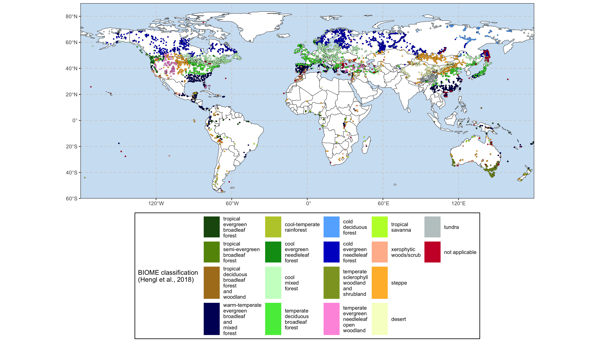

<!-- README.md is generated from README.Rmd. Please edit that file -->

# SMPDS: Modern Pollen Data for climate reconstructionS

<!-- badges: start -->

[](https://www.tidyverse.org/lifecycle/#experimental)
[](https://CRAN.R-project.org/package=smpds)
[](https://codecov.io/gh/special-uor/smpds?branch=main)
[](https://github.com/special-uor/smpds/actions)
<!-- badges: end -->

The goal of smpds is to …

## Installation

You can install the released version of SMPDS from
[CRAN](https://CRAN.R-project.org) with:

``` r
install.packages("smpds")
```

And the development version from [GitHub](https://github.com/) with:

``` r
# install.packages("devtools")
devtools::install_github("special-uor/smpds")
```

## Example

<!-- This is a basic example which shows you how to solve a common problem: -->

``` r
library(smpds)
## basic example code
smpds::SMPDSv2 %>%
  dplyr::relocate(reference, DOI, .after = publication) %>%
  dplyr::slice(1:20) %>%
  smpds::rm_na_taxa(cols = 1:16) %>% # Filter taxa without counts
  dplyr::select(1:66) %>% # Select only the metadata (16) + the 50 first taxa
  knitr::kable()
```

| original | ID\_SMPDSv1 | source   | site\_name     | entity\_name   | latitude | longitude | elevation | basin\_size         | site\_type                   | entity\_type         | age\_BP        | ID\_BIOME | publication                                                                                                                                          | reference | DOI | Abies | Acer | Amaranthaceae | Apiaceae | Artemisia | Asteroideae | Betula | Brassicaceae | Carpinus betulus | Carpinus orientalis | Cichorioideae | Corylus | Cyperaceae | Epilobium | Fagus | Fraxinus ornus | Juglans | Picea | Pinus | Poaceae | Quercus | Ranunculus type | Rubiaceae | Rumex | Scleranthus | Silene type | Ulmus | Xanthium type | Mentha type | Plantago lanceolata | Polygonum aviculare | Ranunculaceae | Alnus | Centaurea jacea type | Juniperus | Tilia | Verbascum type | Cirsium type | Robinia pseudacacia | Trifolium type | Vicia type | Salix | Scrophulariaceae | Silene | Fraxinus excelsior type | Filipendula | Geum type | Viburnum | Cirsium/Carduus type | Rosaceae |
| :------- | ----------: | :------- | :------------- | :------------- | -------: | --------: | --------: | :------------------ | :--------------------------- | :------------------- | :------------- | --------: | :--------------------------------------------------------------------------------------------------------------------------------------------------- | :-------- | :-- | ----: | ---: | ------------: | -------: | --------: | ----------: | -----: | -----------: | ---------------: | ------------------: | ------------: | ------: | ---------: | --------: | ----: | -------------: | ------: | ----: | ----: | ------: | ------: | --------------: | --------: | ----: | ----------: | ----------: | ----: | ------------: | ----------: | ------------------: | ------------------: | ------------: | ----: | -------------------: | --------: | ----: | -------------: | -----------: | ------------------: | -------------: | ---------: | ----: | ---------------: | -----: | ----------------------: | ----------: | --------: | -------: | -------------------: | -------: |
| SMPDSv1  |           1 | EMPD     | Mt Shipchenska | Atanassova\_a1 | 42.74111 |  25.34139 |      1310 |                     | Unknown                      | moss polster or moss | \-52           |        13 | Harrison, Sandy P., 2019. Modern pollen data for climate reconstructions, version 1 (SMPDS). University of Reading. Dataset. <doi:10.17864/1947.194> |           |     |     7 |    1 |            49 |        5 |        13 |          14 |     97 |            9 |                9 |                   9 |             7 |      30 |          9 |         5 |   245 |              1 |      17 |    25 |   495 |     237 |      51 |               4 |        28 |    14 |           5 |           3 |     3 |            12 |             |                     |                     |               |       |                      |           |       |                |              |                     |                |            |       |                  |        |                         |             |           |          |                      |          |
| SMPDSv1  |           2 | EMPD     | Mt Shipchenska | Atanassova\_a2 | 42.75556 |  25.32750 |      1195 |                     | Unknown                      | moss polster or moss | \-52           |        13 | Harrison, Sandy P., 2019. Modern pollen data for climate reconstructions, version 1 (SMPDS). University of Reading. Dataset. <doi:10.17864/1947.194> |           |     |       |      |            35 |       36 |         7 |         192 |     26 |              |               34 |                     |               |      59 |            |           |   165 |                |       4 |    24 |   277 |     156 |      43 |                 |         8 |    16 |           3 |             |       |             7 |          12 |                   5 |                   1 |             3 |       |                      |           |       |                |              |                     |                |            |       |                  |        |                         |             |           |          |                      |          |
| SMPDSv1  |           3 | EMPD     | Mt Shipchenska | Atanassova\_a3 | 42.76000 |  25.32750 |      1061 |                     | Unknown                      | moss polster or moss | \-52           |        13 | Harrison, Sandy P., 2019. Modern pollen data for climate reconstructions, version 1 (SMPDS). University of Reading. Dataset. <doi:10.17864/1947.194> |           |     |       |      |            97 |          |        89 |          15 |     41 |              |              128 |                     |               |     111 |            |           |   575 |                |       5 |   525 |   426 |      21 |      73 |                 |           |       |             |             |       |            17 |             |                     |                     |               |    43 |                    8 |        10 |     4 |              1 |              |                     |                |            |       |                  |        |                         |             |           |          |                      |          |
| SMPDSv1  |           4 | EMPD     | Mt Shipchenska | Atanassova\_a4 | 42.72056 |  25.34083 |       895 |                     | Unknown                      | moss polster or moss | \-52           |        13 | Harrison, Sandy P., 2019. Modern pollen data for climate reconstructions, version 1 (SMPDS). University of Reading. Dataset. <doi:10.17864/1947.194> |           |     |       |      |            41 |        9 |        10 |           5 |     60 |              |               55 |                   9 |               |      35 |            |           |   115 |                |      10 |     4 |   590 |      20 |      69 |                 |         1 |       |           5 |             |     4 |             4 |             |                     |                     |               |       |                      |           |    41 |                |              |                     |                |            |       |                  |        |                         |             |           |          |                      |          |
| SMPDSv1  |           5 | EMPD     | Mt Shipchenska | Atanassova\_a5 | 42.72444 |  25.33722 |       639 |                     | Unknown                      | moss polster or moss | \-52           |        13 | Harrison, Sandy P., 2019. Modern pollen data for climate reconstructions, version 1 (SMPDS). University of Reading. Dataset. <doi:10.17864/1947.194> |           |     |       |    1 |            38 |       33 |        25 |          36 |     47 |              |               98 |                  22 |            47 |     121 |            |           |    29 |                |      26 |       |   359 |      38 |      49 |                 |           |    28 |             |           3 |    11 |               |             |                  10 |                     |               |    73 |                      |           |    32 |                |            2 |                  15 |             26 |         75 |       |                  |        |                         |             |           |          |                      |          |
| SMPDSv1  |           6 | EMPD     | Mt Shipchenska | Atanassova\_b1 | 42.74111 |  25.34139 |      1310 |                     | Unknown                      | moss polster or moss | \-53           |        13 | Harrison, Sandy P., 2019. Modern pollen data for climate reconstructions, version 1 (SMPDS). University of Reading. Dataset. <doi:10.17864/1947.194> |           |     |     2 |      |            21 |       40 |        10 |           9 |     51 |              |               36 |                     |            27 |       6 |            |         4 |    77 |                |       6 |     3 |   285 |     149 |      48 |               3 |           |    33 |             |             |       |               |             |                     |                     |               |     2 |                   33 |           |     4 |                |              |                     |                |            |     1 |                1 |      5 |                         |             |           |          |                      |          |
| SMPDSv1  |           7 | EMPD     | Mt Shipchenska | Atanassova\_b2 | 42.75556 |  25.32750 |      1195 |                     | Unknown                      | moss polster or moss | \-53           |        13 | Harrison, Sandy P., 2019. Modern pollen data for climate reconstructions, version 1 (SMPDS). University of Reading. Dataset. <doi:10.17864/1947.194> |           |     |       |    3 |            18 |        2 |         6 |             |     26 |              |               64 |                     |               |      11 |            |           |   159 |              1 |         |    19 |   305 |     111 |         |                 |         5 |       |             |             |       |             6 |             |                  26 |                   3 |               |    33 |                   26 |           |       |                |              |                     |                |            |       |                  |        |                         |             |           |          |                      |          |
| SMPDSv1  |           8 | EMPD     | Mt Shipchenska | Atanassova\_b3 | 42.76000 |  25.32750 |      1061 |                     | Unknown                      | moss polster or moss | \-53           |        13 | Harrison, Sandy P., 2019. Modern pollen data for climate reconstructions, version 1 (SMPDS). University of Reading. Dataset. <doi:10.17864/1947.194> |           |     |       |      |            25 |        5 |         1 |           4 |     18 |            3 |                  |                     |               |      26 |            |           |   199 |                |      13 |   430 |   206 |      34 |      20 |                 |           |       |             |             |     2 |             1 |           1 |                   1 |                     |               |    16 |                      |           |       |                |              |                     |                |            |       |                1 |        |                       3 |             |           |          |                      |          |
| SMPDSv1  |           9 | EMPD     | Mt Shipchenska | Atanassova\_b4 | 42.72056 |  25.34083 |       895 |                     | Unknown                      | moss polster or moss | \-53           |        13 | Harrison, Sandy P., 2019. Modern pollen data for climate reconstructions, version 1 (SMPDS). University of Reading. Dataset. <doi:10.17864/1947.194> |           |     |     3 |    3 |            15 |          |         3 |           9 |        |              |               46 |                     |               |      11 |            |           |   264 |              5 |       1 |     8 |   496 |      26 |      66 |                 |           |       |          19 |           3 |       |            11 |             |                   4 |                   2 |               |    11 |                      |           |     7 |                |              |                     |                |            |       |                  |        |                         |             |           |          |                      |          |
| SMPDSv1  |          10 | EMPD     | Mt Shipchenska | Atanassova\_b5 | 42.72444 |  25.33722 |       639 |                     | Unknown                      | moss polster or moss | \-53           |        13 | Harrison, Sandy P., 2019. Modern pollen data for climate reconstructions, version 1 (SMPDS). University of Reading. Dataset. <doi:10.17864/1947.194> |           |     |       |      |             6 |          |         5 |             |     21 |              |               43 |                  10 |            31 |      31 |            |           |    20 |                |       6 |       |   412 |      25 |      57 |                 |           |    12 |             |           3 |    10 |               |             |                     |                  12 |               |    23 |                      |           |    12 |                |              |                  29 |             11 |            |       |                  |        |                         |             |           |          |                      |          |
| SMPDSv1  |          11 | EMPD     | Mt Shipchenska | Atanassova\_c1 | 42.74111 |  25.34139 |      1310 |                     | Unknown                      | moss polster or moss | \-54           |        13 | Harrison, Sandy P., 2019. Modern pollen data for climate reconstructions, version 1 (SMPDS). University of Reading. Dataset. <doi:10.17864/1947.194> |           |     |       |      |               |          |        11 |          14 |     15 |              |                9 |                     |            55 |       9 |         20 |           |    80 |              1 |       4 |    13 |   346 |     341 |      44 |               1 |           |    13 |             |             |       |               |           4 |                   4 |                     |               |    14 |                   23 |           |       |                |              |                     |                |            |       |                  |        |                         |           1 |        10 |        3 |                      |          |
| SMPDSv1  |          12 | EMPD     | Mt Shipchenska | Atanassova\_c2 | 42.75556 |  25.32750 |      1195 |                     | Unknown                      | moss polster or moss | \-54           |        13 | Harrison, Sandy P., 2019. Modern pollen data for climate reconstructions, version 1 (SMPDS). University of Reading. Dataset. <doi:10.17864/1947.194> |           |     |       |      |            10 |        3 |           |             |     29 |              |              150 |                     |               |       8 |            |           |    90 |                |       2 |       |   249 |     345 |      50 |                 |        16 |       |             |             |       |             6 |             |                     |                     |               |       |                      |           |       |                |              |                     |                |            |       |                  |        |                         |           3 |           |        2 |                      |          |
| SMPDSv1  |          13 | EMPD     | Mt Shipchenska | Atanassova\_c3 | 42.76000 |  25.32750 |      1061 |                     | Unknown                      | moss polster or moss | \-54           |        13 | Harrison, Sandy P., 2019. Modern pollen data for climate reconstructions, version 1 (SMPDS). University of Reading. Dataset. <doi:10.17864/1947.194> |           |     |       |   11 |            10 |          |        19 |          12 |        |            6 |               36 |                     |               |      66 |            |           |   296 |                |       5 |   306 |   234 |      20 |      14 |                 |         5 |       |             |             |       |             7 |             |                     |                     |               |    25 |                      |           |    15 |                |              |                     |                |            |       |                  |        |                         |             |           |          |                      |          |
| SMPDSv1  |          14 | EMPD     | Mt Shipchenska | Atanassova\_c4 | 42.72056 |  25.34083 |       895 |                     | Unknown                      | moss polster or moss | \-54           |        13 | Harrison, Sandy P., 2019. Modern pollen data for climate reconstructions, version 1 (SMPDS). University of Reading. Dataset. <doi:10.17864/1947.194> |           |     |       |      |            20 |          |         3 |             |    356 |            4 |               41 |                   4 |               |      14 |            |           |   117 |                |       4 |       |   420 |       6 |      20 |                 |           |       |          21 |             |       |               |             |                     |                   9 |               |    25 |                      |           |    14 |                |              |                     |                |            |       |                  |        |                         |             |           |        4 |                      |          |
| SMPDSv1  |          15 | EMPD     | Mt Shipchenska | Atanassova\_c5 | 42.72444 |  25.33722 |       639 |                     | Unknown                      | moss polster or moss | \-54           |        13 | Harrison, Sandy P., 2019. Modern pollen data for climate reconstructions, version 1 (SMPDS). University of Reading. Dataset. <doi:10.17864/1947.194> |           |     |       |      |            32 |       11 |           |          20 |     21 |           10 |               43 |                   7 |            32 |      39 |            |           |    48 |              1 |       6 |    21 |   291 |      56 |      52 |               4 |         9 |    19 |             |          23 |     2 |               |             |                   5 |                   4 |               |    45 |                    6 |           |    17 |                |              |                     |              4 |            |       |                  |        |                         |             |         5 |          |                    6 |       11 |
| SMPDSv1  |          16 | EMPD     | Mt Shipchenska | Atanassova\_d1 | 42.75556 |  25.32750 |      1195 |                     | Unknown                      | moss polster or moss | \-55           |        13 | Harrison, Sandy P., 2019. Modern pollen data for climate reconstructions, version 1 (SMPDS). University of Reading. Dataset. <doi:10.17864/1947.194> |           |     |     3 |      |            42 |       16 |           |          21 |     66 |          155 |               47 |                  12 |            34 |      21 |            |           |    93 |                |         |    45 |  1276 |     210 |      35 |              20 |        28 |    12 |             |             |    10 |            18 |             |                     |                     |             6 |    24 |                      |           |     5 |                |              |                     |                |            |       |                  |        |                       5 |             |         7 |        5 |                      |        6 |
| SMPDSv1  |          17 | EMPD     | Mt Shipchenska | Atanassova\_d2 | 42.76000 |  25.32750 |      1061 |                     | Unknown                      | moss polster or moss | \-55           |        13 | Harrison, Sandy P., 2019. Modern pollen data for climate reconstructions, version 1 (SMPDS). University of Reading. Dataset. <doi:10.17864/1947.194> |           |     |    12 |      |            32 |        1 |         4 |           1 |     44 |            1 |               48 |                     |            10 |      70 |            |        11 |   116 |                |       6 |   220 |   226 |      46 |      62 |                 |        11 |       |           3 |             |       |            14 |             |                     |                  16 |             1 |    12 |                    8 |           |       |              1 |              |                     |                |            |       |                  |        |                         |             |        11 |          |                      |          |
| SMPDSv1  |          18 | EMPD/EMB | GravgazMarsh   | Bakker\_a1     | 37.59118 |  30.40144 |      1241 | medium (1.1-50 km2) | terrestrial, marsh           | surface sample       | assumed modern |        17 | Harrison, Sandy P., 2019. Modern pollen data for climate reconstructions, version 1 (SMPDS). University of Reading. Dataset. <doi:10.17864/1947.194> |           |     |       |    2 |             8 |       24 |           |           3 |        |           11 |                  |                     |           122 |         |            |           |       |                |         |       |    25 |       9 |         |                 |           |       |             |             |       |               |             |                     |                     |               |     1 |                      |           |       |                |              |                     |                |            |       |                  |        |                         |             |           |          |                      |          |
| SMPDSv1  |          19 | EMPD/EMB | Bereket Basin  | Bakker\_a10    | 37.55091 |  30.29780 |      1486 | medium (1.1-50 km2) | terrestrial, other sediments | moss polster or moss | assumed modern |        17 | Harrison, Sandy P., 2019. Modern pollen data for climate reconstructions, version 1 (SMPDS). University of Reading. Dataset. <doi:10.17864/1947.194> |           |     |       |      |            33 |       15 |           |           8 |      2 |           53 |                  |                     |            19 |         |            |           |       |                |         |       |   926 |       4 |         |                 |           |       |             |             |       |               |             |                     |                     |               |     1 |                      |           |       |                |              |                     |                |            |       |                  |        |                         |             |           |          |                      |        1 |
| SMPDSv1  |          20 | EMPD/EMB | Bereket Basin  | Bakker\_a11    | 37.54651 |  30.30045 |      1449 | medium (1.1-50 km2) | terrestrial, other sediments | moss polster or moss | assumed modern |        17 | Harrison, Sandy P., 2019. Modern pollen data for climate reconstructions, version 1 (SMPDS). University of Reading. Dataset. <doi:10.17864/1947.194> |           |     |       |      |             1 |        3 |           |           2 |        |            5 |                  |                     |             3 |         |            |           |       |                |         |       |   340 |       2 |         |                 |           |       |             |             |       |               |             |                     |                     |               |     1 |                      |           |       |                |              |                     |                |            |       |                  |        |                         |             |           |          |                      |          |

``` r
smpds::SMPDSv2 %>%
  smpds::plot_biome()
```



## Code of Conduct

Please note that the SMPDS project is released with a [Contributor Code
of
Conduct](https://contributor-covenant.org/version/2/0/CODE_OF_CONDUCT.html).
By contributing to this project, you agree to abide by its terms.
