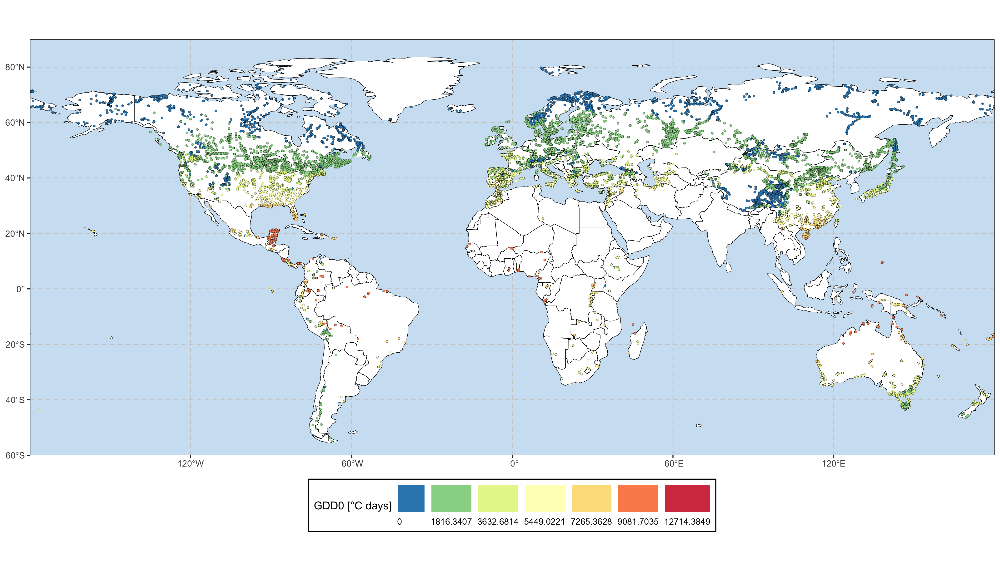

<!-- README.md is generated from README.Rmd. Please edit that file -->

# SMPDS: The SPECIAL Modern Pollen Data for Climate Reconstructions

<!-- badges: start -->

[](https://github.com/special-uor/smpds)
[](https://github.com/special-uor/smpds/actions)
[](https://cran.r-project.org/package=smpds)
[](https://doi.org/10.5281/zenodo.6598832)
<!-- badges: end -->

The goal of `smpds` is to provide access to the SPECIAL Modern Pollen
Data Set for Climate Reconstructions (SMPDS).

## Installation

You **can(not)** install the released version of SMPDS from
[CRAN](https://CRAN.R-project.org) with:

``` r
install.packages("smpds")
```

And the development version from [GitHub](https://github.com/) with:

``` r
# install.packages("remotes")
remotes::install_github("special-uor/smpds")
```

## Example

#### Load tables to the working environment

``` r
data("climate", package = "smpds")
data("entity", package = "smpds")
data("pollen_count", package = "smpds")
data("taxon_name", package = "smpds")
```

#### Create a snapshot of entities

The function `smpds::snapshot` takes few different parameters and based
on the first one, `x`, it returns a variety of snapshots.

This function returns a list with 3 components:

-   `entity`: data frame (`tibble` object) with the metadata associated
    to the entities.
-   `climate`: data frame (`tibble` object) with the climate and
    vegetation reconstructions. This one can be linked to the `entity`
    table using the column called `ID_SAMPLE`.
-   `pollen_count`: list of data frames (`tibble` objects) containing
    the pollen counts for 3 levels of “amalgamation”:
    -   `clean`
    -   `intermediate`
    -   `amalgamated`

    All these data frames can be linked to the `entity` table using the
    column called `ID_SAMPLE`.

:warning: **NOTE:** the output is returned “invisibly”, so you should
assign the output of the function to a variable.

``` r
output <- smpds::snapshot(...)
output$entity
output$climate
output$pollen_count$clean
output$pollen_count$intermediate
output$pollen_count$intermediate
```

##### Using the `entity_name`

``` r
smpds::snapshot("juodonys_core")
#> # A tibble: 1 × 6
#>   ID_SITE ID_ENTITY ID_SAMPLE site_name entity_name   pollen_counts$clean
#>     <int>     <int>     <int> <chr>     <chr>                       <int>
#> 1    3890      7901         1 Juodonys  juodonys_core                   1
#> # … with 2 more variables: pollen_counts$intermediate <int>, $amalgamated <int>
```

##### Using the `site_name`

``` r
smpds::snapshot("Petresiunai", use_site_name = TRUE)
#> # A tibble: 1 × 6
#>   ID_SITE ID_ENTITY ID_SAMPLE site_name   entity_name     pollen_counts$clean
#>     <int>     <int>     <int> <chr>       <chr>                         <int>
#> 1    6690     14229         2 Petresiunai petresiunai_121                   1
#> # … with 2 more variables: pollen_counts$intermediate <int>, $amalgamated <int>
```

##### Using the `ID_ENTITY`

``` r
smpds::snapshot(2)
#> # A tibble: 1 × 6
#>   ID_SITE ID_ENTITY ID_SAMPLE site_name entity_name pollen_counts$clean
#>     <int>     <int>     <int> <chr>     <chr>                     <int>
#> 1       1         2      9710 05-Mo     05-Mo-10                      1
#> # … with 2 more variables: pollen_counts$intermediate <int>, $amalgamated <int>
```

##### Using the `ID_SITE`

``` r
smpds::snapshot(3, use_id_site = TRUE)
#> # A tibble: 1 × 6
#>   ID_SITE ID_ENTITY ID_SAMPLE site_name  entity_name pollen_counts$clean
#>     <int>     <int>     <int> <chr>      <chr>                     <int>
#> 1       3        37     15871 11 [HFL11] HFL11                         1
#> # … with 2 more variables: pollen_counts$intermediate <int>, $amalgamated <int>
```

##### Extracting multiple records at once

``` r
smpds::snapshot(1:10)
#> # A tibble: 10 × 6
#>    ID_SITE ID_ENTITY ID_SAMPLE site_name entity_name pollen_counts$clean
#>      <int>     <int>     <int> <chr>     <chr>                     <int>
#>  1       1         1      9709 05-Mo     05-Mo                        10
#>  2       1         2      9710 05-Mo     05-Mo-10                     10
#>  3       1         3      9711 05-Mo     05-Mo-11                     10
#>  4       1         4      9712 05-Mo     05-Mo-12                     10
#>  5       1         5      9713 05-Mo     05-Mo-13                     10
#>  6       1         6      9714 05-Mo     05-Mo-14                     10
#>  7       1         7      9715 05-Mo     05-Mo-15                     10
#>  8       1         8      9716 05-Mo     05-Mo-16                     10
#>  9       1         9      9717 05-Mo     05-Mo-17                     10
#> 10       1        10      9718 05-Mo     05-Mo-18                     10
#> # … with 2 more variables: pollen_counts$intermediate <int>, $amalgamated <int>
```

##### Extracting all the records at once

This will run ****very slow****, so if only few entities are required,
it would be better to indicate which, based on the previous examples.

``` r
out <- smpds::snapshot()
```

#### Export data as individual CSV files

The function `smpds::write_csvs` takes to parameters:

-   `.data`: a list of class `snapshot`, this one can be generated using
    the function `smpds::snapshot` (see previous section).
-   `prefix`: a prefix name to be included in each individual files,
    this prefix can include a relative or absolute path to a directory
    in the local machine.

##### Without a path

``` r
`%>%` <- smpds::`%>%`
smpds::snapshot("juodonys_core") %>%
  smpds::write_csvs(prefix = "juodonys_core")
#> # A tibble: 1 × 6
#>   ID_SITE ID_ENTITY ID_SAMPLE site_name entity_name   pollen_counts$clean
#>     <int>     <int>     <int> <chr>     <chr>                       <int>
#> 1    3890      7901         1 Juodonys  juodonys_core                   1
#> # … with 2 more variables: pollen_counts$intermediate <int>, $amalgamated <int>
```

###### Output

    #>                                          levelName
    #> 1 .                                               
    #> 2  ¦--juodonys_core_metadata.csv                  
    #> 3  ¦--juodonys_core_pollen_counts_amalgamated.csv 
    #> 4  ¦--juodonys_core_pollen_counts_clean.csv       
    #> 5  °--juodonys_core_pollen_counts_intermediate.csv

##### Including a path

``` r
`%>%` <- smpds::`%>%`
smpds::snapshot("juodonys_core") %>%
  smpds::write_csvs(prefix = "/special.uor/epd/juodonys_core")
```

###### Output

    #>                                              levelName
    #> 1 special.uor                                         
    #> 2  °--epd                                             
    #> 3      ¦--juodonys_core_metadata.csv                  
    #> 4      ¦--juodonys_core_pollen_counts_amalgamated.csv 
    #> 5      ¦--juodonys_core_pollen_counts_clean.csv       
    #> 6      °--juodonys_core_pollen_counts_intermediate.csv

## Spatial distribution of the entities

##### Potential Natural Vegetation (PNV)

``` r
smpds::SMPDSv2 %>%
  smpds::plot_biome()
```


##### Growing Degree Days aboce 0 deg Celsius (`gdd0`)

``` r
smpds::SMPDSv2 %>%
  smpds::plot_gdd()
```



##### Mean Temperature of the COldest month (`mtco`)

``` r
smpds::SMPDSv2 %>%
  smpds::plot_mtco()
```


##### Moisture Index (`mi`)

``` r
smpds::SMPDSv2 %>%
  smpds::plot_mi()
```


## Code of Conduct

Please note that the SMPDS project is released with a [Contributor Code
of
Conduct](https://contributor-covenant.org/version/2/0/CODE_OF_CONDUCT.html).
By contributing to this project, you agree to abide by its terms.

## Publications

This package is a companion to the following dataset:

Villegas-Diaz, R., Harrison, S. P., 2022. The SPECIAL Modern Pollen Data
Set for Climate Reconstructions, version 2 (SMPDSv2). University of
Reading. Dataset. <https://doi.org/10.17864/1947.000389>
